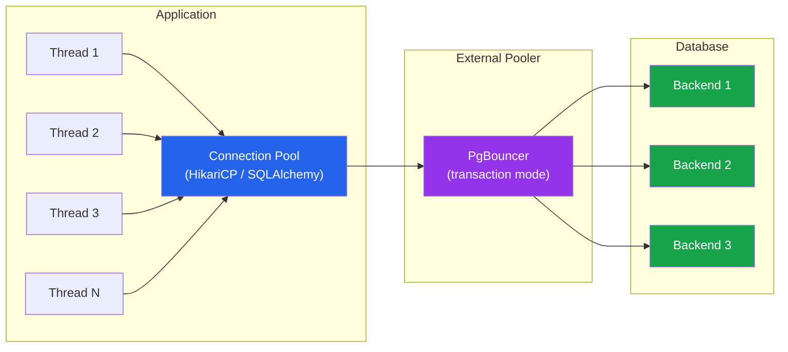

# [DEE-501] Connection Pool Configuration

:::info
Every application MUST use connection pooling when accessing a relational database. Pool size SHOULD be tuned based on workload characteristics, not left at defaults.
:::

## Context

Opening a database connection is expensive. Each connection requires a TCP handshake, TLS negotiation (if encrypted), authentication, and server-side memory allocation. PostgreSQL, for example, forks a new OS process for every connection -- each consuming roughly 5-10 MB of RAM. MySQL uses a thread per connection, which is lighter but still non-trivial at scale.

Without connection pooling, an application that handles 200 concurrent requests opens 200 database connections, most of which spend their time idle while the application processes results or waits on other I/O. These idle connections waste database memory, consume slots against `max_connections`, and create contention for shared resources like locks and buffers.

Connection pooling solves this by maintaining a fixed set of reusable connections. Application threads borrow a connection from the pool, execute queries, and return it. The pool handles creation, validation, and lifecycle management.

There are two levels of pooling: **application-side** (HikariCP, c3p0, SQLAlchemy pool) where the pool lives inside each application instance, and **proxy-side** (PgBouncer, ProxySQL, Amazon RDS Proxy) where an external process multiplexes connections from many application instances down to fewer database connections. For PostgreSQL workloads with many application instances, both layers are often used together.

## Principle

- Every application MUST use connection pooling -- opening a new connection per query or per request is never acceptable in production.
- Pool size SHOULD be tuned based on the formula: `connections = (core_count * 2) + effective_spindle_count`, where `effective_spindle_count` is 0 for fully cached datasets and 1 for SSD-backed storage.
- Developers MUST configure idle connection timeouts to prevent stale connections from consuming database slots.
- Teams running PostgreSQL with multiple application instances SHOULD deploy PgBouncer or an equivalent external pooler in transaction mode to reduce total backend connections.
- Developers MUST NOT set pool sizes larger than what the database can support -- total connections across all application instances must stay below `max_connections` minus reserved connections.

## Visual



**Key insight:** 50 application threads share a pool of 10 connections. PgBouncer further multiplexes multiple application pools down to a small number of database backends. The database serves fewer connections, each working harder.

## Example

### Pool Sizing Formula

The HikariCP wiki documents a formula based on PostgreSQL benchmarking:

```
connections = (core_count * 2) + effective_spindle_count
```

| Server | Cores | Storage | Formula | Pool Size |
|--------|-------|---------|---------|-----------|
| 4-core, SSD | 4 | SSD (spindle=1) | (4 * 2) + 1 | **9-10** |
| 8-core, fully cached | 8 | RAM (spindle=0) | (8 * 2) + 0 | **16** |
| 16-core, HDD RAID | 16 | 4 spindles | (16 * 2) + 4 | **36** |

A smaller pool with threads waiting for connections outperforms a large pool where connections contend for CPU, disk, and locks. Counter-intuitively, reducing pool size from 50 to 10 often increases throughput.

### HikariCP Configuration (Java / Spring Boot)

```yaml
spring:
  datasource:
    hikari:
      maximum-pool-size: 10        # Tuned, not default (default is 10, but verify)
      minimum-idle: 10             # Fixed pool: min = max for stable performance
      idle-timeout: 600000         # 10 minutes -- reclaim idle connections
      max-lifetime: 1800000        # 30 minutes -- recycle before DB-side timeout
      connection-timeout: 30000    # 30 seconds -- fail fast if pool exhausted
      leak-detection-threshold: 60000  # Log warning if connection held > 60s
```

### PgBouncer Configuration

```ini
[databases]
mydb = host=127.0.0.1 port=5432 dbname=mydb

[pgbouncer]
listen_port = 6432
pool_mode = transaction          ; Release connection after each transaction
default_pool_size = 20           ; Connections per user/database pair
max_client_conn = 400            ; Total client connections accepted
reserve_pool_size = 5            ; Extra connections for burst traffic
reserve_pool_timeout = 3         ; Seconds before using reserve pool
server_idle_timeout = 600        ; Close unused backend connections after 10 min
```

**Transaction mode** is the most common choice: the backend connection is returned to the pool after each transaction completes, maximizing connection reuse. Session mode ties a backend to a client for the entire session (needed for prepared statements or session-level features). Statement mode is rarely used.

### PostgreSQL max_connections Calculation

```
max_connections >= (app_instances * pool_size_per_instance)
                 + superuser_reserved_connections
                 + monitoring_connections

-- Example: 5 app instances * 10 pool each + 3 reserved + 2 monitoring = 55
-- Set max_connections = 60 (with headroom)
```

With PgBouncer in front:

```
max_connections >= pgbouncer_default_pool_size
                 + pgbouncer_reserve_pool_size
                 + superuser_reserved_connections

-- Example: 20 + 5 + 3 = 28 -- set max_connections = 30
```

## Common Mistakes

1. **Pool too large.** Setting `maximum-pool-size: 100` because "more connections means more throughput" is wrong. Database connections contend for CPU, memory, and I/O. A pool of 100 connections on a 4-core server means 96 connections are waiting at any given time, adding context-switch overhead and lock contention. Start with the sizing formula and adjust based on load testing.

2. **No idle connection timeout.** Connections that sit idle indefinitely consume database memory and count against `max_connections`. If the database restarts or a network partition occurs, stale connections cause errors. Configure `idle-timeout` and `max-lifetime` so connections are recycled regularly.

3. **Not using an external pooler with PostgreSQL.** PostgreSQL's process-per-connection model means 200 connections consume over 1 GB of RAM on the database server. When multiple application instances each maintain their own pool, total connections multiply quickly. PgBouncer in transaction mode can reduce database-side connections by 10x or more.

4. **Connection leaks.** Borrowing a connection from the pool without returning it (e.g., missing `finally` block, exception before `close()`) exhausts the pool. Enable leak detection (`leak-detection-threshold` in HikariCP) and always use try-with-resources or equivalent patterns to guarantee connection return.

5. **Ignoring connection validation.** A connection that was valid when pooled may become invalid (database restart, network timeout). Configure connection validation (`connection-test-query` or `connectionTestQuery`) or rely on the pool's built-in validation (HikariCP validates on borrow by default). Without validation, the first query on a stale connection fails and the application must handle the retry.

6. **Multiple application instances exceeding max_connections.** Each application instance has its own pool. With 10 instances and a pool size of 20, you need 200 database connections -- which may exceed `max_connections`. Calculate the total across all instances before deploying.

## Related DEEs

- [DEE-500](500.md) Application Patterns Overview
- [DEE-502](502.md) ORM Pitfalls and Best Practices -- ORMs manage connections through pools
- [DEE-200](200.md) Query and Performance Overview

## References

- [HikariCP Wiki: About Pool Sizing](https://github.com/brettwooldridge/HikariCP/wiki/About-Pool-Sizing) -- the original pool sizing formula and rationale
- [PgBouncer Configuration](https://www.pgbouncer.org/config.html) -- official PgBouncer configuration reference
- [PostgreSQL Documentation: Connection Settings](https://www.postgresql.org/docs/current/runtime-config-connection.html) -- max_connections and related parameters
- [Vlad Mihalcea: The Best Way to Determine the Optimal Connection Pool Size](https://vladmihalcea.com/optimal-connection-pool-size/) -- practical benchmarking approach
- [Heroku: Best Practices for PgBouncer Configuration](https://devcenter.heroku.com/articles/best-practices-pgbouncer-configuration) -- production PgBouncer tuning
- [AWS Database Blog: Scaling Connections with Amazon RDS Proxy](https://aws.amazon.com/blogs/database/multi-tenant-data-isolation-with-postgresql-row-level-security/) -- managed connection pooling for AWS
