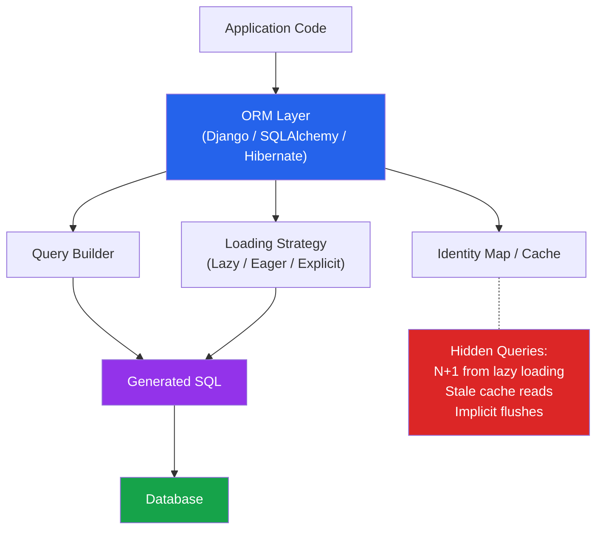

# [DEE-502] ORM Pitfalls and Best Practices

:::info
Developers MUST understand the SQL their ORM generates. ORMs boost productivity but hide database behavior -- invisible inefficiencies accumulate into serious performance problems.
:::

## Context

Object-Relational Mappers (ORMs) let developers work with database rows as objects, reducing boilerplate and speeding up development. Every major framework ships with or recommends one: Django ORM, SQLAlchemy, Hibernate/JPA, TypeORM, Prisma, ActiveRecord.

The abstraction has a cost. ORMs make decisions about when to load related data, how to construct joins, and when to batch queries. These decisions are reasonable defaults for simple cases but break down in production workloads. The most common failure mode is the **N+1 query problem** -- where accessing a list of N parent objects triggers N additional queries to fetch related children, turning one query into N+1.

The core tension is that ORMs optimize for developer convenience (write less code) while databases optimize for set-based operations (process data in bulk). When developers think in terms of objects and loops, but the database needs JOINs and batch operations, performance suffers silently.

## Principle

- Developers MUST enable SQL logging during development to see every query the ORM generates.
- Developers MUST use eager loading (`select_related`, `joinedload`, `JOIN FETCH`) when accessing related objects in a loop or list context.
- Developers SHOULD use the ORM's raw SQL escape hatch for complex queries rather than fighting the ORM's query builder.
- Developers SHOULD NOT trust ORM defaults for loading strategy, batch size, or caching without understanding their implications.
- Teams MUST review ORM-generated SQL during code review for any data access path that handles collections or runs in loops.

## Visual



## Example

### The N+1 Problem Across ORMs

**Django ORM -- N+1:**

```python
# BAD: 1 query for orders + N queries for customer (one per order)
orders = Order.objects.all()
for order in orders:
    print(order.customer.name)  # Lazy load triggers query per iteration

# GOOD: 1 query with JOIN
orders = Order.objects.select_related('customer').all()
for order in orders:
    print(order.customer.name)  # Already loaded, no extra query

# GOOD: 2 queries (one for orders, one for all related customers)
orders = Order.objects.prefetch_related('items').all()
```

**SQLAlchemy -- N+1:**

```python
from sqlalchemy.orm import joinedload, selectinload

# BAD: default lazy loading -- each order.customer triggers a query
orders = session.query(Order).all()
for order in orders:
    print(order.customer.name)

# GOOD: eager load with JOIN
orders = session.query(Order).options(joinedload(Order.customer)).all()

# GOOD: eager load with separate SELECT (better for large collections)
orders = session.query(Order).options(selectinload(Order.items)).all()
```

**JPA / Hibernate -- N+1:**

```java
// BAD: @ManyToOne defaults to EAGER, but @OneToMany defaults to LAZY
// Accessing order.getItems() in a loop triggers N queries
List<Order> orders = em.createQuery("SELECT o FROM Order o", Order.class)
    .getResultList();
for (Order o : orders) {
    o.getItems().size();  // Lazy load per order
}

// GOOD: JOIN FETCH loads everything in one query
List<Order> orders = em.createQuery(
    "SELECT o FROM Order o JOIN FETCH o.items", Order.class)
    .getResultList();

// GOOD: @EntityGraph for declarative fetch plan
@EntityGraph(attributePaths = {"items", "customer"})
List<Order> findAllByStatus(String status);
```

### When to Use Raw SQL

| Situation | Use ORM | Use Raw SQL |
|-----------|---------|-------------|
| Simple CRUD (single table) | Yes | No |
| List with related objects | Yes (with eager loading) | Depends on complexity |
| Complex reporting / aggregation | Maybe | Yes |
| Bulk INSERT/UPDATE (thousands of rows) | No (too slow) | Yes |
| Database-specific features (CTEs, window functions, LATERAL) | Check ORM support | Yes |
| Performance-critical hot path | Profile first | Yes, if ORM adds overhead |

**Raw SQL escape hatch examples:**

```python
# Django
orders = Order.objects.raw('''
    SELECT o.*, COUNT(i.id) as item_count
    FROM orders o
    LEFT JOIN order_items i ON i.order_id = o.id
    WHERE o.status = %s
    GROUP BY o.id
    HAVING COUNT(i.id) > %s
''', ['shipped', 5])

# SQLAlchemy
from sqlalchemy import text
result = session.execute(text('''
    SELECT customer_id, SUM(total) as lifetime_value
    FROM orders
    WHERE created_at >= :start_date
    GROUP BY customer_id
    HAVING SUM(total) > :threshold
'''), {"start_date": "2025-01-01", "threshold": 10000})
```

### Enabling SQL Logging

```python
# Django settings.py
LOGGING = {
    'loggers': {
        'django.db.backends': {
            'level': 'DEBUG',  # Logs every SQL query with timing
        },
    },
}

# SQLAlchemy
engine = create_engine("postgresql://...", echo=True)  # Logs all SQL
```

```yaml
# Hibernate (application.yml)
spring:
  jpa:
    show-sql: true
    properties:
      hibernate:
        format_sql: true
        generate_statistics: true  # Query count per session
```

## Common Mistakes

1. **Blind trust in ORM defaults.** Most ORMs default to lazy loading for relationships. This is safe for single-object access but disastrous for list views. A page that displays 50 orders with their customers generates 51 queries instead of 1. Always explicitly choose the loading strategy for any query that returns multiple objects with relationships.

2. **Not logging SQL in development.** If you cannot see the queries your ORM generates, you cannot identify N+1 problems, redundant queries, or missing indexes. Enable SQL logging in every development environment. Tools like Django Debug Toolbar, SQLAlchemy's `echo=True`, and Hibernate's `generate_statistics` make invisible queries visible.

3. **Fighting the ORM instead of using raw SQL.** When a complex query requires contortions in the ORM's query builder -- chained method calls that are harder to read than the equivalent SQL -- use the raw SQL escape hatch. Every mature ORM provides one. There is no virtue in forcing every query through the ORM's abstraction.

4. **Ignoring ORM-generated migrations.** Auto-generated migrations may create inefficient indexes, miss needed indexes, or produce schema changes that lock tables for extended periods. Always review generated migration SQL before applying to production. Use `sqlmigrate` (Django) or equivalent to inspect the actual DDL.

5. **Using ORM objects for bulk operations.** Inserting 10,000 rows by creating 10,000 ORM objects and calling `save()` in a loop generates 10,000 individual INSERT statements. Use bulk operations: `bulk_create()` (Django), `session.bulk_save_objects()` (SQLAlchemy), or raw SQL with multi-row INSERT.

6. **Selecting all columns by default.** ORMs load all columns of a model unless told otherwise. For tables with large TEXT or BLOB columns, this wastes bandwidth and memory. Use `defer()` (Django), `load_only()` (SQLAlchemy), or projections to fetch only needed columns.

## Related DEEs

- [DEE-500](500.md) Application Patterns Overview
- [DEE-202](204.md) The N+1 Query Problem -- the most common ORM performance failure
- [DEE-501](501.md) Connection Pool Configuration -- ORMs use connection pools internally
- [DEE-503](503.md) Repository Pattern -- abstracting data access beyond the ORM

## References

- [SQLAlchemy Documentation: Relationship Loading Techniques](https://docs.sqlalchemy.org/en/20/orm/queryguide/relationships.html) -- joinedload, selectinload, and other strategies
- [Django Documentation: select_related and prefetch_related](https://docs.djangoproject.com/en/5.1/ref/models/querysets/#select-related) -- Django's eager loading mechanisms
- [Hibernate Documentation: Fetching Strategies](https://docs.jboss.org/hibernate/orm/6.4/userguide/html_single/Hibernate_User_Guide.html#fetching) -- JPA/Hibernate fetch types and entity graphs
- [Vlad Mihalcea: The Best Way to Handle the N+1 Query Issue with JPA and Hibernate](https://vladmihalcea.com/n-plus-1-query-problem/) -- practical Hibernate N+1 solutions
- [TypeORM Documentation: Eager and Lazy Relations](https://typeorm.io/eager-and-lazy-relations) -- TypeORM loading strategies
- [Martin Fowler: OrmHate](https://martinfowler.com/bliki/OrmHate.html) -- balanced perspective on ORM trade-offs
