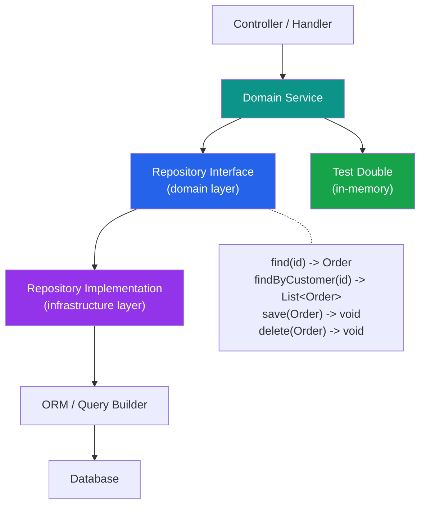

# [DEE-503] Repository Pattern

:::info
Use the repository pattern to decouple business logic from data access details. The repository provides a collection-like interface over the persistence layer, making domain logic testable and data access swappable.
:::

## Context

In most applications, business logic and database queries are intertwined. A service that calculates order totals also constructs SQL queries, handles pagination, and manages transactions. This coupling makes the business logic harder to test (tests need a database), harder to change (switching databases requires rewriting business logic), and harder to understand (domain rules are buried in query construction).

The repository pattern, introduced by Martin Fowler in *Patterns of Enterprise Application Architecture* and central to Domain-Driven Design (DDD), addresses this by providing an abstraction that behaves like an in-memory collection of domain objects. The business logic asks the repository for objects and saves objects back to it, without knowing whether the underlying store is PostgreSQL, MongoDB, or an in-memory test double.

In DDD, repositories exist only for aggregate roots -- not for every table or entity. An `OrderRepository` manages `Order` aggregates; individual `OrderItem` rows are accessed through their parent `Order`, not through a separate repository. This preserves aggregate boundaries and transactional consistency.

## Principle

- Teams SHOULD use the repository pattern when business logic must be testable without a database, or when data access may change independently of domain logic.
- Repositories MUST expose domain-oriented interfaces (e.g., `findActiveOrdersByCustomer`), not data-oriented interfaces (e.g., `query(sql)` or `findBy(column, value)`).
- In DDD contexts, repositories SHOULD be created only for aggregate roots, not for every entity or table.
- Teams SHOULD NOT use the repository pattern for simple CRUD applications where the ORM already provides sufficient abstraction and testability.
- Repository interfaces MUST NOT expose implementation details such as query builders, ORM sessions, or SQL fragments.

## Visual



**Key insight:** The domain service depends on the repository *interface* (defined in the domain layer). The actual implementation (using an ORM or raw SQL) lives in the infrastructure layer. For testing, a simple in-memory implementation replaces the real one.

## Example

### Repository Interface (Language-Agnostic)

```
interface OrderRepository:
    find(id: OrderId) -> Order | null
    findByCustomer(customerId: CustomerId) -> List<Order>
    findActiveByDateRange(start: Date, end: Date) -> List<Order>
    save(order: Order) -> void
    delete(order: Order) -> void
```

### Implementation with SQL

```python
# Python / SQLAlchemy implementation
class SqlOrderRepository(OrderRepository):
    def __init__(self, session: Session):
        self._session = session

    def find(self, order_id: OrderId) -> Order | None:
        return self._session.get(OrderModel, order_id.value)

    def find_by_customer(self, customer_id: CustomerId) -> list[Order]:
        stmt = (
            select(OrderModel)
            .where(OrderModel.customer_id == customer_id.value)
            .order_by(OrderModel.created_at.desc())
        )
        return list(self._session.scalars(stmt))

    def save(self, order: Order) -> None:
        self._session.merge(order.to_model())

    def delete(self, order: Order) -> None:
        model = self._session.get(OrderModel, order.id.value)
        if model:
            self._session.delete(model)
```

### In-Memory Test Double

```python
class InMemoryOrderRepository(OrderRepository):
    def __init__(self):
        self._orders: dict[OrderId, Order] = {}

    def find(self, order_id: OrderId) -> Order | None:
        return self._orders.get(order_id)

    def find_by_customer(self, customer_id: CustomerId) -> list[Order]:
        return [
            o for o in self._orders.values()
            if o.customer_id == customer_id
        ]

    def save(self, order: Order) -> None:
        self._orders[order.id] = order

    def delete(self, order: Order) -> None:
        self._orders.pop(order.id, None)
```

### Using the Repository in a Service

```python
class OrderService:
    def __init__(self, orders: OrderRepository):
        self._orders = orders

    def cancel_order(self, order_id: OrderId) -> None:
        order = self._orders.find(order_id)
        if order is None:
            raise OrderNotFound(order_id)
        order.cancel()          # Domain logic on the aggregate
        self._orders.save(order)

# Production
service = OrderService(SqlOrderRepository(db_session))

# Test
service = OrderService(InMemoryOrderRepository())
```

### When NOT to Use the Repository Pattern

| Scenario | Use Repository? | Why |
|----------|----------------|-----|
| Simple CRUD API (no complex domain logic) | No | The ORM already acts as the repository |
| Small project / prototype | No | Over-abstraction slows development |
| Complex domain with multiple aggregates | Yes | Testability and boundary enforcement |
| Need to swap data stores (SQL -> NoSQL) | Yes | Abstraction makes the switch possible |
| Multiple read models (CQRS) | Yes (for write side) | Separates command and query responsibilities |
| Microservice with one entity | Maybe | Depends on testing requirements |

## Common Mistakes

1. **Leaky abstractions.** Exposing ORM query builders, `IQueryable`, or SQL fragments through the repository interface defeats the purpose. If callers construct queries, the repository is not abstracting anything. The interface should expose domain operations (`findActiveOrders`), not generic query capabilities (`findWhere(predicate)`).

2. **Repository that is just a pass-through.** If every repository method is a one-line delegation to the ORM (`find(id)` calls `session.get(id)`), the repository adds indirection without value. This is a sign that either the domain is simple enough to not need the pattern, or the repository methods are too generic. Add value through domain-specific query methods, encapsulated transaction boundaries, or aggregate reconstitution logic.

3. **One repository per table.** In DDD, repositories exist for aggregate roots only. Creating `OrderRepository`, `OrderItemRepository`, and `OrderStatusHistoryRepository` for a single aggregate breaks encapsulation. `OrderItem` should be accessed only through the `Order` aggregate and its repository.

4. **Over-abstraction in simple applications.** A CRUD API that maps HTTP endpoints directly to database tables does not benefit from the repository pattern. The ORM's built-in querying is sufficient. Adding a repository layer, a service layer, and an interface layer for a simple TODO app creates maintenance overhead without testability benefits.

5. **Putting business logic in the repository.** The repository's job is data access, not domain rules. Validation, state transitions, and business calculations belong in the domain model or service layer. A `cancel_order` method in the repository that checks cancellation rules is a misplaced responsibility.

## Related DEEs

- [DEE-500](500.md) Application Patterns Overview
- [DEE-502](502.md) ORM Pitfalls and Best Practices -- the data access layer repositories wrap
- [DEE-504](504.md) Multi-Tenancy Data Isolation -- repositories can encapsulate tenant filtering

## References

- [Martin Fowler: Repository Pattern](https://martinfowler.com/eaaCatalog/repository.html) -- original pattern definition from *Patterns of Enterprise Application Architecture*
- [Microsoft: Designing the Infrastructure Persistence Layer](https://learn.microsoft.com/en-us/dotnet/architecture/microservices/microservice-ddd-cqrs-patterns/infrastructure-persistence-layer-design) -- repository pattern in DDD microservices
- [DevIQ: Repository Pattern](https://deviq.com/design-patterns/repository-pattern/) -- concise explanation with implementation guidance
- [Eric Evans: Domain-Driven Design](https://www.domainlanguage.com/ddd/) -- the foundational text on repositories in DDD context
- [Vaughn Vernon: Implementing Domain-Driven Design](https://www.oreilly.com/library/view/implementing-domain-driven-design/9780133039900/ch12lev1sec6.html) -- repository vs DAO distinction
