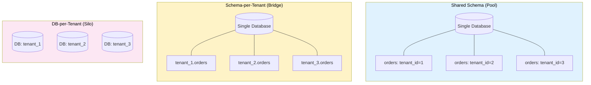

# [DEE-504] Multi-Tenancy Data Isolation

:::info
Choose a multi-tenancy isolation strategy based on compliance requirements, tenant count, and operational complexity. There is no single best approach -- each strategy trades isolation guarantees for cost and operational burden.
:::

## Context

SaaS applications serve multiple customers (tenants) from a shared infrastructure. The central database design question is how to isolate each tenant's data so that tenant A can never see tenant B's data, while keeping infrastructure costs and operational complexity manageable.

There are three fundamental strategies, each with different isolation, cost, and complexity characteristics:

1. **Shared schema (pool model):** All tenants share the same tables. A `tenant_id` column in every table distinguishes ownership. Row-Level Security (RLS) or application-level filtering enforces isolation.
2. **Schema-per-tenant (bridge model):** Each tenant gets a separate database schema within the same database instance. Tables are identical across schemas but data is physically separated.
3. **Database-per-tenant (silo model):** Each tenant gets a dedicated database instance. Maximum isolation at maximum cost.

The choice depends on regulatory requirements (healthcare and finance often mandate strong isolation), the number of tenants (schema-per-tenant struggles beyond a few hundred), and operational capacity (managing thousands of database instances requires automation).

## Principle

- Teams MUST choose an isolation strategy before building multi-tenant features -- retrofitting isolation is extremely difficult.
- Applications using shared schema MUST enforce tenant isolation at the database level (PostgreSQL RLS), not solely in application code.
- Every table containing tenant data MUST include a `tenant_id` column when using the shared schema model.
- Teams SHOULD use shared schema with RLS as the default strategy unless compliance or contractual requirements mandate stronger isolation.
- Teams choosing database-per-tenant MUST automate provisioning, migration, and monitoring -- manual management does not scale beyond a handful of tenants.

## Visual



### Strategy Comparison

| Aspect | Shared Schema (Pool) | Schema-per-Tenant (Bridge) | DB-per-Tenant (Silo) |
|--------|---------------------|---------------------------|---------------------|
| **Isolation level** | Logical (row-level) | Logical (schema-level) | Physical |
| **Cost per tenant** | Lowest | Medium | Highest |
| **Operational complexity** | Low | Medium-High | High |
| **Schema migrations** | One migration for all | One per schema | One per database |
| **Max tenants** | Millions | Hundreds | Tens to hundreds |
| **Cross-tenant queries** | Easy (same tables) | Possible (cross-schema) | Difficult (cross-database) |
| **Compliance suitability** | Standard SaaS | Regulated industries | Strictest requirements |
| **Noisy neighbor risk** | High (shared resources) | Medium | None |
| **Backup/restore granularity** | All tenants together | Per schema (complex) | Per tenant |

## Example

### Shared Schema with PostgreSQL Row-Level Security

**Step 1: Add tenant_id to every table**

```sql
CREATE TABLE orders (
    order_id    BIGSERIAL PRIMARY KEY,
    tenant_id   UUID NOT NULL,
    customer_id BIGINT NOT NULL,
    total       NUMERIC(12,2) NOT NULL,
    status      TEXT NOT NULL DEFAULT 'pending',
    created_at  TIMESTAMPTZ NOT NULL DEFAULT now()
);

CREATE INDEX idx_orders_tenant ON orders (tenant_id);
```

**Step 2: Enable RLS and create policies**

```sql
-- Enable RLS on the table
ALTER TABLE orders ENABLE ROW LEVEL SECURITY;

-- Force RLS even for table owners (important for security)
ALTER TABLE orders FORCE ROW LEVEL SECURITY;

-- Policy: users can only see rows where tenant_id matches their session variable
CREATE POLICY tenant_isolation ON orders
    USING (tenant_id = current_setting('app.current_tenant')::UUID);

-- Separate policy for INSERT to ensure new rows have the correct tenant_id
CREATE POLICY tenant_insert ON orders
    FOR INSERT
    WITH CHECK (tenant_id = current_setting('app.current_tenant')::UUID);
```

**Step 3: Set the tenant context per request**

```sql
-- At the start of each request / transaction:
SET LOCAL app.current_tenant = 'a1b2c3d4-e5f6-7890-abcd-ef1234567890';

-- All subsequent queries are automatically filtered:
SELECT * FROM orders WHERE status = 'shipped';
-- Internally becomes:
-- SELECT * FROM orders WHERE status = 'shipped'
--   AND tenant_id = 'a1b2c3d4-e5f6-7890-abcd-ef1234567890';
```

**Application middleware example (Python/FastAPI):**

```python
@app.middleware("http")
async def set_tenant_context(request: Request, call_next):
    tenant_id = request.headers.get("X-Tenant-ID")
    if not tenant_id:
        return JSONResponse(status_code=400, content={"error": "Missing tenant"})

    async with db.connection() as conn:
        await conn.execute(
            "SET LOCAL app.current_tenant = $1", tenant_id
        )
        request.state.db = conn
        response = await call_next(request)
    return response
```

### Schema-per-Tenant

```sql
-- Create a schema for each tenant
CREATE SCHEMA tenant_acme;
CREATE SCHEMA tenant_globex;

-- Create identical tables in each schema
CREATE TABLE tenant_acme.orders (
    order_id BIGSERIAL PRIMARY KEY,
    total NUMERIC(12,2) NOT NULL
);

CREATE TABLE tenant_globex.orders (
    order_id BIGSERIAL PRIMARY KEY,
    total NUMERIC(12,2) NOT NULL
);

-- Route queries by setting search_path
SET search_path = tenant_acme, public;
SELECT * FROM orders;  -- Queries tenant_acme.orders
```

## Common Mistakes

1. **Forgetting tenant_id in queries (data leaks).** Without RLS, every query must include `WHERE tenant_id = ?`. A single missed filter exposes one tenant's data to another. This is why database-level enforcement (RLS) is critical -- application-level filtering is error-prone and cannot be verified at the database layer.

2. **No RLS enforcement, relying only on application code.** Application-level tenant filtering works until someone writes a raw query, a migration script, or a debugging session that forgets the filter. RLS policies enforce isolation regardless of how the query reaches the database. Always use `FORCE ROW LEVEL SECURITY` so even table owners are subject to policies.

3. **Choosing database-per-tenant at scale.** Database-per-tenant is appropriate for 10-100 high-value enterprise tenants. For a SaaS with 10,000 tenants, managing 10,000 databases (migrations, monitoring, backups, connection management) is operationally crushing. Default to shared schema with RLS unless regulatory or contractual requirements demand physical isolation.

4. **Missing tenant_id index.** Every query hits the `tenant_id` filter (either via RLS or application code). Without an index on `tenant_id` (or a composite index starting with `tenant_id`), every query becomes a sequential scan filtered by tenant. Include `tenant_id` as the leading column in your most-used indexes.

5. **Not testing tenant isolation.** Write integration tests that verify: (a) tenant A cannot read tenant B's data, (b) INSERT respects the tenant context, (c) UPDATE/DELETE cannot affect other tenants' rows. These tests should run in CI against a real database with RLS enabled.

6. **Schema-per-tenant with too many tenants.** PostgreSQL's catalog performance degrades with hundreds of schemas, each containing many tables. Schema-per-tenant works well for 10-200 tenants but becomes a bottleneck at larger scales. Connection pooling also becomes complicated as each tenant may require a different `search_path`.

## Related DEEs

- [DEE-500](500.md) Application Patterns Overview
- [DEE-501](501.md) Connection Pool Configuration -- multi-tenant apps need careful pool management
- [DEE-505](505.md) Soft Delete vs Hard Delete -- tenant data deletion has compliance implications

## References

- [AWS Database Blog: Multi-Tenant Data Isolation with PostgreSQL Row Level Security](https://aws.amazon.com/blogs/database/multi-tenant-data-isolation-with-postgresql-row-level-security/) -- comprehensive RLS implementation guide
- [PostgreSQL Documentation: Row Security Policies](https://www.postgresql.org/docs/current/ddl-rowsecurity.html) -- official RLS reference
- [Crunchy Data: Row Level Security for Tenants in Postgres](https://www.crunchydata.com/blog/row-level-security-for-tenants-in-postgres) -- practical RLS patterns and pitfalls
- [The Nile Dev: Shipping Multi-Tenant SaaS Using Postgres Row-Level Security](https://www.thenile.dev/blog/multi-tenant-rls) -- end-to-end multi-tenant RLS implementation
- [Microsoft Azure: Multi-Tenant SaaS Patterns](https://learn.microsoft.com/en-us/azure/azure-sql/database/saas-tenancy-app-design-patterns) -- strategy comparison across isolation models
- [Citus Documentation: Multi-Tenant Applications](https://docs.citusdata.com/en/stable/use_cases/multi_tenant.html) -- distributed PostgreSQL for multi-tenant workloads
