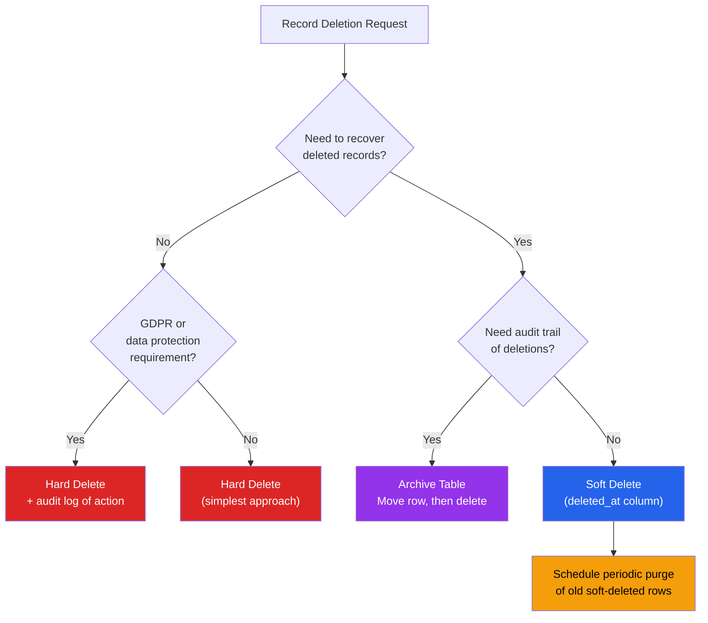

# [DEE-505] Soft Delete vs Hard Delete

:::info
Choose a deletion strategy based on recovery needs, audit requirements, and compliance obligations. Soft delete is **NOT** always the right choice -- it adds complexity and may violate data protection regulations.
:::

## Context

When an application needs to "delete" data, there are three fundamental approaches:

1. **Hard delete:** Execute `DELETE FROM` and remove the row permanently. The data is gone (unless recovered from backups).
2. **Soft delete:** Set a flag (`deleted_at` timestamp or `is_deleted` boolean) to mark the row as deleted. The row remains in the database but is excluded from normal queries.
3. **Archive table:** Move the row to a separate archive table, then hard-delete from the primary table. Preserves history without polluting the active dataset.

Soft delete became a widespread default because it feels safe -- "we might need it later." But soft delete has real costs: every query must filter deleted rows, unique constraints conflict with deleted rows, table size grows unboundedly, and regulations like GDPR may require actual data removal.

The right strategy depends on the use case. Financial records may legally require retention. User profile deletion under GDPR requires actual erasure of personal data. Audit logs need an immutable history but not necessarily the original table structure.

## Principle

- Teams MUST choose a deletion strategy per entity based on business requirements, not apply soft delete as a blanket default.
- Applications using soft delete MUST add a default scope or query middleware that excludes deleted rows from all normal queries.
- Soft-deleted data containing personal information MUST be hard-deleted or anonymized to comply with GDPR right to erasure (Article 17) and similar regulations.
- Teams SHOULD prefer archive tables over soft delete when the primary concern is audit history rather than undo functionality.
- Developers MUST handle unique constraint conflicts when using soft delete -- a deleted row's unique values must not block new inserts.

## Visual



## Example

### Soft Delete: deleted_at Column Pattern

```sql
-- Table with soft delete support
CREATE TABLE users (
    user_id     BIGSERIAL PRIMARY KEY,
    email       TEXT NOT NULL,
    name        TEXT NOT NULL,
    created_at  TIMESTAMPTZ NOT NULL DEFAULT now(),
    deleted_at  TIMESTAMPTZ          -- NULL = active, non-NULL = deleted
);

-- Partial unique index: only enforced for active (non-deleted) rows
CREATE UNIQUE INDEX idx_users_email_active
ON users (email)
WHERE deleted_at IS NULL;

-- Default view that excludes deleted rows
CREATE VIEW active_users AS
SELECT * FROM users WHERE deleted_at IS NULL;
```

**ORM integration (Django):**

```python
class SoftDeleteManager(models.Manager):
    def get_queryset(self):
        return super().get_queryset().filter(deleted_at__isnull=True)

class User(models.Model):
    email = models.EmailField()
    name = models.CharField(max_length=255)
    deleted_at = models.DateTimeField(null=True, blank=True)

    objects = SoftDeleteManager()      # Default: excludes deleted
    all_objects = models.Manager()     # Includes deleted (for admin)

    def soft_delete(self):
        self.deleted_at = timezone.now()
        self.save(update_fields=['deleted_at'])

    def restore(self):
        self.deleted_at = None
        self.save(update_fields=['deleted_at'])
```

### Archive Table Pattern

```sql
-- Active table (clean, no deleted rows)
CREATE TABLE orders (
    order_id    BIGSERIAL PRIMARY KEY,
    customer_id BIGINT NOT NULL,
    total       NUMERIC(12,2) NOT NULL,
    status      TEXT NOT NULL,
    created_at  TIMESTAMPTZ NOT NULL DEFAULT now()
);

-- Archive table (same structure + metadata)
CREATE TABLE orders_archive (
    order_id    BIGINT NOT NULL,          -- Not SERIAL, preserves original ID
    customer_id BIGINT NOT NULL,
    total       NUMERIC(12,2) NOT NULL,
    status      TEXT NOT NULL,
    created_at  TIMESTAMPTZ NOT NULL,
    archived_at TIMESTAMPTZ NOT NULL DEFAULT now(),
    archived_by TEXT NOT NULL             -- Who initiated the deletion
);

-- Archive function
CREATE OR REPLACE FUNCTION archive_order(p_order_id BIGINT, p_user TEXT)
RETURNS VOID AS $$
BEGIN
    INSERT INTO orders_archive (order_id, customer_id, total, status, created_at, archived_by)
    SELECT order_id, customer_id, total, status, created_at, p_user
    FROM orders
    WHERE order_id = p_order_id;

    DELETE FROM orders WHERE order_id = p_order_id;
END;
$$ LANGUAGE plpgsql;
```

### GDPR-Compliant Deletion

```sql
-- For personal data: hard delete + audit log of the action (not the data)
CREATE TABLE deletion_audit_log (
    log_id      BIGSERIAL PRIMARY KEY,
    table_name  TEXT NOT NULL,
    record_id   BIGINT NOT NULL,
    deleted_by  TEXT NOT NULL,
    reason      TEXT NOT NULL,           -- e.g., 'GDPR erasure request #1234'
    deleted_at  TIMESTAMPTZ NOT NULL DEFAULT now()
    -- NOTE: Do NOT store the deleted data here -- that defeats the purpose
);

-- Delete the personal data
BEGIN;
    INSERT INTO deletion_audit_log (table_name, record_id, deleted_by, reason)
    VALUES ('users', 42, 'system', 'GDPR erasure request #1234');

    DELETE FROM users WHERE user_id = 42;
COMMIT;
```

**Alternative: anonymize instead of delete** (preserves referential integrity):

```sql
-- Replace personal data with anonymized values
UPDATE users
SET email = 'deleted_' || user_id || '@removed.invalid',
    name = 'Deleted User',
    phone = NULL,
    address = NULL,
    deleted_at = now()
WHERE user_id = 42;
```

### Unique Constraint Solutions for Soft Delete

```sql
-- PostgreSQL: partial unique index (best approach)
CREATE UNIQUE INDEX idx_users_email_active
ON users (email) WHERE deleted_at IS NULL;

-- MySQL (no partial indexes): include a delete token in the unique constraint
ALTER TABLE users ADD COLUMN delete_token BIGINT NOT NULL DEFAULT 0;
-- Active rows: delete_token = 0
-- Deleted rows: delete_token = user_id (unique per row)
ALTER TABLE users ADD UNIQUE INDEX idx_email_token (email, delete_token);

-- On soft delete:
UPDATE users SET deleted_at = NOW(), delete_token = user_id WHERE user_id = 42;
```

## Common Mistakes

1. **Soft-deleting everything by default.** Applying soft delete to every table "just in case" means every query must filter `deleted_at IS NULL`, table sizes grow forever, and you accumulate data with no clear retention policy. Choose soft delete only for entities where recovery or undo is a real requirement.

2. **Forgetting to filter deleted rows in all queries.** The most dangerous soft delete bug: a query that returns deleted rows to the user. This happens in raw SQL queries, reporting dashboards, API endpoints that bypass the ORM's default scope, and JOIN conditions that do not check `deleted_at`. Every access path must be audited. This is why a database VIEW or ORM default manager is essential.

3. **Unique constraint conflicts with soft-deleted rows.** A user deletes their account (soft-deleted with `email = alice@example.com`), then tries to re-register with the same email. A standard unique index on `email` blocks the insert. Use partial unique indexes (PostgreSQL) or a delete token column (MySQL) to scope uniqueness to active rows only.

4. **Soft delete as GDPR compliance.** Marking a row as deleted while keeping all personal data in the database does not satisfy the GDPR right to erasure. The data subject's personal information must be actually removed or fully anonymized. Soft delete is a retention mechanism, not a deletion mechanism.

5. **No purge schedule for soft-deleted rows.** Soft-deleted rows accumulate indefinitely, growing table size, slowing sequential scans, and bloating backups. Define a retention policy (e.g., purge soft-deleted rows older than 90 days) and automate the purge.

6. **Not considering archive tables.** When the goal is audit history (who deleted what and when), an archive table is cleaner than soft delete. The active table stays small and clean, unique constraints work normally, queries do not need extra filters, and the archive table can have different retention and access policies.

## Related DEEs

- [DEE-500](500.md) Application Patterns Overview
- [DEE-504](504.md) Multi-Tenancy Data Isolation -- tenant data deletion has unique compliance considerations
- [DEE-400](../Schema%20Evolution/400.md) Schema Evolution Overview -- migrations for adding soft delete or archive tables

## References

- [GDPR Article 17: Right to Erasure](https://gdpr-info.eu/art-17-gdpr/) -- the legal basis for data deletion requirements
- [GDPR.eu: Right to Be Forgotten](https://gdpr.eu/right-to-be-forgotten/) -- practical guide to GDPR erasure obligations
- [PostgreSQL Documentation: Partial Indexes](https://www.postgresql.org/docs/current/indexes-partial.html) -- partial unique indexes for soft delete
- [Halim Samy: SQL Soft Deleting and Unique Constraint](https://halimsamy.com/sql-soft-deleting-and-unique-constraint) -- practical solutions for the unique constraint problem
- [GDPR for SaaS: Deleting Personal Data](https://gdpr4saas.eu/deleting-personal-data) -- soft delete vs hard delete under GDPR
- [Brent Ozar: Soft Deletes are a Code Smell](https://www.brentozar.com/archive/2020/02/what-are-soft-deletes-and-how-are-they-implemented/) -- critique of blanket soft delete patterns
