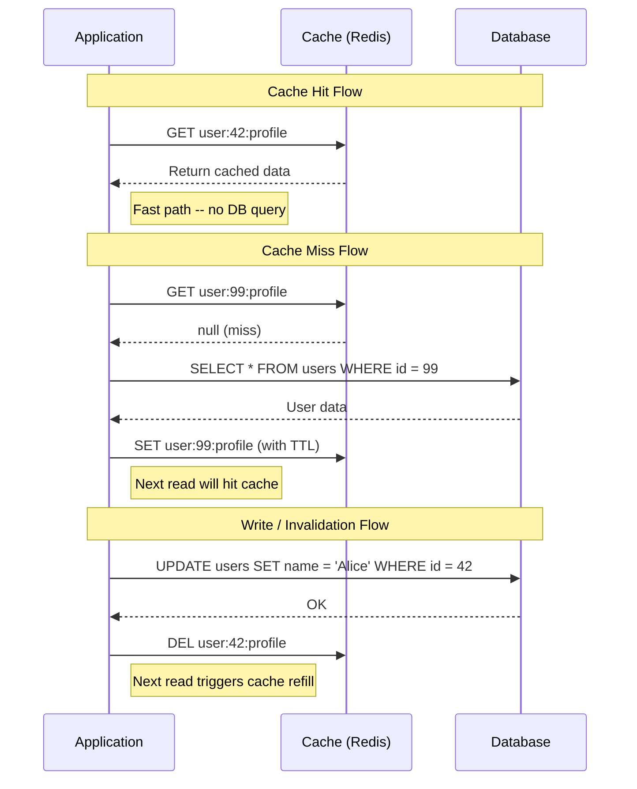

# [DEE-451] Cache-Aside Pattern

:::info
The cache-aside pattern (lazy loading) is the most common caching strategy. The application explicitly manages cache reads and writes, checking the cache first and falling back to the database on a miss.
:::

## Context

Most applications have read-heavy workloads where the same data is fetched repeatedly. Querying the database on every request wastes resources and adds latency. A cache -- typically an in-memory store like Redis or Memcached -- can serve frequently accessed data orders of magnitude faster than a disk-based database.

Cache-aside is the simplest and most widely adopted caching pattern. Unlike read-through or write-through patterns (where the cache layer manages database interaction), cache-aside puts the application in full control of both cache and database operations. This explicit control makes the pattern easy to reason about and debug, but it also means the application is responsible for keeping the cache consistent with the database.

The pattern is sometimes called "lazy loading" because data enters the cache only when it is first requested, not proactively.

## Principle

Developers SHOULD use cache-aside as the default caching pattern for read-heavy workloads where occasional cache misses are acceptable.

Developers MUST set a TTL on every cached entry to prevent unbounded memory growth and stale data accumulation.

Developers SHOULD design cache keys to be deterministic, human-readable, and scoped to avoid collisions (e.g., `user:{user_id}:profile`, `product:{product_id}:details`).

Developers MUST NOT assume the cache always contains fresh data. The application MUST handle cache misses gracefully by falling back to the database.

## Visual



## Example

### Python implementation with Redis

```python
import json
import redis
import hashlib

r = redis.Redis(host="localhost", port=6379, decode_responses=True)

CACHE_TTL_SECONDS = 300  # 5 minutes

def get_user_profile(user_id: int) -> dict:
    cache_key = f"user:{user_id}:profile"

    # Step 1: Check the cache
    cached = r.get(cache_key)
    if cached is not None:
        return json.loads(cached)

    # Step 2: Cache miss -- query the database
    profile = db_fetch_user_profile(user_id)  # your DB query

    # Step 3: Populate the cache with a TTL
    r.set(cache_key, json.dumps(profile), ex=CACHE_TTL_SECONDS)

    return profile


def update_user_profile(user_id: int, changes: dict) -> None:
    # Step 1: Write to the database (source of truth)
    db_update_user_profile(user_id, changes)

    # Step 2: Invalidate the cache entry
    cache_key = f"user:{user_id}:profile"
    r.delete(cache_key)
    # The next read will refill the cache from the database
```

### Cache key design guidelines

| Pattern | Example | Purpose |
|---------|---------|---------|
| `entity:{id}:field` | `user:42:profile` | Single entity lookup |
| `entity:{id}:relation` | `user:42:orders` | Related collection |
| `query:{hash}` | `query:a3f9c1...` | Parameterized query result |
| `v2:entity:{id}` | `v2:product:100` | Versioned key for deploy safety |

For complex queries, hash the normalized query parameters to produce a deterministic key:

```python
def cache_key_for_query(table: str, params: dict) -> str:
    normalized = json.dumps(params, sort_keys=True)
    digest = hashlib.sha256(normalized.encode()).hexdigest()[:12]
    return f"query:{table}:{digest}"
```

## Cache Invalidation Strategies

Cache-aside requires an explicit invalidation strategy. The three main approaches are:

| Strategy | Mechanism | Best For |
|----------|-----------|----------|
| **TTL-based** | Cache entries expire after a fixed duration | Data where short staleness is acceptable |
| **Explicit invalidation** | Application deletes the cache key on write | Data that must reflect writes quickly |
| **Event-driven** | A message bus (Kafka, Redis pub/sub) triggers invalidation | Microservices where multiple writers exist |

In practice, combine TTL with explicit invalidation: set a TTL as a safety net, and actively invalidate on known writes. This way, even if an invalidation message is lost, the stale entry expires eventually.

## Common Mistakes

1. **No TTL on cache entries.** Without a TTL, stale data persists indefinitely. If the invalidation logic has a bug or a write path is missed, the cache will serve outdated data forever. Always set a TTL, even if you also invalidate explicitly.

2. **Cache stampede (thundering herd).** When a popular key expires, hundreds of concurrent requests may simultaneously miss the cache and hit the database. Mitigations include distributed locking (only one request refills the cache while others wait or serve stale data), probabilistic early recomputation (refresh the key before it expires based on a probability that increases as TTL approaches zero), and adding random jitter to TTLs so keys do not expire simultaneously.

3. **Inconsistent invalidation across write paths.** If the application writes to the database in multiple places (API endpoint, background job, migration script) but only some of those paths invalidate the cache, stale data will be served. Centralize invalidation logic in the data access layer, not scattered across controllers.

4. **Caching mutable data without a strategy.** Caching data that changes frequently (e.g., real-time counters, inventory counts) with a long TTL leads to stale reads. Either use a very short TTL, switch to a write-through pattern, or avoid caching that data entirely.

5. **Delete-then-write ordering.** Deleting the cache before writing to the database creates a race condition: a concurrent reader can refill the cache with the old value between the delete and the write. Always write to the database first, then invalidate the cache.

## Related DEEs

- [DEE-450](450.md) Caching and Search Overview
- [DEE-452](452.md) Read-Through and Write-Through Caching -- alternative patterns where the cache manages DB interaction
- [DEE-453](453.md) Cache Invalidation Strategies -- deep dive into invalidation approaches
- [DEE-454](454.md) Redis Data Structures for Caching -- choosing the right Redis type for your cache

## References

- AWS: Database Caching Strategies Using Redis. <https://docs.aws.amazon.com/whitepapers/latest/database-caching-strategies-using-redis/caching-patterns.html>
- Microsoft: Cache-Aside Pattern. <https://learn.microsoft.com/en-us/azure/architecture/patterns/cache-aside>
- Redis: Cache-Aside Pattern with Redis. <https://redis.io/tutorials/howtos/solutions/microservices/caching/>
- Wikipedia: Cache stampede. <https://en.wikipedia.org/wiki/Cache_stampede>
