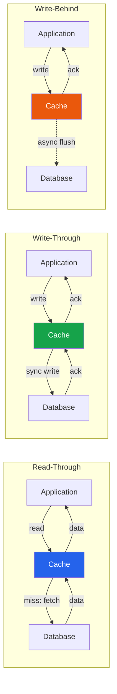

# [DEE-452] Read-Through and Write-Through Caching

:::info
In read-through and write-through caching, the cache layer -- not the application -- manages database reads and writes. The application interacts only with the cache, which transparently synchronizes with the database.
:::

## Context

In the cache-aside pattern ([DEE-451](451.md)), the application explicitly manages both the cache and the database. This gives full control but scatters cache logic throughout the application code. Read-through and write-through patterns move that responsibility into the cache layer itself, creating a simpler programming model where the application treats the cache as the primary data interface.

These patterns are common in enterprise caching frameworks (Oracle Coherence, NCache, Hazelcast) and CDN architectures. They are less common with raw Redis or Memcached, which do not natively provide database-backed read/write-through behavior -- you must build or configure a middleware layer.

Three related patterns exist:

- **Read-through**: On a cache miss, the cache itself fetches the data from the database, stores it, and returns it to the application. Subsequent reads are served from cache.
- **Write-through**: On a write, the cache writes to both itself and the database synchronously before returning success to the application.
- **Write-behind (write-back)**: On a write, the cache updates itself immediately and returns success, then asynchronously flushes the write to the database in the background.

## Principle

Developers SHOULD use read-through caching when the application should not contain cache-miss logic and the caching layer can be configured with a data loader.

Developers SHOULD use write-through caching when every write must be persisted to the database before the application proceeds, and the cache should always reflect the latest state.

Developers MAY use write-behind caching when write throughput is critical and the application can tolerate a window of potential data loss if the cache node fails before flushing.

Developers MUST NOT use write-behind caching for data that cannot be lost (e.g., financial transactions, audit logs) unless the cache layer provides durability guarantees (replication, write-ahead log).

## Visual



## Example

### Conceptual read-through implementation

In a read-through setup, you configure the cache with a "loader" function. The application never queries the database directly:

```python
class ReadThroughCache:
    def __init__(self, cache_store, db_loader, ttl_seconds=300):
        self.cache = cache_store
        self.loader = db_loader
        self.ttl = ttl_seconds

    def get(self, key: str):
        value = self.cache.get(key)
        if value is not None:
            return value

        # Cache manages the DB fetch -- not the application
        value = self.loader(key)
        if value is not None:
            self.cache.set(key, value, ex=self.ttl)
        return value

# Application code is simple -- no cache-miss logic
cache = ReadThroughCache(
    cache_store=redis_client,
    db_loader=lambda key: db.query_user(key)
)
user = cache.get("user:42")
```

### Conceptual write-through implementation

```python
class WriteThroughCache:
    def __init__(self, cache_store, db_writer):
        self.cache = cache_store
        self.writer = db_writer

    def put(self, key: str, value, ttl_seconds=300):
        # Write to database first (synchronous)
        self.writer(key, value)
        # Then update cache
        self.cache.set(key, value, ex=ttl_seconds)

    def get(self, key: str):
        return self.cache.get(key)
```

### Write-behind with batching

```python
class WriteBehindCache:
    def __init__(self, cache_store, db_writer, flush_interval=5):
        self.cache = cache_store
        self.writer = db_writer
        self.buffer = {}  # pending writes
        self.flush_interval = flush_interval

    def put(self, key: str, value):
        # Update cache immediately -- return fast
        self.cache.set(key, value)
        self.buffer[key] = value

    def flush(self):
        """Called periodically by a background thread."""
        if self.buffer:
            self.writer.batch_write(self.buffer)
            self.buffer.clear()
```

## Comparison Table

| Aspect | Cache-Aside | Read-Through | Write-Through | Write-Behind |
|--------|------------|--------------|---------------|--------------|
| **Who manages DB interaction** | Application | Cache layer | Cache layer | Cache layer |
| **Read latency (miss)** | Cache + DB round-trip | Same, but transparent | N/A | N/A |
| **Write latency** | DB write + cache invalidation | N/A | Higher (sync DB + cache) | Lowest (cache only) |
| **Write throughput** | Limited by DB | N/A | Limited by DB | Highest (async batching) |
| **Data loss risk on cache failure** | None (DB is source of truth) | None | None | **Yes** -- buffered writes may be lost |
| **Consistency** | Depends on invalidation | Strong for reads | Strong for reads + writes | Eventual |
| **Implementation complexity** | Low (application logic) | Medium (cache must have loader) | Medium (cache must have writer) | High (async flush, error handling) |
| **Common implementations** | Redis + application code | Oracle Coherence, NCache, Hazelcast | Oracle Coherence, NCache, DAX | Oracle Coherence, NCache, Hazelcast |

## Common Mistakes

1. **Write-behind data loss risk.** Write-behind caches buffer writes in memory. If the cache node crashes before flushing, those writes are lost permanently. Mitigate with cache replication, persistent write-ahead logs, or by restricting write-behind to data you can afford to lose (e.g., analytics counters, non-critical metrics).

2. **Assuming write-through eliminates inconsistency.** Write-through guarantees the cache and database are updated on every write, but if another system writes directly to the database (migration script, admin tool, another service), the cache will not reflect those changes. You still need a TTL or an invalidation mechanism for external writes.

3. **Over-engineering simple use cases.** If your application has a single database and a single cache, cache-aside with explicit invalidation is usually simpler and sufficient. Read-through and write-through add value in frameworks that support them natively (e.g., Hazelcast MapLoader, DynamoDB DAX) or when you want to decouple cache logic from business code in a large codebase.

4. **Not handling loader/writer failures.** In read-through, if the database is down, the cache cannot serve a miss. In write-through, if the database write fails, the cache must not be updated. Ensure the cache layer propagates errors to the application rather than silently caching partial or failed results.

5. **Mixing patterns without a clear strategy.** Using read-through for reads but cache-aside invalidation for writes creates confusion about who owns the cache lifecycle. Pick a consistent pattern per data domain and document it.

## Related DEEs

- [DEE-450](450.md) Caching and Search Overview
- [DEE-451](451.md) Cache-Aside Pattern -- the most common alternative where the application manages cache explicitly
- [DEE-453](453.md) Cache Invalidation Strategies -- invalidation applies to all caching patterns

## References

- Oracle: Read-Through, Write-Through, Write-Behind Caching. <https://docs.oracle.com/cd/E16459_01/coh.350/e14510/readthrough.htm>
- AWS: Database Caching Strategies Using Redis. <https://docs.aws.amazon.com/whitepapers/latest/database-caching-strategies-using-redis/caching-patterns.html>
- Hazelcast: Cache Access Patterns. <https://hazelcast.com/foundations/caching/cache-access-patterns/>
- CodeAhoy: Caching Strategies and How to Choose the Right One. <https://codeahoy.com/2017/08/11/caching-strategies-and-how-to-choose-the-right-one/>
