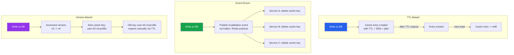

# [DEE-453] Cache Invalidation Strategies

:::info
"There are only two hard things in Computer Science: cache invalidation and naming things." -- Phil Karlton. Choose your invalidation strategy based on consistency requirements, data change frequency, and system topology.
:::

## Context

Caching improves performance, but every cached value is a potential source of stale data. The core challenge is deciding when and how to remove or refresh cached entries so that the application serves reasonably fresh data without losing the performance benefits of caching.

Phil Karlton's famous quote (often attributed to various sources, but originating at Netscape in the mid-1990s) captures the fundamental tension: a cache that never invalidates is fast but unreliable; a cache that invalidates too aggressively is reliable but slow.

There is no universal best strategy. The right choice depends on how frequently the underlying data changes, how much staleness the application can tolerate, how many services write to the same data, and how complex the system topology is. In practice, production systems often combine multiple strategies for different data domains.

## Principle

Developers MUST define an explicit invalidation strategy for every cached data type. Relying on "the cache will eventually expire" without a deliberate TTL is not a strategy.

Developers SHOULD start with TTL-based invalidation (the simplest approach) and layer on event-driven or versioned invalidation only where consistency requirements demand it.

Developers MUST add random jitter to TTL values when multiple keys expire on similar schedules, to prevent thundering herd / cache stampede scenarios.

Developers SHOULD centralize invalidation logic in the data access layer rather than scattering cache deletes across controllers, background jobs, and scripts.

## Visual



## Strategies in Detail

### 1. TTL-Based Invalidation

The simplest approach. Every cache entry is stored with an expiration time. After the TTL elapses, the entry is automatically evicted, and the next read triggers a refill from the database.

```python
import random

BASE_TTL = 300  # 5 minutes
MAX_JITTER = 60  # up to 60 seconds of random jitter

def set_with_jitter(redis_client, key, value):
    ttl = BASE_TTL + random.randint(0, MAX_JITTER)
    redis_client.set(key, value, ex=ttl)
```

**When to use:** Data where short staleness is acceptable (product catalogs, user profiles, configuration). Most caching starts here.

### 2. Event-Driven Invalidation

When data changes, the writer publishes an event on a message bus. All services that cache that data subscribe to the event and delete their local cache entries.

```python
import redis

r = redis.Redis()

# Publisher (in the write path)
def update_user(user_id, changes):
    db_update_user(user_id, changes)
    r.publish("cache:invalidate", f"user:{user_id}:profile")

# Subscriber (running in each service instance)
def invalidation_listener():
    pubsub = r.pubsub()
    pubsub.subscribe("cache:invalidate")
    for message in pubsub.listen():
        if message["type"] == "message":
            cache_key = message["data"]
            r.delete(cache_key)
```

**When to use:** Microservices where multiple services cache the same data and writes must be reflected quickly. Also useful when the writer and reader are different services.

### 3. Version-Based (Cache Key Versioning)

Instead of deleting a cache entry, increment a version counter. Cache keys include the version, so old entries become unreachable and expire naturally via TTL.

```python
def get_user_profile(redis_client, user_id):
    # Fetch current version (stored separately, small and fast)
    version = redis_client.get(f"user:{user_id}:version") or "1"
    cache_key = f"user:{user_id}:v{version}:profile"

    cached = redis_client.get(cache_key)
    if cached:
        return json.loads(cached)

    profile = db_fetch_user(user_id)
    redis_client.set(cache_key, json.dumps(profile), ex=300)
    return profile

def invalidate_user(redis_client, user_id):
    # Increment version -- old keys become orphaned and expire via TTL
    redis_client.incr(f"user:{user_id}:version")
```

**When to use:** When you want to avoid explicit deletes (which can cause cache stampedes) and prefer a gradual transition. Also useful for deploy-time invalidation -- increment a global version on deploy.

### 4. Tag-Based Invalidation

Group related cache entries under a tag. Invalidating the tag invalidates all entries in the group. This is a variation of version-based invalidation applied to collections.

```python
# Tag: "department:engineering"
# Members: user:42:profile, user:43:profile, user:44:profile

def invalidate_tag(redis_client, tag):
    members = redis_client.smembers(f"tag:{tag}")
    if members:
        redis_client.delete(*members)
        redis_client.delete(f"tag:{tag}")
```

**When to use:** When a single change affects many cache entries (e.g., updating a department name should invalidate all user profiles in that department).

## Comparison Table

| Strategy | Consistency | Complexity | Staleness Window | Stampede Risk | Best For |
|----------|------------|------------|-----------------|---------------|----------|
| **TTL-based** | Eventual (bounded by TTL) | Low | Up to TTL duration | Yes (mitigate with jitter) | General-purpose, read-heavy data |
| **Explicit delete** | Near-real-time | Low-medium | Minimal (race window) | Yes (hot keys) | Single-service, known write paths |
| **Event-driven** | Near-real-time | Medium-high | Message propagation delay | Low (deletes are targeted) | Microservices, multi-writer |
| **Version-based** | Near-real-time | Medium | Old version TTL | Low (no mass expiry) | Deploy-time, gradual rollover |
| **Tag-based** | Near-real-time | Medium | Depends on implementation | Moderate (bulk deletes) | Related data groups |

## Common Mistakes

1. **No jitter on TTL (thundering herd).** If thousands of cache entries for the same data type are set with an identical TTL (e.g., all product pages cached for exactly 300 seconds), they all expire simultaneously. The resulting flood of cache misses can overwhelm the database. Always add random jitter: `TTL = base + random(0, maxJitter)`.

2. **Manual invalidation scattered across the codebase.** When cache deletes are placed in individual controllers, background jobs, and admin scripts, it is almost guaranteed that some write path will miss an invalidation. Centralize invalidation in the repository or data access layer so every write goes through a single code path that handles both the database write and the cache invalidation.

3. **Stale cache after deploy.** A new code version may change the serialization format, add fields, or alter business logic, but the cache still contains entries written by the old version. Use key versioning (embed an app version or schema version in the cache key) or flush the cache on deploy. A full flush is safe if the system can handle the resulting cold-cache load.

4. **Relying solely on TTL for critical data.** For data where staleness has business impact (account balances, permissions, inventory counts), TTL alone is insufficient. Combine TTL (as a safety net) with explicit or event-driven invalidation so that writes are reflected within seconds, not minutes.

5. **Ignoring the invalidation-stampede trade-off.** Deleting a hot key causes a cache stampede. Version-based invalidation avoids this because the old entry remains until its TTL expires, while new requests use the new version key. For very hot keys, prefer version-based invalidation or use a lock/lease mechanism to allow only one request to refill the cache.

## Related DEEs

- [DEE-450](450.md) Caching and Search Overview
- [DEE-451](451.md) Cache-Aside Pattern -- the most common pattern that requires explicit invalidation
- [DEE-452](452.md) Read-Through and Write-Through Caching -- patterns where the cache layer can manage invalidation internally

## References

- Karlton, P. (c. 1996-1997). Attribution via Martin Fowler's Bliki: TwoHardThings. <https://martinfowler.com/bliki/TwoHardThings.html>
- AWS: Database Caching Strategies Using Redis -- Caching Patterns. <https://docs.aws.amazon.com/whitepapers/latest/database-caching-strategies-using-redis/caching-patterns.html>
- Redis: Cache Eviction Strategies. <https://redis.io/blog/cache-eviction-strategies/>
- Wikipedia: Cache stampede. <https://en.wikipedia.org/wiki/Cache_stampede>
- Vattani, A., Chakrabarti, D., Gurevich, M. (2015). "Optimal Probabilistic Cache Stampede Prevention." PVLDB, 8(8). <http://www.vldb.org/pvldb/vol8/p886-vattani.pdf>
