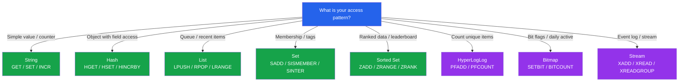

# [DEE-454] Redis Data Structures for Caching

:::info
Redis offers specialized data structures beyond simple key-value strings. Choosing the right data structure for your access pattern reduces memory usage, simplifies application logic, and unlocks operations that would be expensive or impossible with plain strings.
:::

## Context

Many developers use Redis exclusively as a key-value store, serializing everything to JSON strings. While this works, it ignores Redis's most powerful feature: purpose-built data structures with atomic operations tailored to specific access patterns.

Redis provides the following core data types:

- **String** -- binary-safe byte sequence up to 512 MB. Used for simple key-value caching, counters, and flags.
- **Hash** -- a map of field-value pairs under a single key. Used for objects where you need to read/write individual fields without deserializing the entire object.
- **List** -- doubly-linked list of strings. Used for queues, recent-activity feeds, and bounded collections.
- **Set** -- unordered collection of unique strings. Used for membership tests, tagging, and set operations (union, intersection, difference).
- **Sorted Set (ZSet)** -- set of unique strings scored by a floating-point number, maintained in sorted order. Used for leaderboards, rate limiters, and time-series ranking.
- **HyperLogLog** -- probabilistic data structure for cardinality estimation with constant 12 KB memory. Used for counting unique visitors, unique events, or any distinct-count approximation.
- **Bitmap** -- string treated as a bit array. Used for feature flags, daily active user tracking, and bloom-filter-like operations.
- **Stream** -- append-only log with consumer groups. Used for event sourcing, activity feeds, and message queues.

Since Redis 2.2, small instances of Hashes, Lists, Sets, and Sorted Sets are stored in a compact "ziplist" (or since Redis 7.0, "listpack") encoding that uses up to 10x less memory than the full data structure. This encoding is used automatically when the number of elements and element sizes are below configurable thresholds.

## Principle

Developers SHOULD choose the Redis data structure that matches the primary access pattern rather than defaulting to String + JSON for everything.

Developers MUST set `maxmemory` and a `maxmemory-policy` on every Redis instance used for caching to prevent unbounded memory growth.

Developers MUST set an expiration (`EXPIRE` or `EX`/`PX` on `SET`) on cache entries to prevent stale data accumulation.

Developers SHOULD use short, consistent key naming conventions (e.g., `user:42:profile`, `lb:daily:scores`) to reduce memory overhead and improve debuggability.

## Visual



## Example

### String: Simple cache and atomic counter

```redis
-- Cache a serialized value with TTL
SET user:42:profile '{"name":"Alice","role":"admin"}' EX 300

-- Atomic counter (no read-modify-write race)
INCR page:views:/home
INCRBY product:42:stock -1
```

### Hash: Object with field-level access

```redis
-- Store user profile as a hash
HSET user:42:profile name "Alice" role "admin" login_count 0

-- Read a single field (no need to deserialize the entire object)
HGET user:42:profile name
-- "Alice"

-- Increment a single field atomically
HINCRBY user:42:profile login_count 1

-- Set expiration on the entire hash
EXPIRE user:42:profile 300
```

Hash is more memory-efficient than storing each field as a separate String key when the hash has fewer than `hash-max-listpack-entries` (default 128) entries and each field value is under `hash-max-listpack-value` (default 64 bytes). In this configuration, Redis uses the compact listpack encoding.

### Sorted Set: Leaderboard

```redis
-- Add scores (ZADD is O(log N))
ZADD lb:daily:scores 1500 "player:alice"
ZADD lb:daily:scores 2300 "player:bob"
ZADD lb:daily:scores 1800 "player:charlie"

-- Top 10 (descending by score)
ZREVRANGE lb:daily:scores 0 9 WITHSCORES

-- Rank of a specific player (0-based)
ZREVRANK lb:daily:scores "player:alice"

-- Expire the leaderboard daily
EXPIRE lb:daily:scores 86400
```

### HyperLogLog: Unique visitor count

```redis
-- Add visitor IDs (constant 12 KB regardless of cardinality)
PFADD uv:2026-04-07 "visitor:abc" "visitor:def" "visitor:ghi"

-- Approximate unique count (standard error < 1%)
PFCOUNT uv:2026-04-07
-- (integer) 3

-- Merge multiple days for weekly count
PFMERGE uv:week:15 uv:2026-04-07 uv:2026-04-06 uv:2026-04-05
PFCOUNT uv:week:15
```

### Set: Tag-based membership

```redis
-- Tag articles
SADD tag:redis "article:101" "article:205" "article:310"
SADD tag:caching "article:101" "article:420"

-- Articles tagged with both "redis" AND "caching"
SINTER tag:redis tag:caching
-- "article:101"

-- Check membership
SISMEMBER tag:redis "article:205"
-- (integer) 1
```

## Memory Optimization Tips

| Technique | Impact | How |
|-----------|--------|-----|
| **Set `maxmemory` + eviction policy** | Prevents OOM crashes | `maxmemory 2gb` + `maxmemory-policy allkeys-lru` |
| **Use Hash for small objects** | Up to 10x less memory via listpack | Keep hashes under 128 fields / 64-byte values |
| **Set EXPIRE on all cache keys** | Prevents stale data buildup | `SET key value EX 300` or `EXPIRE key 300` |
| **Short key names** | Saves bytes per key at scale | `u:42:p` vs `user_profile_for_user_id_42` |
| **Avoid storing large blobs** | Reduces memory and network I/O | Keep values under 100 KB; store large objects in S3/blob store |
| **Use OBJECT ENCODING to inspect** | Verify compact encoding is used | `OBJECT ENCODING mykey` should show `listpack` / `ziplist` |
| **Choose the right eviction policy** | Keeps hot data in memory | `allkeys-lru` (general), `volatile-lfu` (TTL keys, frequency-based) |

### Eviction policy reference

| Policy | Scope | Algorithm | Best For |
|--------|-------|-----------|----------|
| `noeviction` | N/A | Returns error on write when full | Data that must not be evicted |
| `allkeys-lru` | All keys | Least Recently Used | General-purpose caching (good default) |
| `allkeys-lfu` | All keys | Least Frequently Used | Workloads with clear hot/cold split |
| `volatile-lru` | Keys with TTL | LRU among expiring keys | Mix of persistent and cache data |
| `volatile-lfu` | Keys with TTL | LFU among expiring keys | TTL keys with frequency patterns |
| `volatile-ttl` | Keys with TTL | Shortest remaining TTL first | Prioritize long-lived cache entries |
| `allkeys-random` | All keys | Random eviction | Uniform access patterns |

## Common Mistakes

1. **Storing everything as JSON strings.** Serializing an object to a JSON string and storing it with `SET` means every read or partial update requires a full deserialize-modify-reserialize cycle. If you frequently access or update individual fields, use a Hash instead. If you need ranked access, use a Sorted Set. Match the structure to the access pattern.

2. **No `maxmemory` limit.** Without a memory limit, Redis will consume all available RAM and eventually be killed by the OS OOM killer, taking down the entire server. Always configure `maxmemory` and an eviction policy for caching workloads.

3. **Missing EXPIRE on cache keys.** Keys without an expiration persist until explicitly deleted or evicted by the eviction policy. If the eviction policy is `noeviction` or `volatile-*` (which only evicts keys with TTL), non-expiring keys accumulate indefinitely. Set a TTL on every cache entry.

4. **Large keys and values.** A single key holding a 10 MB JSON blob blocks Redis (single-threaded for commands) during serialization and transfer. Break large values into smaller keys or use an external blob store. Redis SLOWLOG can help identify commands blocked by large payloads.

5. **Using KEYS in production.** `KEYS *` scans the entire keyspace and blocks Redis. Use `SCAN` for iterative key discovery in production.

## Related DEEs

- [DEE-450](450.md) Caching and Search Overview
- [DEE-451](451.md) Cache-Aside Pattern -- the pattern most commonly implemented with Redis
- [DEE-453](453.md) Cache Invalidation Strategies -- TTL and invalidation patterns that apply to all Redis data structures

## References

- Redis: Data Types. <https://redis.io/docs/latest/develop/data-types/>
- Redis: Memory Optimization. <https://redis.io/docs/latest/operate/oss_and_stack/management/optimization/memory-optimization/>
- Redis: Key Eviction. <https://redis.io/docs/latest/develop/reference/eviction/>
- Redis: Cache Eviction Strategies (blog). <https://redis.io/blog/cache-eviction-strategies/>
- AWS: Evictions -- Database Caching Strategies Using Redis. <https://docs.aws.amazon.com/whitepapers/latest/database-caching-strategies-using-redis/evictions.html>
