# [DEE-455] Redis Persistence (RDB vs AOF)

:::info
Redis is an in-memory data store, but it provides two persistence mechanisms -- RDB snapshots and AOF (Append-Only File) -- plus a hybrid mode that combines both. Choosing the right persistence strategy determines how much data you can afford to lose on a crash and how fast Redis can recover.
:::

## Context

Redis keeps its entire dataset in memory for speed, but memory is volatile. Without persistence, a Redis restart means total data loss. This is acceptable for pure caching (the database is the source of truth), but many Redis deployments hold authoritative data -- session state, rate-limiting counters, job queues, leaderboards -- where losing data on restart is unacceptable.

Redis offers two persistence mechanisms that can be used independently or together:

- **RDB (Redis Database)**: Periodic point-in-time snapshots of the entire dataset, written as a compact binary file (`dump.rdb`).
- **AOF (Append-Only File)**: A log of every write command received by the server, replayed on startup to reconstruct the dataset.

Since Redis 4.0, a **hybrid mode** combines both: the AOF file begins with an RDB preamble (a full snapshot) followed by incremental AOF commands, giving fast recovery with fine-grained durability.

## Principle

Developers SHOULD enable persistence for any Redis instance that holds data not trivially reconstructible from another source of truth.

Developers MUST choose a persistence strategy based on their durability requirements: RDB for periodic backups with acceptable data loss windows, AOF for near-zero data loss, or hybrid for the best balance of recovery speed and durability.

Developers SHOULD use `appendfsync everysec` as the default AOF fsync policy, which provides a practical balance between durability (at most one second of data loss) and performance.

Developers MUST NOT rely solely on RDB persistence when zero data loss is required, because RDB snapshots are periodic and any writes since the last snapshot will be lost on crash.

## Visual

```mermaid
graph TD
    subgraph "RDB Snapshots"
        direction LR
        W1[Writes] --> M1[In-Memory Dataset]
        M1 -->|BGSAVE every N sec<br/>if M changes| S1[dump.rdb]
        S1 -->|On restart| M1
    end

    subgraph "AOF Append-Only File"
        direction LR
        W2[Writes] --> M2[In-Memory Dataset]
        M2 -->|Append each write| A1[appendonly.aof]
        A1 -->|Replay on restart| M2
        A1 -->|Periodic rewrite| A2[Compacted AOF]
    end

    subgraph "Hybrid RDB + AOF"
        direction LR
        W3[Writes] --> M3[In-Memory Dataset]
        M3 -->|AOF rewrite| H1[RDB Preamble + AOF Tail]
        H1 -->|Load RDB bulk<br/>then replay AOF| M3
    end

    style S1 fill:#2563eb,color:#fff
    style A1 fill:#16a34a,color:#fff
    style A2 fill:#16a34a,color:#fff
    style H1 fill:#ea580c,color:#fff
```



## Example

### RDB-only configuration (`redis.conf`)

```ini
# Trigger an RDB snapshot when at least M keys change in N seconds
save 900 1        # After 900s if at least 1 key changed
save 300 10       # After 300s if at least 10 keys changed
save 60 10000     # After 60s if at least 10000 keys changed

dbfilename dump.rdb
dir /var/lib/redis

rdbcompression yes
rdbchecksum yes
stop-writes-on-bgsave-error yes

# Disable AOF
appendonly no
```

### AOF-only configuration (`redis.conf`)

```ini
# Disable RDB snapshots
save ""

# Enable AOF
appendonly yes
appendfilename "appendonly.aof"

# fsync policy -- balance durability and performance
appendfsync everysec

# AOF rewrite triggers (prevents unbounded file growth)
auto-aof-rewrite-percentage 100   # Rewrite when AOF is 2x the size after last rewrite
auto-aof-rewrite-min-size 64mb    # Don't rewrite if AOF is smaller than 64 MB

aof-load-truncated yes
```

### Hybrid RDB + AOF configuration (`redis.conf`) -- recommended for production

```ini
# Keep RDB snapshots as a backup safety net
save 900 1
save 300 10
save 60 10000

# Enable AOF with hybrid preamble
appendonly yes
appendfilename "appendonly.aof"
appendfsync everysec
aof-use-rdb-preamble yes          # Hybrid mode: AOF rewrite produces RDB prefix + AOF tail

auto-aof-rewrite-percentage 100
auto-aof-rewrite-min-size 64mb
```

When Redis restarts with both RDB and AOF present, it loads the AOF file (which is more complete). In hybrid mode, the AOF starts with a compact RDB snapshot for fast bulk loading, followed by only the incremental commands since that snapshot.

## fsync Policies

The `appendfsync` directive controls how often the AOF buffer is flushed to disk. This is the single most important durability-vs-performance trade-off in Redis:

| Policy | Durability | Performance Impact | Data Loss Window |
|--------|-----------|-------------------|-----------------|
| `always` | Maximum -- every write is fsynced | Severe (~100x slower than `everysec`) | Virtually zero |
| `everysec` | High -- fsync runs in a background thread every second | Minimal -- main thread is rarely blocked | Up to ~1 second of writes |
| `no` | OS-dependent -- Linux typically flushes every 30 seconds | Best -- no explicit fsync | Up to ~30 seconds of writes |

For most production workloads, `everysec` is the right default. Use `always` only when you genuinely cannot tolerate any data loss and the performance penalty is acceptable (e.g., low-write-volume financial state). Use `no` only for ephemeral data where persistence is a nice-to-have.

## Comparison Table

| Aspect | RDB Only | AOF Only | Hybrid (RDB + AOF) |
|--------|---------|---------|-------------------|
| **Data loss on crash** | All writes since last snapshot (minutes) | Depends on fsync policy (0s to ~30s) | Depends on fsync policy (0s to ~30s) |
| **Restart speed** | Fast -- single binary file load | Slow -- replays every command | Fast -- loads RDB preamble, then replays short AOF tail |
| **Disk space** | Compact binary snapshots | Larger -- logs every command (mitigated by rewrites) | Moderate -- RDB preamble + incremental commands |
| **Write performance impact** | Periodic fork() for BGSAVE (memory spike) | Continuous append + periodic rewrite | Same as AOF |
| **File format** | Binary, not human-readable | Text-based Redis commands (human-readable) | Binary RDB prefix + text AOF suffix |
| **Backup friendliness** | Excellent -- single file, easy to copy off-host | Larger file, but complete | Good -- single AOF file with embedded snapshot |
| **Best for** | Backups, disaster recovery, dev environments | Production systems needing durability | Production systems needing both durability and fast recovery |

## Common Mistakes

1. **No persistence in production.** Running Redis without any persistence for data that is not trivially reconstructible means a restart (planned or not) causes full data loss. Even if Redis is "just a cache," evaluate whether a cold-cache thundering herd on restart could overwhelm the database. At minimum, enable RDB snapshots.

2. **AOF rewrite not configured.** Without `auto-aof-rewrite-percentage` and `auto-aof-rewrite-min-size`, the AOF file grows without bound. A 100 GB AOF for a 2 GB dataset is common in neglected deployments. This wastes disk space and makes restart painfully slow as Redis replays millions of redundant commands.

3. **Assuming RDB is sufficient for zero data loss.** RDB snapshots are periodic. With `save 60 10000`, you could lose up to 60 seconds of writes (or more if fewer than 10000 keys changed). If you need point-in-time recovery, you need AOF.

4. **Using `appendfsync always` without measuring the performance impact.** `always` can reduce write throughput by orders of magnitude. Benchmark your workload before enabling it, and consider whether `everysec` (losing at most one second) is an acceptable trade-off.

5. **Ignoring BGSAVE fork() memory overhead.** RDB persistence uses `fork()` to create a child process. Due to copy-on-write semantics, a write-heavy workload can cause the child to consume nearly as much memory as the parent. Ensure the host has enough memory headroom (typically 2x Redis memory) or the OS will OOM-kill Redis.

6. **Not testing recovery.** Persistence is meaningless if you have never verified that your RDB or AOF files produce a correct, complete dataset on reload. Periodically restore from your persistence files to a test instance and validate the data.

## Related DEEs

- [DEE-450](450.md) Caching and Search Overview
- [DEE-451](451.md) Cache-Aside Pattern -- caching strategy where persistence backs the in-memory layer
- [DEE-454](454.md) Redis Data Structures for Caching -- choosing data structures that affect persistence file size

## References

- Redis: Persistence. <https://redis.io/docs/latest/operate/oss_and_stack/management/persistence/>
- Redis: Persistence and Durability at Scale. <https://redis.io/tutorials/operate/redis-at-scale/persistence-and-durability/>
- Engineering at Scale: Redis Persistence Deep Dive. <https://engineeringatscale.substack.com/p/redis-persistence-aof-rdb-crash-recovery>
