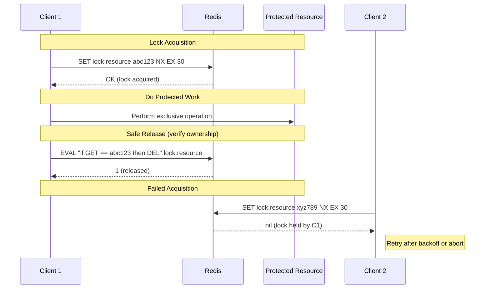

# [DEE-456] Distributed Locking with Redis

:::info
Distributed systems need coordination primitives to prevent concurrent processes from corrupting shared resources. Redis is commonly used for distributed locking because it is fast, widely deployed, and supports atomic operations -- but Redis-based locks come with important safety caveats that developers must understand.
:::

## Context

In a distributed system, multiple processes or services may need to access a shared resource exclusively -- updating a database record, writing to a file, calling an external API with rate limits, or processing a job exactly once. A distributed lock provides mutual exclusion across these independent processes.

Redis is a popular choice for distributed locking because it offers atomic primitives (`SET NX EX`), sub-millisecond latency, and is often already part of the infrastructure. Two main approaches exist:

- **Single-instance lock**: Use a single Redis node with `SET key value NX EX ttl`. Simple, fast, and sufficient for best-effort coordination where occasional double-execution is tolerable.
- **Redlock (multi-instance)**: Acquire locks on a majority of N independent Redis masters (typically 5). Designed to survive the failure of any minority of nodes.

The Redlock algorithm generated a well-known debate between Martin Kleppmann (distributed systems researcher) and Salvatore Sanfilippo (antirez, Redis creator) about when distributed locks can and cannot provide correctness guarantees.

## Principle

Developers SHOULD use a single-instance Redis lock (`SET NX EX`) for best-effort coordination where the consequence of occasional double-execution is acceptable (e.g., deduplication of background jobs, rate limiting, leader election with tolerance for brief split-brain).

Developers MUST always set a TTL on lock keys to prevent deadlocks when the lock holder crashes without releasing.

Developers MUST use a unique lock value (e.g., a UUID) and verify ownership before releasing, to avoid deleting another client's lock.

Developers SHOULD NOT rely on Redlock for correctness-critical mutual exclusion (e.g., preventing double-spending, financial transactions) without an additional fencing mechanism, because Redlock's safety depends on timing assumptions that real systems can violate.

Developers SHOULD use fencing tokens when the protected resource supports them, as they provide correctness guarantees independent of lock timing.

## Visual



## Example

### Single-instance lock: acquire and release

```python
import uuid
import redis
import time

r = redis.Redis(host="localhost", port=6379, decode_responses=True)

LOCK_TTL_SECONDS = 30

def acquire_lock(resource: str, ttl: int = LOCK_TTL_SECONDS) -> str | None:
    """Attempt to acquire a lock. Returns a token on success, None on failure."""
    token = str(uuid.uuid4())
    acquired = r.set(f"lock:{resource}", token, nx=True, ex=ttl)
    return token if acquired else None


def release_lock(resource: str, token: str) -> bool:
    """Release a lock only if we still own it (atomic check-and-delete via Lua)."""
    lua_script = """
    if redis.call("GET", KEYS[1]) == ARGV[1] then
        return redis.call("DEL", KEYS[1])
    else
        return 0
    end
    """
    result = r.eval(lua_script, 1, f"lock:{resource}", token)
    return result == 1


# Usage
token = acquire_lock("order:42")
if token:
    try:
        process_order(42)  # exclusive work
    finally:
        release_lock("order:42", token)
else:
    print("Could not acquire lock -- another worker is processing this order")
```

### Why Lua for release? Atomicity matters

Without the Lua script, a naive release has a race condition:

```python
# UNSAFE -- do not use
def unsafe_release(resource: str, token: str):
    key = f"lock:{resource}"
    if r.get(key) == token:        # (1) Check ownership
        # <-- Lock could expire here, and another client acquires it
        r.delete(key)              # (2) Delete -- now deleting someone else's lock!
```

The Lua script executes atomically on the Redis server, eliminating this race.

### Redlock multi-instance pattern (pseudocode)

```python
# Redlock uses N independent Redis masters (typically 5, no replication).
# A lock is acquired only when held on a majority (N/2 + 1).

QUORUM = 3  # majority of 5 nodes
LOCK_TTL_MS = 30_000
CLOCK_DRIFT_FACTOR = 0.01

def redlock_acquire(nodes: list, resource: str, ttl_ms: int) -> str | None:
    token = str(uuid.uuid4())
    start_ms = current_time_ms()

    acquired_count = 0
    for node in nodes:
        if node.set(f"lock:{resource}", token, nx=True, px=ttl_ms):
            acquired_count += 1

    elapsed_ms = current_time_ms() - start_ms
    drift = ttl_ms * CLOCK_DRIFT_FACTOR + 2  # clock drift allowance
    validity_ms = ttl_ms - elapsed_ms - drift

    if acquired_count >= QUORUM and validity_ms > 0:
        return token  # lock acquired with validity_ms remaining

    # Failed -- release all acquired locks
    for node in nodes:
        release_lock_on_node(node, resource, token)
    return None
```

### Fencing tokens for correctness

```
Client A acquires lock (fence token = 33)
Client A pauses (GC, network delay)
Lock expires
Client B acquires lock (fence token = 34)
Client B writes to storage with fence = 34
Client A resumes, writes to storage with fence = 33
Storage rejects write: 33 < 34 (stale token)
```

A fencing token is a monotonically increasing number issued with each lock acquisition. The protected resource checks the token and rejects operations from stale lock holders. This provides correctness even when locks expire prematurely.

## The Kleppmann vs Antirez Debate

The safety of Redlock has been publicly debated by two respected voices in the distributed systems community:

**Martin Kleppmann's critique** (2016): Redlock is "neither fish nor fowl" -- too heavyweight for efficiency-only locks and too weak for correctness-critical locks. His core arguments:

- Redlock assumes bounded network delay, bounded process pauses, and roughly synchronized clocks. Real systems violate these assumptions (GC pauses, network partitions, clock skew).
- Without fencing tokens, a client that pauses after acquiring the lock can resume after the lock expires and corrupt the resource, while another client holds the lock.
- If the protected resource supports fencing tokens, you do not need the complexity of Redlock -- a single Redis instance suffices.

**Antirez's defense** (2016): After acquiring the majority, the Redlock client re-checks that it has not exceeded the TTL. This limits the vulnerability window. Antirez also argued that Redlock's random value can serve as a form of fencing in systems with compare-and-set semantics.

**Practical guidance**: For efficiency-only locks (preventing duplicate work, reducing load), a single-instance Redis lock with a TTL is simple and sufficient. For correctness-critical locks (preventing data corruption), use fencing tokens on the protected resource, which works with any lock implementation. Redlock adds value when you need the lock service itself to survive Redis node failures, but it does not guarantee mutual exclusion under all failure modes.

## Common Mistakes

1. **No TTL on lock keys (deadlock on crash).** If the lock holder crashes or loses connectivity without releasing the lock, and no TTL is set, the lock is held forever. Every lock MUST have a TTL. Choose a TTL that is significantly longer than the expected operation time but short enough to recover within an acceptable window.

2. **DEL without ownership check.** Calling `DEL lock:resource` without verifying that you still own the lock can release another client's lock. Always store a unique token and use atomic check-and-delete (Lua script or `GETDEL` with comparison).

3. **Relying on Redlock for correctness-critical systems.** Redlock's safety depends on timing assumptions (bounded network delay, bounded process pauses, limited clock drift). If a client pauses long enough for its lock to expire, Redlock cannot prevent a second client from acquiring the lock and proceeding. For correctness, the protected resource itself must enforce ordering via fencing tokens.

4. **Lock TTL shorter than operation time.** If the protected operation takes longer than the lock TTL, the lock expires while the operation is still running, and another client can acquire it. Either set a generous TTL with safety margin, implement lock extension (renewal) before expiry, or redesign the operation to be faster.

5. **Retry storms on contention.** When many clients compete for the same lock and retry immediately on failure, they create a thundering herd. Use exponential backoff with random jitter between retry attempts.

6. **Using Redlock with replicated Redis.** Redlock requires N independent Redis masters with no replication between them. Using it with Redis Sentinel or Redis Cluster (which use replication) defeats the algorithm's assumptions -- a failover can cause two clients to hold the lock simultaneously.

## Related DEEs

- [DEE-450](450.md) Caching and Search Overview
- [DEE-454](454.md) Redis Data Structures for Caching -- the underlying data types that locking builds on
- [DEE-455](455.md) Redis Persistence (RDB vs AOF) -- persistence affects lock durability across restarts

## References

- Redis: Distributed Locks with Redis. <https://redis.io/docs/latest/develop/clients/patterns/distributed-locks/>
- Martin Kleppmann: How to do distributed locking. <https://martin.kleppmann.com/2016/02/08/how-to-do-distributed-locking.html>
- Antirez: Is Redlock safe? <https://antirez.com/news/101>
- Leapcell: Implementing Distributed Locks with Redis. <https://leapcell.io/blog/implementing-distributed-locks-with-redis-delving-into-setnx-redlock-and-their-controversies>
