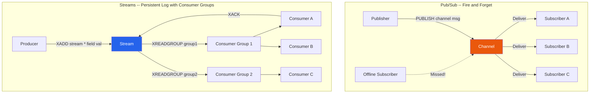

# [DEE-457] Redis Pub/Sub and Streams

:::info
Redis provides two messaging primitives with fundamentally different guarantees: Pub/Sub is a fire-and-forget broadcast mechanism with no persistence, while Streams is a persistent, log-based data structure with consumer groups. Choosing between them depends on whether messages must survive disconnection and whether consumers need independent progress tracking.
:::

## Context

Applications frequently need to distribute events or messages between components -- notifying subscribers of state changes, fanning out work to processors, or streaming data for real-time analytics. Redis offers two built-in mechanisms for this:

- **Pub/Sub**: A classic publish-subscribe system. Publishers send messages to channels; all currently connected subscribers receive them in real time. Messages are not stored -- if a subscriber is disconnected when a message is published, that message is lost forever. There are no consumer groups, no acknowledgements, and no replay.

- **Streams** (introduced in Redis 5.0): A persistent, append-only log data structure inspired by Apache Kafka. Messages (called entries) are stored with auto-generated IDs and persist until explicitly trimmed. Consumers can read from any point in the stream, and consumer groups allow multiple consumers to cooperatively process a stream with at-least-once delivery semantics.

These primitives serve different use cases, and conflating them is a common source of data loss bugs.

## Principle

Developers SHOULD use Pub/Sub for ephemeral, real-time notifications where message loss is acceptable (e.g., cache invalidation signals, live dashboard updates, typing indicators).

Developers SHOULD use Streams when messages must not be lost, when consumers need to process messages at their own pace, or when multiple consumer groups need independent views of the same data.

Developers MUST use `XACK` to acknowledge processed messages in consumer groups to prevent the Pending Entries List (PEL) from growing unboundedly.

Developers MUST configure a retention policy (`MAXLEN` or `MINID`) on Streams to prevent unbounded memory and disk growth.

## Visual



## Example

### Pub/Sub: publish and subscribe

```bash
# Terminal 1 -- Subscriber
redis-cli SUBSCRIBE notifications

# Terminal 2 -- Publisher
redis-cli PUBLISH notifications '{"event":"cache_invalidated","key":"user:42"}'

# Subscriber output:
# 1) "message"
# 2) "notifications"
# 3) "{\"event\":\"cache_invalidated\",\"key\":\"user:42\"}"
```

```python
# Python subscriber example
import redis

r = redis.Redis(host="localhost", port=6379, decode_responses=True)
pubsub = r.pubsub()
pubsub.subscribe("notifications")

for message in pubsub.listen():
    if message["type"] == "message":
        print(f"Received: {message['data']}")
```

### Streams: produce, consume with consumer groups, acknowledge

```bash
# Add entries to a stream
XADD orders * customer_id 42 product "widget" qty 3
# Returns: "1712345678901-0"

XADD orders * customer_id 99 product "gadget" qty 1
# Returns: "1712345678902-0"

# Create a consumer group starting from the beginning of the stream
XGROUP CREATE orders processing-group 0

# Consumer "worker-1" reads up to 2 pending messages
XREADGROUP GROUP processing-group worker-1 COUNT 2 STREAMS orders >
# Returns the entries assigned to this consumer

# After processing, acknowledge completion
XACK orders processing-group 1712345678901-0

# Check pending (unacknowledged) entries
XPENDING orders processing-group
```

```python
# Python stream consumer with consumer group
import redis

r = redis.Redis(host="localhost", port=6379, decode_responses=True)

STREAM = "orders"
GROUP = "processing-group"
CONSUMER = "worker-1"

# Create group (ignore error if it already exists)
try:
    r.xgroup_create(STREAM, GROUP, id="0", mkstream=True)
except redis.ResponseError:
    pass

while True:
    # Read new messages assigned to this consumer
    entries = r.xreadgroup(GROUP, CONSUMER, {STREAM: ">"}, count=10, block=5000)

    if not entries:
        continue  # no new messages, loop back to block

    for stream_name, messages in entries:
        for msg_id, fields in messages:
            try:
                process_order(fields)           # your business logic
                r.xack(STREAM, GROUP, msg_id)   # acknowledge success
            except Exception:
                pass  # message stays in PEL for retry or claim by another consumer
```

### Stream retention: preventing unbounded growth

```bash
# Cap stream at ~10,000 entries (approximate trimming for performance)
XADD orders MAXLEN ~ 10000 * customer_id 42 product "widget" qty 1

# Or trim by minimum ID (discard entries older than a given ID)
XTRIM orders MINID ~ 1712345600000-0
```

## Comparison Table

| Aspect | Redis Pub/Sub | Redis Streams | Apache Kafka | RabbitMQ |
|--------|--------------|---------------|-------------|----------|
| **Message persistence** | None -- fire and forget | Yes -- stored until trimmed | Yes -- retained by time/size policy | Yes -- until acknowledged |
| **Consumer groups** | No | Yes -- with XREADGROUP | Yes -- partitioned across consumers | Yes -- competing consumers on queues |
| **Delivery guarantee** | At-most-once | At-least-once (with XACK) | At-least-once / exactly-once | At-least-once / at-most-once |
| **Message replay** | Not possible | Yes -- read from any ID | Yes -- seek to any offset | No (once consumed and acked) |
| **Ordering** | Per-channel, real-time only | Per-stream, total order | Per-partition | Per-queue (with caveats) |
| **Throughput** | Very high (in-memory fan-out) | High (in-memory log) | Very high (disk-based, horizontal scaling) | Moderate (broker-mediated) |
| **Latency** | Sub-millisecond | Sub-millisecond | Low milliseconds (10-30ms typical) | Low milliseconds |
| **Horizontal scaling** | Limited (single-node channels) | Limited (single-node per stream) | Excellent (partitions across brokers) | Good (clustered queues) |
| **Best for** | Real-time notifications, cache invalidation, typing indicators | Task queues, event sourcing, activity feeds within Redis | High-volume event streaming, cross-service event bus | Complex routing, request-reply, task queues |

## When to Choose What

- **Pub/Sub**: You need real-time fan-out to all connected subscribers, and dropping messages when a subscriber is offline is acceptable. Typical uses: cache invalidation broadcasts, live UI updates, chat presence indicators.
- **Redis Streams**: You need message durability within Redis, consumer groups for work distribution, and the ability to replay or resume from a point. Typical uses: task queues, event logs, activity feeds where Redis is already in the stack and Kafka would be overengineering.
- **Kafka**: You need persistent, high-volume event streaming across services with strong ordering guarantees, horizontal scalability, and long retention. The operational overhead of a Kafka cluster is justified.
- **RabbitMQ**: You need complex routing (topic exchanges, headers-based routing, dead-letter queues) or request-reply patterns with rich protocol support (AMQP).

## Common Mistakes

1. **Using Pub/Sub when messages must not be lost.** Pub/Sub has zero persistence. If a subscriber disconnects -- even for a millisecond during a reconnect -- any messages published in that window are gone. For durable messaging, use Streams, Kafka, or RabbitMQ.

2. **Unbounded stream growth without MAXLEN or MINID.** Without a trimming policy, a Redis Stream grows indefinitely, consuming memory until Redis hits its `maxmemory` limit. Always set a cap with `MAXLEN ~` (approximate trimming is more performant than exact) or `MINID` to discard entries older than a threshold.

3. **Not acknowledging messages in consumer groups.** Unacknowledged messages accumulate in the Pending Entries List (PEL). Over time, the PEL grows, consuming memory and making `XPENDING` responses enormous. Use `XACK` after successful processing. For failed messages, use `XCLAIM` to reassign them to another consumer after a timeout.

4. **Treating Redis Streams as a Kafka replacement at scale.** Redis Streams live on a single node (per stream key). They do not partition across a cluster like Kafka topics. For high-volume, multi-service event streaming with horizontal scaling, Kafka or a dedicated message broker is the right tool.

5. **Not handling Pub/Sub subscriber reconnection.** When a Pub/Sub subscriber reconnects after a network blip, it has no way to know what it missed. If your application needs reliable delivery, either switch to Streams or implement a catch-up mechanism (e.g., on reconnect, query the latest state from a database).

6. **Blocking the Redis connection with Pub/Sub.** A Redis connection in subscribe mode cannot execute other commands. Use a dedicated connection for Pub/Sub and a separate connection for regular Redis operations.

## Related DEEs

- [DEE-450](450.md) Caching and Search Overview
- [DEE-453](453.md) Cache Invalidation Strategies -- Pub/Sub is commonly used for event-driven cache invalidation
- [DEE-454](454.md) Redis Data Structures for Caching -- Streams are a Redis data structure with unique properties

## References

- Redis: Pub/Sub. <https://redis.io/docs/latest/develop/interact/pubsub/>
- Redis: Streams. <https://redis.io/docs/latest/develop/data-types/streams/>
- Redis: Introduction to Redis Streams. <https://redis.io/docs/latest/develop/data-types/streams-tutorial/>
- Redis Blog: Choosing the Right Messaging Tool. <https://redis.io/blog/what-to-choose-for-your-synchronous-and-asynchronous-communication-needs-redis-streams-redis-pub-sub-kafka-etc-best-approaches-synchronous-asynchronous-communication/>
- DEV Community: Choosing the Right Messaging Tool. <https://dev.to/lovestaco/choosing-the-right-messaging-tool-redis-streams-redis-pubsub-kafka-and-more-577a>
