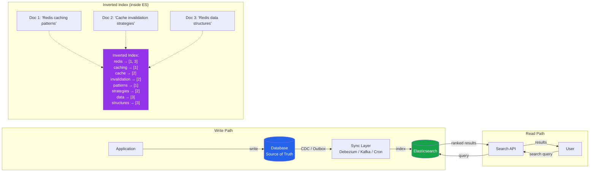

# [DEE-458] Full-Text Search with Elasticsearch

:::info
Elasticsearch provides full-text search capabilities beyond what relational database FTS offers: relevance scoring, faceted search, fuzzy matching, and multi-field queries across large datasets. It is a search engine, not a primary data store.
:::

## Context

Relational databases offer basic full-text search (PostgreSQL `tsvector`/`tsquery`, MySQL `FULLTEXT` indexes), which works well for simple keyword search on moderate data volumes. But when requirements grow -- relevance ranking across multiple fields, typo tolerance, faceted navigation, language-aware stemming, synonym expansion, autocomplete suggestions -- a dedicated search engine becomes necessary.

Elasticsearch is built on Apache Lucene and stores data in an inverted index: a data structure that maps each unique token (word) to the list of documents containing it. When a search query arrives, Elasticsearch looks up matching tokens in the inverted index, applies scoring algorithms (BM25 by default), and returns results ranked by relevance.

Key concepts:

- **Index** -- analogous to a database table. Contains documents with a defined schema (mapping).
- **Mapping** -- the schema definition for an index. Specifies field types, analyzers, and indexing behavior.
- **Analyzer** -- a pipeline that transforms raw text into tokens: character filters (strip HTML), tokenizer (split on whitespace/punctuation), and token filters (lowercase, stemming, synonyms).
- **Inverted index** -- the core data structure. Maps tokens to document IDs with metadata (position, frequency) for relevance scoring.

Elasticsearch is distributed by default, sharding data across nodes for horizontal scalability. However, it is not a transactional data store and should not replace the primary database. The database remains the source of truth; Elasticsearch is a read-optimized projection of that data for search purposes.

## Principle

Developers SHOULD use Elasticsearch when the application needs relevance-scored full-text search, faceted navigation, fuzzy matching, or multi-field search across large datasets that exceed the practical limits of database-native FTS.

Developers MUST NOT use Elasticsearch as the primary data store. It does not provide ACID transactions, durable single-document writes are not guaranteed until a refresh, and data loss is possible without proper replication.

Developers MUST define explicit index mappings before indexing data. Relying on dynamic mapping in production leads to type conflicts, bloated mappings, and poor search quality.

Developers MUST plan a data synchronization strategy between the source database and Elasticsearch before building search features.

## Visual



## Example

### Index creation with explicit mapping

```json
PUT /products
{
  "settings": {
    "number_of_shards": 3,
    "number_of_replicas": 1,
    "analysis": {
      "analyzer": {
        "product_analyzer": {
          "type": "custom",
          "tokenizer": "standard",
          "filter": ["lowercase", "english_stemmer", "english_stop"]
        }
      },
      "filter": {
        "english_stemmer": {
          "type": "stemmer",
          "language": "english"
        },
        "english_stop": {
          "type": "stop",
          "stopwords": "_english_"
        }
      }
    }
  },
  "mappings": {
    "properties": {
      "name": {
        "type": "text",
        "analyzer": "product_analyzer",
        "fields": {
          "keyword": { "type": "keyword" }
        }
      },
      "description": {
        "type": "text",
        "analyzer": "product_analyzer"
      },
      "category": {
        "type": "keyword"
      },
      "price": {
        "type": "float"
      },
      "tags": {
        "type": "keyword"
      },
      "created_at": {
        "type": "date"
      }
    }
  }
}
```

### Search query with relevance scoring

```json
POST /products/_search
{
  "query": {
    "bool": {
      "must": {
        "multi_match": {
          "query": "wireless noise cancelling headphones",
          "fields": ["name^3", "description", "tags^2"],
          "type": "best_fields",
          "fuzziness": "AUTO"
        }
      },
      "filter": [
        { "term": { "category": "electronics" } },
        { "range": { "price": { "lte": 300 } } }
      ]
    }
  },
  "aggs": {
    "by_category": {
      "terms": { "field": "category", "size": 10 }
    },
    "price_ranges": {
      "range": {
        "field": "price",
        "ranges": [
          { "to": 50 },
          { "from": 50, "to": 150 },
          { "from": 150, "to": 300 },
          { "from": 300 }
        ]
      }
    }
  },
  "highlight": {
    "fields": {
      "name": {},
      "description": {}
    }
  }
}
```

Key points in this query:
- `multi_match` searches across multiple fields with boosting (`name^3` is weighted 3x).
- `fuzziness: "AUTO"` tolerates typos (1-2 character edits depending on term length).
- `filter` clauses are exact matches that do not affect relevance scoring and are cached.
- `aggs` provides faceted counts for building filter UI.
- `highlight` returns matching snippets for display.

## Data Synchronization Patterns

The database is the source of truth. Elasticsearch must be kept in sync. Four common approaches:

| Pattern | Mechanism | Latency | Consistency | Complexity |
|---------|-----------|---------|-------------|------------|
| **Dual write** | Application writes to both DB and ES | Low | Weak (no atomicity) | Low |
| **Transactional outbox + CDC** | DB write -> outbox table -> Debezium/Kafka -> ES | Seconds | Strong (outbox is transactional) | High |
| **Application-level events** | Write to DB, publish event, consumer indexes to ES | Seconds | Depends on event delivery | Medium |
| **Periodic sync (cron)** | Batch query DB for changes, bulk index to ES | Minutes | Eventual | Low |

**Recommendation:** Avoid dual write -- it cannot guarantee atomicity across two independent systems. If the DB write succeeds but the ES index fails (or vice versa), the data diverges silently. Use CDC (Change Data Capture) with Debezium for production systems, or application-level events with a reliable message broker for simpler setups.

### CDC with Debezium (recommended)

```
PostgreSQL (WAL) -> Debezium connector -> Kafka topic -> 
  Kafka Connect Elasticsearch Sink -> Elasticsearch index
```

This approach captures every database change from the write-ahead log, ensuring no writes are missed. The sync lag is typically 1-5 seconds.

### Application-level event (simpler alternative)

```python
def create_product(product_data):
    # 1. Write to database (transactional)
    product = db.products.insert(product_data)

    # 2. Publish event (async, with retry)
    event_bus.publish("product.created", {
        "id": product.id,
        "payload": product_data
    })

# Consumer indexes to Elasticsearch
@event_bus.subscribe("product.created")
def index_product(event):
    es.index(index="products", id=event["id"], document=event["payload"])
```

## Common Mistakes

1. **Using Elasticsearch as the primary data store.** Elasticsearch is not a database. It does not provide ACID transactions, and documents are not immediately visible after indexing (they require a "refresh," which defaults to 1 second). If Elasticsearch data is lost, it should be fully rebuildable from the source database.

2. **Not planning index mapping upfront.** Relying on dynamic mapping causes problems: a field indexed as `text` cannot later be changed to `keyword` without reindexing. String fields get both `text` and `keyword` sub-fields by default, doubling storage. Define explicit mappings for every index.

3. **Ignoring sync lag.** There is always a delay between the database write and the Elasticsearch index update (seconds for CDC, minutes for cron). If the application shows search results immediately after a write, the new data may not appear. Handle this in the UX (e.g., optimistically show the just-created item) or in the API (read-your-own-writes from the database, not ES).

4. **Over-indexing fields.** Indexing every field as both `text` (full-text searchable) and `keyword` (exact match, aggregation) wastes storage and slows indexing. Only index fields that users actually search or filter on. Use `"index": false` for fields that are stored but never queried.

5. **No index lifecycle management.** Indices grow indefinitely without a retention strategy. Use Index Lifecycle Management (ILM) to automatically roll over, shrink, and delete old indices. This is especially important for time-series data (logs, events).

6. **Querying Elasticsearch for non-search reads.** If the application needs to fetch a product by ID, query the database -- not Elasticsearch. ES is optimized for search, not point lookups. Using ES for both search and CRUD reads couples the application to ES availability.

## Related DEEs

- [DEE-450](450.md) Caching and Search Overview
- [DEE-451](451.md) Cache-Aside Pattern -- caching frequently searched results
- [DEE-454](454.md) Redis Data Structures for Caching -- Redis complements ES for caching search results

## References

- Elastic: How Full-Text Search Works. <https://www.elastic.co/docs/solutions/search/full-text/how-full-text-works>
- Elastic: Mapping. <https://www.elastic.co/docs/manage-data/data-store/mapping>
- Elastic: Specify an Analyzer. <https://www.elastic.co/docs/manage-data/data-store/text-analysis/specify-an-analyzer>
- CockroachDB: Full Text Search with CockroachDB and Elasticsearch (CDC pattern). <https://www.cockroachlabs.com/blog/cockroachdb-cdc-elasticsearch/>
- Debezium: Streaming Database Changes to Elasticsearch. <https://debezium.io/documentation/reference/stable/tutorial.html>
- Wikipedia: Inverted index. <https://en.wikipedia.org/wiki/Inverted_index>
