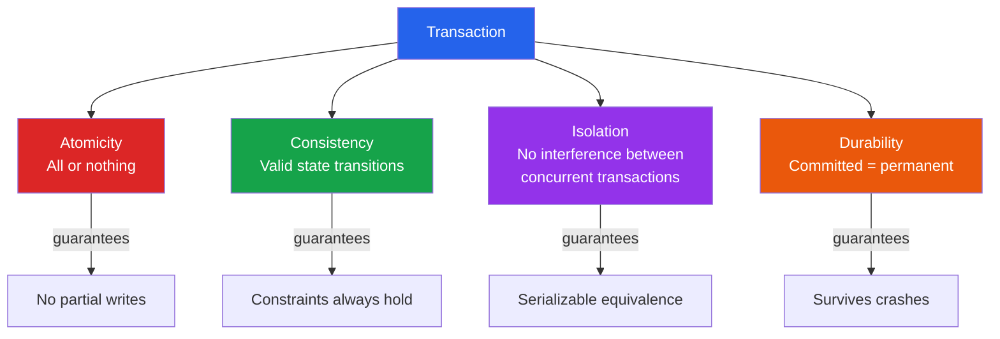

# [DEE-10] ACID Properties

:::info
ACID (Atomicity, Consistency, Isolation, Durability) defines the four guarantees that a database transaction MUST provide to ensure data validity despite errors, crashes, and concurrent access.
:::

## Context

Every application that writes data faces the same fundamental question: what happens when things go wrong mid-operation? A bank transfer debits one account but the server crashes before crediting the other. Two users purchase the last item in stock at the same instant. The power fails one millisecond after a user clicks "Save."

The ACID properties emerged as the answer to these problems. Jim Gray formalized the concepts of atomicity, consistency, and durability in his 1981 paper "The Transaction Concept: Virtues and Limitations." In 1983, Theo Haerder and Andreas Reuter coined the ACID acronym, adding isolation as an explicit property, in their paper "Principles of Transaction-Oriented Database Recovery."

Today, ACID compliance remains the defining characteristic that separates traditional relational databases (PostgreSQL, MySQL InnoDB, Oracle) from many distributed and NoSQL systems that relax one or more of these guarantees in exchange for scalability or availability. Understanding ACID is not optional for anyone designing a system where data correctness matters -- it is the baseline vocabulary for reasoning about data integrity.

## Principle

A database system MUST guarantee all four ACID properties for any operation declared as a transaction:

- **Atomicity** -- A transaction MUST be all-or-nothing. Either every operation within the transaction completes successfully, or none of them take effect. There is no partial execution.
- **Consistency** -- A transaction MUST transition the database from one valid state to another. All defined rules -- constraints, cascades, triggers -- MUST hold after the transaction completes.
- **Isolation** -- Concurrent transactions MUST NOT interfere with each other. The result of executing transactions concurrently MUST be equivalent to some serial ordering of those transactions.
- **Durability** -- Once a transaction is committed, its effects MUST persist even in the event of power loss, crashes, or other system failures.

Developers SHOULD understand that isolation levels (Read Uncommitted, Read Committed, Repeatable Read, Serializable) represent deliberate trade-offs between strictness and performance. The default isolation level in PostgreSQL is Read Committed; in MySQL InnoDB it is Repeatable Read. Developers MUST choose the isolation level appropriate to their consistency requirements rather than relying on defaults blindly.

## Visual



## Example

A classic bank transfer demonstrates all four properties working together:

```sql
-- Transfer $500 from account A to account B
BEGIN;

-- Debit source account
UPDATE accounts SET balance = balance - 500
 WHERE account_id = 'A'
   AND balance >= 500;  -- Consistency: enforce non-negative balance

-- Credit destination account
UPDATE accounts SET balance = balance + 500
 WHERE account_id = 'B';

-- Both updates succeed or neither takes effect (Atomicity)
-- No other transaction sees the intermediate state where
-- A is debited but B is not yet credited (Isolation)
COMMIT;
-- After COMMIT returns, the transfer survives a crash (Durability)
```

### Isolation levels in practice (PostgreSQL)

```sql
-- Default: Read Committed
-- Each statement sees only rows committed before that statement began
SET TRANSACTION ISOLATION LEVEL READ COMMITTED;

-- Repeatable Read
-- The transaction sees a snapshot taken at the start of the first statement
SET TRANSACTION ISOLATION LEVEL REPEATABLE READ;

-- Serializable
-- Full serializability; the database will abort transactions
-- that would cause anomalies
SET TRANSACTION ISOLATION LEVEL SERIALIZABLE;
```

### MySQL InnoDB durability configuration

```sql
-- Full ACID durability (default, safest)
SET GLOBAL innodb_flush_log_at_trx_commit = 1;

-- Flush once per second (better performance, risk of ~1s data loss)
SET GLOBAL innodb_flush_log_at_trx_commit = 2;
```

## Common Mistakes

1. **Assuming ACID means zero concurrency issues.** ACID guarantees depend on the chosen isolation level. Under Read Committed (PostgreSQL default), a transaction can see different snapshots between statements, leading to non-repeatable reads. Developers who need consistent reads within a transaction MUST explicitly set Repeatable Read or Serializable isolation.

2. **Wrapping long-running operations in a single transaction.** Large transactions hold locks longer, increasing contention and the probability of deadlocks. A common anti-pattern is wrapping a batch import of millions of rows in one transaction "for atomicity." Instead, break work into smaller batches and use application-level idempotency to handle partial failures.

3. **Ignoring durability configuration.** Setting `innodb_flush_log_at_trx_commit = 0` or `= 2` in MySQL, or setting `fsync = off` in PostgreSQL, disables full durability. The database will report a transaction as committed before the data is safely on disk. This is appropriate for ephemeral data but dangerous for financial or critical records.

4. **Confusing application-level consistency with database consistency.** The "C" in ACID refers to constraint enforcement within the database (foreign keys, CHECK constraints, unique indexes). Business rules enforced only in application code are not protected by ACID. If a business rule matters, encode it as a database constraint whenever possible.

## Related DEEs

- [DEE-11](11.md) CAP Theorem -- how distributed systems trade off consistency
- [DEE-12](12.md) Relational vs Non-Relational -- not all databases provide full ACID
- [DEE-100](../Relational%20Design/100.md) Normalization -- the structural foundation for consistency

## References

- Gray, J. (1981). "The Transaction Concept: Virtues and Limitations." Proceedings of the 7th International Conference on Very Large Data Bases. <https://jimgray.azurewebsites.net/papers/thetransactionconcept.pdf>
- Haerder, T. & Reuter, A. (1983). "Principles of Transaction-Oriented Database Recovery." ACM Computing Surveys, 15(4), 287-317. <https://dl.acm.org/doi/10.1145/289.291>
- PostgreSQL Documentation: Transaction Isolation. <https://www.postgresql.org/docs/current/transaction-iso.html>
- MySQL 8.4 Reference Manual: InnoDB and the ACID Model. <https://dev.mysql.com/doc/refman/8.4/en/mysql-acid.html>
- Wikipedia: ACID. <https://en.wikipedia.org/wiki/ACID>
