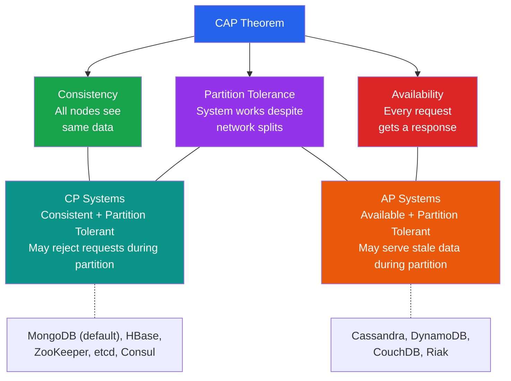

# [DEE-11] CAP Theorem

:::info
The CAP theorem states that a distributed data store can provide at most two of three guarantees simultaneously: Consistency, Availability, and Partition tolerance.
:::

## Context

When a database runs on a single server, ACID properties are relatively straightforward to implement. The moment data is replicated across multiple nodes -- for fault tolerance, geographic distribution, or horizontal scaling -- a fundamental trade-off emerges.

In 2000, Eric Brewer presented the CAP conjecture at the ACM Symposium on Principles of Distributed Computing (PODC), arguing that any networked shared-data system can satisfy at most two of three properties: consistency, availability, and partition tolerance. In 2002, Seth Gilbert and Nancy Lynch of MIT published a formal proof, establishing it as a theorem.

The three properties are:

- **Consistency (C)** -- Every read receives the most recent write or an error. All nodes see the same data at the same time.
- **Availability (A)** -- Every request to a non-failing node receives a response, without the guarantee that it contains the most recent write.
- **Partition tolerance (P)** -- The system continues to operate despite arbitrary message loss or failure of part of the network.

Since network partitions are inevitable in any distributed system, the practical choice is between CP (consistency + partition tolerance) and AP (availability + partition tolerance). A system that chooses CP will refuse requests or return errors during a partition to maintain consistency. A system that chooses AP will continue to serve requests during a partition but may return stale data.

Daniel Abadi extended CAP with the PACELC theorem (2010), observing that even when there is no partition, systems must still choose between latency and consistency. PACELC states: if there is a Partition, choose between Availability and Consistency; Else, choose between Latency and Consistency.

## Principle

Architects MUST understand the CAP trade-off before selecting a distributed database. The choice between CP and AP SHOULD be driven by the domain's tolerance for stale reads versus unavailability.

Developers SHOULD NOT treat CAP as a permanent binary label on a database. Many modern databases allow per-query or per-operation consistency tuning (e.g., MongoDB read/write concerns, Cassandra consistency levels). The system's effective CAP behavior depends on how it is configured, not just which product is chosen.

Developers MUST NOT design systems that assume network partitions will never occur. Partition tolerance is not optional in distributed environments -- it is a physical reality.

## Visual



## Example

### CP behavior: MongoDB during a partition

When a MongoDB replica set loses its primary, the cluster holds an election. During the election window (typically 10-12 seconds), the cluster refuses write operations to maintain consistency:

```
Client -> Write request -> Replica Set (no primary)
       <- Error: "not primary" / "no primary found"

-- After election completes, writes resume on the new primary.
-- Any writes that were not replicated before the old primary
-- went down are rolled back to maintain consistency.
```

### AP behavior: Cassandra during a partition

Cassandra continues to accept reads and writes on all reachable nodes. After the partition heals, conflicting writes are resolved using last-write-wins (by timestamp):

```
-- With consistency level ONE (AP behavior):
Client -> Write to Node A (reachable)   -> Success
Client -> Read from Node B (stale data) -> Returns old value

-- After partition heals:
-- Anti-entropy repair reconciles differences using timestamps
```

### Tuning consistency per-operation (Cassandra)

```cql
-- Strong consistency for a critical read (quorum of replicas must agree)
SELECT * FROM orders WHERE order_id = 42
  USING CONSISTENCY QUORUM;

-- Eventual consistency for a non-critical read (any single replica)
SELECT * FROM user_activity WHERE user_id = 7
  USING CONSISTENCY ONE;
```

### Real-world CP vs AP decision table

| Scenario | Tolerance | Choice | Example System |
|----------|-----------|--------|----------------|
| Financial transactions | Cannot tolerate stale reads | CP | MongoDB (w:majority, r:majority), CockroachDB |
| Shopping cart | Stale reads acceptable, must stay available | AP | DynamoDB, Cassandra |
| DNS | Stale records acceptable, must resolve | AP | DNS infrastructure |
| Distributed locking | Correctness over availability | CP | ZooKeeper, etcd, Consul |
| Social media feed | Slightly stale content is fine | AP | Cassandra, DynamoDB |
| Inventory count (oversell prevention) | Cannot tolerate stale reads | CP | PostgreSQL (single-node), CockroachDB |

## Common Mistakes

1. **Treating CAP as a permanent label.** Calling MongoDB "CP" or Cassandra "AP" without qualification is misleading. Both databases offer tunable consistency. MongoDB with `readConcern: "local"` and `writeConcern: 1` behaves more like AP. Cassandra with `CONSISTENCY ALL` behaves more like CP. The trade-off is per-operation, not per-product.

2. **Ignoring the "else" case (PACELC).** CAP only describes behavior during partitions. In normal operation (the common case), the real trade-off is between latency and consistency. A system classified as PA/EL (e.g., Cassandra default) sacrifices consistency for availability during partitions AND sacrifices consistency for lower latency during normal operation. Architects SHOULD evaluate both dimensions.

3. **Assuming single-node databases are immune to CAP.** A single PostgreSQL instance trivially provides CA (no partitions possible). But the moment you add streaming replication for high availability, you face CAP trade-offs: synchronous replication (CP-like, higher latency) vs. asynchronous replication (risk of stale reads on replicas, AP-like).

4. **Believing "consistency" means the same thing in CAP and ACID.** CAP consistency means linearizability -- every read sees the most recent write. ACID consistency means the database transitions between valid states respecting constraints. These are fundamentally different concepts that share an unfortunate name.

## Related DEEs

- [DEE-10](10.md) ACID Properties -- the consistency model for single-node databases
- [DEE-12](12.md) Relational vs Non-Relational -- CAP trade-offs influence database category selection
- [DEE-600](../Operations/600.md) Replication -- where CAP trade-offs become operational reality

## References

- Brewer, E. (2000). "Towards Robust Distributed Systems." Keynote at ACM PODC. <https://people.eecs.berkeley.edu/~brewer/cs262b-2004/PODC-keynote.pdf>
- Gilbert, S. & Lynch, N. (2002). "Brewer's Conjecture and the Feasibility of Consistent, Available, Partition-Tolerant Web Services." ACM SIGACT News, 33(2). <https://users.ece.cmu.edu/~adrian/731-sp04/readings/GL-cap.pdf>
- Abadi, D. (2012). "Consistency Tradeoffs in Modern Distributed Database System Design." IEEE Computer, 45(2). <https://www.cs.umd.edu/~abadi/papers/abadi-pacelc.pdf>
- Kleppmann, M. (2015). "Please stop calling databases CP or AP." <https://martin.kleppmann.com/2015/05/11/please-stop-calling-databases-cp-or-ap.html>
- Wikipedia: CAP theorem. <https://en.wikipedia.org/wiki/CAP_theorem>
- Wikipedia: PACELC theorem. <https://en.wikipedia.org/wiki/PACELC_theorem>
