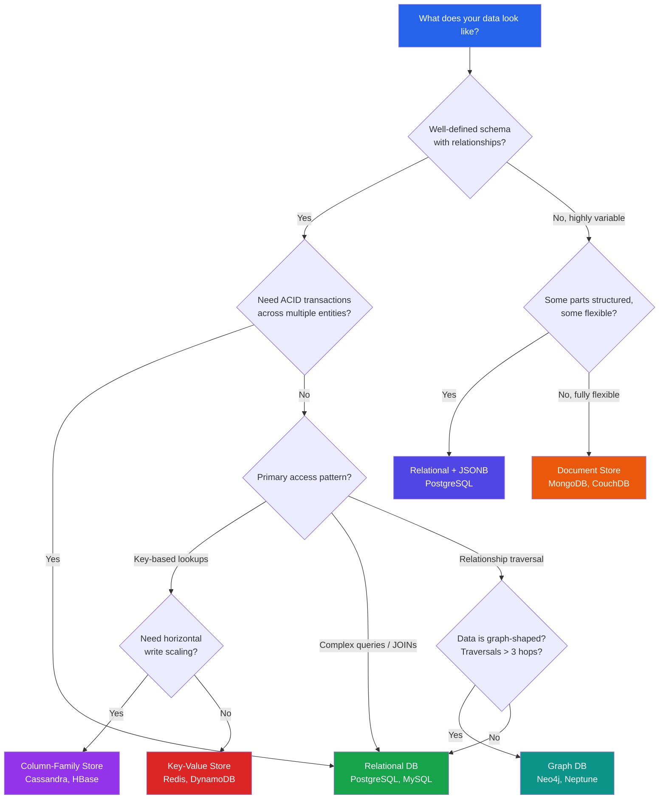

# [DEE-12] Relational vs Non-Relational

:::info
The choice between relational and non-relational databases SHOULD be driven by data access patterns and consistency requirements, not by hype or familiarity.
:::

## Context

For decades, relational databases were the default persistence layer for virtually all applications. The relational model, formalized by Edgar F. Codd in 1970, provides a rigorous foundation: tables, rows, columns, constraints, and SQL as a universal query language. Systems like PostgreSQL, MySQL, Oracle, and SQL Server dominate enterprise and web application development.

The rise of web-scale applications in the 2000s exposed limitations of the relational model for certain workloads: rigid schemas made rapid iteration difficult, JOIN-heavy queries struggled at massive scale, and horizontal scaling required complex sharding. This led to the emergence of NoSQL databases -- document stores (MongoDB, CouchDB), key-value stores (Redis, DynamoDB), column-family stores (Cassandra, HBase), and graph databases (Neo4j, Amazon Neptune) -- each optimized for specific access patterns.

Today the landscape has converged significantly. PostgreSQL supports JSONB with indexing and powerful query operators, blurring the line with document databases. MongoDB added multi-document ACID transactions in version 4.0 (2018). Martin Fowler and Pramod Sadalage popularized the concept of "polyglot persistence" -- using different database technologies for different parts of an application based on each component's specific data access patterns, rather than forcing all data into one model.

The decision is no longer "relational or not" but "which model fits this particular data access pattern." Most production systems benefit from a relational database as the primary store, with specialized databases for specific workloads where the relational model creates friction.

## Principle

Developers SHOULD default to a relational database unless there is a specific, measurable reason to choose otherwise. Relational databases are general-purpose, well-understood, and provide strong consistency guarantees that are difficult to retrofit.

Developers MUST evaluate the data access pattern before selecting a database type. The primary drivers are:

- **Schema stability** -- If the schema is well-defined and unlikely to change frequently, relational is a natural fit. If the schema is highly variable or document-oriented, a document store MAY be more appropriate.
- **Query complexity** -- If the workload involves multi-table JOINs, aggregations, and ad-hoc queries, relational databases with SQL provide superior expressiveness. If access is primarily key-based lookups, a key-value or document store MAY offer better performance.
- **Consistency requirements** -- If the application requires ACID transactions across multiple entities, a relational database SHOULD be the first choice. NoSQL databases that support transactions often do so with caveats or performance penalties.
- **Scale characteristics** -- If the workload requires horizontal write scaling beyond what a single node can handle, distributed NoSQL databases SHOULD be evaluated.

Teams SHOULD NOT adopt polyglot persistence without operational readiness. Each additional database technology introduces deployment, monitoring, backup, and expertise costs.

## Visual



## Example

### Use case mapping

| Use Case | Access Pattern | Recommended Type | Why |
|----------|---------------|------------------|-----|
| E-commerce orders | Transactions across orders, inventory, payments | Relational (PostgreSQL) | ACID transactions, complex queries, reporting |
| User sessions | Fast key-based read/write, TTL expiration | Key-Value (Redis) | Sub-millisecond latency, built-in expiry |
| Content management | Variable document structure, nested content | Document (MongoDB) or Relational + JSONB | Flexible schema, rich querying |
| IoT time-series | High write throughput, range scans by time | Column-Family (Cassandra) or TimescaleDB | Horizontal write scaling, time-range partitioning |
| Social network | Friend-of-friend queries, recommendation paths | Graph (Neo4j) | Efficient multi-hop traversal |
| Product catalog | Structured core + variable attributes | Relational + JSONB (PostgreSQL) | Best of both: SQL joins + flexible attributes |
| Real-time leaderboard | Sorted sets, fast rank lookups | Key-Value (Redis) | Native sorted set operations |
| Audit log | Append-heavy, rarely queried | Column-Family (Cassandra) or Relational | High write throughput, time-based partitioning |

### PostgreSQL JSONB: relational and document in one

```sql
-- Store products with structured core fields and flexible attributes
CREATE TABLE products (
    id          SERIAL PRIMARY KEY,
    name        TEXT NOT NULL,
    category_id INTEGER REFERENCES categories(id),
    price       NUMERIC(10,2) NOT NULL,
    attributes  JSONB DEFAULT '{}'
);

-- Index into the JSONB for fast queries
CREATE INDEX idx_products_attrs ON products USING GIN (attributes);

-- Query: find all electronics with screen size > 13 inches
SELECT name, price, attributes->>'screen_size' AS screen
  FROM products
 WHERE category_id = 42
   AND (attributes->>'screen_size')::numeric > 13
 ORDER BY price;

-- You get SQL joins, constraints, and transactions
-- PLUS flexible per-product attributes without schema changes
```

### MongoDB multi-document transaction (since 4.0)

```javascript
const session = client.startSession();
session.startTransaction();

try {
  await orders.insertOne({ orderId: 1001, items: [...], total: 99.99 }, { session });
  await inventory.updateOne(
    { sku: "ABC-123" },
    { $inc: { quantity: -1 } },
    { session }
  );
  await session.commitTransaction();
} catch (error) {
  await session.abortTransaction();
  throw error;
} finally {
  session.endSession();
}
// Works, but adds latency compared to single-document operations.
// MongoDB is optimized for single-document atomicity by design.
```

## Common Mistakes

1. **Choosing NoSQL "for scale" without evidence of a scaling problem.** Most applications never outgrow a single well-tuned PostgreSQL instance. A single PostgreSQL server can handle thousands of transactions per second and terabytes of data. Premature adoption of a distributed database adds operational complexity (consistency management, cluster maintenance, split-brain scenarios) without corresponding benefit.

2. **Using MongoDB to avoid schema design.** Skipping schema design does not eliminate the need for it -- it defers it to application code, where it is harder to enforce and reason about. "Schemaless" databases still have an implicit schema defined by the application. The difference is that a relational database enforces the schema; a document database does not.

3. **Storing everything in one database type.** A relational database with JSONB support (PostgreSQL) can handle 80% of document workloads without introducing a second database. Teams that add MongoDB alongside PostgreSQL for a small amount of flexible data often underestimate the operational burden of maintaining two database systems, two backup strategies, and two sets of expertise.

4. **Ignoring the convergence of modern databases.** PostgreSQL has powerful JSON support; MongoDB has ACID transactions; Redis has persistence and Lua scripting; Cassandra has lightweight transactions. Before adding a new database to the stack, verify that the existing one cannot serve the need. The gap between relational and non-relational has narrowed considerably.

5. **Adopting polyglot persistence without operational maturity.** Martin Fowler's polyglot persistence assumes the team can operate multiple database systems reliably. Each database adds monitoring, backup, failover, upgrade, and on-call complexity. Teams SHOULD adopt additional databases incrementally, only when the benefit clearly outweighs the operational cost.

## Related DEEs

- [DEE-10](10.md) ACID Properties -- relational databases provide full ACID; NoSQL databases vary
- [DEE-11](11.md) CAP Theorem -- distributed NoSQL databases face CAP trade-offs
- [DEE-100](100.md) Normalization -- foundational design principle for relational databases
- [DEE-400](400.md) Document Modeling -- design patterns for document databases

## References

- Codd, E.F. (1970). "A Relational Model of Data for Large Shared Data Banks." Communications of the ACM, 13(6). <https://dl.acm.org/doi/10.1145/362384.362685>
- Fowler, M. "Polyglot Persistence." <https://martinfowler.com/bliki/PolyglotPersistence.html>
- Sadalage, P. & Fowler, M. (2012). "NoSQL Distilled: A Brief Guide to the Emerging World of Polyglot Persistence." Addison-Wesley. <https://martinfowler.com/books/nosql.html>
- PostgreSQL Documentation: JSON Types. <https://www.postgresql.org/docs/current/datatype-json.html>
- MongoDB Documentation: Transactions. <https://www.mongodb.com/docs/manual/core/transactions/>
- Bytebase (2025). "Postgres vs. MongoDB: a Complete Comparison." <https://www.bytebase.com/blog/postgres-vs-mongodb/>
