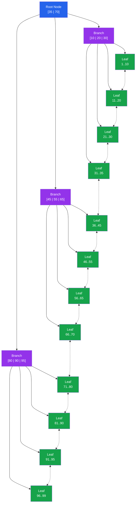

# [DEE-151] B-Tree Indexes

:::info
B-tree is the default index type in every major relational database. Developers MUST understand B-tree behavior -- its strengths, its limits, and its structure -- before reaching for any specialized index type.
:::

## Context

When you run `CREATE INDEX` without specifying a method, both PostgreSQL and MySQL create a B-tree index. This is not an accident. B-trees are the most versatile index structure in relational databases: they support equality lookups, range scans, sorting, and MIN/MAX aggregation, all with predictable logarithmic performance.

The "B" in B-tree stands for "balanced." Every leaf node sits at the same depth from the root, which guarantees consistent lookup time regardless of which value you search for. A B-tree with millions of entries typically has a depth of only 4 or 5 levels, meaning any value can be located in 4-5 page reads.

The structure has three layers. Leaf nodes store the actual indexed values (or pointers to heap tuples) and are connected via a doubly linked list so the database can scan ranges efficiently without returning to the root. Branch nodes contain separator keys that guide traversal from the root down to the correct leaf. The root node is the single entry point at the top.

Because B-trees handle the vast majority of real-world access patterns, the correct default strategy is to use B-trees and only switch to a specialized index type (hash, GIN, GiST, BRIN) when you have measured evidence that B-tree performance is insufficient for a specific workload.

## Principle

- Developers MUST understand B-tree capabilities before evaluating alternative index types.
- Developers SHOULD use B-tree indexes as the default choice for all general-purpose indexing needs.
- B-tree indexes support: `=`, `<`, `<=`, `>=`, `>`, `BETWEEN`, `IN`, `IS NULL`, `IS NOT NULL`, `LIKE 'prefix%'`, `ORDER BY`, and `MIN`/`MAX` aggregation.
- Developers SHOULD NOT create indexes on low-cardinality columns (e.g., boolean or status fields with 2-3 values) unless combined with other columns in a composite index or used as a partial index predicate.

## Visual



**Blue** = root node, **Purple** = branch nodes, **Green** = leaf nodes. Dotted lines between leaves represent the doubly linked list that enables efficient range scans.

## Example

### Basic B-tree index creation

```sql
-- PostgreSQL and MySQL: default index type is B-tree
CREATE INDEX idx_orders_created_at ON orders (created_at);

-- Explicit B-tree specification (same result)
CREATE INDEX idx_orders_created_at ON orders USING BTREE (created_at);
```

### Operations a B-tree supports

```sql
-- Equality lookup: traverses root -> branch -> leaf
SELECT * FROM orders WHERE order_id = 12345;

-- Range scan: finds start leaf, follows linked list
SELECT * FROM orders
 WHERE created_at >= '2025-01-01'
   AND created_at <  '2025-02-01';

-- Sorting: the index already stores values in order
SELECT * FROM orders ORDER BY created_at DESC LIMIT 20;

-- MIN/MAX: jump directly to the first or last leaf
SELECT MIN(created_at) FROM orders;
SELECT MAX(created_at) FROM orders;

-- BETWEEN: equivalent to a range scan
SELECT * FROM orders
 WHERE total BETWEEN 100 AND 500;

-- Prefix LIKE: works because B-tree sorts lexicographically
SELECT * FROM customers WHERE last_name LIKE 'John%';
```

### Multi-column B-tree index

```sql
-- Supports queries filtering on (status), (status, created_at),
-- or (status, created_at, customer_id)
CREATE INDEX idx_orders_status_date ON orders (status, created_at, customer_id);

-- Uses the index (leftmost prefix match)
SELECT * FROM orders WHERE status = 'shipped' AND created_at >= '2025-06-01';

-- Does NOT efficiently use this index (skips leading column)
SELECT * FROM orders WHERE created_at >= '2025-06-01';
```

## Common Mistakes

1. **Indexing low-cardinality columns alone.** A B-tree index on a boolean column like `is_active` is nearly useless by itself. With only two distinct values, the index does not narrow the search meaningfully -- the database will often choose a sequential scan instead. Use a composite index or a partial index to make low-cardinality filters effective.

2. **Creating too many indexes.** Every index must be maintained on every INSERT, UPDATE, and DELETE. A table with 10 indexes means 10 additional write operations per row change. Audit your indexes regularly: if an index is never used (check `pg_stat_user_indexes` in PostgreSQL or `sys.schema_unused_indexes` in MySQL), drop it.

3. **Not understanding index column ordering.** In a multi-column B-tree index on `(A, B, C)`, the data is sorted first by A, then by B within each A value, then by C. A query filtering only on B or C cannot efficiently use this index. Column order must match your query patterns -- see [DEE-153](153.md) for details.

4. **Assuming indexes always make queries faster.** For small tables (hundreds of rows), a sequential scan is often faster than an index lookup because it avoids the overhead of tree traversal and random I/O. The optimizer knows this and will ignore your index on small tables -- this is correct behavior.

5. **Using exotic index types prematurely.** Hash, GIN, GiST, and BRIN indexes exist for specific use cases. Reaching for them before confirming that a B-tree cannot meet your performance requirements adds complexity without benefit. Start with B-tree; switch only with evidence.

## Related DEEs

- [DEE-150](150.md) Indexing and Storage Overview
- [DEE-152](152.md) Hash Indexes -- equality-only alternative to B-tree
- [DEE-153](153.md) Composite Indexes -- multi-column index design
- [DEE-201](202.md) Reading Execution Plans -- verify your indexes are being used

## References

- [PostgreSQL Documentation: Index Types](https://www.postgresql.org/docs/current/indexes-types.html) -- official documentation on B-tree and other index types
- [MySQL 8.4 Reference Manual: Comparison of B-Tree and Hash Indexes](https://dev.mysql.com/doc/refman/8.4/en/index-btree-hash.html) -- MySQL B-tree capabilities and limitations
- [Use The Index, Luke: Anatomy of an Index](https://use-the-index-luke.com/sql/anatomy/the-tree) -- visual explanation of B-tree structure and traversal
- [Use The Index, Luke: The Where Clause](https://use-the-index-luke.com/sql/where-clause) -- how B-tree indexes serve different query predicates
- [PostgreSQL Documentation: Multicolumn Indexes](https://www.postgresql.org/docs/current/indexes-multicolumn.html) -- multi-column B-tree behavior
