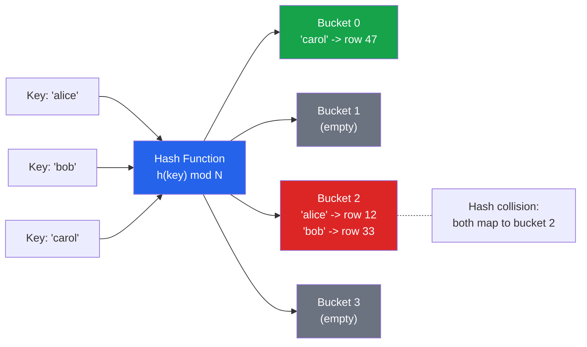

# [DEE-152] Hash Indexes

:::info
Hash indexes support only equality comparisons. Developers SHOULD use hash indexes only when equality lookups dominate the workload and B-tree overhead has been measured as a bottleneck -- which is rare in practice.
:::

## Context

A hash index maps each indexed value through a hash function to a bucket. When the database looks up a value, it computes the hash, jumps directly to the corresponding bucket, and finds matching row pointers. This is conceptually O(1) per lookup, compared to O(log n) for a B-tree traversal.

In practice, the performance advantage of hash indexes over B-trees for equality lookups is small. B-trees with a depth of 4-5 levels are already extremely fast for point lookups. The cases where hash indexes provide measurable improvement are narrow: very large tables where the B-tree depth becomes significant, or workloads consisting almost entirely of equality checks with no range queries, sorting, or prefix matching.

### PostgreSQL hash index history

PostgreSQL hash indexes had a troubled history. Before PostgreSQL 10, hash indexes were not WAL-logged (Write-Ahead Log), meaning they were not crash-safe and could not be replicated. A crash required a full `REINDEX`. Starting with PostgreSQL 10, hash indexes are fully WAL-logged and crash-safe, making them a viable option. However, the PostgreSQL documentation still notes that B-tree indexes are generally preferred because they are more versatile.

### MySQL hash indexes

In MySQL, hash indexes are primarily associated with the MEMORY (HEAP) storage engine. InnoDB uses an internal "adaptive hash index" that the engine builds automatically on top of B-tree indexes for frequently accessed pages -- this is not user-controlled. For InnoDB tables, you cannot explicitly create a hash index; the `HASH` index type is only available for MEMORY tables.

## Principle

- Developers SHOULD use hash indexes only for pure equality lookups (`=`) where B-tree overhead has been measured as a bottleneck.
- Developers MUST NOT use hash indexes for range queries (`<`, `>`, `BETWEEN`), sorting (`ORDER BY`), or prefix matching (`LIKE 'prefix%'`) -- hash indexes do not support these operations.
- In PostgreSQL, developers SHOULD prefer B-tree unless the table is very large and the workload is exclusively equality-based.
- In MySQL, developers SHOULD be aware that explicit hash indexes are only available on MEMORY engine tables; InnoDB manages its adaptive hash index automatically.

## Visual



The hash function maps each key to a bucket number. Lookups compute the hash and jump directly to the bucket. Collisions (multiple keys in one bucket) are resolved by scanning within the bucket.

## Example

### PostgreSQL hash index

```sql
-- Create a hash index for equality-only lookups
CREATE INDEX idx_sessions_token ON sessions USING HASH (session_token);

-- This query uses the hash index (equality)
SELECT * FROM sessions WHERE session_token = 'abc123def456';

-- These queries CANNOT use the hash index:
-- Range query
SELECT * FROM sessions WHERE session_token > 'abc';
-- Sorting
SELECT * FROM sessions ORDER BY session_token;
-- Prefix match
SELECT * FROM sessions WHERE session_token LIKE 'abc%';
```

### Comparing B-tree and hash for equality lookups

```sql
-- B-tree index (supports equality AND range)
CREATE INDEX idx_users_email_btree ON users USING BTREE (email);

-- Hash index (supports equality ONLY)
CREATE INDEX idx_users_email_hash ON users USING HASH (email);

-- For this query, both indexes work:
EXPLAIN ANALYZE SELECT * FROM users WHERE email = 'alice@example.com';

-- For this query, only the B-tree works:
EXPLAIN ANALYZE SELECT * FROM users WHERE email LIKE 'alice%';
```

### MySQL MEMORY engine hash index

```sql
-- Hash indexes are explicit only on MEMORY tables in MySQL
CREATE TABLE session_cache (
    session_id VARCHAR(64) NOT NULL,
    user_id    INT NOT NULL,
    data       TEXT,
    INDEX USING HASH (session_id)
) ENGINE = MEMORY;

-- InnoDB adaptive hash index is automatic and not user-controlled
-- Check its status:
SHOW ENGINE INNODB STATUS;
-- Look for "INSERT BUFFER AND ADAPTIVE HASH INDEX" section
```

## Common Mistakes

1. **Using hash indexes for range queries.** A hash index stores values in hash-bucket order, not in sorted order. It cannot answer "give me all rows where created_at > X" -- it can only answer "give me all rows where session_token = X." If you need range queries, use a B-tree.

2. **Assuming hash is always faster for equality.** The theoretical O(1) vs O(log n) difference is misleading. A B-tree with 10 million rows has a depth of about 4-5. The practical difference in I/O between 1 hash lookup and 4-5 B-tree page reads is small, especially when upper B-tree levels are cached in memory. Benchmark before switching.

3. **Using PostgreSQL hash indexes on versions before 10.** Before PostgreSQL 10, hash indexes were not WAL-logged. A crash required a manual `REINDEX`. If you are on PostgreSQL 9.x or earlier, do not use hash indexes in production.

4. **Expecting hash indexes on MySQL InnoDB tables.** InnoDB does not support user-created hash indexes. The `USING HASH` syntax is only valid for the MEMORY storage engine. InnoDB's adaptive hash index is an internal optimization that the engine manages automatically.

5. **Overlooking hash index space usage.** Hash indexes store a 32-bit hash code for each indexed value. For short keys (like integers), a hash index can actually be larger than a B-tree index on the same column. Measure actual index size with `pg_relation_size()` before assuming space savings.

## Related DEEs

- [DEE-150](150.md) Indexing and Storage Overview
- [DEE-151](151.md) B-Tree Indexes -- the default and more versatile alternative
- [DEE-153](153.md) Composite Indexes -- hash indexes do not support multi-column composite indexes in PostgreSQL

## References

- [PostgreSQL Documentation: Index Types](https://www.postgresql.org/docs/current/indexes-types.html) -- official documentation on hash indexes
- [MySQL 8.4 Reference Manual: Comparison of B-Tree and Hash Indexes](https://dev.mysql.com/doc/refman/8.4/en/index-btree-hash.html) -- MySQL hash index limitations
- [PostgreSQL Wiki: Hash Indexes](https://wiki.postgresql.org/wiki/Hash_Indexes) -- history of WAL support and current status
- [MySQL 8.4 Reference Manual: The MEMORY Storage Engine](https://dev.mysql.com/doc/refman/8.4/en/memory-storage-engine.html) -- MEMORY engine hash index details
