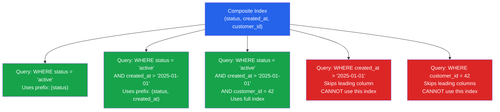

# [DEE-153] Composite Indexes

:::info
Column order in a composite index MUST match your query patterns. A composite index on `(A, B, C)` is usable for queries on `(A)`, `(A, B)`, or `(A, B, C)` -- but not for queries on `(B)`, `(C)`, or `(B, C)` alone.
:::

## Context

A composite index (also called a concatenated index or multi-column index) is a single B-tree index that spans multiple columns. The database sorts entries first by the first column, then by the second column within each first-column value, then by the third, and so on -- exactly like a phone book sorted by last name, then first name.

This sorting behavior creates the **leftmost prefix rule**: the database can use a composite index only when the query's WHERE clause includes a contiguous prefix of the index columns, starting from the leftmost column. A query that skips the leading column cannot efficiently traverse the B-tree because the entries for the non-leading column are scattered across the entire index.

PostgreSQL supports composite B-tree indexes with up to 32 columns. MySQL supports up to 16 columns. In practice, indexes with more than 3-4 columns are rarely beneficial -- the maintenance cost and storage overhead increase with each additional column, and query patterns that require 5+ column indexes usually indicate a schema or query design problem.

The critical design decision in composite indexes is **column ordering**. The same set of columns in different orders produces indexes that serve different queries. Getting the order right requires analyzing your actual query patterns, not guessing.

## Principle

- Developers MUST order composite index columns to match their query patterns, following the leftmost prefix rule.
- Developers SHOULD place equality-filtered columns first and range-filtered columns last in composite indexes.
- Developers SHOULD prefer a single composite index over multiple single-column indexes when queries consistently filter on the same combination of columns.
- Developers MUST NOT assume that the database can efficiently use a composite index when the query skips the leading column.

## Visual



## Example

### Column order matters

```sql
-- Index A: optimized for filtering by status, then date range
CREATE INDEX idx_orders_status_date ON orders (status, created_at);

-- Index B: optimized for filtering by date range, then status
CREATE INDEX idx_orders_date_status ON orders (created_at, status);
```

```sql
-- Query 1: "all shipped orders in January"
SELECT * FROM orders
 WHERE status = 'shipped'
   AND created_at >= '2025-01-01'
   AND created_at <  '2025-02-01';
-- Index A is optimal: equality on status (narrows to one branch),
-- then range on created_at (scans a contiguous leaf range)
-- Index B works but less efficiently: range on created_at first
-- (wider scan), then filters status within each leaf

-- Query 2: "all orders in January regardless of status"
SELECT * FROM orders
 WHERE created_at >= '2025-01-01'
   AND created_at <  '2025-02-01';
-- Index B is optimal: leading column matches
-- Index A CANNOT be used efficiently: leading column (status) is missing
```

### Equality first, range last

```sql
-- Queries: find orders by status and customer within a date range
-- Equality columns: status, customer_id
-- Range column: created_at

-- GOOD: equality columns first, range column last
CREATE INDEX idx_orders_eq_range ON orders (status, customer_id, created_at);

-- The index narrows to (status = X, customer_id = Y) immediately,
-- then scans a tight range on created_at.

-- BAD: range column in the middle
CREATE INDEX idx_orders_bad ON orders (status, created_at, customer_id);

-- The range on created_at breaks the ability to use customer_id
-- as an index filter -- it becomes a post-scan filter instead.
```

### One composite vs multiple single-column indexes

```sql
-- Scenario: queries always filter on (tenant_id, status)

-- Approach A: two single-column indexes
CREATE INDEX idx_orders_tenant ON orders (tenant_id);
CREATE INDEX idx_orders_status ON orders (status);
-- The database may use "bitmap index scan" to combine them,
-- but this is slower than a direct composite index lookup.

-- Approach B: one composite index (better)
CREATE INDEX idx_orders_tenant_status ON orders (tenant_id, status);
-- Direct B-tree traversal on both columns. Faster, less I/O.
-- Bonus: this also serves queries filtering on tenant_id alone.
```

### Verifying index usage

```sql
-- PostgreSQL: check which indexes are used
EXPLAIN ANALYZE
SELECT * FROM orders
 WHERE status = 'shipped'
   AND created_at >= '2025-01-01';

-- Look for "Index Scan using idx_orders_status_date"
-- If you see "Seq Scan" instead, the index is not being used.

-- PostgreSQL: check for unused indexes
SELECT indexrelname, idx_scan
  FROM pg_stat_user_indexes
 WHERE schemaname = 'public'
 ORDER BY idx_scan ASC;
```

## Common Mistakes

1. **Wrong column order.** The most common composite index mistake. An index on `(created_at, status)` does not help a query that filters on `status` alone. Analyze your actual queries and order columns so the leftmost prefix matches the most common filter combinations.

2. **Creating single-column indexes when a composite would serve.** If your queries consistently filter on `(tenant_id, status)`, two separate single-column indexes are inferior to one composite index. The database must combine two separate index lookups (bitmap scan) instead of performing a single B-tree traversal. Use composite indexes for common multi-column filter patterns.

3. **Ignoring the leftmost prefix rule.** An index on `(A, B, C)` does not help queries filtering only on `B` or `C`. If you also need to query by `B` alone, you need a separate index on `(B)` or a different composite index with `B` as the leading column.

4. **Placing range columns before equality columns.** In a composite index, once the B-tree encounters a range condition, all subsequent columns can only be used as post-scan filters, not as index navigators. Place equality-filtered columns first (`=`, `IN`) and range-filtered columns last (`>`, `<`, `BETWEEN`).

5. **Over-indexing with redundant composites.** An index on `(A, B)` already covers queries on `(A)` alone. Creating a separate index on `(A)` is redundant and wastes space and write performance. Review existing indexes before adding new ones.

## Related DEEs

- [DEE-150](150.md) Indexing and Storage Overview
- [DEE-151](151.md) B-Tree Indexes -- the underlying structure of composite indexes
- [DEE-154](154.md) Partial and Conditional Indexes -- combining composite with partial for targeted indexing
- [DEE-201](202.md) Reading Execution Plans -- verify your composite index is actually used

## References

- [PostgreSQL Documentation: Multicolumn Indexes](https://www.postgresql.org/docs/current/indexes-multicolumn.html) -- official guide to composite indexes in PostgreSQL
- [MySQL 8.4 Reference Manual: Multiple-Column Indexes](https://dev.mysql.com/doc/refman/8.4/en/multiple-column-indexes.html) -- MySQL composite index behavior and leftmost prefix rule
- [Use The Index, Luke: Concatenated Keys](https://use-the-index-luke.com/sql/where-clause/the-equals-operator/concatenated-keys) -- deep explanation of column ordering in composite indexes
- [Use The Index, Luke: Multi-Column Indexes](https://use-the-index-luke.com/sql/where-clause/searching-for-ranges/greater-less-between-and-டindex) -- equality-first, range-last strategy
- [PostgreSQL Documentation: Combining Multiple Indexes](https://www.postgresql.org/docs/current/indexes-bitmap-scans.html) -- how PostgreSQL combines single-column indexes as an alternative
