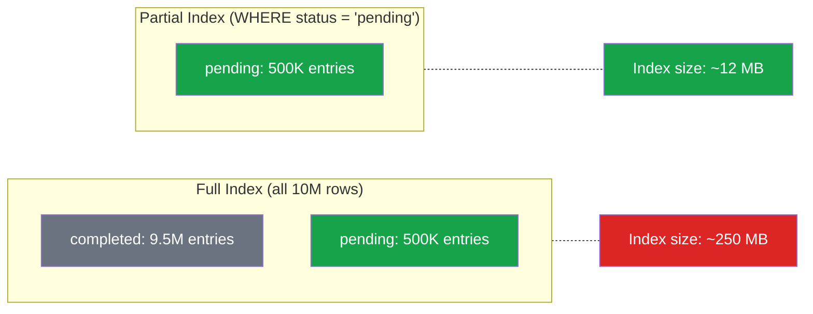

# [DEE-154] Partial and Conditional Indexes

:::info
A partial index indexes only the rows that match a WHERE predicate. Developers SHOULD use partial indexes when queries consistently filter on a known condition, reducing index size and maintenance cost while improving lookup performance.
:::

## Context

A standard index covers every row in the table, regardless of whether each row is ever queried. For many real-world access patterns, this is wasteful. Consider an orders table with 10 million rows where 95% have `status = 'completed'` and queries almost exclusively target the 5% that are `status = 'pending'`. A full B-tree index on `status` wastes space and I/O on 9.5 million rows that the application rarely looks up.

A partial index solves this by including only rows that satisfy a predicate specified at index creation time. The result is a smaller index that is faster to scan, cheaper to maintain on writes, and uses less disk space.

PostgreSQL has supported partial indexes since version 7.2 via the `CREATE INDEX ... WHERE` syntax. This is a mature, well-optimized feature.

**MySQL does not support partial indexes.** There is no equivalent `WHERE` clause on `CREATE INDEX` in MySQL. MySQL developers must use workarounds such as composite indexes with the filtering column as a leading column, generated columns, or application-level strategies. This is one of the significant indexing capability gaps between PostgreSQL and MySQL.

## Principle

- Developers SHOULD use partial indexes when queries consistently filter on a stable, known condition and only a fraction of rows match.
- The partial index predicate MUST match (or be implied by) the query's WHERE clause for the optimizer to use the index.
- Developers SHOULD NOT create many non-overlapping partial indexes as a substitute for table partitioning -- use actual table partitioning instead.
- Developers MUST be aware that MySQL does not support partial indexes and plan workarounds accordingly.

## Visual



The partial index is 95% smaller because it excludes the 9.5 million completed rows that queries do not target.

## Example

### Index on active users only

```sql
-- Full index: includes all users, even deactivated ones
CREATE INDEX idx_users_email_full ON users (email);

-- Partial index: only active users (much smaller)
CREATE INDEX idx_users_email_active ON users (email)
 WHERE is_active = true;

-- This query uses the partial index:
SELECT * FROM users WHERE email = 'alice@example.com' AND is_active = true;

-- This query CANNOT use the partial index (no is_active filter):
SELECT * FROM users WHERE email = 'alice@example.com';
```

### Unique constraint with soft delete

```sql
-- Problem: enforce unique email, but allow multiple deleted users
-- with the same email (soft-delete pattern)

-- A regular unique index would reject reuse of a deleted user's email:
-- CREATE UNIQUE INDEX idx_users_email_unique ON users (email);  -- too strict

-- Solution: unique partial index on non-deleted rows only
CREATE UNIQUE INDEX idx_users_email_unique ON users (email)
 WHERE deleted_at IS NULL;

-- Active user alice@example.com exists:
INSERT INTO users (email, deleted_at) VALUES ('alice@example.com', NULL);
-- OK

-- Soft-delete that user:
UPDATE users SET deleted_at = NOW() WHERE email = 'alice@example.com';

-- Re-register with same email:
INSERT INTO users (email, deleted_at) VALUES ('alice@example.com', NULL);
-- OK: the old row has deleted_at set, so it's outside the partial index
```

### Index on recent orders

```sql
-- Only index orders from the last 90 days for dashboard queries
-- NOTE: this uses a fixed date; you must recreate or use a function
CREATE INDEX idx_orders_recent ON orders (customer_id, created_at)
 WHERE created_at >= '2025-01-01';

-- Query that uses this index:
SELECT * FROM orders
 WHERE customer_id = 42
   AND created_at >= '2025-03-01';
-- The optimizer recognizes that created_at >= '2025-03-01'
-- implies created_at >= '2025-01-01'
```

### MySQL workarounds (no partial index support)

```sql
-- MySQL: no partial index syntax. Workarounds:

-- Workaround 1: composite index with the filter column leading
CREATE INDEX idx_orders_status_date ON orders (status, created_at);
-- This helps narrow to status = 'pending' but still indexes all rows.

-- Workaround 2: generated column + index
ALTER TABLE orders
  ADD COLUMN is_pending TINYINT
  GENERATED ALWAYS AS (IF(status = 'pending', 1, NULL)) STORED;

CREATE INDEX idx_orders_pending ON orders (is_pending, created_at);
-- NULL values are not indexed in MySQL, so completed orders are excluded.
-- This approximates a partial index.
```

## Common Mistakes

1. **Partial index predicate not matching the query WHERE clause.** The PostgreSQL optimizer uses the partial index only when it can prove the query's conditions imply the index predicate. If your index has `WHERE status = 'pending'` but your query filters on `WHERE status != 'completed'`, the optimizer may not recognize these as equivalent. Keep predicates simple and match them literally in your queries.

2. **Using parameterized queries that defeat partial index matching.** Prepared statements with parameters like `WHERE status = $1` cannot use a partial index with `WHERE status = 'pending'` because the planner does not know the parameter value at plan time. Use explicit values in the query or restructure to pass the condition at plan time.

3. **Over-using partial indexes.** Creating a separate partial index for every status value (pending, processing, shipped, completed, cancelled) is worse than a single composite index on `(status, ...)`. Many non-overlapping partial indexes add planner overhead as PostgreSQL evaluates each one. Use table partitioning for this pattern instead.

4. **Forgetting to update time-based predicates.** A partial index with `WHERE created_at >= '2025-01-01'` does not automatically slide forward in time. As data ages, this index grows to include more and more rows. Either recreate the index periodically with an updated date, or use a different approach (partitioning, composite index).

5. **Assuming partial indexes exist in MySQL.** MySQL does not support the `WHERE` clause on `CREATE INDEX`. Code that works in PostgreSQL will fail in MySQL. If cross-database compatibility is required, use composite indexes with the filtering column as a leading column, or use generated columns with NULL to exclude rows from indexing.

## Related DEEs

- [DEE-150](150.md) Indexing and Storage Overview
- [DEE-151](151.md) B-Tree Indexes -- the underlying structure of most partial indexes
- [DEE-153](153.md) Composite Indexes -- often an alternative to partial indexes

## References

- [PostgreSQL Documentation: Partial Indexes](https://www.postgresql.org/docs/current/indexes-partial.html) -- official guide to creating and using partial indexes
- [PostgreSQL Documentation: CREATE INDEX](https://www.postgresql.org/docs/current/sql-createindex.html) -- syntax reference including the WHERE clause
- [MySQL 8.4 Reference Manual: CREATE INDEX Statement](https://dev.mysql.com/doc/refman/8.4/en/create-index.html) -- note the absence of partial index support
- [Stonebraker, M. (1989). "The Case for Partial Indexes"](https://dl.acm.org/doi/10.1145/74120.74151) -- original academic paper proposing partial indexes
