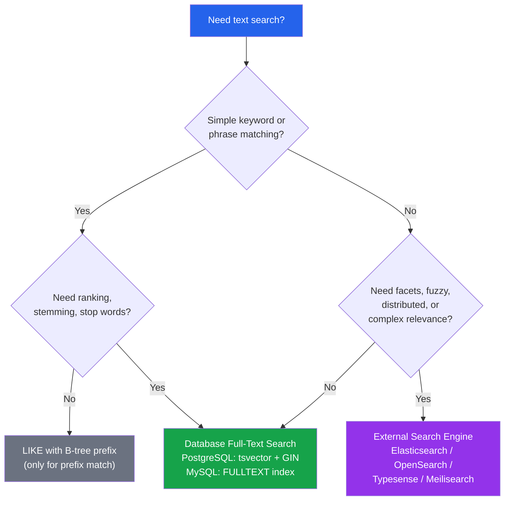

# [DEE-155] Full-Text Search Indexes

:::info
Database full-text search is sufficient for many search requirements. Developers SHOULD use built-in full-text search before reaching for external search engines like Elasticsearch. Jump to Elasticsearch only when you need features the database cannot provide.
:::

## Context

Application search is a spectrum. At one end, `WHERE name LIKE '%search%'` does a full table scan on every query -- it cannot use indexes, ignores word boundaries, and does not rank results. At the other end, Elasticsearch provides distributed full-text search with relevance scoring, faceted navigation, fuzzy matching, synonyms, and horizontal scaling. Between these extremes, database-native full-text search provides a capable middle ground that eliminates the operational complexity of a separate search cluster.

### PostgreSQL full-text search

PostgreSQL provides a mature full-text search system built on two data types: `tsvector` (a processed document representation storing lexemes with positional information) and `tsquery` (a search query with boolean operators). The `@@` operator matches a `tsquery` against a `tsvector`. GIN (Generalized Inverted Index) is the recommended index type for full-text search -- it builds an inverted index mapping each lexeme to the rows that contain it, enabling fast lookups. GiST indexes are an alternative but are lossy (they may produce false matches that require heap re-checks) and generally slower for pure text search.

### MySQL full-text search

MySQL supports `FULLTEXT` indexes on `CHAR`, `VARCHAR`, and `TEXT` columns in both InnoDB and MyISAM storage engines. Queries use the `MATCH ... AGAINST` syntax with three modes: natural language (default, relevance-ranked), boolean (operators like `+`, `-`, `*`), and query expansion (automatic term broadening). MySQL's full-text search is simpler to set up than PostgreSQL's but offers less control over text processing (no custom dictionaries, limited stemming configuration).

### When to use an external search engine

Elasticsearch (or OpenSearch, Typesense, Meilisearch) becomes necessary when you need: distributed search across very large corpora, complex relevance tuning with custom scoring, faceted/aggregated search results, fuzzy matching and typo tolerance beyond basic stemming, real-time analytics on text data, or multi-language support with per-field analyzers.

## Principle

- Developers SHOULD use database full-text search for straightforward search needs before introducing an external search engine.
- Developers MUST NOT use `LIKE '%term%'` for user-facing search -- it forces full table scans, ignores linguistic processing, and cannot rank results by relevance.
- Developers SHOULD use GIN indexes (not GiST) for PostgreSQL full-text search unless covering-index or multi-type column requirements favor GiST.
- Developers SHOULD evaluate whether Elasticsearch is necessary based on specific feature requirements, not on assumptions about performance.

## Visual



## Example

### PostgreSQL: tsvector + GIN index

```sql
-- Add a tsvector column (can also compute on-the-fly, but storing is faster)
ALTER TABLE articles ADD COLUMN search_vector tsvector;

-- Populate the tsvector column
UPDATE articles
   SET search_vector = to_tsvector('english', coalesce(title, '') || ' ' || coalesce(body, ''));

-- Create a GIN index on the tsvector column
CREATE INDEX idx_articles_search ON articles USING GIN (search_vector);

-- Keep the column up to date with a trigger
CREATE FUNCTION articles_search_trigger() RETURNS trigger AS $$
BEGIN
  NEW.search_vector :=
    to_tsvector('english', coalesce(NEW.title, '') || ' ' || coalesce(NEW.body, ''));
  RETURN NEW;
END
$$ LANGUAGE plpgsql;

CREATE TRIGGER trg_articles_search
  BEFORE INSERT OR UPDATE ON articles
  FOR EACH ROW EXECUTE FUNCTION articles_search_trigger();

-- Search with ranking
SELECT title,
       ts_rank(search_vector, query) AS rank
  FROM articles,
       to_tsquery('english', 'database & indexing') AS query
 WHERE search_vector @@ query
 ORDER BY rank DESC
 LIMIT 20;
```

### MySQL: FULLTEXT index with MATCH AGAINST

```sql
-- Create a FULLTEXT index (InnoDB or MyISAM)
CREATE FULLTEXT INDEX idx_articles_ft ON articles (title, body);

-- Natural language search (default, returns relevance score)
SELECT title,
       MATCH(title, body) AGAINST('database indexing') AS relevance
  FROM articles
 WHERE MATCH(title, body) AGAINST('database indexing')
 ORDER BY relevance DESC
 LIMIT 20;

-- Boolean mode (operators: + must include, - must exclude, * wildcard)
SELECT title
  FROM articles
 WHERE MATCH(title, body) AGAINST('+database -nosql +index*' IN BOOLEAN MODE);

-- Query expansion (finds related terms automatically)
SELECT title
  FROM articles
 WHERE MATCH(title, body) AGAINST('database' WITH QUERY EXPANSION);
```

### Comparison table

| Feature | PostgreSQL FTS | MySQL FULLTEXT | Elasticsearch |
|---------|---------------|----------------|---------------|
| **Setup complexity** | Moderate (tsvector, triggers) | Low (just add FULLTEXT index) | High (separate cluster) |
| **Relevance ranking** | `ts_rank`, `ts_rank_cd` | Built-in relevance score | BM25, custom scoring |
| **Stemming** | Yes (configurable dictionaries) | Basic (built-in) | Yes (per-field analyzers) |
| **Stop words** | Configurable per dictionary | Built-in list | Configurable per analyzer |
| **Fuzzy / typo tolerance** | Limited (trigram with pg_trgm) | No | Yes (native) |
| **Boolean operators** | `&`, `|`, `!` in tsquery | `+`, `-`, `*`, `""` | Full query DSL |
| **Faceted search** | Manual (GROUP BY) | Manual (GROUP BY) | Native aggregations |
| **Highlighting** | `ts_headline()` | No built-in | Native highlighting |
| **Multi-language** | Yes (per-column dictionaries) | Basic (ngram for CJK) | Yes (per-field) |
| **Horizontal scaling** | No (single node) | No (single node) | Yes (distributed) |
| **Operational overhead** | None (in-database) | None (in-database) | High (separate infra) |

## Common Mistakes

1. **Using `LIKE '%term%'` for search.** This forces a full sequential scan on every query. It cannot use any index (the leading `%` prevents B-tree prefix matching). It does not understand word boundaries, stemming, or relevance. Replace it with proper full-text search.

2. **Not understanding stemming.** Full-text search engines reduce words to their stems: "running", "runs", and "ran" all match the stem "run." Developers who expect exact string matching are surprised when `to_tsquery('english', 'runs')` matches documents containing "running." This is correct behavior -- understand your text search configuration.

3. **Forgetting to maintain the tsvector column.** In PostgreSQL, if you store a precomputed `tsvector` column but forget to add a trigger to update it on INSERT/UPDATE, search results become stale. Either use a trigger (as shown above) or compute `to_tsvector()` at query time (slower but always current).

4. **Jumping to Elasticsearch too early.** Elasticsearch requires a separate cluster, data synchronization pipeline, and operational monitoring. For simple keyword search on a few million rows, database full-text search handles the load with zero additional infrastructure. Introduce Elasticsearch only when you need features the database cannot provide (fuzzy matching, facets, distributed search).

5. **Ignoring MySQL FULLTEXT limitations.** MySQL FULLTEXT has minimum word length defaults (3 characters for InnoDB, 4 for MyISAM) that silently ignore short search terms. It also has a 50% threshold in natural language mode -- words appearing in more than 50% of rows are treated as stop words. These defaults catch developers off guard. Check `innodb_ft_min_token_size` and understand the frequency threshold.

## Related DEEs

- [DEE-150](150.md) Indexing and Storage Overview
- [DEE-151](151.md) B-Tree Indexes -- why B-tree cannot serve full-text search
- [DEE-154](154.md) Partial and Conditional Indexes -- can be combined with full-text indexes

## References

- [PostgreSQL Documentation: Full-Text Search](https://www.postgresql.org/docs/current/textsearch.html) -- comprehensive guide to PostgreSQL text search
- [PostgreSQL Documentation: Text Search Indexes (GIN, GiST)](https://www.postgresql.org/docs/current/textsearch-indexes.html) -- index type comparison for text search
- [MySQL 8.4 Reference Manual: Full-Text Search Functions](https://dev.mysql.com/doc/refman/8.4/en/fulltext-search.html) -- MySQL FULLTEXT syntax and modes
- [MySQL 8.4 Reference Manual: InnoDB Full-Text Indexes](https://dev.mysql.com/doc/refman/8.4/en/innodb-fulltext-index.html) -- InnoDB-specific full-text details
- [Elasticsearch: The Definitive Guide](https://www.elastic.co/guide/en/elasticsearch/reference/current/index.html) -- when and how to use Elasticsearch
