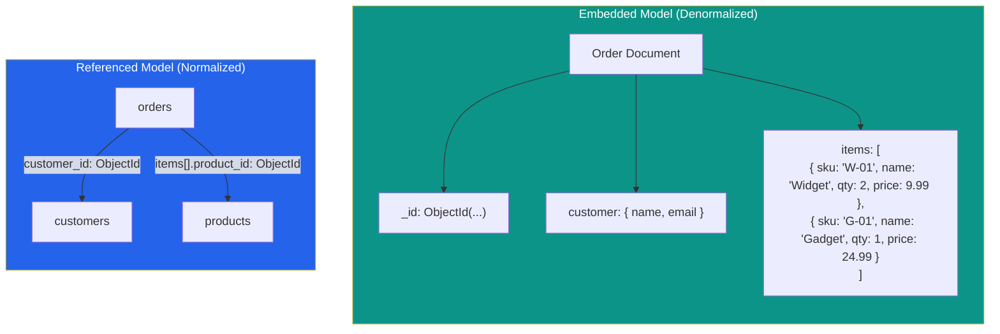

# [DEE-401] Document Store Modeling

:::info
Model documents around access patterns, not entity relationships. Embed data that is read together; reference data that is shared, large, or changes independently.
:::

## Context

Document stores such as MongoDB, Couchbase, and Amazon DocumentDB store data as self-contained documents (typically JSON or BSON). Unlike relational databases, which decompose data into normalized tables and reconstruct it with joins, document databases encourage denormalization -- placing related data in a single document so a query can retrieve everything it needs in one read.

This trade-off is deliberate. Relational normalization optimizes for write correctness and storage efficiency; document embedding optimizes for read performance and schema flexibility. A well-modeled document eliminates multi-table joins, reduces network round trips, and maps naturally to the objects an application already works with.

However, document modeling is not "dump everything in one document." MongoDB imposes a 16 MB BSON document size limit, and unbounded embedded arrays are a well-documented anti-pattern that leads to degraded write performance, bloated working sets, and eventual document size limit violations. The core skill is knowing when to embed and when to reference.

## Principle

- You MUST model documents around how the application reads data, not around the entity-relationship diagram you would create for a relational database.
- You SHOULD embed data that is always read together and has a bounded, predictable size.
- You SHOULD reference data that is shared across many documents, is large, or changes independently of the parent document.
- You MUST NOT allow arrays within documents to grow without bound. Unbounded arrays degrade index performance, inflate memory usage, and risk hitting the 16 MB document limit.
- You SHOULD add indexes on fields used in referenced lookups (`$lookup`, application-level joins).

## Visual



## Example

### Embedded: order with line items

When an order is always displayed with its line items and the number of items per order is bounded (e.g., max 100), embedding is the natural choice:

```json
{
  "_id": ObjectId("665a1f..."),
  "order_number": "ORD-2025-4821",
  "status": "shipped",
  "customer": {
    "name": "Alice Chen",
    "email": "alice@example.com",
    "shipping_address": {
      "street": "123 Main St",
      "city": "Taipei",
      "country": "TW"
    }
  },
  "items": [
    { "sku": "W-01", "name": "Widget", "qty": 2, "unit_price": 9.99 },
    { "sku": "G-01", "name": "Gadget", "qty": 1, "unit_price": 24.99 }
  ],
  "total": 44.97,
  "created_at": ISODate("2025-06-01T08:30:00Z")
}
```

A single `findOne({ _id: ... })` returns everything the order detail page needs. No joins. No round trips.

### Referenced: products shared across many orders

When products are referenced by thousands of orders and product information (price, description) changes independently:

```json
// products collection
{
  "_id": ObjectId("665b2a..."),
  "sku": "W-01",
  "name": "Widget",
  "current_price": 10.99,
  "description": "A high-quality widget",
  "category": "hardware"
}

// orders collection
{
  "_id": ObjectId("665a1f..."),
  "order_number": "ORD-2025-4821",
  "customer_id": ObjectId("665c3b..."),
  "items": [
    { "product_id": ObjectId("665b2a..."), "qty": 2, "unit_price": 9.99 },
    { "product_id": ObjectId("665b3c..."), "qty": 1, "unit_price": 24.99 }
  ],
  "created_at": ISODate("2025-06-01T08:30:00Z")
}
```

Note that `unit_price` is still stored on the order item (the price at time of sale), while the current price lives in the product document. The `product_id` reference is only used when the application needs to display current product details alongside order history.

### Embed vs Reference decision table

| Factor | Embed | Reference |
|--------|-------|-----------|
| **Read pattern** | Data is always read together | Data is read independently or optionally |
| **Data size** | Subdocument is small and bounded | Subdocument is large or grows without limit |
| **Update frequency** | Embedded data rarely changes | Related data changes frequently and independently |
| **Cardinality** | One-to-few (e.g., 1 order : 5 items) | One-to-many or many-to-many (e.g., 1 product : 10,000 orders) |
| **Data sharing** | Data belongs to this document alone | Data is shared across many documents |
| **Atomicity needs** | Single-document atomicity is sufficient | Multi-document transactions needed anyway |
| **Document growth** | Document stays well under 16 MB | Risk of approaching 16 MB limit |

## Common Mistakes

| Mistake | Why It Hurts | Fix |
|---------|-------------|-----|
| **Treating MongoDB like a relational DB** -- creating one collection per entity and joining with `$lookup` for every read | Eliminates MongoDB's primary advantage (single-document reads). `$lookup` is a server-side join that is significantly slower than embedding. | Embed data that is read together; reserve `$lookup` for ad-hoc analytics, not primary access paths |
| **Unbounded array growth** -- embedding every comment, log entry, or event into a parent document without limit | Arrays grow until the document hits 16 MB. Even before that, large documents inflate the WiredTiger cache working set and slow updates. | Use the subset pattern: embed the N most recent items; store the full history in a separate collection |
| **No indexes on referenced fields** -- storing `customer_id` as a reference but never indexing it | Application-level joins become collection scans. A `$lookup` on an unindexed foreign field is O(n) per document. | Create indexes on every field used as a join target: `db.orders.createIndex({ customer_id: 1 })` |
| **Duplicating mutable data without a sync strategy** -- embedding a customer's address in every order for read speed but having no way to update it | When the customer moves, hundreds of order documents contain stale addresses with no automated way to update them. | Either reference the address (if current address matters) or accept the embedded copy as a historical snapshot (if point-in-time accuracy is the requirement) |
| **Over-embedding for write-heavy workloads** -- embedding data that changes frequently into a large parent document | Every update to the embedded subdocument rewrites the entire parent document in WiredTiger. On large documents, this causes write amplification. | Reference frequently-updated data in its own collection; embed only stable or read-heavy data |

## Related DEEs

- [DEE-400](400.md) NoSQL Patterns Overview
- [DEE-405](405.md) Choosing the Right NoSQL Type
- [DEE-12](../Fundamentals/14.md) Relational vs Non-Relational

## References

- [MongoDB Data Modeling Best Practices](https://www.mongodb.com/docs/manual/data-modeling/best-practices/) -- official schema design guidance
- [Embed Data in Your MongoDB Schema](https://www.mongodb.com/docs/manual/data-modeling/embedding/) -- when and how to embed
- [Reference Data in Your MongoDB Schema](https://www.mongodb.com/docs/manual/data-modeling/referencing/) -- when and how to reference
- [Avoid Unbounded Arrays -- MongoDB Docs](https://www.mongodb.com/docs/manual/data-modeling/design-antipatterns/unbounded-arrays/) -- anti-pattern documentation
- [Schema Design Anti-Patterns -- MongoDB Docs](https://www.mongodb.com/docs/manual/data-modeling/design-antipatterns/) -- comprehensive anti-pattern list
