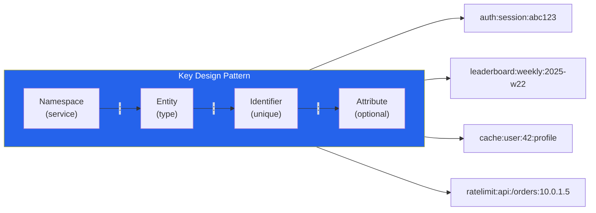

# [DEE-402] Key-Value Store Patterns

:::info
Design keys for your access patterns; value structure depends on the store's capabilities. Use consistent key naming conventions, set TTLs on ephemeral data, and choose the right data structure for each use case.
:::

## Context

Key-value stores are the simplest category of NoSQL database: every record is a key (a unique string) mapped to a value (a blob, string, or structured data type). This simplicity enables extreme performance -- Redis routinely delivers sub-millisecond reads and writes, and DynamoDB offers single-digit millisecond latency at any scale.

However, the stores within this category vary significantly in capability. Redis provides rich data structures (strings, hashes, lists, sets, sorted sets, streams, and more), making it suitable for caching, session management, leaderboards, rate limiting, and real-time analytics. DynamoDB extends the key-value model with sort keys and secondary indexes, supporting complex access patterns in a single table. Simpler stores like Memcached or etcd offer only opaque string values.

The key design is the most critical decision. Unlike relational databases where you can add indexes after the fact, key-value stores are accessed almost exclusively by key. A poorly designed key structure means you cannot efficiently retrieve the data you need.

## Principle

- You MUST establish and enforce a key naming convention before writing any application code. The convention SHOULD use a hierarchical namespace with a consistent delimiter (e.g., `service:entity:id:attribute`).
- You MUST set a TTL (time-to-live) on ephemeral data such as sessions, caches, and rate-limit counters. Missing TTLs cause memory to grow unboundedly until the store runs out of memory or evicts unpredictably.
- You SHOULD choose the appropriate Redis data structure for each use case rather than serializing everything into strings.
- You MUST NOT store values larger than what the store is designed for (e.g., Redis values over 512 MB, DynamoDB items over 400 KB). Large values increase latency, memory fragmentation, and replication lag.
- You SHOULD design keys to avoid hot spots -- a single key receiving a disproportionate share of traffic.

## Visual



## Example

### Redis session store

Store user sessions as Redis hashes with a TTL. Each field in the hash can be read or updated independently without deserializing the entire session:

```redis
-- Create a session with 30-minute TTL
HSET auth:session:abc123 user_id 42 role "admin" login_at "2025-06-01T08:30:00Z"
EXPIRE auth:session:abc123 1800

-- Read a single field (no deserialization needed)
HGET auth:session:abc123 user_id
-- "42"

-- Extend session on activity (slide the TTL)
EXPIRE auth:session:abc123 1800

-- Delete session on logout
DEL auth:session:abc123
```

### Redis sorted set leaderboard

Sorted sets maintain elements ordered by score, enabling O(log N) insertions and O(log N + M) range queries (where M is the number of returned elements):

```redis
-- Record player scores
ZADD leaderboard:weekly:2025-w22 1500 "player:alice"
ZADD leaderboard:weekly:2025-w22 2300 "player:bob"
ZADD leaderboard:weekly:2025-w22 1800 "player:carol"

-- Top 3 players (highest score first)
ZREVRANGE leaderboard:weekly:2025-w22 0 2 WITHSCORES
-- 1) "player:bob"    2) "2300"
-- 3) "player:carol"  4) "1800"
-- 5) "player:alice"  6) "1500"

-- Player rank (0-based, highest first)
ZREVRANK leaderboard:weekly:2025-w22 "player:carol"
-- 1

-- Increment a score atomically
ZINCRBY leaderboard:weekly:2025-w22 200 "player:alice"

-- Set TTL to auto-expire old leaderboards
EXPIRE leaderboard:weekly:2025-w22 604800
```

### DynamoDB single-table design basics

DynamoDB uses a partition key (PK) and optional sort key (SK) to organize data. Single-table design stores multiple entity types in one table, using key prefixes to distinguish them:

```
PK                  SK                      Attributes
─────────────────   ─────────────────────   ──────────────────────────
USER#42             PROFILE                 { name: "Alice", email: "alice@ex.com" }
USER#42             ORDER#2025-06-01#001    { total: 44.97, status: "shipped" }
USER#42             ORDER#2025-06-15#002    { total: 19.99, status: "pending" }
PRODUCT#W-01        METADATA                { name: "Widget", price: 10.99 }
PRODUCT#W-01        REVIEW#2025-06-10#u42   { rating: 5, comment: "Great" }
```

Access patterns enabled:
- Get user profile: `PK = USER#42, SK = PROFILE`
- List user orders: `PK = USER#42, SK begins_with ORDER#`
- Get orders in date range: `PK = USER#42, SK between ORDER#2025-06-01 and ORDER#2025-06-30`

### Redis data structure selection guide

| Data Structure | Use When | Example Use Case | Key Operations |
|---------------|----------|------------------|----------------|
| **String** | Simple values, counters, serialized objects | Page view counter, cached JSON response | `GET`, `SET`, `INCR`, `SETNX` |
| **Hash** | Object with named fields that are read/updated independently | User session, product details | `HGET`, `HSET`, `HMGET`, `HINCRBY` |
| **List** | Ordered sequence, queue, recent items | Task queue, activity feed (last N items) | `LPUSH`, `RPOP`, `LRANGE`, `LTRIM` |
| **Set** | Unique membership, tagging, intersection/union | User roles, online users, tag filtering | `SADD`, `SISMEMBER`, `SINTER`, `SUNION` |
| **Sorted Set** | Ranked data, time-series windows, priority queues | Leaderboard, rate limiter (sliding window) | `ZADD`, `ZRANGE`, `ZREVRANK`, `ZINCRBY` |
| **Stream** | Append-only event log with consumer groups | Event sourcing, message broker | `XADD`, `XREAD`, `XREADGROUP` |

## Common Mistakes

| Mistake | Why It Hurts | Fix |
|---------|-------------|-----|
| **Hot keys** -- a single key (e.g., global counter, popular cache entry) receiving the majority of traffic | In Redis, all operations on a key are serialized. In DynamoDB, a hot partition key throttles all items in that partition. | Shard hot keys (e.g., `counter:{0..N}` with `INCRBY` on a random shard, sum on read). In DynamoDB, use write sharding with calculated suffixes. |
| **Missing TTL on ephemeral data** -- sessions, caches, and temp data without expiration | Memory grows unboundedly. Redis eviction policies (`allkeys-lru`, `volatile-lru`) are a safety net, not a design strategy. The store eventually OOMs or evicts important data. | Set explicit TTLs on every ephemeral key: `EXPIRE key seconds` or `SET key value EX seconds`. |
| **Large values** -- storing multi-MB blobs (images, PDFs, full HTML pages) in Redis or DynamoDB | Large values increase network latency, memory fragmentation, and replication lag. In DynamoDB, items over 400 KB are rejected. | Store large blobs in object storage (S3); store only metadata or a reference URL in the key-value store. |
| **No key naming convention** -- ad-hoc key names like `u42`, `bob_session`, `data` | Keys become impossible to manage, debug, or monitor. You cannot use `SCAN` patterns to find related keys. Namespacing collisions occur between services. | Define a convention (e.g., `service:entity:id`) on day one and enforce it in code review. |
| **Serializing everything as JSON strings** in Redis | Loses the ability to update individual fields atomically and efficiently. Every update requires a full read-modify-write cycle. | Use Hashes for objects, Sorted Sets for ranked data, Sets for membership -- leverage Redis native structures. |

## Related DEEs

- [DEE-400](400.md) NoSQL Patterns Overview
- [DEE-405](405.md) Choosing the Right NoSQL Type
- [DEE-11](12.md) CAP Theorem

## References

- [Redis Data Structures](https://redis.io/technology/data-structures/) -- official overview of all Redis data types
- [Redis Coding Patterns](https://redis.io/docs/latest/develop/clients/patterns/) -- official client-side design patterns
- [Best Practices for DynamoDB Partition Keys -- AWS Docs](https://docs.aws.amazon.com/amazondynamodb/latest/developerguide/bp-partition-key-design.html) -- partition key design guidance
- [The What, Why, and When of Single-Table Design with DynamoDB -- Alex DeBrie](https://www.alexdebrie.com/posts/dynamodb-single-table/) -- comprehensive single-table design guide
- [Redis Key Design and Naming Conventions](https://oneuptime.com/blog/post/2026-01-21-redis-key-design-naming/view) -- key naming best practices
