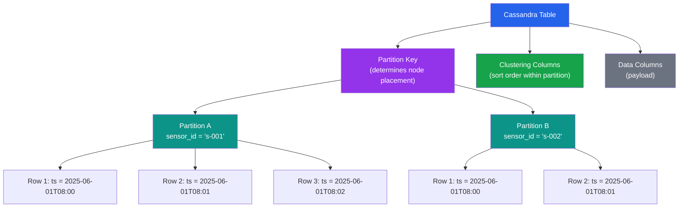

# [DEE-403] Column-Family Modeling

:::info
Model tables around queries, not entities. In column-family stores like Apache Cassandra, you design one table per query pattern, accept denormalization, and let the partition key and clustering columns organize data for efficient reads.
:::

## Context

Column-family databases (also called wide-column stores) -- including Apache Cassandra, ScyllaDB, and Google Bigtable -- are designed for massive write throughput, horizontal scaling, and high availability across data centers. They achieve this by distributing data across a cluster using a partition key and organizing rows within each partition using clustering columns.

The data model is fundamentally different from relational databases. In a relational database, you normalize data into entities, then write queries with joins to answer questions. In Cassandra, you start with the queries you need to answer and design a table specifically for each query. Joins do not exist. Denormalization is not a compromise -- it is the intended design approach.

Data is organized in a hierarchy: a **partition key** determines which node stores the data, and **clustering columns** determine the sort order of rows within that partition. A query that reads from a single partition is the most efficient operation Cassandra can perform. Queries that span multiple partitions (scatter-gather) are expensive and should be avoided for latency-sensitive paths.

Cassandra best practices recommend keeping partitions under 100 MB in disk size and under 100,000 rows. Exceeding these limits causes compaction pressure, increased read latency, and potential heap pressure during repairs.

## Principle

- You MUST identify all query patterns before designing tables. Each primary access pattern typically gets its own table.
- You MUST choose a partition key that distributes data evenly across the cluster and does not grow without bound.
- You SHOULD use clustering columns to sort data within a partition so that range queries (e.g., time ranges) are efficient.
- You MUST NOT use secondary indexes as a substitute for proper table design. Secondary indexes in Cassandra require scatter-gather queries across all nodes and perform poorly at scale.
- You SHOULD accept denormalization and duplicate data across tables to serve different query patterns. Writes in Cassandra are cheap; reads across partitions are expensive.

## Visual



## Example

### Time-series sensor data

**Query**: "Get all readings for sensor X between time T1 and T2."

```cql
CREATE TABLE sensor_readings (
    sensor_id    TEXT,
    reading_date DATE,
    reading_ts   TIMESTAMP,
    temperature  DOUBLE,
    humidity     DOUBLE,
    pressure     DOUBLE,
    PRIMARY KEY ((sensor_id, reading_date), reading_ts)
) WITH CLUSTERING ORDER BY (reading_ts DESC);
```

Key design decisions:
- **Composite partition key** `(sensor_id, reading_date)` -- distributes data by sensor AND by day, preventing any single partition from growing unboundedly (one day of readings per partition).
- **Clustering column** `reading_ts DESC` -- newest readings first, which matches the most common query pattern (recent readings).

```cql
-- Efficient: single-partition read with range on clustering column
SELECT * FROM sensor_readings
WHERE sensor_id = 's-001'
  AND reading_date = '2025-06-01'
  AND reading_ts >= '2025-06-01T08:00:00Z'
  AND reading_ts <= '2025-06-01T09:00:00Z';
```

### User activity feed

**Query 1**: "Get the latest 20 activities for user X."
**Query 2**: "Get all activities for user X on a specific date."

```cql
CREATE TABLE user_activity (
    user_id      UUID,
    activity_date DATE,
    activity_ts  TIMESTAMP,
    activity_type TEXT,
    details      TEXT,
    PRIMARY KEY ((user_id, activity_date), activity_ts)
) WITH CLUSTERING ORDER BY (activity_ts DESC);
```

```cql
-- Latest activities today
SELECT * FROM user_activity
WHERE user_id = 550e8400-e29b-41d4-a716-446655440000
  AND activity_date = '2025-06-15'
LIMIT 20;
```

### Comparison with relational: one table per query pattern

| Relational Approach | Cassandra Approach |
|--------------------|--------------------|
| One `orders` table, queried with different `WHERE` clauses and `JOIN`s | `orders_by_customer` table for "get orders by customer" |
| Same table, different index | `orders_by_status` table for "get orders by status" |
| Same table, different join | `orders_by_date` table for "get orders by date range" |
| Normalize to avoid redundancy | Duplicate order data across all three tables |
| Add index to support new query | Create a new table for the new query pattern |

In Cassandra, the storage cost of denormalization is insignificant compared to the latency cost of cross-partition queries.

## Common Mistakes

| Mistake | Why It Hurts | Fix |
|---------|-------------|-----|
| **Unbounded partition growth** -- using only `sensor_id` as partition key for time-series data | A single sensor's partition grows forever. Large partitions cause compaction pressure, GC pauses, and slow reads. | Add a time bucket to the partition key (e.g., `(sensor_id, reading_date)`) to bound partition size |
| **Too many small partitions** -- using a high-cardinality clustering column as part of the partition key | Each query requires reading many tiny partitions (scatter-gather). Read latency increases linearly with partition count. | Design partition keys so that a single query reads from one partition. Move high-cardinality columns to clustering columns. |
| **Over-reliance on secondary indexes** -- using `CREATE INDEX` to avoid creating a new table | Secondary indexes in Cassandra are local indexes that require querying every node. They work for low-cardinality columns with small result sets but fail at scale. | Create a dedicated table for the query pattern. Use materialized views cautiously (they have known consistency issues). |
| **Relational thinking** -- normalizing data into separate tables and attempting multi-table queries | Cassandra has no joins. Reading from multiple tables requires multiple round trips, increasing latency and failure probability. | Denormalize aggressively. Write data to every table that needs it. Use batches (`LOGGED BATCH`) only for maintaining consistency across denormalized tables for the same partition key. |
| **Using `ALLOW FILTERING`** in production queries | `ALLOW FILTERING` forces a full table scan. It exists for ad-hoc exploration, not production workloads. | Redesign the table so the query can be served by partition key + clustering column restrictions alone. |

## Related DEEs

- [DEE-400](400.md) NoSQL Patterns Overview
- [DEE-405](405.md) Choosing the Right NoSQL Type
- [DEE-11](../Fundamentals/12.md) CAP Theorem

## References

- [Apache Cassandra Data Modeling Introduction](https://cassandra.apache.org/doc/3.11/cassandra/data_modeling/intro.html) -- official data modeling documentation
- [Evaluating and Refining Data Models -- Apache Cassandra Docs](https://cassandra.apache.org/doc/4.0/cassandra/data_modeling/data_modeling_refining.html) -- refining models based on partitioning and sizing
- [Best Practices for Data Modeling in Cassandra -- DataStax Docs](https://docs.datastax.com/en/cql/hcd/data-modeling/best-practices.html) -- DataStax best practices
- [Apache Cassandra Data Modeling Best Practices -- Instaclustr](https://www.instaclustr.com/blog/cassandra-data-modeling/) -- practical modeling guide with examples
- [Cassandra Partition Key -- ScyllaDB Glossary](https://www.scylladb.com/glossary/cassandra-partition-key/) -- partition key design concepts
