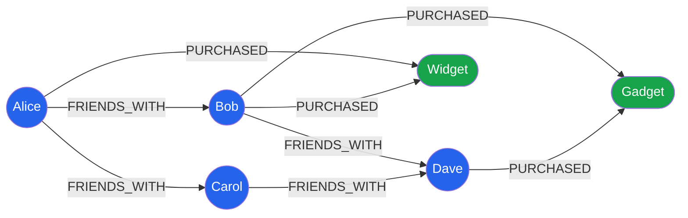

# [DEE-404] Graph Database Modeling

:::info
Use graph databases when relationships are the primary query target. Graph models excel at variable-depth traversals and relationship-rich queries that would require complex recursive joins in relational databases.
:::

## Context

Graph databases such as Neo4j, Amazon Neptune, and TigerGraph store data as nodes (entities) and relationships (edges between entities), both of which can carry properties. Unlike relational databases, where relationships are implicit (expressed as foreign keys resolved through joins), graph databases make relationships first-class citizens with their own identity, direction, type, and properties.

The fundamental advantage of a graph database is **index-free adjacency**: each node directly references its neighbors, so traversing a relationship is a constant-time pointer lookup regardless of total graph size. In a relational database, finding "friends of friends of friends" requires three self-joins on a potentially massive table. In a graph database, it is a three-hop traversal that executes in milliseconds.

Cypher, Neo4j's declarative query language, uses ASCII-art syntax to express graph patterns: `(a)-[r:KNOWS]->(b)` reads naturally as "node a has a KNOWS relationship to node b." This visual syntax makes complex traversals surprisingly readable.

Graph databases are not a general-purpose replacement for relational or document databases. They are purpose-built for relationship-heavy data where the depth and direction of connections are the primary query concern.

## Principle

- You SHOULD use a graph database when the primary queries involve traversing relationships of variable or unknown depth (e.g., shortest path, recommendation, fraud detection, access control).
- You MUST model nodes as domain entities and relationships as meaningful connections between them. Relationships SHOULD have a type (verb) and MAY carry properties.
- You SHOULD index node properties used in `MATCH` starting points. Without indexes, Cypher queries fall back to full label scans.
- You MUST NOT use a graph database as a document store -- stuffing large JSON blobs into node properties defeats the purpose of the graph model.
- You SHOULD NOT choose a graph database for simple CRUD operations where relationships are shallow (one level of foreign keys). Relational or document databases serve these workloads better.

## Visual



## Example

### Social network: friends-of-friends

Find people that Alice's friends know, but Alice does not yet know (potential friend recommendations):

```cypher
// Find friends-of-friends who are not already Alice's friends
MATCH (alice:Person {name: 'Alice'})-[:FRIENDS_WITH]->(friend)-[:FRIENDS_WITH]->(foaf)
WHERE foaf <> alice
  AND NOT (alice)-[:FRIENDS_WITH]->(foaf)
RETURN foaf.name AS recommended, COUNT(friend) AS mutual_friends
ORDER BY mutual_friends DESC
LIMIT 10;
```

In SQL, this would require multiple self-joins on a `friendships` table:

```sql
-- Relational equivalent (PostgreSQL) -- much harder to read and extend
SELECT p.name, COUNT(DISTINCT mf.id) AS mutual_friends
FROM friendships f1
JOIN friendships f2 ON f1.friend_id = f2.person_id
JOIN persons p ON f2.friend_id = p.id
JOIN persons mf ON f1.friend_id = mf.id
WHERE f1.person_id = (SELECT id FROM persons WHERE name = 'Alice')
  AND f2.friend_id <> f1.person_id
  AND f2.friend_id NOT IN (
    SELECT friend_id FROM friendships
    WHERE person_id = f1.person_id
  )
GROUP BY p.name
ORDER BY mutual_friends DESC
LIMIT 10;
```

### Recommendation engine: collaborative filtering

Find products purchased by people who bought the same products as Alice:

```cypher
// "People who bought X also bought Y" recommendation
MATCH (alice:Person {name: 'Alice'})-[:PURCHASED]->(product)<-[:PURCHASED]-(other)
      -[:PURCHASED]->(rec)
WHERE NOT (alice)-[:PURCHASED]->(rec)
  AND rec <> product
RETURN rec.name AS recommended_product,
       COUNT(DISTINCT other) AS recommenders
ORDER BY recommenders DESC
LIMIT 5;
```

### Access control: permission traversal

Determine if a user has access to a resource through group membership and role inheritance:

```cypher
// Check if user has READ permission on a resource (any path)
MATCH path = (user:User {email: 'alice@example.com'})
             -[:MEMBER_OF*1..3]->(group:Group)
             -[:HAS_ROLE]->(role:Role)
             -[:GRANTS]->(perm:Permission {action: 'READ'})
             -[:ON]->(resource:Resource {name: 'secret-doc'})
RETURN path LIMIT 1;
```

This single query traverses user -> groups (up to 3 levels of nesting) -> roles -> permissions -> resources. In SQL, this would require recursive CTEs and multiple joins.

### When graph beats relational

| Scenario | Graph Advantage | Relational Limitation |
|----------|----------------|----------------------|
| Variable-depth traversal (friends-of-friends at N hops) | Constant cost per hop via index-free adjacency | Each additional hop adds a self-join; cost grows exponentially |
| Many-to-many with relationship properties | Relationships are first-class with their own properties and types | Junction tables become complex; properties on relationships require extra columns or tables |
| Shortest path / pathfinding | Built-in `shortestPath()` algorithm | Requires recursive CTE or application-level BFS, difficult to optimize |
| Schema-flexible connections | New relationship types need no schema migration | New relationship types require new junction tables and FK constraints |
| Pattern matching across multiple entity types | `MATCH (a)-[*1..5]->(b)` traverses any path up to 5 hops | Multi-table joins with unions, hard to generalize |

## Common Mistakes

| Mistake | Why It Hurts | Fix |
|---------|-------------|-----|
| **Using a graph DB for simple CRUD** -- basic entity creation, retrieval, and update with no traversal queries | Graph databases add complexity (different query language, different ops tooling) without benefit when queries don't traverse relationships. | Use a relational or document database for simple CRUD. Adopt a graph DB only when traversal queries are a primary use case. |
| **Not indexing node properties** used as MATCH starting points | Without a property index, `MATCH (p:Person {name: 'Alice'})` triggers a full scan of all Person nodes. | Create indexes on frequently queried properties: `CREATE INDEX FOR (p:Person) ON (p.name)` |
| **Treating it as a document store** -- storing large JSON blobs in node properties | Large property values defeat index-free adjacency and increase memory footprint. The graph becomes a poorly indexed document store. | Keep node properties small and scalar. Store large content in a document database and reference it from the graph. |
| **Modeling everything as a node** when some data should be a property | Excessive node creation leads to unnecessary traversals for simple attribute lookups. Not everything deserves to be a node. | If data does not participate in relationships and is only ever accessed as part of its parent, make it a property. |
| **Ignoring relationship direction** -- creating undirected relationships when direction carries meaning | Cypher requires a direction on creation. If you arbitrarily pick directions, queries become confusing and may return wrong results. | Model direction based on domain semantics (e.g., `(a)-[:REPORTS_TO]->(b)` means a reports to b). For symmetric relationships, pick a convention and query both directions. |

## Related DEEs

- [DEE-400](400.md) NoSQL Patterns Overview
- [DEE-405](405.md) Choosing the Right NoSQL Type
- [DEE-12](14.md) Relational vs Non-Relational

## References

- [Neo4j Cypher Manual -- Basic Queries](https://neo4j.com/docs/cypher-manual/current/queries/basic/) -- official Cypher query syntax
- [What is Cypher -- Neo4j Getting Started](https://neo4j.com/docs/getting-started/cypher/) -- introduction to the Cypher query language
- [Patterns in Practice -- Neo4j Getting Started](https://neo4j.com/docs/getting-started/cypher-intro/patterns-in-practice/index.html) -- graph pattern matching examples
- [Graph Modeling Guidelines -- Neo4j Docs](https://neo4j.com/docs/getting-started/data-modeling/guide-data-modeling/) -- official data modeling guide
- [Wikipedia: Graph database](https://en.wikipedia.org/wiki/Graph_database) -- general overview and history
