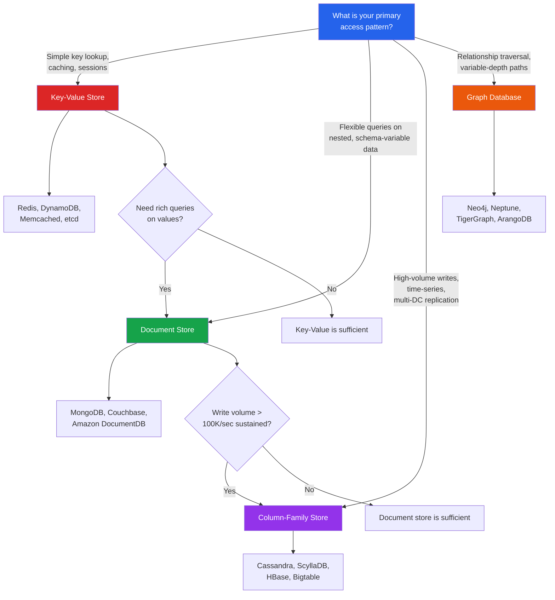

# [DEE-405] Choosing the Right NoSQL Type

:::info
Choose a NoSQL database type based on your data model and access patterns, not on popularity or hype. Each type -- document, key-value, column-family, and graph -- is optimized for a specific category of workload.
:::

## Context

The NoSQL landscape offers four primary database types, each designed around a different data model and access pattern:

- **Document stores** (MongoDB, Couchbase) -- flexible schema, nested data, rich queries within documents.
- **Key-value stores** (Redis, DynamoDB, Memcached) -- simple lookups by key, extreme throughput and low latency.
- **Column-family stores** (Cassandra, ScyllaDB, HBase) -- massive write throughput, time-series data, horizontal scaling across data centers.
- **Graph databases** (Neo4j, Neptune, TigerGraph) -- relationship-heavy data, variable-depth traversals, pathfinding.

Choosing the wrong type creates friction that no amount of application-layer workaround can resolve. Forcing relationship traversals into a document store means building graph algorithms in application code. Forcing flexible schema requirements into a column-family store means fighting CQL's rigid query model. The cost of choosing wrong is high because migrating between NoSQL types often requires a complete data model redesign.

The concept of **polyglot persistence** -- using multiple database types within a single system, each for the workload it serves best -- is a well-established pattern. A modern application might use Redis for caching and sessions, MongoDB for the product catalog, Cassandra for event logging, and Neo4j for recommendation queries.

## Principle

- You MUST map each data access pattern to the database type that natively supports it before committing to a technology.
- You SHOULD consider polyglot persistence when a single database type cannot efficiently serve all access patterns.
- You MUST NOT choose a NoSQL database based solely on popularity, team familiarity, or vendor marketing without evaluating the data model fit.
- You SHOULD evaluate operational complexity (backup, monitoring, scaling, team expertise) as a first-class selection criterion alongside technical fit.
- You MUST NOT assume that any single NoSQL database is the right choice for all workloads. "One-size-fits-all" thinking is the most common source of NoSQL project failures.

## Visual

## Comparison Table

| Dimension | Document Store | Key-Value Store | Column-Family Store | Graph Database |
|-----------|---------------|-----------------|---------------------|----------------|
| **Data model** | Nested JSON/BSON documents | Opaque key-value pairs (some stores offer structured values) | Rows with partition key, clustering columns, and sparse columns | Nodes with properties, directed typed relationships |
| **Query flexibility** | Rich: filters, projections, aggregations within documents | Minimal: lookup by key (DynamoDB adds sort key + secondary indexes) | Moderate: partition key required, range on clustering columns | Rich: pattern matching, variable-depth traversal, pathfinding |
| **Schema flexibility** | High: each document can have a different structure | High: values are opaque to the store | Low: table schema is rigid once defined (query-first design) | Moderate: node/relationship types are flexible, but indexes must be explicit |
| **Write throughput** | Moderate to high (10K-100K ops/sec per node) | Very high (100K+ ops/sec per node) | Very high (100K+ sustained writes per node, linear scaling) | Moderate (writes involve maintaining adjacency lists) |
| **Read pattern** | Single-document reads, rich queries | Single-key lookups, O(1) | Single-partition reads, range scans within partition | Traversals: variable-depth, shortest path, pattern matching |
| **Horizontal scaling** | Sharding (manual or auto) | Partitioning (built-in for DynamoDB, manual for Redis Cluster) | Linear scaling by adding nodes (native to design) | Limited (most graph DBs scale reads via replicas, not writes via sharding) |
| **Consistency model** | Tunable (MongoDB: read/write concern) | Varies (Redis: eventual with replication; DynamoDB: strong or eventual per-read) | Tunable per-query (Cassandra: consistency levels) | Typically ACID per-transaction (Neo4j) |
| **Best for** | Product catalogs, content management, user profiles, APIs with variable payloads | Caching, sessions, leaderboards, rate limiting, feature flags | Event logging, IoT time-series, audit trails, messaging systems | Social networks, recommendations, fraud detection, knowledge graphs, access control |

## Example Scenarios

| Scenario | Recommended Type | Why |
|----------|-----------------|-----|
| E-commerce product catalog with variable attributes per category | Document (MongoDB) | Products in different categories have different fields (clothing has size/color; electronics has specs). Document schema flexibility handles this naturally. |
| User session management for a web application with 100K concurrent users | Key-Value (Redis) | Sessions are accessed by session ID, expire after inactivity, and require sub-millisecond latency. Pure key-value access pattern. |
| IoT sensor data: 50,000 sensors reporting every second | Column-Family (Cassandra) | 50K writes/sec sustained, time-series data, partition by sensor + time bucket, range queries on timestamp. Cassandra's write-optimized LSM-tree storage is built for this. |
| Social network "people you may know" feature | Graph (Neo4j) | Friends-of-friends at variable depth. A 3-hop traversal in Neo4j takes milliseconds; the same query in SQL requires 3 self-joins on a billion-row table. |
| Configuration key-value store for distributed services | Key-Value (etcd / Consul) | Simple key lookup with strong consistency and watch/subscribe for changes. No need for query flexibility. |
| Real-time fraud detection (unusual transaction patterns across accounts) | Graph (Neo4j / TigerGraph) | Detecting circular money flows, shell company networks, or unusual connection patterns requires traversing a graph of accounts, transactions, and entities. |
| Event sourcing / audit trail for a financial system | Column-Family (Cassandra) | Append-only writes, immutable records, time-ordered retrieval, multi-datacenter replication for compliance. |
| REST API backend with moderate traffic and evolving schema | Document (MongoDB) | Schema flexibility for rapid iteration, rich query support for API filtering/pagination, good developer experience with JSON-native storage. |

## Common Mistakes

| Mistake | Why It Hurts | Fix |
|---------|-------------|-----|
| **One-size-fits-all thinking** -- choosing one NoSQL database for every workload | Forces workloads into data models that don't fit. Results in application-layer workarounds that are slower, buggier, and harder to maintain. | Map each access pattern to the best-fit database type. Embrace polyglot persistence where justified. |
| **Choosing based on popularity** -- "MongoDB is the most popular NoSQL database, so we'll use it for everything" | Popularity does not mean fit. Using MongoDB for time-series at 100K writes/sec, or for deep graph traversals, will underperform dedicated solutions. | Evaluate based on data model and access pattern, not market share. |
| **Ignoring operational complexity** -- choosing a technology the team cannot operate | A database that requires specialized operations knowledge (Cassandra ring management, Neo4j memory tuning) will cause outages if the team lacks expertise. | Factor in team expertise, managed service availability (e.g., DynamoDB, Amazon Neptune, Atlas), monitoring tools, and backup/restore complexity. |
| **Premature polyglot persistence** -- using 5 databases for a simple application | Each database adds operational overhead: monitoring, backups, failover, team training. For small teams and simple workloads, one well-chosen database is better. | Start with one database that covers most access patterns. Add specialized databases only when a specific workload clearly outgrows the primary store. |
| **Ignoring the relational option** -- assuming NoSQL is always better for modern applications | Many workloads (transactional, strongly consistent, ad-hoc query heavy) are best served by PostgreSQL or MySQL. NoSQL is not an upgrade from relational; it is a different tool for different problems. | Always include a relational database in the evaluation. If your data is structured, your queries are ad-hoc, and your scale is moderate, relational may be the best choice. |

## Related DEEs

- [DEE-400](400.md) NoSQL Patterns Overview
- [DEE-401](401.md) Document Store Modeling
- [DEE-402](402.md) Key-Value Store Patterns
- [DEE-403](403.md) Column-Family Modeling
- [DEE-404](404.md) Graph Database Modeling
- [DEE-11](12.md) CAP Theorem
- [DEE-12](14.md) Relational vs Non-Relational

## References

- [Types of NoSQL Databases and Key Criteria for Choosing Them -- TechTarget](https://www.techtarget.com/searchdatamanagement/feature/Key-criteria-for-choosing-different-types-of-NoSQL-databases) -- decision criteria overview
- [Understand Data Store Models -- Azure Architecture Center](https://learn.microsoft.com/en-us/azure/architecture/data-guide/technology-choices/understand-data-store-models) -- Microsoft's data model comparison
- [NoSQL Database Comparison -- ScyllaDB](https://www.scylladb.com/learn/nosql/nosql-database-comparison/) -- technical comparison across types
- [The What, Why, and When of Single-Table Design -- Alex DeBrie](https://www.alexdebrie.com/posts/dynamodb-single-table/) -- when key-value with sort keys is sufficient
- [Wikipedia: NoSQL](https://en.wikipedia.org/wiki/NoSQL) -- historical context and taxonomy
