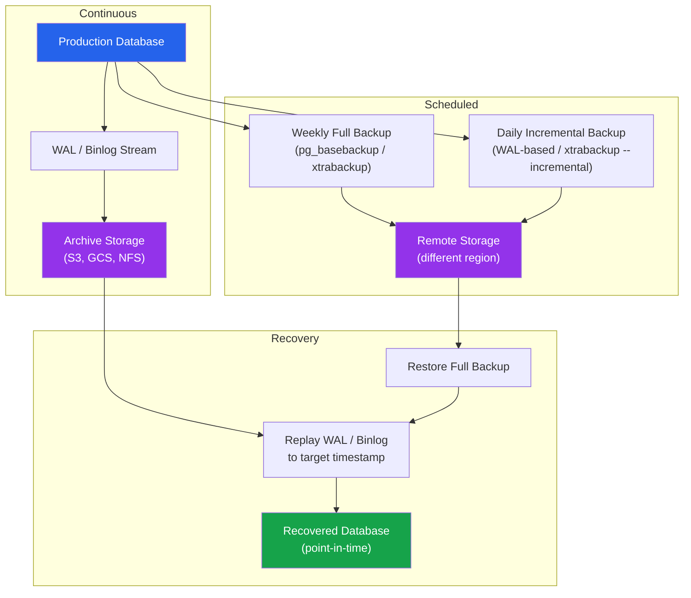

# [DEE-601] Backup and Restore Strategies

:::info
Every production database MUST have automated, tested backups with a defined retention policy. Backups that have never been restored are not backups -- they are hopes.
:::

## Context

Backups are your last line of defense against data loss. Hardware fails, software has bugs, humans make mistakes, and attackers encrypt disks. When everything else fails -- replication, snapshots, redundancy -- your backup is the only thing standing between you and a catastrophic, unrecoverable data loss event.

Despite this, backup failures remain one of the most common causes of extended outages. The failure modes are predictable: backups were never configured, backups silently stopped working months ago, backups exist but nobody has ever tested a restore, or backups are stored on the same disk that just failed.

There are two fundamental categories of database backups: **logical** and **physical**. Logical backups (pg_dump, mysqldump) export data as SQL statements or structured formats -- they are portable across versions and platforms but slow for large databases. Physical backups (pg_basebackup, Percona XtraBackup) copy the raw data files -- they are fast but tied to the same database version and architecture. Most production environments use physical backups for routine recovery and logical backups for portability and granular object-level restores.

Beyond full backups, **continuous archiving** of write-ahead logs (WAL in PostgreSQL, binary logs in MySQL) enables **point-in-time recovery (PITR)** -- restoring the database to any specific moment, not just the last backup. This is critical for recovering from accidental data deletion or corruption that happened at a known time.

## Principle

- Every production database MUST have automated backups running on a defined schedule.
- Teams MUST test restores regularly -- at minimum quarterly, ideally monthly -- in an isolated environment.
- Backups MUST be stored on separate infrastructure from the database they protect (different disk, different server, ideally different region).
- Teams SHOULD implement continuous WAL/binlog archiving to enable point-in-time recovery for all production databases.
- Backup retention policies MUST be defined and documented, balancing storage costs against recovery window requirements.
- Backup completion and integrity MUST be monitored and alerted -- a silently failing backup job is worse than no backup at all because it creates false confidence.

## Visual



**Key insight:** A full backup gives you a starting point. WAL/binlog archiving gives you the ability to recover to any point in time between backups. Together, they provide comprehensive protection against both total loss and surgical recovery from mistakes.

## Example

### PostgreSQL: pg_basebackup + WAL Archiving

Configure WAL archiving in `postgresql.conf`:

```ini
# Enable WAL archiving
wal_level = replica
archive_mode = on
archive_command = 'pgbackrest --stanza=main archive-push %p'
# Or with plain file copy:
# archive_command = 'cp %p /var/lib/postgresql/wal_archive/%f'
```

Take a base backup:

```bash
# Physical backup using pg_basebackup
pg_basebackup -h localhost -U replicator \
  -D /backups/base/$(date +%Y%m%d) \
  --checkpoint=fast --wal-method=stream \
  --progress --verbose

# Logical backup using pg_dump (for portability or single-database restore)
pg_dump -h localhost -U backup_user \
  --format=custom --compress=9 \
  --file=/backups/logical/mydb_$(date +%Y%m%d).dump \
  mydb
```

Restore to a point in time:

```bash
# 1. Restore the base backup
cp -r /backups/base/20260405 /var/lib/postgresql/data

# 2. Create recovery.signal and configure recovery target
cat > /var/lib/postgresql/data/postgresql.auto.conf << 'EOF'
restore_command = 'pgbackrest --stanza=main archive-get %f %p'
recovery_target_time = '2026-04-05 14:30:00 UTC'
recovery_target_action = 'promote'
EOF

# 3. Create recovery signal file and start PostgreSQL
touch /var/lib/postgresql/data/recovery.signal
pg_ctl start -D /var/lib/postgresql/data
```

### MySQL: Percona XtraBackup

```bash
# Full physical backup (non-blocking for InnoDB)
xtrabackup --backup --target-dir=/backups/full/$(date +%Y%m%d) \
  --user=backup_user --password=secret

# Incremental backup based on last full
xtrabackup --backup --target-dir=/backups/incr/$(date +%Y%m%d) \
  --incremental-basedir=/backups/full/20260405 \
  --user=backup_user --password=secret

# Restore: prepare the full backup, then apply incrementals
xtrabackup --prepare --apply-log-only --target-dir=/backups/full/20260405
xtrabackup --prepare --apply-log-only --target-dir=/backups/full/20260405 \
  --incremental-dir=/backups/incr/20260406
xtrabackup --copy-back --target-dir=/backups/full/20260405
```

### Logical vs Physical Backup Comparison

| Aspect | Logical (pg_dump / mysqldump) | Physical (pg_basebackup / xtrabackup) |
|--------|-------------------------------|---------------------------------------|
| **Speed (backup)** | Slow -- reads and serializes all data | Fast -- copies raw files |
| **Speed (restore)** | Slow -- re-executes SQL/COPY | Fast -- file copy + WAL replay |
| **Size** | Smaller with compression | Larger (full data directory) |
| **Cross-version** | Yes -- portable across major versions | No -- same major version required |
| **Granularity** | Single database, table, or schema | Entire cluster only |
| **PITR support** | No | Yes (with WAL/binlog archiving) |
| **Impact on server** | Shared locks on some operations | Minimal with WAL streaming |
| **Best for** | Small databases, migrations, selective restore | Large databases, routine full recovery |

### Full vs Incremental Backup Comparison

| Aspect | Full Backup | Incremental Backup |
|--------|-------------|-------------------|
| **Contains** | Complete copy of all data | Only changes since last backup |
| **Size** | Large | Small (typically 5-20% of full) |
| **Backup time** | Long | Short |
| **Restore time** | Short (single step) | Longer (full + all incrementals) |
| **Restore complexity** | Simple | Must apply chain in order |
| **Typical schedule** | Weekly | Daily |

## Common Mistakes

1. **Untested backups.** The most dangerous backup failure mode: backups run every night, monitoring shows them as "successful," but nobody has ever attempted a restore. The backup files could be corrupted, incomplete, or missing critical data. Schedule regular restore tests to an isolated environment and verify data integrity after each test.

2. **No point-in-time recovery capability.** Taking nightly full backups without WAL/binlog archiving means the best-case recovery loses up to 24 hours of data. If someone runs `DELETE FROM orders WHERE 1=1` at 4 PM and the last backup was at midnight, those 16 hours of data are gone. Enable continuous archiving to recover to any second.

3. **Backups stored on the same disk or server.** If the disk fails, both the database and its backups are lost simultaneously. Store backups on separate physical infrastructure -- ideally in a different availability zone or region. Cloud object storage (S3, GCS) is a cost-effective and durable option.

4. **No retention policy.** Without a defined retention policy, you either run out of disk space (no cleanup) or lose the ability to recover from issues discovered days later (aggressive cleanup). Define how long you keep daily, weekly, and monthly backups based on your compliance and recovery requirements.

5. **Silently failing backup jobs.** A backup cron job that fails and sends output to `/dev/null` is a common disaster setup. Monitor backup job completion, verify backup file sizes, and alert on failures. Your monitoring system should alert if a backup has not completed successfully within the expected window.

6. **Only logical backups for large databases.** Using `pg_dump` or `mysqldump` on a 500 GB database takes hours and puts load on the server. For large databases, use physical backups (pg_basebackup, xtrabackup) for routine recovery and reserve logical backups for cross-version migrations or selective restores.

## Related DEEs

- [DEE-600](600.md) Operations Overview
- [DEE-602](602.md) Replication Topologies -- replication provides redundancy but does not replace backups
- [DEE-605](605.md) Disaster Recovery -- backups are a core component of DR strategy

## References

- [PostgreSQL Documentation: Continuous Archiving and Point-in-Time Recovery](https://www.postgresql.org/docs/current/continuous-archiving.html) -- official PostgreSQL PITR documentation
- [PostgreSQL Documentation: pg_basebackup](https://www.postgresql.org/docs/current/app-pgbasebackup.html) -- physical backup tool reference
- [Percona XtraBackup Documentation](https://docs.percona.com/percona-xtrabackup/latest/) -- hot backup tool for MySQL
- [pgBackRest Documentation](https://pgbackrest.org/) -- enterprise PostgreSQL backup with PITR, parallel backup/restore, and cloud storage
- [Percona Blog: MySQL Backup and Recovery Best Practices](https://www.percona.com/blog/mysql-backup-and-recovery-best-practices/) -- comprehensive MySQL backup guide
- [Crunchy Data Blog: Introduction to Postgres Backups](https://www.crunchydata.com/blog/introduction-to-postgres-backups) -- practical PostgreSQL backup overview
