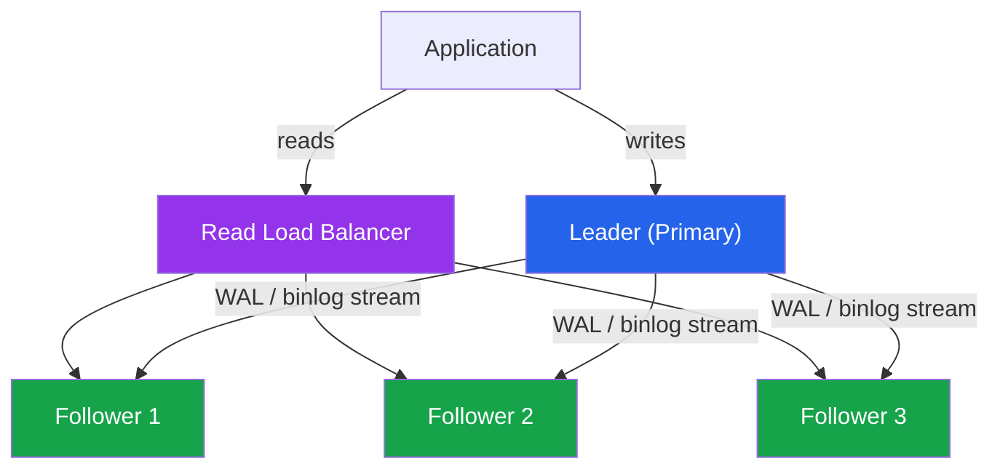
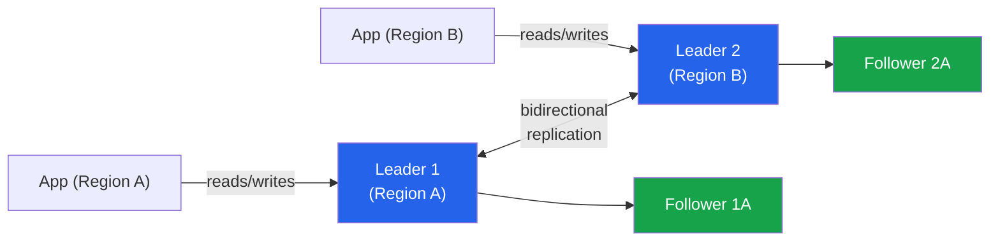
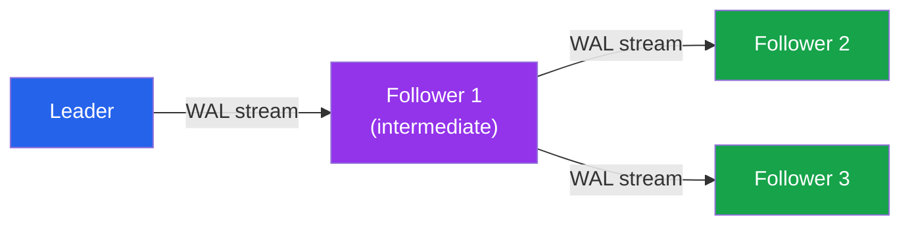

# [DEE-602] Replication Topologies

:::info
Choose replication topology based on your availability requirements and consistency trade-offs. Replication is not a backup strategy -- it is an availability and read-scaling strategy.
:::

## Context

Replication copies data from one database server (the leader, also called primary or source) to one or more other servers (followers, also called replicas or standbys). It serves two primary purposes: **high availability** (if the leader fails, a follower can be promoted) and **read scaling** (distribute read queries across multiple servers).

Every replication system forces a trade-off between **consistency** (how up-to-date replicas are) and **performance** (how much the leader is slowed by waiting for replicas). This trade-off manifests as **replication lag** -- the delay between a transaction committing on the leader and becoming visible on a replica. Depending on configuration, this lag ranges from sub-millisecond (synchronous replication) to seconds or even minutes (asynchronous replication under load).

PostgreSQL uses **streaming replication** to continuously ship WAL records from primary to standbys. MySQL uses **binary log replication** where the source writes events to its binary log and replicas pull and replay them. Both support asynchronous, semi-synchronous, and (in MySQL's case via Group Replication) virtually synchronous modes.

The topology -- how servers are connected -- determines your failure modes, read capacity, and operational complexity. The three fundamental topologies are **leader-follower** (one writer, multiple readers), **multi-leader** (multiple writers, conflict resolution required), and **chain/cascade** (followers replicate from other followers to reduce leader load).

## Principle

- Teams MUST choose a replication topology based on documented availability requirements (SLA, RPO, RTO), not defaults.
- Read replicas SHOULD be used to offload read-heavy workloads from the primary, but consumers MUST tolerate stale reads when using asynchronous replicas.
- Synchronous replication SHOULD be used when zero data loss on failover is required, with the understanding that it increases write latency.
- Teams MUST monitor replication lag continuously and alert when it exceeds acceptable thresholds.
- Multi-leader replication SHOULD only be used when the application can handle conflict resolution -- it is not a general-purpose upgrade from leader-follower.

## Visual

### Leader-Follower (Single-Leader) Topology



### Multi-Leader Topology



### Cascade (Chain) Topology



**Key insight:** Leader-follower is the default choice for most workloads. Multi-leader adds write availability in multiple regions at the cost of conflict resolution complexity. Cascade replication reduces network load on the leader when you have many replicas.

## Example

### PostgreSQL Streaming Replication Setup

On the primary, configure `postgresql.conf`:

```ini
wal_level = replica
max_wal_senders = 10          # Maximum number of replication connections
wal_keep_size = 1GB           # Retain WAL for slow replicas
hot_standby = on              # Allow read queries on standbys

# For synchronous replication (optional -- increases write latency):
synchronous_standby_names = 'FIRST 1 (standby1, standby2)'
synchronous_commit = on       # 'on' waits for WAL flush on standby
                              # 'remote_apply' waits for replay on standby
```

On the replica, create the standby with `pg_basebackup`:

```bash
pg_basebackup -h primary-host -U replicator \
  -D /var/lib/postgresql/data --checkpoint=fast \
  --wal-method=stream --write-recovery-conf
```

This creates `standby.signal` and sets `primary_conninfo` in `postgresql.auto.conf`, enabling the replica to stream WAL from the primary.

### Read Replica Routing Pattern

```python
# Application-level read/write splitting
class DatabaseRouter:
    def __init__(self, primary_dsn, replica_dsns):
        self.primary = create_pool(primary_dsn)
        self.replicas = [create_pool(dsn) for dsn in replica_dsns]
        self._replica_index = 0

    def get_connection(self, read_only=False):
        if read_only and self.replicas:
            # Round-robin across replicas
            conn = self.replicas[self._replica_index % len(self.replicas)]
            self._replica_index += 1
            return conn
        return self.primary

    def query(self, sql, params=None, read_only=False):
        conn = self.get_connection(read_only=read_only)
        return conn.execute(sql, params)

# Usage
db = DatabaseRouter(
    primary_dsn="postgresql://primary:5432/mydb",
    replica_dsns=[
        "postgresql://replica1:5432/mydb",
        "postgresql://replica2:5432/mydb",
    ]
)

# Writes always go to primary
db.query("INSERT INTO orders (user_id, total) VALUES (%s, %s)", [42, 99.99])

# Reads can go to replicas (accepting potential staleness)
db.query("SELECT * FROM products WHERE category = %s", ["electronics"], read_only=True)
```

### Monitoring Replication Lag

```sql
-- PostgreSQL: check replication lag on the primary
SELECT client_addr,
       state,
       sent_lsn,
       write_lsn,
       flush_lsn,
       replay_lsn,
       pg_wal_lsn_diff(sent_lsn, replay_lsn) AS replay_lag_bytes,
       write_lag,
       flush_lag,
       replay_lag
FROM pg_stat_replication;

-- MySQL: check replication lag on the replica
SHOW REPLICA STATUS\G
-- Key field: Seconds_Behind_Source
```

### Replication Mode Comparison

| Aspect | Asynchronous | Semi-Synchronous | Synchronous |
|--------|-------------|-----------------|-------------|
| **Write latency** | Lowest | Moderate (1 RTT) | Highest (1+ RTT) |
| **Data loss on failover** | Possible (uncommitted txns) | Minimal (logged on replica) | None (committed on replica) |
| **Throughput impact** | None | Moderate | Significant |
| **Replication lag** | Variable (ms to minutes) | Low (sub-second) | None (zero lag guarantee) |
| **PostgreSQL** | Default | synchronous_commit=on | synchronous_commit=remote_apply |
| **MySQL** | Default | Semi-sync plugin | Group Replication |
| **Best for** | Read scaling, analytics replicas | Most HA setups | Financial, zero-loss requirements |

## Common Mistakes

1. **Reading from a replica expecting strong consistency.** Asynchronous replicas can be seconds behind the leader. If a user writes data and immediately reads it back from a replica, they may see stale data -- a classic read-your-own-writes violation. Route reads that must reflect recent writes to the primary, or use synchronous replication for critical replicas.

2. **Not monitoring replication lag.** A replica that falls behind by hours is worse than no replica -- it gives the illusion of redundancy while serving dangerously stale data. Monitor `replay_lag` (PostgreSQL) or `Seconds_Behind_Source` (MySQL) and alert when lag exceeds your acceptable threshold.

3. **Single-region replicas for disaster recovery.** All replicas in the same availability zone or data center fail together during a site-wide outage. For genuine disaster recovery, at least one replica must be in a different region, even if it means higher replication lag.

4. **Using multi-leader without conflict resolution.** Multi-leader replication allows concurrent writes to the same data on different leaders, which creates conflicts. Without a deterministic conflict resolution strategy (last-write-wins, custom merge logic, or application-level coordination), data diverges silently between leaders.

5. **Promoting a lagging replica during failover.** If the leader fails and you promote a replica that was 30 seconds behind, you lose 30 seconds of committed transactions. Monitor which replica is most up-to-date and promote that one. Automated failover tools (Patroni for PostgreSQL, Orchestrator for MySQL) handle this correctly.

6. **Too many replicas streaming directly from the leader.** Each replication connection consumes CPU and network bandwidth on the leader. With many replicas, use cascade replication: a few replicas connect to the leader, and additional replicas connect to those intermediates. PostgreSQL supports this natively with cascading standbys.

## Related DEEs

- [DEE-600](600.md) Operations Overview
- [DEE-601](601.md) Backup and Restore Strategies -- replication is not a substitute for backups
- [DEE-603](603.md) Sharding Strategies -- sharding addresses write scaling, replication addresses read scaling
- [DEE-605](605.md) Disaster Recovery -- cross-region replicas are a key DR component

## References

- [PostgreSQL Documentation: High Availability, Load Balancing, and Replication](https://www.postgresql.org/docs/current/different-replication-solutions.html) -- comparison of PostgreSQL HA solutions
- [PostgreSQL Documentation: Log-Shipping Standby Servers](https://www.postgresql.org/docs/current/warm-standby.html) -- streaming replication setup
- [MySQL Documentation: Semisynchronous Replication](https://dev.mysql.com/doc/refman/8.4/en/replication-semisync.html) -- MySQL semi-sync replication reference
- [MySQL Documentation: Group Replication](https://dev.mysql.com/doc/refman/8.0/en/group-replication.html) -- MySQL multi-leader replication
- [Crunchy Data Blog: Synchronous Replication in PostgreSQL](https://www.crunchydata.com/blog/synchronous-replication-in-postgresql) -- practical synchronous replication guide
- [Percona Blog: Overview of Different MySQL Replication Solutions](https://www.percona.com/blog/overview-of-different-mysql-replication-solutions/) -- comprehensive MySQL replication comparison
