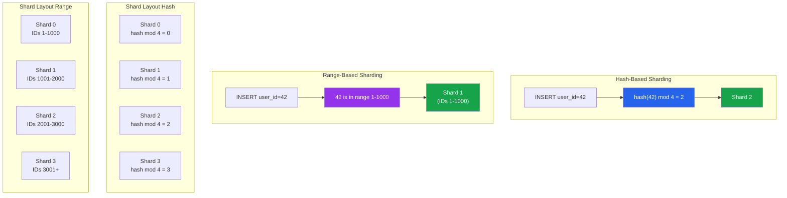

# [DEE-603] Sharding Strategies

:::info
Exhaust vertical scaling and read replicas **BEFORE** considering sharding. Sharding is a one-way door that introduces permanent operational complexity.
:::

## Context

Sharding horizontally partitions data across multiple independent database instances (shards), each holding a subset of the total data. Unlike replication (which copies all data to multiple servers for read scaling), sharding splits the data so that each server handles a fraction of the writes and storage. This is the primary mechanism for scaling write throughput beyond what a single server can handle.

The decision to shard should come late in a system's evolution. A well-tuned single PostgreSQL or MySQL server with read replicas handles far more traffic than most teams expect. Vertical scaling (bigger server, more RAM, faster disks) and read replicas are simpler, cheaper, and operationally safer than sharding. Premature sharding is one of the most expensive architectural mistakes a team can make -- it fragments the data model, complicates every query, breaks transactions across shard boundaries, and makes schema changes exponentially harder.

When sharding becomes necessary, the **shard key** is the single most important decision. The shard key determines which shard holds each row. A good shard key distributes data and traffic evenly (avoiding hot spots), aligns with the most common query patterns (avoiding cross-shard queries), and rarely changes. Common shard key choices include tenant ID (for multi-tenant SaaS), user ID (for user-centric applications), and geographic region (for data residency requirements).

Two primary sharding strategies exist: **hash-based** (apply a hash function to the shard key to determine placement) and **range-based** (assign contiguous ranges of the shard key to each shard). Hash-based sharding distributes data more evenly but makes range queries inefficient. Range-based sharding preserves ordering but risks hot spots on the most active range.

## Principle

- Teams MUST exhaust vertical scaling, query optimization, caching, and read replicas before implementing sharding.
- The shard key MUST be chosen based on query patterns and data distribution analysis, not intuition.
- Cross-shard queries SHOULD be minimized by co-locating related data on the same shard (e.g., a tenant's orders and order items on the same shard).
- Teams MUST plan for resharding from the start -- the initial number of shards will eventually be insufficient.
- Cross-shard transactions SHOULD be avoided; if required, teams MUST understand the consistency and performance implications.

## Visual

### Hash-Based vs Range-Based Sharding



**Key insight:** Hash-based sharding distributes data evenly but scatters range queries across all shards. Range-based sharding keeps ordered data together but concentrates writes on the active range (the latest IDs, the current time period).

## Example

### Shard Key Selection for a Multi-Tenant SaaS Application

```sql
-- Table structure with tenant_id as shard key
CREATE TABLE orders (
    order_id    BIGINT GENERATED ALWAYS AS IDENTITY,
    tenant_id   BIGINT NOT NULL,    -- shard key
    customer_id BIGINT NOT NULL,
    total       DECIMAL(10,2),
    created_at  TIMESTAMPTZ DEFAULT now(),
    PRIMARY KEY (tenant_id, order_id)  -- shard key must be part of PK
);

-- This query hits a single shard (good):
SELECT * FROM orders WHERE tenant_id = 42 AND created_at > '2026-01-01';

-- This query must scatter to ALL shards (bad):
SELECT * FROM orders WHERE customer_id = 99;
-- customer_id is not the shard key, so the router doesn't know which shard has it
```

### PostgreSQL with Citus: Hash-Distributed Tables

```sql
-- Install Citus extension
CREATE EXTENSION citus;

-- Add worker nodes
SELECT citus_add_node('worker1', 5432);
SELECT citus_add_node('worker2', 5432);
SELECT citus_add_node('worker3', 5432);

-- Distribute the orders table by tenant_id (hash sharding)
SELECT create_distributed_table('orders', 'tenant_id');

-- Co-locate related tables on the same shard
SELECT create_distributed_table('order_items', 'tenant_id',
       colocate_with => 'orders');

-- Single-shard query (fast -- hits one worker):
SELECT o.order_id, oi.product_name, oi.quantity
FROM orders o
JOIN order_items oi ON o.tenant_id = oi.tenant_id
                   AND o.order_id = oi.order_id
WHERE o.tenant_id = 42;

-- Cross-shard aggregation (slower -- hits all workers):
SELECT tenant_id, COUNT(*), SUM(total)
FROM orders
GROUP BY tenant_id;
```

### MySQL with Vitess: Sharding Configuration

```yaml
# Vitess VSchema definition
{
  "sharded": true,
  "vindexes": {
    "hash_tenant": {
      "type": "hash"
    }
  },
  "tables": {
    "orders": {
      "column_vindexes": [
        {
          "column": "tenant_id",
          "name": "hash_tenant"
        }
      ]
    },
    "order_items": {
      "column_vindexes": [
        {
          "column": "tenant_id",
          "name": "hash_tenant"
        }
      ]
    }
  }
}
```

### Sharding Strategy Comparison

| Aspect | Hash-Based | Range-Based | Directory-Based |
|--------|-----------|-------------|-----------------|
| **Distribution** | Even (with good hash) | Depends on key distribution | Fully controlled |
| **Range queries** | Scatter to all shards | Efficient (single shard) | Depends on mapping |
| **Hot spots** | Rare (hash spreads load) | Common (active range) | Avoidable with re-mapping |
| **Resharding** | Difficult (rehash needed) | Split ranges (moderate) | Update directory (easiest) |
| **Implementation** | Simple (hash function) | Simple (boundary table) | Requires lookup service |
| **Best for** | Multi-tenant, user-based | Time-series, sequential IDs | Custom placement, geo |

### Cross-Shard Query Strategies

When cross-shard queries are unavoidable:

| Strategy | How It Works | Trade-off |
|----------|-------------|-----------|
| **Scatter-gather** | Query all shards, merge results | Latency = slowest shard |
| **Global tables** | Replicate small reference tables to all shards | Storage overhead, sync lag |
| **Denormalization** | Duplicate data into shard-local tables | Write amplification |
| **Async materialization** | ETL/CDC to a read-optimized store | Eventual consistency |

## Common Mistakes

1. **Premature sharding.** Sharding a database that could be handled by a single server with proper indexing and read replicas adds enormous complexity for no benefit. A well-tuned PostgreSQL instance on modern hardware (64+ cores, 512 GB RAM, NVMe storage) handles millions of rows and thousands of transactions per second. Shard only when you have evidence that vertical scaling is exhausted.

2. **Wrong shard key causing hot spots.** Choosing a monotonically increasing value (auto-increment ID, timestamp) as a hash shard key concentrates recent writes on a single shard. For range-based sharding, all new inserts go to the last range. Analyze your write patterns: if 90% of traffic is for 10% of tenants, even tenant_id creates hot shards. Consider composite keys or virtual sharding buckets.

3. **Cross-shard transactions.** Distributed transactions (two-phase commit) across shards are slow, complex, and fragile. If your application requires transactions spanning multiple shards, either restructure the data model to co-locate related data or accept eventual consistency with compensating transactions.

4. **Not co-locating related data.** If `orders` is sharded by `tenant_id` but `order_items` is sharded by `order_id`, every join between them becomes a cross-shard operation. Co-locate tables that are frequently joined by using the same shard key (Citus `colocate_with`, Vitess same vindex).

5. **No resharding plan.** Starting with 4 shards and hoping it is enough forever is a recipe for a painful, risky migration later. Use a logical shard count much higher than physical shards (e.g., 256 virtual shards mapped to 4 physical servers) so resharding means remapping virtual-to-physical, not re-hashing data.

6. **Ignoring the operational overhead.** Sharding multiplies every operational task: schema migrations run on every shard, backups multiply, monitoring covers more instances, and debugging requires correlating logs across shards. Budget for this ongoing operational cost before committing to a sharded architecture.

## Related DEEs

- [DEE-600](600.md) Operations Overview
- [DEE-602](602.md) Replication Topologies -- use read replicas before sharding
- [DEE-604](604.md) Database Monitoring and Alerting -- monitoring becomes critical with multiple shards
- [DEE-605](605.md) Disaster Recovery -- DR plans must cover all shards

## References

- [Citus Documentation: Choosing a Distribution Column](https://docs.citusdata.com/en/stable/sharding/data_modeling.html) -- official guide on shard key selection for Citus
- [Vitess Documentation: Sharding](https://vitess.io/docs/) -- Vitess sharding concepts and VSchema configuration
- [PlanetScale: Sharding Strategies](https://planetscale.com/learn/courses/database-scaling/sharding/sharding-strategies) -- practical sharding strategy comparison
- [Last9: Database Sharding -- How It Works and When You Actually Need It](https://last9.io/blog/database-sharding/) -- when to shard and when not to
- [Percona Blog: MySQL Sharding with ProxySQL](https://www.percona.com/blog/) -- MySQL sharding patterns
- [Martin Kleppmann: Designing Data-Intensive Applications, Chapter 6](https://dataintensive.net/) -- authoritative coverage of partitioning strategies
