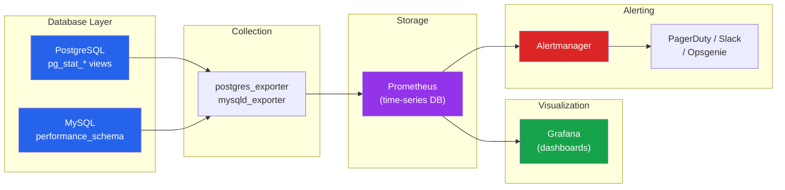

# [DEE-604] Database Monitoring and Alerting

:::info
Every production database MUST have monitoring for key health metrics with actionable alerts. You cannot optimize what you cannot measure, and you cannot respond to what you cannot see.
:::

## Context

Database problems rarely announce themselves cleanly. A slow query that takes 200 ms today takes 2 seconds next month as the table grows. Disk usage creeps up 1% per day until the database crashes at 100%. Replication lag is 50 ms for weeks, then spikes to 30 seconds during a batch job nobody knew about. Without monitoring, these problems are invisible until they become outages.

Effective database monitoring covers four areas: **resource utilization** (CPU, memory, disk, connections), **query performance** (latency, throughput, slow queries), **replication health** (lag, status, errors), and **internal engine metrics** (cache hit ratio, lock waits, vacuum progress, checkpoint frequency). Each area has metrics that indicate normal operation and thresholds that indicate trouble.

The modern monitoring stack for databases typically involves a **metrics exporter** (postgres_exporter, mysqld_exporter) that exposes database metrics in Prometheus format, a **time-series database** (Prometheus, VictoriaMetrics) that scrapes and stores metrics, a **visualization layer** (Grafana) for dashboards, and an **alerting system** (Alertmanager, PagerDuty, Opsgenie) for notifications.

PostgreSQL exposes extensive metrics through its `pg_stat_*` system views and the `pg_stat_statements` extension. MySQL provides the `performance_schema` and `information_schema` for similar visibility. The challenge is not collecting metrics -- it is knowing which metrics matter, what thresholds to set, and how to avoid alert fatigue.

## Principle

- Every production database MUST have continuous monitoring for connections, query latency, replication lag, disk usage, and cache hit ratio.
- Alert thresholds SHOULD be set based on baseline measurements, not arbitrary values.
- Teams MUST enable `pg_stat_statements` (PostgreSQL) or `performance_schema` (MySQL) in production to track query-level performance.
- Alerts MUST be actionable -- every alert should have a documented response procedure. If nobody acts on an alert, remove it or fix the threshold.
- Monitoring data SHOULD be retained for at least 30 days to enable trend analysis and capacity planning.

## Visual



**Key insight:** The monitoring pipeline is: database exposes metrics -> exporter scrapes and formats them -> Prometheus stores time-series data -> Grafana visualizes trends -> Alertmanager routes notifications. Each layer is replaceable, but the pattern is consistent.

## Example

### PostgreSQL: Enable pg_stat_statements

```sql
-- Step 1: Add to postgresql.conf (requires restart)
-- shared_preload_libraries = 'pg_stat_statements'
-- pg_stat_statements.track = all

-- Step 2: Create the extension
CREATE EXTENSION IF NOT EXISTS pg_stat_statements;

-- Top 10 queries by total execution time
SELECT
    substring(query, 1, 80) AS query_preview,
    calls,
    round(total_exec_time::numeric, 2) AS total_ms,
    round(mean_exec_time::numeric, 2) AS avg_ms,
    round((100.0 * shared_blks_hit / NULLIF(shared_blks_hit + shared_blks_read, 0))::numeric, 2)
        AS cache_hit_pct,
    rows
FROM pg_stat_statements
ORDER BY total_exec_time DESC
LIMIT 10;
```

### Key Health Check Queries (PostgreSQL)

```sql
-- Active connections vs limit
SELECT
    count(*) AS active_connections,
    (SELECT setting::int FROM pg_settings WHERE name = 'max_connections') AS max_connections,
    round(100.0 * count(*) /
        (SELECT setting::int FROM pg_settings WHERE name = 'max_connections'), 1)
        AS usage_pct
FROM pg_stat_activity
WHERE state IS NOT NULL;

-- Cache hit ratio (should be > 99% for OLTP)
SELECT
    round(100.0 * sum(blks_hit) / NULLIF(sum(blks_hit) + sum(blks_read), 0), 2)
        AS cache_hit_ratio
FROM pg_stat_database;

-- Replication lag (run on primary)
SELECT
    client_addr,
    state,
    pg_wal_lsn_diff(sent_lsn, replay_lsn) AS replay_lag_bytes,
    replay_lag
FROM pg_stat_replication;

-- Long-running queries (> 5 minutes)
SELECT
    pid,
    now() - query_start AS duration,
    state,
    substring(query, 1, 100) AS query_preview
FROM pg_stat_activity
WHERE state = 'active'
  AND now() - query_start > interval '5 minutes'
ORDER BY duration DESC;

-- Table bloat / dead tuples (vacuum health)
SELECT
    schemaname,
    relname,
    n_dead_tup,
    n_live_tup,
    round(100.0 * n_dead_tup / NULLIF(n_live_tup + n_dead_tup, 0), 2) AS dead_pct,
    last_autovacuum
FROM pg_stat_user_tables
WHERE n_dead_tup > 10000
ORDER BY n_dead_tup DESC
LIMIT 10;

-- Lock waits
SELECT
    blocked.pid AS blocked_pid,
    blocked_activity.query AS blocked_query,
    blocking.pid AS blocking_pid,
    blocking_activity.query AS blocking_query,
    now() - blocked_activity.query_start AS blocked_duration
FROM pg_catalog.pg_locks blocked
JOIN pg_catalog.pg_stat_activity blocked_activity ON blocked.pid = blocked_activity.pid
JOIN pg_catalog.pg_locks blocking
    ON blocking.locktype = blocked.locktype
    AND blocking.relation = blocked.relation
    AND blocking.pid != blocked.pid
JOIN pg_catalog.pg_stat_activity blocking_activity ON blocking.pid = blocking_activity.pid
WHERE NOT blocked.granted;
```

### Key Metrics Table

| Metric | What It Measures | Warning Threshold | Critical Threshold |
|--------|-----------------|-------------------|-------------------|
| **Connection usage** | Active / max_connections | > 70% | > 90% |
| **Query latency (p95)** | 95th percentile query time | > 100 ms (OLTP) | > 500 ms |
| **Replication lag** | Delay between primary and replica | > 1 second | > 10 seconds |
| **Disk usage** | Data directory disk consumption | > 75% | > 90% |
| **Cache hit ratio** | Buffer cache effectiveness | < 99% (OLTP) | < 95% |
| **Lock waits** | Queries blocked by locks | > 5 concurrent | > 20 concurrent |
| **Deadlocks** | Deadlocks per minute | > 0.1/min | > 1/min |
| **Long-running queries** | Queries exceeding time limit | > 5 min | > 30 min |
| **Transactions per second** | Write throughput | Varies by baseline | Sudden drop > 50% |
| **WAL generation rate** | Write-ahead log volume | Trend analysis | Sudden spike > 3x |
| **Vacuum dead tuples** | Autovacuum effectiveness | > 10% dead rows | > 25% dead rows |

### Prometheus Alerting Rules

```yaml
groups:
  - name: database-alerts
    rules:
      - alert: HighConnectionUsage
        expr: pg_stat_activity_count / pg_settings_max_connections > 0.8
        for: 5m
        labels:
          severity: warning
        annotations:
          summary: "Database connection usage above 80%"
          runbook: "https://wiki.example.com/runbooks/db-connections"

      - alert: ReplicationLagHigh
        expr: pg_replication_lag_seconds > 10
        for: 2m
        labels:
          severity: critical
        annotations:
          summary: "Replication lag exceeds 10 seconds"
          runbook: "https://wiki.example.com/runbooks/replication-lag"

      - alert: DiskSpaceLow
        expr: (pg_database_size_bytes / node_filesystem_size_bytes) > 0.85
        for: 10m
        labels:
          severity: warning
        annotations:
          summary: "Database disk usage above 85%"
          runbook: "https://wiki.example.com/runbooks/disk-space"

      - alert: CacheHitRatioLow
        expr: pg_stat_database_blks_hit /
              (pg_stat_database_blks_hit + pg_stat_database_blks_read) < 0.95
        for: 15m
        labels:
          severity: warning
        annotations:
          summary: "Buffer cache hit ratio below 95%"
          runbook: "https://wiki.example.com/runbooks/cache-hit"
```

## Common Mistakes

1. **Monitoring only disk space.** Disk space is important but is one of many critical metrics. Teams that only monitor disk miss slow queries, replication lag, connection exhaustion, and lock contention -- all of which cause outages before the disk fills up. Implement comprehensive monitoring covering all categories: resources, queries, replication, and engine internals.

2. **No alerting on replication lag.** A replica that silently falls hours behind serves dangerously stale data to users and cannot be used for fast failover. Monitor replication lag on every replica and alert when it exceeds your acceptable threshold (typically 1-10 seconds depending on use case).

3. **Not tracking slow queries.** Without `pg_stat_statements` or `performance_schema` enabled, there is no visibility into which queries consume the most time. Enable query tracking in production -- the overhead is minimal (typically 1-2%) and the visibility is invaluable. Review top queries by total execution time weekly.

4. **Alert fatigue.** Too many alerts, or alerts with thresholds set too aggressively, train teams to ignore notifications. Every alert must be actionable: if the alert fires, someone should take a specific action. If an alert fires regularly without requiring action, raise the threshold or remove it. Link every alert to a runbook documenting the response.

5. **No baseline measurements.** Setting alert thresholds without understanding normal behavior leads to false positives or missed incidents. Record baselines for connection count, query latency, and throughput during normal operation, then set warning thresholds at 2x baseline and critical at 5x baseline. Adjust based on experience.

6. **Missing dashboard for on-call.** During an incident, the on-call engineer needs a single Grafana dashboard showing database health at a glance: connections, latency, throughput, replication, disk, and recent errors. Build this dashboard proactively -- not during an outage at 3 AM.

## Related DEEs

- [DEE-600](600.md) Operations Overview
- [DEE-602](602.md) Replication Topologies -- replication lag monitoring is essential
- [DEE-604](604.md) This article
- [DEE-605](605.md) Disaster Recovery -- monitoring provides early warning before disasters

## References

- [PostgreSQL Documentation: The Cumulative Statistics System](https://www.postgresql.org/docs/current/monitoring-stats.html) -- pg_stat_* views reference
- [PostgreSQL Documentation: pg_stat_statements](https://www.postgresql.org/docs/current/pgstatstatements.html) -- query statistics extension
- [prometheus-community/postgres_exporter](https://github.com/prometheus-community/postgres_exporter) -- Prometheus exporter for PostgreSQL metrics
- [Grafana: PostgreSQL Integration](https://grafana.com/docs/grafana-cloud/monitor-infrastructure/integrations/integration-reference/integration-postgres/) -- pre-built PostgreSQL dashboards
- [Sysdig: Top Metrics in PostgreSQL Monitoring with Prometheus](https://www.sysdig.com/blog/postgresql-monitoring) -- practical guide to key PostgreSQL metrics
- [MySQL Documentation: Performance Schema](https://dev.mysql.com/doc/refman/8.0/en/performance-schema.html) -- MySQL query and performance instrumentation
