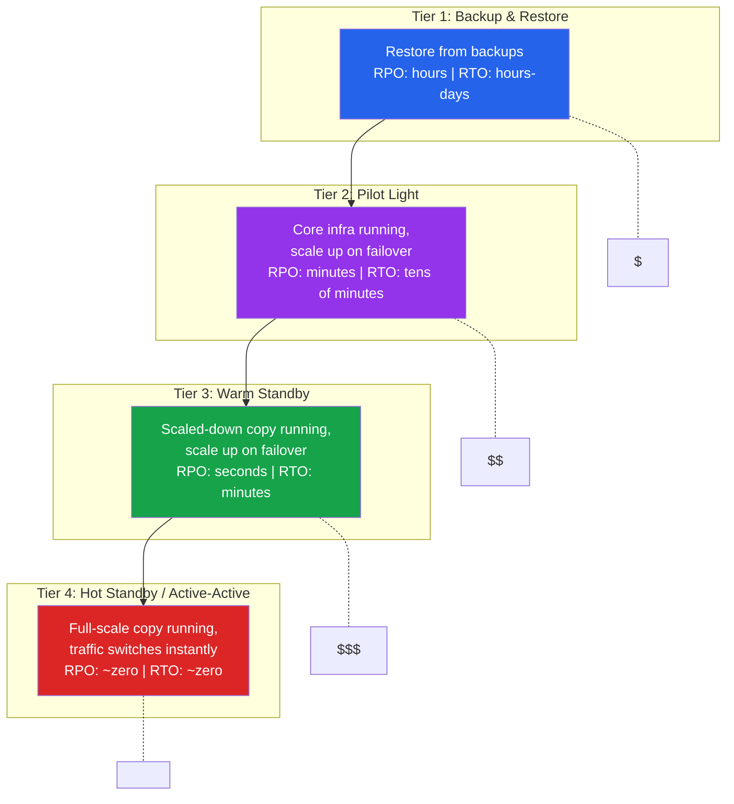

# [DEE-605] Disaster Recovery

:::info
Define your Recovery Point Objective (RPO) and Recovery Time Objective (RTO) **BEFORE** designing the recovery strategy. The strategy exists to meet those numbers, not the other way around.
:::

## Context

Disaster recovery (DR) planning addresses what happens when things go catastrophically wrong -- not a single disk failure or a crashed process, but a region-wide outage, a corrupted data center, a ransomware attack that encrypts every volume, or a cascading failure that takes down your entire production stack.

Most teams conflate high availability (HA) with disaster recovery. HA handles routine failures: a server crash, a network blip, a failed disk. DR handles the scenarios where HA itself fails -- when the entire availability zone or region is unavailable, when backups in the primary location are compromised, or when the failure is so severe that automatic failover cannot recover.

Two numbers define every DR strategy:

- **Recovery Point Objective (RPO)**: the maximum acceptable data loss, measured in time. An RPO of 1 hour means you can afford to lose up to 1 hour of data. An RPO of zero means no data loss is acceptable.
- **Recovery Time Objective (RTO)**: the maximum acceptable downtime, measured in time. An RTO of 4 hours means the system must be operational within 4 hours of a disaster.

These numbers drive every DR decision: what you replicate, where you replicate it, how often you back up, and how much infrastructure you keep running in the recovery region. Lower RPO and RTO cost more money -- the goal is to match the strategy to the business requirement, not to achieve zero for everything.

## Principle

- Teams MUST define RPO and RTO for every production database based on business impact analysis.
- The DR strategy MUST be chosen to meet the defined RPO and RTO -- not over-engineered beyond what the business requires.
- DR plans MUST be tested at least annually through a full failover exercise, not just a document review.
- Backups used for DR MUST be stored in a different region from the production database.
- DR runbooks MUST exist and be accessible during an outage (not stored only in the system that is down).

## Visual

### RPO and RTO on a Timeline


### DR Strategy Tiers



**Key insight:** Each tier reduces RPO and RTO but increases cost and complexity. Most systems do not need Tier 4. Match the tier to your business requirements.

## Example

### DR Strategy Comparison

| Strategy | RPO | RTO | Cost | Complexity | How It Works |
|----------|-----|-----|------|------------|-------------|
| **Backup & Restore** | Hours (time since last backup) | Hours to days | Low | Low | Restore database from backups stored in a recovery region. No running infrastructure in the DR region until needed. |
| **Pilot Light** | Minutes (async replication lag) | 10-30 minutes | Moderate | Moderate | Database replication runs continuously to DR region. Compute is off but pre-configured. On failover: start compute, verify DB, switch DNS. |
| **Warm Standby** | Seconds (sync/near-sync replication) | 1-10 minutes | High | High | Fully functional but scaled-down environment runs in DR region. On failover: scale up compute, promote replica, switch traffic. |
| **Hot Standby / Active-Active** | Near zero | Near zero | Very high | Very high | Full-scale environment runs in both regions serving traffic. On disaster: remove failed region from load balancer. No promotion needed. |

### Pilot Light Implementation

```
Production Region (us-east-1)          DR Region (us-west-2)
+----------------------------+         +----------------------------+
| App Servers (running)      |         | App Servers (OFF)          |
| Load Balancer (active)     |         | Load Balancer (standby)    |
| Primary DB (PostgreSQL)    | ------> | Replica DB (streaming)     |
|   - Handles all traffic    | async   |   - Receiving WAL stream   |
| Object Storage             | ------> | Object Storage (replicated)|
+----------------------------+  repl   +----------------------------+
```

Failover procedure for pilot light:

```bash
# 1. Promote the DR replica to primary
psql -h dr-replica -c "SELECT pg_promote();"

# 2. Start application servers in DR region (pre-configured AMIs/containers)
aws autoscaling update-auto-scaling-group \
  --auto-scaling-group-name dr-app-servers \
  --desired-capacity 4 --min-size 4

# 3. Verify the promoted database is accepting writes
psql -h dr-replica -c "CREATE TEMP TABLE dr_test (id int); DROP TABLE dr_test;"

# 4. Switch DNS to DR region
aws route53 change-resource-record-sets \
  --hosted-zone-id Z123456 \
  --change-batch '{
    "Changes": [{
      "Action": "UPSERT",
      "ResourceRecordSet": {
        "Name": "api.example.com",
        "Type": "CNAME",
        "TTL": 60,
        "ResourceRecords": [{"Value": "dr-lb.us-west-2.elb.amazonaws.com"}]
      }
    }]
  }'

# 5. Verify end-to-end connectivity
curl -s https://api.example.com/health | jq .status
```

### DR Runbook Essentials

Every DR runbook must contain:

| Section | Contents |
|---------|----------|
| **Trigger criteria** | When to declare a disaster vs. wait for HA recovery |
| **Decision authority** | Who has authority to initiate failover |
| **Communication plan** | Who to notify, status page updates, customer comms |
| **Step-by-step procedure** | Exact commands to execute, in order, with expected output |
| **Verification steps** | How to confirm the DR environment is healthy |
| **Data integrity checks** | Queries to verify no data loss or corruption |
| **Failback procedure** | How to return to the primary region after recovery |
| **Contact list** | On-call engineers, database admins, cloud support escalation |
| **Access credentials** | DR region access (stored independently of production) |
| **Last tested date** | When the runbook was last validated through a drill |

### RPO/RTO Planning Worksheet

```
Business question:                    | Determines:
--------------------------------------|---------------------------
How much data loss can we tolerate?   | RPO target
How long can the service be down?     | RTO target
What is the cost of downtime per hour?| Budget for DR infrastructure
Which data is most critical?          | Priority for replication
What are our compliance requirements? | Minimum DR tier required

Example:
  E-commerce checkout: RPO=0, RTO=5 min  -> Hot standby (Tier 4)
  Internal analytics:  RPO=24h, RTO=48h  -> Backup & restore (Tier 1)
  Customer portal:     RPO=1min, RTO=15m -> Warm standby (Tier 3)
```

## Common Mistakes

1. **No DR plan at all.** Many teams operate under the assumption that "the cloud provider handles it" or "replication is our DR." Cloud providers protect against infrastructure failures, not against application-level data corruption, accidental deletion, or region-wide outages. Replication faithfully copies corruption to every replica. A documented, tested DR plan is non-negotiable for production systems.

2. **Untested failover.** A DR plan that has never been tested is a hypothesis, not a plan. Failover procedures that look correct on paper fail in practice due to expired credentials, changed API endpoints, missing permissions, or DNS propagation delays. Test the full failover process at least annually -- ideally quarterly -- in a realistic scenario.

3. **RPO and RTO not defined.** Without explicit RPO and RTO numbers agreed upon by engineering and business stakeholders, teams either over-invest in DR (running hot standby for a system that tolerates hours of downtime) or under-invest (discovering during an outage that the business expected zero data loss but the backup is 6 hours old).

4. **Single-region everything.** All databases, backups, replicas, and application servers in the same region means a regional outage takes down everything including the recovery mechanism. At minimum, store backups in a different region. For critical systems, maintain a replica or standby environment in a separate region.

5. **DR runbook stored only in the affected system.** If your DR documentation is on a wiki hosted in the same region that just went down, nobody can access it during the disaster. Store runbooks in at least two independent locations: a different cloud region, a local copy on on-call laptops, or a printed binder in the office.

6. **No failback plan.** Getting to the DR region is only half the problem. Returning to the primary region after it recovers -- without data loss during the period when DR was serving traffic -- requires its own procedure. Plan and test failback alongside failover.

## Related DEEs

- [DEE-600](600.md) Operations Overview
- [DEE-601](601.md) Backup and Restore Strategies -- backups are the foundation of Tier 1 DR
- [DEE-602](602.md) Replication Topologies -- cross-region replication enables Tier 2-4 DR
- [DEE-604](604.md) Database Monitoring and Alerting -- monitoring detects when DR activation is needed

## References

- [AWS: Disaster Recovery Options in the Cloud](https://docs.aws.amazon.com/whitepapers/latest/disaster-recovery-workloads-on-aws/disaster-recovery-options-in-the-cloud.html) -- AWS DR strategy tiers (backup-restore, pilot light, warm standby, multi-site active-active)
- [AWS Architecture Blog: Disaster Recovery -- Pilot Light and Warm Standby](https://aws.amazon.com/blogs/architecture/disaster-recovery-dr-architecture-on-aws-part-iii-pilot-light-and-warm-standby/) -- detailed comparison of pilot light vs warm standby
- [AWS Well-Architected Framework: Planning for Recovery](https://docs.aws.amazon.com/wellarchitected/latest/reliability-pillar/rel_planning_for_recovery_disaster_recovery.html) -- RPO/RTO planning guidance
- [PostgreSQL Documentation: High Availability and Replication](https://www.postgresql.org/docs/current/different-replication-solutions.html) -- PostgreSQL HA options for DR
- [Google Cloud: Disaster Recovery Planning Guide](https://cloud.google.com/architecture/dr-scenarios-planning-guide) -- cloud-agnostic DR planning principles
