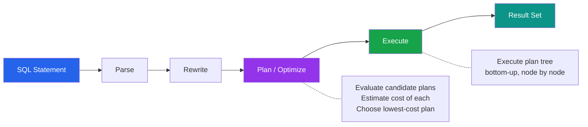

# [DEE-201] Reading Execution Plans

:::info
Developers SHOULD use EXPLAIN ANALYZE before optimizing any query. An execution plan reveals what the database actually does -- guessing from query syntax alone leads to wasted effort or counterproductive changes.
:::

## Context

Every SQL statement goes through three phases before returning results: parsing, planning, and execution. During the planning phase, the query optimizer evaluates many possible strategies -- different join orders, scan methods, and sort algorithms -- and selects the plan with the lowest estimated cost. The execution plan is the optimizer's chosen strategy, expressed as a tree of operations.

Without reading the execution plan, developers optimize by intuition: adding indexes that are never used, rewriting queries that were already efficient, or overlooking the actual bottleneck entirely. Both PostgreSQL (`EXPLAIN` / `EXPLAIN ANALYZE`) and MySQL (`EXPLAIN` / `EXPLAIN ANALYZE`) expose their execution plans, and reading them is a prerequisite to any meaningful optimization work.

The distinction between `EXPLAIN` and `EXPLAIN ANALYZE` is critical. `EXPLAIN` shows the planner's *estimated* plan without executing the query. `EXPLAIN ANALYZE` *executes* the query and annotates the plan with actual timing and row counts. The gap between estimated and actual numbers is often where performance problems hide.

## Principle

- Developers SHOULD run `EXPLAIN ANALYZE` before attempting any query optimization.
- Developers MUST NOT optimize queries based solely on intuition or query syntax without examining the execution plan.
- Developers SHOULD compare estimated rows to actual rows -- large discrepancies indicate stale statistics or a misleading data distribution.
- Developers SHOULD look for the most expensive nodes first -- the nodes with the highest actual time or the widest gap between estimated and actual rows.

## Visual



## Example

### PostgreSQL EXPLAIN ANALYZE

```sql
EXPLAIN ANALYZE
SELECT o.order_id, o.total, c.name
FROM orders o
JOIN customers c ON c.customer_id = o.customer_id
WHERE o.status = 'shipped'
  AND o.created_at >= '2025-01-01';
```

```
Hash Join  (cost=15.20..450.30 rows=120 width=52)
           (actual time=0.310..3.450 rows=1451 loops=1)
  Hash Cond: (o.customer_id = c.customer_id)
  ->  Seq Scan on orders o  (cost=0.00..380.00 rows=120 width=20)
                             (actual time=0.020..2.800 rows=1451 loops=1)
        Filter: ((status = 'shipped') AND (created_at >= '2025-01-01'))
        Rows Removed by Filter: 85000
  ->  Hash  (cost=10.50..10.50 rows=500 width=36)
            (actual time=0.250..0.250 rows=500 loops=1)
        ->  Seq Scan on customers c  (cost=0.00..10.50 rows=500 width=36)
                                      (actual time=0.010..0.120 rows=500 loops=1)
Planning Time: 0.150 ms
Execution Time: 3.700 ms
```

**How to read this plan:**

| What to Check | Value | Interpretation |
|---------------|-------|----------------|
| **Scan type on orders** | `Seq Scan` | Full table scan -- no index used for the filter |
| **Estimated vs actual rows (orders)** | 120 vs 1,451 | 12x underestimate -- statistics may be stale; run `ANALYZE orders` |
| **Rows Removed by Filter** | 85,000 | The scan read 86,451 rows to return 1,451 -- an index on `(status, created_at)` would help |
| **Join method** | `Hash Join` | The planner hashes the smaller table (customers) and probes it -- efficient here |
| **Total execution time** | 3.7 ms | Acceptable now, but will degrade as the orders table grows |

After adding an index:

```sql
CREATE INDEX idx_orders_status_created ON orders (status, created_at);
```

```
Nested Loop  (cost=5.10..85.30 rows=1400 width=52)
              (actual time=0.050..0.620 rows=1451 loops=1)
  ->  Index Scan using idx_orders_status_created on orders o
        (cost=0.42..45.20 rows=1400 width=20)
        (actual time=0.030..0.280 rows=1451 loops=1)
        Index Cond: ((status = 'shipped') AND (created_at >= '2025-01-01'))
  ->  Index Scan using customers_pkey on customers c
        (cost=0.28..0.30 rows=1 width=36)
        (actual time=0.001..0.001 rows=1 loops=1451)
Planning Time: 0.200 ms
Execution Time: 0.750 ms
```

The `Seq Scan` became an `Index Scan`, rows removed by filter dropped to zero, and execution time dropped from 3.7 ms to 0.75 ms.

### MySQL EXPLAIN

```sql
EXPLAIN
SELECT o.order_id, o.total, c.name
FROM orders o
JOIN customers c ON c.customer_id = o.customer_id
WHERE o.status = 'shipped'
  AND o.created_at >= '2025-01-01';
```

```
+----+-------+-------+---------------+---------+------+------+-------------+
| id | table | type  | possible_keys | key     | rows | filt | Extra       |
+----+-------+-------+---------------+---------+------+------+-------------+
|  1 | o     | ALL   | NULL          | NULL    | 8645 |  1.4 | Using where |
|  1 | c     | eq_ref| PRIMARY       | PRIMARY |    1 |  100 | NULL        |
+----+-------+-------+---------------+---------+------+------+-------------+
```

**Key columns to check in MySQL EXPLAIN:**

| Column | What to Look For |
|--------|-----------------|
| **type** | `ALL` = full table scan (bad for large tables); `ref`/`range`/`eq_ref` = index used; `const` = single row lookup |
| **key** | `NULL` means no index was chosen -- the query needs an index |
| **rows** | Estimated rows examined -- multiply across joined tables for total work |
| **filtered** | Percentage of rows that survive the WHERE clause -- low values with high row counts signal missing indexes |
| **Extra** | `Using index` = covering index; `Using filesort` = sort not from index; `Using temporary` = temp table created |

### Key Plan Node Types to Recognize

| PostgreSQL Node | MySQL type | Meaning | Performance |
|----------------|------------|---------|-------------|
| Seq Scan | ALL | Full table scan | Slow on large tables |
| Index Scan | ref, range | B-tree traversal + heap fetch | Good |
| Index Only Scan | Using index | Answered entirely from index | Best |
| Bitmap Index Scan | index_merge | Bitmap of matching rows, then heap fetch | Good for medium selectivity |
| Nested Loop | nested loop | For each outer row, scan inner | Good with index on inner |
| Hash Join | hash join (8.0.18+) | Build hash table, probe it | Good for large unsorted sets |
| Merge Join | -- | Merge two sorted inputs | Good when both inputs pre-sorted |
| Sort | Using filesort | Explicit sort operation | Watch for large sorts |

## Common Mistakes

1. **Optimizing without EXPLAIN.** Adding indexes, rewriting queries, or denormalizing tables without first reading the execution plan means you are guessing. The plan may reveal the bottleneck is somewhere unexpected -- a missing statistic, a bad join order, or an implicit type cast preventing index use.

2. **Using EXPLAIN without ANALYZE.** `EXPLAIN` alone shows estimates. Estimates can be wildly wrong when statistics are stale or data distribution is skewed. Always use `EXPLAIN ANALYZE` (which executes the query) to see actual row counts and timing. Be cautious with `EXPLAIN ANALYZE` on INSERT/UPDATE/DELETE -- wrap them in a transaction and roll back.

3. **Ignoring the gap between estimated and actual rows.** When the planner estimates 100 rows but 50,000 are returned, every downstream decision (join strategy, memory allocation, sort method) is based on wrong assumptions. Fix this by running `ANALYZE` on the affected tables to update statistics.

4. **Focusing only on execution time.** A fast query today may be fast only because the table is small or the data is cached. Look at the plan structure: a Seq Scan on a 1,000-row table is fine, but the same plan on a 10-million-row table will not scale.

5. **Not testing with production-like data volumes.** The optimizer may choose a completely different plan on a development database with 100 rows versus production with 10 million rows. Test execution plans against realistic data sizes.

## Related DEEs

- [DEE-200](200.md) Query and Performance Overview
- [DEE-205](205.md) Query Optimization Patterns -- applying what execution plans reveal
- [DEE-300](../Indexing%20and%20Storage/300.md) Indexing Overview -- the indexes that execution plans reference

## References

- [PostgreSQL Documentation: Using EXPLAIN](https://www.postgresql.org/docs/current/using-explain.html) -- official guide to reading PostgreSQL execution plans
- [PostgreSQL Documentation: EXPLAIN command](https://www.postgresql.org/docs/current/sql-explain.html) -- syntax and options for EXPLAIN
- [MySQL Documentation: EXPLAIN Output Format](https://dev.mysql.com/doc/en/explain-output.html) -- official reference for MySQL EXPLAIN columns
- [Use The Index, Luke: PostgreSQL Execution Plan Operations](https://use-the-index-luke.com/sql/explain-plan/postgresql/operations) -- visual guide to PostgreSQL plan nodes
- [Cybertec: How to Interpret PostgreSQL EXPLAIN ANALYZE Output](https://www.cybertec-postgresql.com/en/how-to-interpret-postgresql-explain-analyze-output/) -- practical walkthrough
- [Thoughtbot: Reading an EXPLAIN ANALYZE Query Plan](https://thoughtbot.com/blog/reading-an-explain-analyze-query-plan) -- developer-friendly explanation
