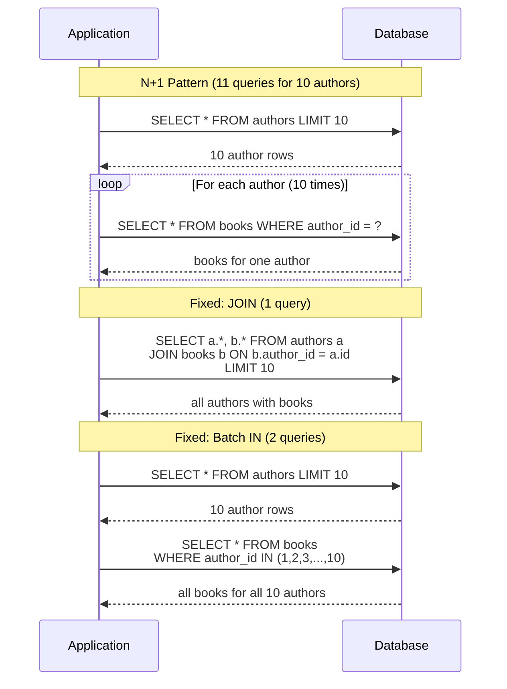

# [DEE-202] The N+1 Query Problem

:::info
Data access patterns MUST be reviewed for N+1 queries during development. The N+1 problem is the single most common performance issue in web applications that use ORMs or hand-written data fetching loops.
:::

## Context

The N+1 query problem occurs when application code fetches a list of N parent records with one query, then issues N additional queries to fetch related data for each parent -- resulting in N+1 total database round trips where one or two would suffice.

This pattern is insidious because it is invisible at small scale. Fetching 10 authors and their books with 11 queries takes milliseconds. Fetching 10,000 authors and their books with 10,001 queries can take minutes and saturate the database connection pool. The problem often hides behind ORM lazy-loading defaults, where related objects are fetched transparently on first access.

N+1 is not limited to ORMs. Any code that loops over a result set and issues a query per iteration exhibits the same problem: REST API handlers fetching related resources in a loop, GraphQL resolvers loading nested fields one at a time, or raw SQL in a for-each loop.

## Principle

- Data access patterns MUST be reviewed for N+1 queries during development and code review.
- Developers SHOULD monitor query count per request in development and testing environments.
- Developers SHOULD use JOIN or batch fetching (IN-list) to replace N+1 patterns.
- Developers MUST NOT rely on caching to mask N+1 problems -- caching hides the symptom but does not fix the root cause; a cache miss reverts to N+1 behavior.

## Visual



## Example

### The N+1 problem in raw SQL

```sql
-- Query 1: fetch all authors
SELECT author_id, name FROM authors;
-- Returns 1000 rows

-- Queries 2..1001: fetch books for each author (in application loop)
SELECT title, published_year FROM books WHERE author_id = 1;
SELECT title, published_year FROM books WHERE author_id = 2;
SELECT title, published_year FROM books WHERE author_id = 3;
-- ... 997 more queries ...
```

**Total: 1,001 queries.** Each query has network round-trip overhead (typically 0.5-2 ms on localhost, 5-20 ms across a network). At 1 ms round-trip, this adds 1 second of pure latency before any query execution time.

### Fix 1: JOIN

```sql
-- Single query: fetch authors and books together
SELECT a.author_id, a.name, b.title, b.published_year
FROM authors a
LEFT JOIN books b ON b.author_id = a.author_id
ORDER BY a.author_id;
```

**Total: 1 query.** The LEFT JOIN ensures authors with no books still appear. The trade-off is that author columns are repeated for each book row, increasing data transfer when authors have many books.

### Fix 2: Batch query with IN

```sql
-- Query 1: fetch all authors
SELECT author_id, name FROM authors;
-- Application collects author IDs: [1, 2, 3, ..., 1000]

-- Query 2: fetch all books for those authors in one query
SELECT author_id, title, published_year
FROM books
WHERE author_id IN (1, 2, 3, ..., 1000);
```

**Total: 2 queries.** The application joins the results in memory. This avoids the data duplication of a JOIN and works well when the IN-list fits within the database's parameter limit (PostgreSQL has no hard limit; MySQL allows up to 65,535 placeholders).

### Fix 3: Batch loading in ORM frameworks

Most ORMs provide built-in solutions:

```python
# Django: select_related (JOIN) and prefetch_related (batch IN)
authors = Author.objects.prefetch_related('books').all()

# SQLAlchemy: joinedload or subqueryload
authors = session.query(Author).options(joinedload(Author.books)).all()
```

```java
// JPA/Hibernate: @BatchSize on the collection
@OneToMany(mappedBy = "author")
@BatchSize(size = 100)
private List<Book> books;
```

```ruby
# Rails ActiveRecord: includes (auto-selects JOIN or batch IN)
authors = Author.includes(:books).all
```

### Detecting N+1 in development

| Tool / Technique | How It Helps |
|-----------------|--------------|
| **Django Debug Toolbar** | Shows query count and duplicate queries per request |
| **Bullet gem (Rails)** | Detects N+1 queries and suggests eager loading |
| **Hibernate `hibernate.generate_statistics`** | Logs query count and fetch statistics |
| **pg_stat_statements (PostgreSQL)** | Aggregates query execution counts across the application |
| **MySQL slow query log with `log_queries_not_using_indexes`** | Captures queries that miss indexes, often N+1 symptoms |
| **Application-level query counter** | Wrap the DB driver to count queries per request; alert above a threshold |

## Common Mistakes

1. **Trusting ORM defaults.** Most ORMs default to lazy loading, which triggers N+1 by design. Developers SHOULD configure eager loading for known access patterns and review generated SQL regularly. ORM convenience does not exempt you from understanding the queries it produces.

2. **Not monitoring query count per request.** A single HTTP request that generates 500 database queries is a red flag, regardless of individual query speed. Add query-count monitoring in development and CI -- many N+1 problems are caught by a simple threshold check (e.g., alert if a request exceeds 20 queries).

3. **Fixing N+1 with caching instead of query design.** Adding a cache layer (Redis, Memcached) in front of N+1 queries only helps while the cache is warm. Cache misses, cold starts, and cache invalidation all revert to the original N+1 behavior. Fix the query pattern first; add caching as a separate optimization if needed.

4. **Over-eager loading everything.** The opposite extreme -- eagerly loading all associations on every query -- wastes memory and bandwidth when the related data is not needed. Load what the current code path actually uses. Use explicit eager loading (specify which associations) rather than global eager loading.

5. **Ignoring N+1 in GraphQL resolvers.** GraphQL's nested field resolution naturally produces N+1 patterns. Use dataloader libraries (e.g., `graphql/dataloader`, `Strawberry DataLoader`) to batch and deduplicate database calls within a single request.

## Related DEEs

- [DEE-200](200.md) Query and Performance Overview
- [DEE-201](201.md) Reading Execution Plans -- diagnose N+1 at the database level
- [DEE-203](203.md) JOIN Strategies -- the JOIN types used to fix N+1
- [DEE-205](205.md) Query Optimization Patterns -- broader optimization techniques

## References

- [PingCAP: How to Efficiently Solve the N+1 Query Problem](https://www.pingcap.com/article/how-to-efficiently-solve-the-n1-query-problem/) -- comprehensive overview with ORM examples
- [Django Documentation: prefetch_related](https://docs.djangoproject.com/en/5.0/ref/models/querysets/#prefetch-related) -- Django's batch loading strategy
- [SQLAlchemy Documentation: Relationship Loading Techniques](https://docs.sqlalchemy.org/en/20/orm/queryguide/relationships.html) -- joinedload, subqueryload, selectinload
- [Rails Guides: Eager Loading Associations](https://guides.rubyonrails.org/active_record_querying.html#eager-loading-associations) -- includes, preload, eager_load
- [graphql/dataloader on GitHub](https://github.com/graphql/dataloader) -- reference DataLoader implementation for batching
- [Digma: What is the N+1 Query Problem and How to Detect It](https://digma.ai/n1-query-problem-and-how-to-detect-it/) -- detection strategies and tooling
