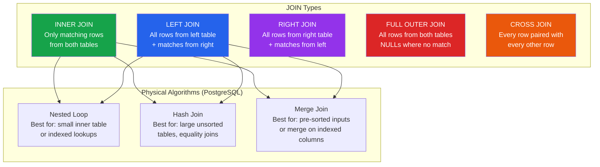

# [DEE-203] JOIN Strategies

:::info
Choose the JOIN type based on data requirements, not convenience. Each JOIN type has distinct semantics -- using the wrong one silently produces incorrect results or unnecessary performance costs.
:::

## Context

JOINs are the mechanism through which relational databases combine data from multiple tables. They are not a performance feature or a convenience -- they are how the relational model works. Without JOINs, you either denormalize everything into one table (violating normalization principles) or fetch data in multiple queries and assemble it in application code (the N+1 pattern).

SQL defines several JOIN types, each with different semantics for how matched and unmatched rows are handled. Choosing the wrong JOIN type is a logic error, not just a performance concern. A LEFT JOIN where an INNER JOIN was intended returns rows with NULL columns that downstream code may not expect. A CROSS JOIN where a filtered JOIN was intended produces a Cartesian product that can be orders of magnitude larger than intended.

Beyond the logical JOIN type, the database engine must choose a physical join algorithm -- Nested Loop, Hash Join, or Merge Join -- to actually execute the operation. Understanding both the logical type and the physical algorithm helps developers write efficient queries and interpret execution plans.

## Principle

- Developers MUST choose the JOIN type that matches the data requirement, not the one they are most familiar with.
- Developers SHOULD use INNER JOIN as the default unless rows without matches are explicitly needed.
- Developers MUST ensure join columns are indexed, especially on the "many" side of a one-to-many relationship.
- Developers SHOULD NOT use CROSS JOIN unless a Cartesian product is genuinely needed (e.g., generating combinations for a calendar or matrix).

## Visual



## JOIN Type Reference

| JOIN Type | Matched Rows | Unmatched Left | Unmatched Right | Use When |
|-----------|:---:|:---:|:---:|----------|
| **INNER JOIN** | Included | Excluded | Excluded | You only want rows that have a match in both tables |
| **LEFT JOIN** | Included | Included (NULLs for right) | Excluded | You need all rows from the left table regardless of match |
| **RIGHT JOIN** | Included | Excluded | Included (NULLs for left) | You need all rows from the right table (often rewritten as LEFT JOIN) |
| **FULL OUTER JOIN** | Included | Included (NULLs for right) | Included (NULLs for left) | You need all rows from both tables (e.g., reconciliation reports) |
| **CROSS JOIN** | N/A -- all combinations | N/A | N/A | You genuinely need every combination of rows (Cartesian product) |

## Example

### Sample data

```sql
CREATE TABLE departments (
    dept_id   INT PRIMARY KEY,
    dept_name TEXT NOT NULL
);

INSERT INTO departments VALUES
    (1, 'Engineering'),
    (2, 'Marketing'),
    (3, 'Finance');

CREATE TABLE employees (
    emp_id    INT PRIMARY KEY,
    name      TEXT NOT NULL,
    dept_id   INT REFERENCES departments(dept_id)
);

INSERT INTO employees VALUES
    (101, 'Alice',  1),
    (102, 'Bob',    1),
    (103, 'Carol',  2),
    (104, 'Dave',   NULL);  -- Dave has no department
```

### INNER JOIN -- only matched rows

```sql
SELECT e.name, d.dept_name
FROM employees e
INNER JOIN departments d ON d.dept_id = e.dept_id;
```

| name  | dept_name   |
|-------|-------------|
| Alice | Engineering |
| Bob   | Engineering |
| Carol | Marketing   |

Dave is excluded (no matching department). Finance is excluded (no matching employee).

### LEFT JOIN -- all employees, even without a department

```sql
SELECT e.name, d.dept_name
FROM employees e
LEFT JOIN departments d ON d.dept_id = e.dept_id;
```

| name  | dept_name   |
|-------|-------------|
| Alice | Engineering |
| Bob   | Engineering |
| Carol | Marketing   |
| Dave  | NULL        |

Dave appears with NULL for dept_name. Finance still excluded (no employee references it).

### FULL OUTER JOIN -- all rows from both tables

```sql
SELECT e.name, d.dept_name
FROM employees e
FULL OUTER JOIN departments d ON d.dept_id = e.dept_id;
```

| name  | dept_name   |
|-------|-------------|
| Alice | Engineering |
| Bob   | Engineering |
| Carol | Marketing   |
| Dave  | NULL        |
| NULL  | Finance     |

Both Dave (no department) and Finance (no employees) appear.

### CROSS JOIN -- Cartesian product

```sql
-- Generate a schedule grid: every employee x every department
SELECT e.name, d.dept_name
FROM employees e
CROSS JOIN departments d;
-- Returns 4 x 3 = 12 rows
```

### Anti-join pattern with LEFT JOIN

```sql
-- Find departments with no employees
SELECT d.dept_name
FROM departments d
LEFT JOIN employees e ON e.dept_id = d.dept_id
WHERE e.emp_id IS NULL;
```

| dept_name |
|-----------|
| Finance   |

This is more efficient than `NOT IN` with a subquery, especially when the subquery can contain NULLs.

## Physical Join Algorithms

The database engine chooses how to physically execute a JOIN independently of the logical JOIN type. Understanding these helps when reading execution plans (see [DEE-201](201.md)).

| Algorithm | How It Works | Best For | Cost |
|-----------|-------------|----------|------|
| **Nested Loop** | For each row in the outer table, scan the inner table (or use an index) | Small tables, or when an index exists on the inner join column | O(N * M) without index, O(N * log M) with index |
| **Hash Join** | Build a hash table from the smaller table, then probe it with each row from the larger table | Large tables without useful indexes, equality conditions only | O(N + M) but requires memory for hash table |
| **Merge Join** | Sort both inputs on the join key (or use pre-sorted index), then merge | Both inputs already sorted, or large tables with indexes on join key | O(N log N + M log M) for sort, O(N + M) for merge |

PostgreSQL supports all three. MySQL added Hash Join support in version 8.0.18; prior versions rely on Nested Loop with index lookups for most joins.

## Common Mistakes

1. **Accidental CROSS JOIN.** Omitting the ON clause or using comma-separated tables without a WHERE condition produces a Cartesian product. With two 10,000-row tables, this generates 100 million rows. Always specify an explicit join condition.

    ```sql
    -- WRONG: accidental cross join (comma syntax, missing condition)
    SELECT * FROM orders, customers;

    -- CORRECT: explicit join
    SELECT * FROM orders o JOIN customers c ON c.customer_id = o.customer_id;
    ```

2. **LEFT JOIN when INNER JOIN suffices.** Using LEFT JOIN "just in case" when the business logic guarantees a match (e.g., a NOT NULL foreign key) adds unnecessary overhead. The optimizer may not be able to eliminate the outer-join logic, leading to suboptimal plans. Use INNER JOIN when every row is guaranteed to have a match.

3. **Not indexing join columns.** Without an index on the join column (especially the foreign key side), the database falls back to sequential scans or hash joins even when a nested loop with an index would be much faster. Always ensure foreign key columns have an index.

4. **Joining on mismatched types.** Joining a VARCHAR column to an INT column forces an implicit type cast on every row, preventing index use. Ensure join columns have the same data type.

5. **Using RIGHT JOIN instead of rewriting as LEFT JOIN.** RIGHT JOIN is semantically identical to LEFT JOIN with the table order swapped. Most teams standardize on LEFT JOIN for readability. RIGHT JOIN adds cognitive overhead without any benefit.

6. **Ignoring NULL semantics in outer joins.** After a LEFT JOIN, columns from the right table may be NULL for unmatched rows. Filtering on those columns in the WHERE clause (e.g., `WHERE right_table.column = 'value'`) implicitly converts the LEFT JOIN to an INNER JOIN, because NULL never equals anything. Place such filters in the ON clause instead if you want to preserve the outer-join behavior.

## Related DEEs

- [DEE-200](200.md) Query and Performance Overview
- [DEE-201](201.md) Reading Execution Plans -- see how the database executes your JOINs
- [DEE-202](202.md) The N+1 Query Problem -- JOINs as the primary solution
- [DEE-204](204.md) Subqueries vs JOINs -- when to use each

## References

- [PostgreSQL Documentation: Table Expressions (JOIN)](https://www.postgresql.org/docs/current/queries-table-expressions.html) -- official JOIN syntax and semantics
- [MySQL Documentation: JOIN Clause](https://dev.mysql.com/doc/refman/8.4/en/join.html) -- MySQL JOIN syntax reference
- [Cybertec: Join Strategies and Performance in PostgreSQL](https://www.cybertec-postgresql.com/en/join-strategies-and-performance-in-postgresql/) -- deep dive into join algorithms
- [Use The Index, Luke: Join Operations](https://use-the-index-luke.com/sql/join) -- index-aware join optimization
- [Crunchy Data: Postgres Scan Types in EXPLAIN Plans](https://www.crunchydata.com/blog/postgres-scan-types-in-explain-plans) -- understanding plan nodes for joins
