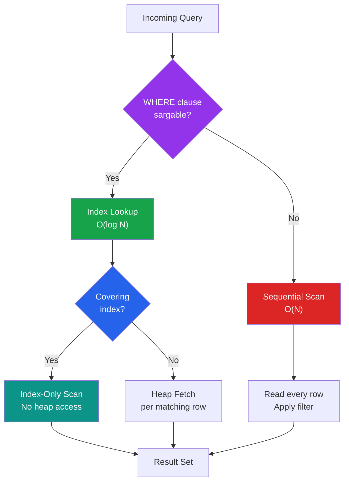

# [DEE-205] Query Optimization Patterns

:::info
Write queries that can use indexes and measure before optimizing. Premature optimization wastes effort; optimization without measurement wastes effort in the wrong place.
:::

## Context

Query optimization is not about writing clever SQL -- it is about writing SQL that cooperates with the database engine's optimizer and index structures. The most impactful optimizations are structural: ensuring the query can use an index, avoiding unnecessary work, and choosing pagination strategies that scale.

Most slow queries fall into a small number of patterns: non-sargable WHERE clauses that prevent index use, SELECT * that fetches unnecessary columns, OFFSET-based pagination that degrades on deep pages, and missing covering indexes that force expensive heap lookups.

This DEE covers practical, recurring optimization patterns. Each pattern is something a developer can apply during query writing -- before the query becomes a performance problem -- and verify with EXPLAIN ANALYZE.

## Principle

- Developers MUST write WHERE clauses that are sargable (Search ARGument ABLE) -- conditions that allow the database to use an index.
- Developers SHOULD select only the columns they need, not `SELECT *`.
- Developers SHOULD use cursor-based (keyset) pagination instead of OFFSET for any user-facing pagination that may reach deep pages.
- Developers MUST measure query performance with EXPLAIN ANALYZE before and after optimization to confirm improvement.
- Developers SHOULD NOT optimize queries that are not measured bottlenecks -- premature optimization adds complexity without proven benefit.

## Visual



## Example

### Pattern 1: Sargable vs non-sargable WHERE clauses

A sargable condition allows the database to seek directly into an index. A non-sargable condition forces a full scan because the index cannot be used.

```sql
-- NON-SARGABLE: function on the indexed column prevents index use
SELECT * FROM orders
WHERE YEAR(created_at) = 2025;

-- SARGABLE: range condition uses the index on created_at
SELECT * FROM orders
WHERE created_at >= '2025-01-01'
  AND created_at < '2026-01-01';
```

```sql
-- NON-SARGABLE: expression on the indexed column
SELECT * FROM products
WHERE price * 1.1 > 100;

-- SARGABLE: move the math to the right side
SELECT * FROM products
WHERE price > 100 / 1.1;
```

```sql
-- NON-SARGABLE: leading wildcard prevents index use
SELECT * FROM customers
WHERE name LIKE '%smith';

-- SARGABLE: trailing wildcard can use a B-tree index
SELECT * FROM customers
WHERE name LIKE 'Smith%';
```

**Common non-sargable patterns and their sargable rewrites:**

| Non-Sargable | Sargable Rewrite |
|-------------|-----------------|
| `WHERE YEAR(date_col) = 2025` | `WHERE date_col >= '2025-01-01' AND date_col < '2026-01-01'` |
| `WHERE LOWER(email) = 'user@example.com'` | Create a functional index: `CREATE INDEX idx ON t (LOWER(email))` |
| `WHERE col + 1 = 10` | `WHERE col = 9` |
| `WHERE col * 2 > 100` | `WHERE col > 50` |
| `WHERE CAST(varchar_col AS INT) = 42` | Store the column as INT, or create a functional index |
| `WHERE name LIKE '%search%'` | Use full-text search (GIN/GiST index) or `pg_trgm` |

### Pattern 2: Covering indexes (Index-Only Scans)

A covering index includes all columns the query needs, so the database never accesses the heap (table data). This eliminates random I/O for each matching row.

```sql
-- Query that only needs order_id and total for shipped orders
SELECT order_id, total
FROM orders
WHERE status = 'shipped'
  AND created_at >= '2025-01-01';

-- Covering index: includes all columns in WHERE and SELECT
CREATE INDEX idx_orders_covering
ON orders (status, created_at)
INCLUDE (order_id, total);
```

```
-- Before (Index Scan + heap fetch):
Index Scan using idx_orders_status on orders
  (actual time=0.03..2.10 rows=1451 loops=1)

-- After (Index Only Scan -- no heap access):
Index Only Scan using idx_orders_covering on orders
  (actual time=0.02..0.45 rows=1451 loops=1)
  Heap Fetches: 0
```

The INCLUDE clause (PostgreSQL 11+, SQL Server) adds columns to the index leaf pages without affecting the index sort order. MySQL achieves the same effect by including columns in the index definition (all secondary index columns are effectively INCLUDE columns in InnoDB since secondary indexes point to the primary key).

### Pattern 3: Cursor-based (keyset) pagination vs OFFSET

OFFSET tells the database to skip N rows. For deep pages, it must scan and discard all preceding rows -- a page at offset 100,000 requires scanning 100,000 rows before returning the requested page.

```sql
-- OFFSET pagination: degrades linearly with page depth
-- Page 1 (fast):
SELECT order_id, total, created_at
FROM orders ORDER BY created_at DESC LIMIT 20 OFFSET 0;

-- Page 5000 (slow -- scans 100,000 rows, returns 20):
SELECT order_id, total, created_at
FROM orders ORDER BY created_at DESC LIMIT 20 OFFSET 99980;
```

```sql
-- CURSOR-BASED pagination: constant performance regardless of depth
-- Page 1:
SELECT order_id, total, created_at
FROM orders
ORDER BY created_at DESC, order_id DESC
LIMIT 20;

-- Next page: use the last row's values as the cursor
SELECT order_id, total, created_at
FROM orders
WHERE (created_at, order_id) < ('2025-06-15 10:30:00', 48573)
ORDER BY created_at DESC, order_id DESC
LIMIT 20;
```

| Aspect | OFFSET | Cursor-Based (Keyset) |
|--------|--------|----------------------|
| **Page 1 speed** | Fast | Fast |
| **Page 5000 speed** | Slow (scans 100K rows) | Fast (index seek) |
| **Consistency under writes** | May skip or duplicate rows | Stable cursor position |
| **Random page access** | Yes (`OFFSET = (page - 1) * size`) | No (forward/backward only) |
| **Implementation complexity** | Simple | Moderate (must track cursor state) |
| **Best for** | Admin interfaces, small datasets | APIs, infinite scroll, large datasets |

**When OFFSET is acceptable:** small result sets (under ~10,000 rows), admin/internal tools where deep pagination is rare, or when random page access is a hard requirement.

### Pattern 4: Avoid SELECT *

```sql
-- BAD: fetches all columns, including large TEXT/BLOB columns
SELECT * FROM articles WHERE category = 'tech';

-- GOOD: fetch only what you need
SELECT article_id, title, published_at FROM articles WHERE category = 'tech';
```

`SELECT *` has multiple costs:
- **Prevents covering index optimization.** The query must access the heap for columns not in the index.
- **Increases data transfer.** Fetching unused BLOB or TEXT columns wastes network bandwidth and memory.
- **Breaks when schema changes.** Adding a column silently changes the result set, which may break application code that depends on column order.
- **Increases buffer pool pressure.** Larger rows mean fewer rows per page, increasing I/O for the same logical result.

### Pattern 5: Indexed ORDER BY to avoid filesort

```sql
-- Without index: database must sort all matching rows (filesort)
SELECT order_id, total FROM orders
WHERE customer_id = 42
ORDER BY created_at DESC;

-- With compound index: sort order comes from the index
CREATE INDEX idx_orders_cust_created
ON orders (customer_id, created_at DESC);

-- Now the ORDER BY is "free" -- the index produces rows in order
```

In MySQL EXPLAIN, watch for `Using filesort` in the Extra column -- it indicates the result must be sorted in memory or on disk. An index that matches the WHERE columns followed by the ORDER BY columns eliminates this.

## Common Mistakes

1. **Premature optimization.** Adding covering indexes, rewriting queries, or switching pagination strategies before measuring is counterproductive. Covering indexes have write cost (maintained on every INSERT/UPDATE/DELETE). Only optimize queries that EXPLAIN ANALYZE shows are actual bottlenecks.

2. **OFFSET for deep pagination in APIs.** A public API that accepts `?page=5000&size=20` will generate queries with `OFFSET 99980`, which degrades linearly. APIs that serve potentially large result sets SHOULD use cursor-based pagination from the start -- retrofitting it later requires API changes.

3. **Wrapping indexed columns in functions.** `WHERE UPPER(email) = 'USER@EXAMPLE.COM'` cannot use a standard B-tree index on `email`. Either store the column in a canonical form, create a functional index (`CREATE INDEX ON t (UPPER(email))`), or use a case-insensitive collation.

4. **Using SELECT * in production queries.** SELECT * prevents covering index optimization, increases data transfer, and creates fragile coupling to the schema. Explicit column lists cost a few extra keystrokes but pay for themselves in performance and maintainability.

5. **Optimizing queries without EXPLAIN ANALYZE.** Developers sometimes add indexes or rewrite queries based on assumptions about what is slow. The actual execution plan may reveal a completely different bottleneck -- stale statistics, a bad join order, or a sequential scan on a different table than expected. Always measure first.

6. **Ignoring write cost of indexes.** Every index must be updated on INSERT, UPDATE (of indexed columns), and DELETE. Adding a covering index to speed up one read query may slow down a high-frequency write path. Balance read optimization against write overhead.

## Related DEEs

- [DEE-200](200.md) Query and Performance Overview
- [DEE-201](201.md) Reading Execution Plans -- the essential tool for measuring optimization impact
- [DEE-202](202.md) The N+1 Query Problem -- a specific optimization pattern
- [DEE-203](203.md) JOIN Strategies -- choosing efficient join approaches
- [DEE-204](204.md) Subqueries vs JOINs -- query structure optimization
- [DEE-300](300.md) Indexing Overview -- the index structures these patterns rely on

## References

- [Use The Index, Luke: The WHERE Clause](https://use-the-index-luke.com/sql/where-clause) -- comprehensive guide to sargable conditions and index use
- [Use The Index, Luke: Pagination Done the Right Way](https://use-the-index-luke.com/no-offset) -- keyset pagination explained
- [PostgreSQL Documentation: Index-Only Scans](https://www.postgresql.org/docs/current/indexes-index-only-scans.html) -- covering index behavior
- [PostgreSQL Documentation: CREATE INDEX (INCLUDE clause)](https://www.postgresql.org/docs/current/sql-createindex.html) -- INCLUDE syntax for covering indexes
- [MySQL Documentation: Covering Indexes](https://dev.mysql.com/doc/refman/8.4/en/index-merge-optimization.html) -- how InnoDB uses covering indexes
- [PlanetScale: Pagination in MySQL](https://planetscale.com/blog/mysql-pagination) -- practical comparison of pagination strategies
- [PingCAP: Limit/Offset vs Cursor Pagination](https://www.pingcap.com/article/limit-offset-pagination-vs-cursor-pagination-in-mysql/) -- benchmarked comparison
- [Wikipedia: Sargable](https://en.wikipedia.org/wiki/Sargable) -- definition and examples of sargable expressions
