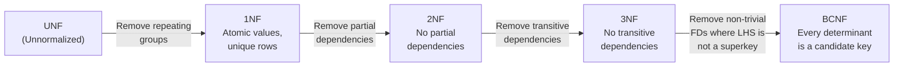

# [DEE-100] Normalization

:::info
Normalize to third normal form (3NF) by default. Denormalize only with measured evidence that a specific query cannot meet its latency target.
:::

## Context

Normalization is the process of organizing a relational database to reduce data redundancy and protect data integrity. E.F. Codd introduced the concept along with the first normal form (1NF) in 1970, followed by 2NF and 3NF in 1971, and Boyce-Codd normal form (BCNF) jointly with Raymond Boyce in 1974.

Without normalization, tables suffer from three well-known anomalies:

- **Update anomaly** -- The same fact is stored in multiple rows. Changing it in one row but not others creates inconsistency.
- **Insert anomaly** -- You cannot record a new fact without also inserting unrelated data (or resorting to NULL placeholders).
- **Delete anomaly** -- Removing a row unintentionally destroys an unrelated fact stored in the same row.

Normalization systematically eliminates these anomalies by decomposing tables so that every non-key column depends on "the key, the whole key, and nothing but the key."

## Principle

- You MUST normalize new schemas to at least 3NF before considering denormalization.
- You SHOULD document any intentional denormalization, including the query it benefits and the benchmark that justified it.
- You MAY go beyond 3NF to BCNF when a table has overlapping composite candidate keys.
- You MUST NOT denormalize "for performance" without a measured query plan or load test showing the normalized design cannot meet its SLA.

## Visual

The following diagram shows the progression through normal forms, with each step eliminating a specific class of dependency problem.



## Example

### Unnormalized Table (UNF)

A single table storing orders with repeated product information:

| order_id | customer_name | customer_email     | product_name | product_price | qty |
|----------|---------------|--------------------|--------------|---------------|-----|
| 1        | Alice         | alice@example.com  | Widget       | 9.99          | 2   |
| 1        | Alice         | alice@example.com  | Gadget       | 24.99         | 1   |
| 2        | Bob           | bob@example.com    | Widget       | 9.99          | 5   |

Problems: updating Alice's email requires touching every row for order 1 (update anomaly). Deleting order 2 loses the fact that Bob's email is bob@example.com (delete anomaly).

### Normalized to 3NF

```sql
-- Customers: no transitive dependency
CREATE TABLE customers (
    customer_id   BIGINT GENERATED ALWAYS AS IDENTITY PRIMARY KEY,
    name          TEXT        NOT NULL,
    email         TEXT        NOT NULL UNIQUE
);

-- Products: independent entity
CREATE TABLE products (
    product_id    BIGINT GENERATED ALWAYS AS IDENTITY PRIMARY KEY,
    name          TEXT        NOT NULL,
    price         NUMERIC(10,2) NOT NULL
);

-- Orders: depends only on customer
CREATE TABLE orders (
    order_id      BIGINT GENERATED ALWAYS AS IDENTITY PRIMARY KEY,
    customer_id   BIGINT      NOT NULL REFERENCES customers(customer_id),
    created_at    TIMESTAMPTZ NOT NULL DEFAULT now()
);

-- Order items: depends on order + product (full composite key dependency)
CREATE TABLE order_items (
    order_id      BIGINT      NOT NULL REFERENCES orders(order_id),
    product_id    BIGINT      NOT NULL REFERENCES products(product_id),
    quantity      INT         NOT NULL CHECK (quantity > 0),
    unit_price    NUMERIC(10,2) NOT NULL,
    PRIMARY KEY (order_id, product_id)
);
```

Each non-key column now depends on the key, the whole key, and nothing but the key:

- `customers.email` depends only on `customer_id`.
- `products.price` depends only on `product_id`.
- `order_items.quantity` depends on the full composite key `(order_id, product_id)`.

Note that `unit_price` is intentionally stored on `order_items` (not looked up from `products`) because the price at the time of sale is a historical fact that MUST NOT change when the current product price is updated.

## Common Mistakes

| Mistake | Why It Hurts | Fix |
|---------|-------------|-----|
| **Skipping normalization** and designing "flat" tables for simplicity | Update, insert, and delete anomalies appear quickly as data grows | Start from 3NF; flatten later with evidence |
| **Over-normalizing** (e.g., separate table for every attribute) | Excessive joins slow reads and complicate application code | Stop at 3NF unless you have overlapping candidate keys (then go to BCNF) |
| **Premature denormalization** "because joins are slow" | Adds write complexity and consistency risks before measuring | Profile the actual query first; joins on indexed keys are fast |
| **Ignoring functional dependencies** during schema review | You may satisfy 3NF by accident but miss a transitive dependency that surfaces later | Explicitly list FDs during design review |
| **Storing derived data without a refresh strategy** | Denormalized copies drift out of sync | Use materialized views or triggers with documented refresh cadence |

## Related DEEs

- [DEE-101](101.md) Primary Keys and Surrogate Keys
- [DEE-102](102.md) Foreign Keys and Referential Integrity
- [DEE-103](103.md) Relationships (1:1, 1:N, M:N)
- [DEE-5](5.md) Glossary

## References

- [E.F. Codd, "A Relational Model of Data for Large Shared Data Banks" (1970)](https://www.seas.upenn.edu/~zives/03f/cis550/codd.pdf) -- the original paper introducing the relational model and 1NF
- [Database normalization -- Wikipedia](https://en.wikipedia.org/wiki/Database_normalization) -- comprehensive overview of normal forms with historical context
- [PostgreSQL Documentation: Constraints](https://www.postgresql.org/docs/current/ddl-constraints.html) -- how PostgreSQL enforces the constraints normalization relies on
- [Database Normalization -- DigitalOcean](https://www.digitalocean.com/community/tutorials/database-normalization) -- practical walkthrough with examples
