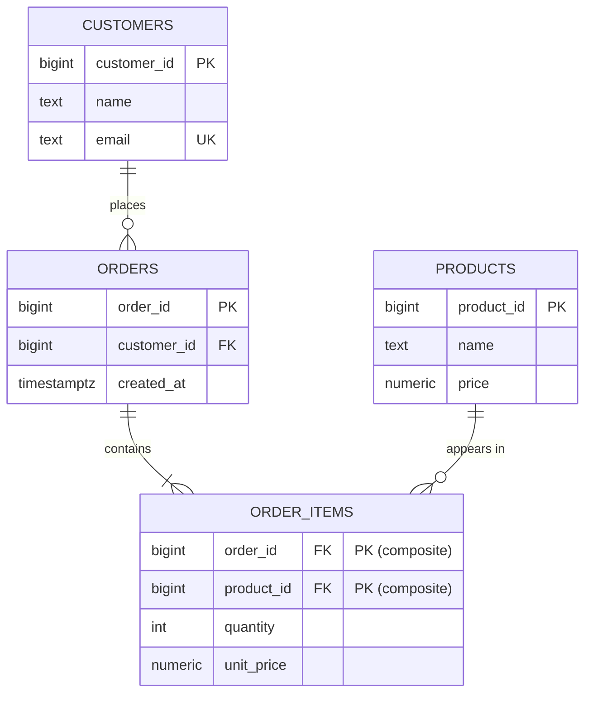

# [DEE-102] Foreign Keys and Referential Integrity

:::info
Every relationship between tables SHOULD be enforced by a foreign key constraint. Always index foreign key columns and choose the ON DELETE action deliberately.
:::

## Context

A foreign key (FK) is a column (or set of columns) in one table that references the primary key of another table. The database engine enforces referential integrity: it guarantees that every FK value points to an existing row in the referenced table. Without FK constraints, applications must enforce this invariant in code -- a historically unreliable approach that leads to orphaned rows and broken joins.

Foreign keys also serve as executable documentation: they make relationships visible in the schema and enable tools (ER diagram generators, ORMs, migration frameworks) to understand the data model automatically.

## Principle

- You SHOULD declare a foreign key constraint for every column that references another table's primary key.
- You MUST create an index on every foreign key column. PostgreSQL does not create one automatically; MySQL/InnoDB does.
- You MUST choose an ON DELETE action explicitly rather than relying on the default (NO ACTION).
- You SHOULD NOT use ON DELETE CASCADE on tables that hold financially or legally significant records.
- You MAY omit FK constraints in append-only analytics tables or event stores where write throughput is critical and referential integrity is enforced upstream -- but document the trade-off.

## Visual



## ON DELETE Behavior

The ON DELETE clause determines what happens to child rows when their parent row is deleted.

| Action | Behavior | Use When |
|--------|----------|----------|
| **RESTRICT** | Prevents parent deletion if any child rows exist. Checked immediately. | Child data is important and MUST NOT be orphaned or lost (e.g., invoices, audit logs) |
| **NO ACTION** | Same as RESTRICT but checked at end of transaction (allows deferred constraints). | You need deferred constraint checking within a transaction |
| **CASCADE** | Deletes all child rows automatically when the parent is deleted. | Child data has no independent meaning (e.g., session tokens, notification preferences, shopping cart items) |
| **SET NULL** | Sets the FK column to NULL in child rows. Column must be nullable. | Child data should survive but the association can be severed (e.g., an employee's manager is deleted; reassign later) |
| **SET DEFAULT** | Sets the FK column to its default value. | Rarely used. Applicable when a sentinel/fallback row exists (e.g., "unassigned" category) |

### Decision Heuristic

1. Is the child entity a **component** of the parent that has no independent existence? Use **CASCADE**.
2. Is the child entity **independently valuable** (financial records, content, audit trail)? Use **RESTRICT**.
3. Should the child **survive** but lose the association? Use **SET NULL**.
4. When in doubt, choose **RESTRICT** -- it is the safest default.

## Example

```sql
-- Parent table
CREATE TABLE departments (
    department_id  BIGINT GENERATED ALWAYS AS IDENTITY PRIMARY KEY,
    name           TEXT NOT NULL UNIQUE
);

-- Child table: employees belong to a department
CREATE TABLE employees (
    employee_id    BIGINT GENERATED ALWAYS AS IDENTITY PRIMARY KEY,
    name           TEXT NOT NULL,
    department_id  BIGINT NOT NULL
        REFERENCES departments(department_id)
        ON DELETE RESTRICT,
    manager_id     BIGINT
        REFERENCES employees(employee_id)
        ON DELETE SET NULL
);

-- CRITICAL: index FK columns for join and delete performance
CREATE INDEX idx_employees_department_id ON employees(department_id);
CREATE INDEX idx_employees_manager_id    ON employees(manager_id);
```

Key points:

- `department_id` uses **RESTRICT**: you cannot delete a department that still has employees.
- `manager_id` uses **SET NULL**: if a manager leaves, their reports remain but temporarily have no manager.
- Both FK columns have explicit indexes. Without them, deleting a department would require a sequential scan of the employees table to verify no references exist.

### MySQL Example

```sql
CREATE TABLE departments (
    department_id  BIGINT AUTO_INCREMENT PRIMARY KEY,
    name           VARCHAR(255) NOT NULL UNIQUE
) ENGINE=InnoDB;

CREATE TABLE employees (
    employee_id    BIGINT AUTO_INCREMENT PRIMARY KEY,
    name           VARCHAR(255) NOT NULL,
    department_id  BIGINT NOT NULL,
    manager_id     BIGINT NULL,
    FOREIGN KEY (department_id)
        REFERENCES departments(department_id)
        ON DELETE RESTRICT,
    FOREIGN KEY (manager_id)
        REFERENCES employees(employee_id)
        ON DELETE SET NULL
) ENGINE=InnoDB;
-- InnoDB automatically creates indexes on FK columns
```

## Common Mistakes

| Mistake | Why It Hurts | Fix |
|---------|-------------|-----|
| **Omitting FKs "for performance"** | Saves negligible write overhead but allows orphaned rows and silent data corruption | Add the FK; the write cost (~2-5%) is almost always worth the integrity guarantee |
| **CASCADE on everything** | A single parent delete can silently wipe thousands of child rows across multiple tables | Default to RESTRICT; use CASCADE only for true compositional relationships |
| **Missing index on FK columns (PostgreSQL)** | Deleting or updating a parent row triggers a sequential scan on the child table | Always create an explicit index on FK columns |
| **Relying on application-only enforcement** | Every code path (API, migration script, manual SQL, background job) must replicate the check -- one miss and data is corrupted | Use database-level FK constraints as the single source of truth |
| **Circular foreign keys without deferred constraints** | Two tables that reference each other cannot be populated if FKs are checked immediately | Use `DEFERRABLE INITIALLY DEFERRED` or restructure the schema |
| **Using ON DELETE SET NULL on a NOT NULL column** | The delete will fail with a constraint violation, defeating the purpose | Ensure the FK column allows NULL if SET NULL is the intended behavior |

## Related DEEs

- [DEE-100](100.md) Normalization
- [DEE-101](101.md) Primary Keys and Surrogate Keys
- [DEE-103](103.md) Relationships (1:1, 1:N, M:N)

## References

- [PostgreSQL Documentation: Constraints](https://www.postgresql.org/docs/current/ddl-constraints.html) -- foreign key syntax, ON DELETE actions, deferrable constraints
- [MySQL Documentation: FOREIGN KEY Constraints](https://dev.mysql.com/doc/refman/8.4/en/create-table-foreign-keys.html) -- InnoDB FK behavior and index requirements
- [Cascade Deletes -- Supabase Docs](https://supabase.com/docs/guides/database/postgres/cascade-deletes) -- practical guide to ON DELETE actions with examples
- [A Practical Guide to Postgres Foreign Keys](https://medium.com/the-table-sql-and-devtalk/a-practical-guide-to-postgres-foreign-keys-59e663b10045) -- syntax, use cases, and best practices
