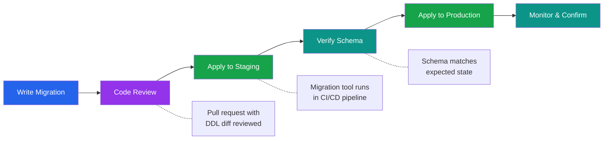

# [DEE-301] Migration Fundamentals

:::info
Every schema change MUST be captured as a versioned, reviewable migration file. Manual DDL executed directly against production is never acceptable.
:::

## Context

Application code is version-controlled, peer-reviewed, and deployed through a pipeline. Database schema changes deserve the same rigor. Without version-controlled migrations, teams lose track of what changed, when, and why. A schema drift -- where production no longer matches what developers expect -- leads to broken deployments, data corruption, and hours of forensic debugging.

Migration tools solve this by treating schema changes as an ordered sequence of files, each containing the DDL needed to move the schema from one version to the next. Every major ecosystem has a mature migration tool: Flyway and Liquibase for JVM projects, Alembic for Python/SQLAlchemy, Django Migrations for Django, ActiveRecord Migrations for Rails, and golang-migrate for Go. Despite differences in syntax and philosophy, they all share the same core model: a numbered sequence of change scripts applied in order, tracked in a metadata table in the database itself.

The migration lifecycle has four phases: **write** the migration file, **review** it like any other code change, **apply** it through the deployment pipeline, and **verify** that the schema matches expectations. Skipping any phase -- especially review -- invites production incidents.

## Principle

- Every schema change MUST be captured as a versioned migration file checked into source control.
- Migrations MUST be reviewed in pull requests before merging, just like application code.
- Teams SHOULD use a migration tool (Flyway, Alembic, Django Migrations, ActiveRecord, golang-migrate, or equivalent) rather than writing custom migration infrastructure.
- Migrations MUST be applied through the deployment pipeline -- never by running SQL manually in a production terminal.
- Down (rollback) migrations SHOULD be maintained for migrations that are reversible, but teams MAY omit them when the rollback is destructive or impractical (e.g., dropping a column cannot be undone without a backup).

## Visual



**Key insight:** The migration lifecycle mirrors the code deployment lifecycle. Every schema change is written, reviewed, applied to a staging environment, verified, and then promoted to production.

## Example

### SQL-Based Migration (Flyway-Style Naming)

Flyway uses the naming convention `V<version>__<description>.sql`:

```
migrations/
  V1__create_users_table.sql
  V2__add_orders_table.sql
  V3__add_email_index_to_users.sql
  V4__add_shipping_address_to_orders.sql
```

A typical migration file:

```sql
-- V3__add_email_index_to_users.sql
-- Up migration: add a unique index on users.email

CREATE UNIQUE INDEX CONCURRENTLY idx_users_email ON users (email);
```

### ORM-Generated Migration (Django)

Django auto-generates migration files from model changes:

```python
# 0003_user_email_unique.py (auto-generated by Django)
from django.db import migrations, models

class Migration(migrations.Migration):

    dependencies = [
        ('users', '0002_add_orders'),
    ]

    operations = [
        migrations.AddField(
            model_name='user',
            name='phone',
            field=models.CharField(max_length=20, null=True),
        ),
    ]
```

### ORM-Generated Migration (Alembic)

```python
# alembic/versions/a1b2c3d4_add_phone_to_users.py
"""add phone to users"""
revision = 'a1b2c3d4'
down_revision = '9e8f7a6b'

from alembic import op
import sqlalchemy as sa

def upgrade():
    op.add_column('users', sa.Column('phone', sa.String(20), nullable=True))

def downgrade():
    op.drop_column('users', 'phone')
```

### Up/Down Migration Pattern

The up/down pattern provides reversibility:

```sql
-- V5__add_status_to_orders.sql (UP)
ALTER TABLE orders ADD COLUMN status VARCHAR(20) DEFAULT 'pending';

-- V5__add_status_to_orders__down.sql (DOWN / UNDO)
ALTER TABLE orders DROP COLUMN status;
```

**When down migrations are worth maintaining:**

| Scenario | Down Migration? | Rationale |
|----------|----------------|-----------|
| Add nullable column | Yes | `DROP COLUMN` is straightforward |
| Create index | Yes | `DROP INDEX` is safe |
| Create table | Yes | `DROP TABLE` if no data yet |
| Drop column | No | Data is lost; cannot be undone without backup |
| Data transformation | No | Original data may be unrecoverable |
| Add NOT NULL constraint | Maybe | Depends on whether NULLs existed before |

In practice, many teams maintain down migrations for development convenience (resetting local databases) but do not rely on them in production. Production rollbacks are better handled by deploying a new forward migration that reverses the change.

## Common Mistakes

1. **Manual DDL in production.** Running `ALTER TABLE` directly in a psql session bypasses version control, review, and the migration metadata table. The next deployment will either fail (migration tool expects a different schema) or silently diverge from the expected state. Every change must go through a migration file.

2. **Unreviewed migrations.** Auto-generated migrations (Django, Alembic) can contain unexpected changes -- dropping columns, changing types, or reordering operations. Treat migration files as production code: review them in pull requests, check the generated SQL, and verify they match intent.

3. **No rollback plan.** Deploying a migration without considering how to reverse it leaves the team stuck if something goes wrong. For every migration, document whether a rollback is possible and what it would look like -- even if the answer is "restore from backup."

4. **Mixing schema changes with data changes.** A migration that both alters a table structure and backfills data is harder to review, slower to execute, and riskier to roll back. Separate structural DDL from data manipulation into distinct migration files.

5. **Not testing migrations against production-like data.** A migration that runs instantly on a dev database with 100 rows may lock a production table with 50 million rows for minutes. Test migration duration and locking behavior against realistic data volumes before promoting to production.

6. **Modifying already-applied migrations.** Once a migration has been applied to any shared environment, its file must never be edited. Migration tools track checksums; changing a file after application causes validation failures. If a correction is needed, create a new migration.

## Related DEEs

- [DEE-300](300.md) Schema Evolution Overview
- [DEE-302](302.md) Backward-Compatible Schema Changes -- ensuring migrations do not break running code
- [DEE-303](303.md) Zero-Downtime Migrations -- avoiding locks during migration execution
- [DEE-305](305.md) Schema Versioning -- tracking which migrations have been applied

## References

- [Flyway Documentation: Migrations](https://documentation.red-gate.com/flyway/flyway-concepts/migrations) -- official Flyway migration concepts and naming conventions
- [Liquibase Documentation: Concepts](https://docs.liquibase.com/concepts/home.html) -- Liquibase changelog and changeset concepts
- [Django Documentation: Migrations](https://docs.djangoproject.com/en/5.1/topics/migrations/) -- Django's built-in migration framework
- [Alembic Tutorial](https://alembic.sqlalchemy.org/en/latest/tutorial.html) -- official Alembic migration tutorial for SQLAlchemy
- [golang-migrate GitHub](https://github.com/golang-migrate/migrate) -- database migration tool for Go
- [Rails Guides: Active Record Migrations](https://guides.rubyonrails.org/active_record_migrations.html) -- Rails migration conventions and best practices
