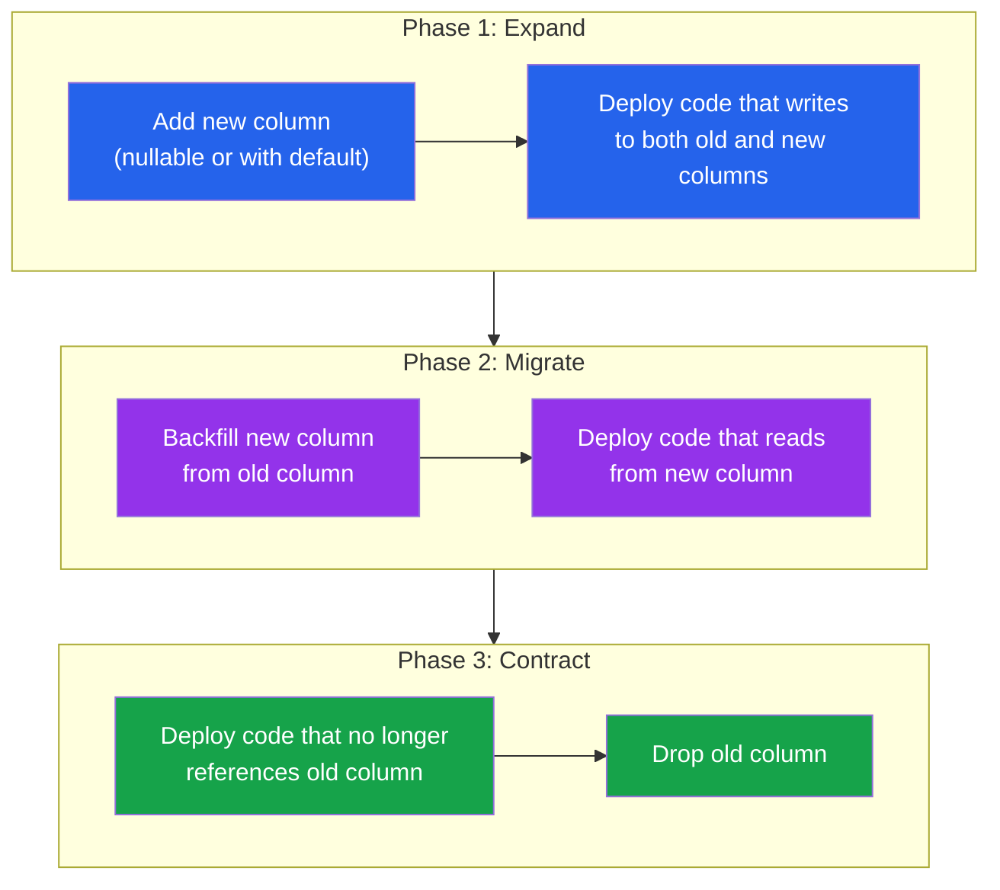

# [DEE-302] Backward-Compatible Schema Changes

:::info
Schema changes MUST be backward-compatible with the currently running application version. During a rolling deployment, old and new code coexist -- a breaking schema change will crash the old instances.
:::

## Context

In continuously deployed systems, application code and database schema do not change at the same instant. During a rolling deployment, both the old version (v1) and the new version (v2) of the application are running simultaneously, both reading from and writing to the same database. If a schema migration removes a column that v1 still reads, v1 crashes. If a migration renames a column, v1 queries fail with "column not found."

This problem is fundamental to any system where the database is shared across application instances that are not all upgraded atomically. Kubernetes rolling deployments, blue-green deployments, and canary releases all create a window where multiple application versions coexist.

The **expand-and-contract** pattern (also called **parallel change**) solves this by breaking every breaking change into a sequence of backward-compatible steps. First, **expand** the schema by adding new structures alongside the old ones. Then, **migrate** application code to use the new structures while maintaining compatibility with both. Finally, **contract** the schema by removing the old structures once no running code references them.

## Principle

- Schema changes MUST be backward-compatible with the currently running application version.
- Breaking changes MUST be decomposed into a sequence of non-breaking steps using the expand-and-contract pattern.
- A column or table MUST NOT be dropped until all application versions that reference it have been fully decommissioned.
- Developers SHOULD classify every DDL operation as safe or unsafe before writing the migration.

## Visual



**Key insight:** Each phase is a separate deployment. At no point does old code break, because the schema always supports both the old and new application versions during the transition.

## Example

### Adding a Column (Safe)

Adding a nullable column with no default is safe -- old code simply ignores the new column:

```sql
-- Migration: safe, backward-compatible
ALTER TABLE users ADD COLUMN phone VARCHAR(20);
```

Old code does not `SELECT phone` and does not `INSERT` into it, so nothing breaks. New code can begin reading and writing the column immediately.

### Renaming a Column (Unsafe -- Use Expand-and-Contract)

Renaming `users.name` to `users.full_name` in a single step breaks all code referencing `name`:

```sql
-- UNSAFE: breaks v1 code immediately
ALTER TABLE users RENAME COLUMN name TO full_name;
```

**Expand-and-contract approach (3 deployments):**

```sql
-- Deployment 1: EXPAND -- add new column, dual-write trigger
ALTER TABLE users ADD COLUMN full_name VARCHAR(255);

-- Backfill existing rows
UPDATE users SET full_name = name WHERE full_name IS NULL;

-- Create trigger to keep columns in sync
CREATE OR REPLACE FUNCTION sync_user_name() RETURNS trigger AS $$
BEGIN
    IF NEW.full_name IS NULL THEN
        NEW.full_name := NEW.name;
    END IF;
    IF NEW.name IS NULL THEN
        NEW.name := NEW.full_name;
    END IF;
    RETURN NEW;
END;
$$ LANGUAGE plpgsql;

CREATE TRIGGER trg_sync_user_name
    BEFORE INSERT OR UPDATE ON users
    FOR EACH ROW EXECUTE FUNCTION sync_user_name();
```

```sql
-- Deployment 2: MIGRATE -- new code reads from full_name
-- (application code change, no DDL needed)
-- Once all instances are on the new code version, proceed.
```

```sql
-- Deployment 3: CONTRACT -- remove old column and trigger
DROP TRIGGER trg_sync_user_name ON users;
DROP FUNCTION sync_user_name();
ALTER TABLE users DROP COLUMN name;
```

### Removing a Column (Multi-Step)

Dropping `users.middle_name`:

```sql
-- Step 1: Deploy code that no longer reads or writes middle_name
-- (application code change only -- no migration)

-- Step 2: After all old instances are decommissioned, drop the column
ALTER TABLE users DROP COLUMN middle_name;
```

If you drop the column before step 1, any old instance still running will crash with `ERROR: column "middle_name" does not exist`.

## Safe vs. Unsafe Operations

| Operation | Safe? | Notes |
|-----------|-------|-------|
| `ADD COLUMN` (nullable, no default) | Safe | Old code ignores the new column |
| `ADD COLUMN` (with default, PG 11+) | Safe | PostgreSQL 11+ does not rewrite the table |
| `ADD COLUMN ... NOT NULL` (no default) | Unsafe | Fails if existing rows have NULLs; blocks writes on older PostgreSQL |
| `DROP COLUMN` | Unsafe | Breaks any code still referencing the column |
| `RENAME COLUMN` | Unsafe | Breaks all queries using the old name |
| `RENAME TABLE` | Unsafe | Breaks all queries using the old table name |
| `ALTER COLUMN TYPE` (compatible cast) | Caution | `VARCHAR(50)` to `VARCHAR(100)` is safe; `VARCHAR` to `INTEGER` is not |
| `ALTER COLUMN TYPE` (incompatible cast) | Unsafe | Requires expand-and-contract |
| `ADD INDEX` | Safe | Use `CONCURRENTLY` to avoid locking (see [DEE-303](303.md)) |
| `DROP INDEX` | Safe | Queries may slow down but will not break |
| `ADD FOREIGN KEY` | Caution | Validates existing data; use `NOT VALID` then `VALIDATE CONSTRAINT` separately |
| `ADD CHECK CONSTRAINT` | Caution | Use `NOT VALID` then `VALIDATE CONSTRAINT` in two steps |
| `ADD NOT NULL` (to existing column) | Unsafe | Use `CHECK` constraint with `NOT VALID`, then validate |

## Common Mistakes

1. **Dropping columns before code stops using them.** The most common cause of deployment failures. The old application version queries `SELECT name FROM users`, the migration drops `name`, and every old instance crashes. Always deploy the code change first, wait for full rollout, then drop the column in a subsequent release.

2. **Adding NOT NULL without a default.** `ALTER TABLE users ADD COLUMN status VARCHAR(20) NOT NULL` fails immediately if the table has any existing rows (no value to fill). Even if the table is empty now, it may not be by the time the migration runs in production. Always provide a default or add the column as nullable first.

3. **Renaming in one step.** `RENAME COLUMN` is never backward-compatible. Use the expand-and-contract pattern: add the new column, dual-write, migrate reads, then drop the old column.

4. **Changing column types without checking compatibility.** Widening a `VARCHAR(50)` to `VARCHAR(100)` is safe. But changing `VARCHAR` to `INTEGER`, `TEXT` to `JSONB`, or narrowing `VARCHAR(100)` to `VARCHAR(50)` can fail on existing data or break application code that expects the old type.

5. **Assuming migrations run before new code.** In some deployment strategies, new code starts before migrations complete. Design migrations to be safe regardless of execution order -- adding a nullable column is safe whether code deploys first or second.

6. **Forgetting to clean up expanded schemas.** The expand phase adds temporary columns, triggers, or views. If the contract phase is never executed, the schema accumulates dead weight. Track expand-and-contract migrations and schedule the contract step.

## Related DEEs

- [DEE-300](300.md) Schema Evolution Overview
- [DEE-301](301.md) Migration Fundamentals -- versioned migration basics
- [DEE-303](303.md) Zero-Downtime Migrations -- avoiding locks during schema changes
- [DEE-304](304.md) Data Backfilling Strategies -- populating new columns after expansion

## References

- [Martin Fowler: Parallel Change](https://martinfowler.com/bliki/ParallelChange.html) -- the expand-and-contract pattern described as "parallel change"
- [Prisma Data Guide: Expand and Contract Pattern](https://www.prisma.io/dataguide/types/relational/expand-and-contract-pattern) -- practical walkthrough of expand-and-contract
- [PlanetScale: Backward Compatible Database Changes](https://planetscale.com/blog/backward-compatible-databases-changes) -- classification of safe and unsafe operations
- [GoCardless: Zero-Downtime Postgres Migrations -- The Hard Parts](https://gocardless.com/blog/zero-downtime-postgres-migrations-the-hard-parts/) -- real-world production experience with backward-compatible changes
- [PostgreSQL Documentation: ALTER TABLE](https://www.postgresql.org/docs/current/sql-altertable.html) -- official reference for DDL operations and their behavior
- [Xata: pgroll Expand and Contract](https://xata.io/blog/pgroll-expand-contract) -- automated expand-and-contract tooling for PostgreSQL
