# [DEE-303] Zero-Downtime Migrations

:::info
Migrations on production tables MUST avoid long-held locks. A migration that locks a table for minutes is indistinguishable from an outage for every application querying that table.
:::

## Context

When you run `ALTER TABLE` or `CREATE INDEX` on a PostgreSQL table, the database acquires a lock. Depending on the operation, this lock may block all reads and writes (`ACCESS EXCLUSIVE`) or only writes (`SHARE` lock). On a table with millions of rows, the operation itself may take seconds to minutes. During that time, every query targeting the table queues behind the lock, connection pools fill up, and the application returns errors or timeouts.

MySQL has a similar problem. While MySQL's online DDL (`ALGORITHM=INPLACE`) can perform some operations without blocking DML, many operations still require a metadata lock that blocks queries during the prepare and commit phases. For large tables, even the "online" path can hold locks long enough to cause timeouts.

The solution is to use non-blocking migration techniques: `CREATE INDEX CONCURRENTLY` in PostgreSQL, `ALGORITHM=INPLACE` or external tools like gh-ost and pt-online-schema-change for MySQL, and careful structuring of `ALTER TABLE` statements to minimize lock duration.

## Principle

- Migrations on production tables MUST avoid long-held exclusive locks.
- Index creation on PostgreSQL MUST use `CREATE INDEX CONCURRENTLY` rather than plain `CREATE INDEX`.
- Large MySQL schema changes SHOULD use gh-ost, pt-online-schema-change, or native online DDL with verified lock behavior.
- Developers MUST test migration duration and locking behavior against production-sized data before deploying.
- Long-running migrations SHOULD set a `lock_timeout` to fail fast rather than block the entire application.

## Visual

```mermaid
flowchart TD
    subgraph Blocking["Blocking Migration"]
        B1["BEGIN"] --> B2["ALTER TABLE<br/>(ACCESS EXCLUSIVE lock)"]
        B2 --> B3["Table locked for<br/>duration of operation"]
        B3 --> B4["All queries queue"]
        B4 --> B5["COMMIT<br/>(lock released)"]
    end

    subgraph NonBlocking["Non-Blocking Migration"]
        N1["CREATE INDEX<br/>CONCURRENTLY"] --> N2["Phase 1: Snapshot<br/>(brief lock)"]
        N2 --> N3["Phase 2: Build index<br/>(no lock, reads/writes OK)"]
        N3 --> N4["Phase 3: Validate<br/>(brief lock)"]
        N4 --> N5["Index ready"]
    end

    style B2 fill:#dc2626,color:#fff
    style B3 fill:#dc2626,color:#fff
    style B4 fill:#dc2626,color:#fff
    style N1 fill:#16a34a,color:#fff
    style N2 fill:#2563eb,color:#fff
    style N3 fill:#16a34a,color:#fff
    style N4 fill:#2563eb,color:#fff
    style N5 fill:#16a34a,color:#fff
```



**Left:** A blocking `ALTER TABLE` holds an exclusive lock for the entire operation. All concurrent queries wait. **Right:** `CREATE INDEX CONCURRENTLY` takes only brief locks at the start and end, allowing normal operations throughout the build.

## Example

### PostgreSQL: CREATE INDEX CONCURRENTLY

```sql
-- WRONG: blocks all writes for the duration of the index build
CREATE INDEX idx_orders_customer ON orders (customer_id);

-- CORRECT: builds the index without blocking writes
CREATE INDEX CONCURRENTLY idx_orders_customer ON orders (customer_id);
```

Important caveats:
- `CONCURRENTLY` cannot run inside a transaction block. If your migration tool wraps migrations in `BEGIN ... COMMIT`, you must configure it to run this migration outside a transaction.
- If the concurrent build fails partway, it leaves an `INVALID` index. Check with `SELECT * FROM pg_indexes WHERE indexdef LIKE '%INVALID%'` and drop it before retrying.

### PostgreSQL: ALTER TABLE with Lock Timeout

```sql
-- Set a short lock timeout so the migration fails fast
-- rather than blocking the application
SET lock_timeout = '5s';

ALTER TABLE orders ADD COLUMN shipped_at TIMESTAMPTZ;

-- Reset timeout
RESET lock_timeout;
```

If another transaction holds a conflicting lock, the `ALTER TABLE` will fail after 5 seconds instead of waiting indefinitely. Retry during a quieter period.

### Splitting a Risky Migration Into Safe Steps

Adding a `NOT NULL` constraint on an existing column with default value:

```sql
-- Step 1: Add column as nullable (instant, brief lock)
ALTER TABLE orders ADD COLUMN priority INTEGER;

-- Step 2: Backfill existing rows in batches (no DDL lock)
-- See DEE-304 for batched backfill techniques
UPDATE orders SET priority = 0 WHERE priority IS NULL AND id BETWEEN 1 AND 10000;
UPDATE orders SET priority = 0 WHERE priority IS NULL AND id BETWEEN 10001 AND 20000;
-- ... continue in batches

-- Step 3: Add NOT NULL using a CHECK constraint (avoids full table scan lock)
ALTER TABLE orders ADD CONSTRAINT orders_priority_not_null
    CHECK (priority IS NOT NULL) NOT VALID;

-- Step 4: Validate the constraint (takes SHARE UPDATE EXCLUSIVE lock, not ACCESS EXCLUSIVE)
ALTER TABLE orders VALIDATE CONSTRAINT orders_priority_not_null;

-- Step 5 (optional): Convert to a proper NOT NULL
-- In PostgreSQL 12+, if a valid CHECK (col IS NOT NULL) exists,
-- SET NOT NULL does not re-scan the table
ALTER TABLE orders ALTER COLUMN priority SET NOT NULL;
ALTER TABLE orders DROP CONSTRAINT orders_priority_not_null;
```

### Tool Comparison: MySQL Online Schema Change

| Feature | Native Online DDL | pt-online-schema-change | gh-ost |
|---------|-------------------|------------------------|--------|
| **Mechanism** | In-place rebuild | Shadow table + triggers | Shadow table + binlog tailing |
| **Write blocking** | Brief lock at start/end | Minimal (trigger overhead) | Minimal (no triggers) |
| **Throttling** | None | Replica lag-based | Replica lag, load-based, manual |
| **Pausable** | No | No | Yes -- true pause, zero writes |
| **Foreign keys** | Supported | Supported | Not supported |
| **Requires** | MySQL 5.6+ | Percona Toolkit | Row-based replication |
| **Cut-over** | Automatic | Atomic `RENAME TABLE` | Manual, auditable |
| **Best for** | Simple operations | General use, FK tables | Write-heavy, large tables |

**Recommendation:** For PostgreSQL, use native features (`CONCURRENTLY`, `NOT VALID`, `lock_timeout`). For MySQL, start with native online DDL for simple operations; use pt-online-schema-change or gh-ost for large tables or operations that native DDL cannot handle without blocking.

## Common Mistakes

1. **Forgetting CONCURRENTLY.** A plain `CREATE INDEX` on a 100-million-row PostgreSQL table acquires a `SHARE` lock that blocks all writes for the entire build duration -- potentially minutes. Always use `CREATE INDEX CONCURRENTLY` in production. Configure your migration linter or CI check to flag non-concurrent index creation.

2. **Long-running transactions blocking DDL.** Even a non-blocking DDL statement needs a brief `ACCESS EXCLUSIVE` lock. If another transaction has been running for hours (an open `psql` session, a forgotten `BEGIN` without `COMMIT`), the DDL waits for that transaction to finish. Meanwhile, new queries stack up behind the DDL. Monitor for long-running transactions before running migrations.

3. **Not testing migration duration.** A migration that takes 50 milliseconds on a development database with 1,000 rows may take 10 minutes on a production table with 50 million rows. Always test against production-sized data -- either a restored backup or a staging environment with realistic volume.

4. **Running multiple DDL operations in one transaction.** Combining several `ALTER TABLE` statements in a single transaction holds the exclusive lock for the combined duration. Split them into separate migrations so each lock window is as short as possible.

5. **Not setting lock_timeout.** Without a `lock_timeout`, an `ALTER TABLE` will wait indefinitely for a conflicting lock. If a long-running query is holding a lock, the migration blocks, and every subsequent query stacks up. Set `lock_timeout` to a few seconds so the migration fails fast and can be retried.

6. **Ignoring failed concurrent index builds.** If `CREATE INDEX CONCURRENTLY` fails (due to a uniqueness violation or cancellation), it leaves an `INVALID` index behind. This index consumes space and slows writes but is never used for queries. Always check for and clean up invalid indexes after a failed build.

## Related DEEs

- [DEE-300](300.md) Schema Evolution Overview
- [DEE-301](301.md) Migration Fundamentals -- the migration lifecycle
- [DEE-302](302.md) Backward-Compatible Schema Changes -- ensuring schema changes do not break running code
- [DEE-304](304.md) Data Backfilling Strategies -- batched updates to avoid lock contention

## References

- [PostgreSQL Documentation: CREATE INDEX (CONCURRENTLY)](https://www.postgresql.org/docs/current/sql-createindex.html#SQL-CREATEINDEX-CONCURRENTLY) -- official reference for concurrent index builds
- [PostgreSQL Documentation: Explicit Locking](https://www.postgresql.org/docs/current/explicit-locking.html) -- lock types and their interactions
- [MySQL Documentation: Online DDL Operations](https://dev.mysql.com/doc/refman/8.4/en/innodb-online-ddl-operations.html) -- which ALTER TABLE operations MySQL can perform in-place
- [GitHub: gh-ost](https://github.com/github/gh-ost) -- GitHub's triggerless online schema migration tool for MySQL
- [Percona: pt-online-schema-change](https://docs.percona.com/percona-toolkit/pt-online-schema-change.html) -- Percona's trigger-based online schema change tool
- [Bytebase: gh-ost vs pt-online-schema-change](https://www.bytebase.com/blog/gh-ost-vs-pt-online-schema-change/) -- detailed comparison of MySQL online migration tools
- [GoCardless: Zero-Downtime Postgres Migrations -- The Hard Parts](https://gocardless.com/blog/zero-downtime-postgres-migrations-the-hard-parts/) -- practical production experience
