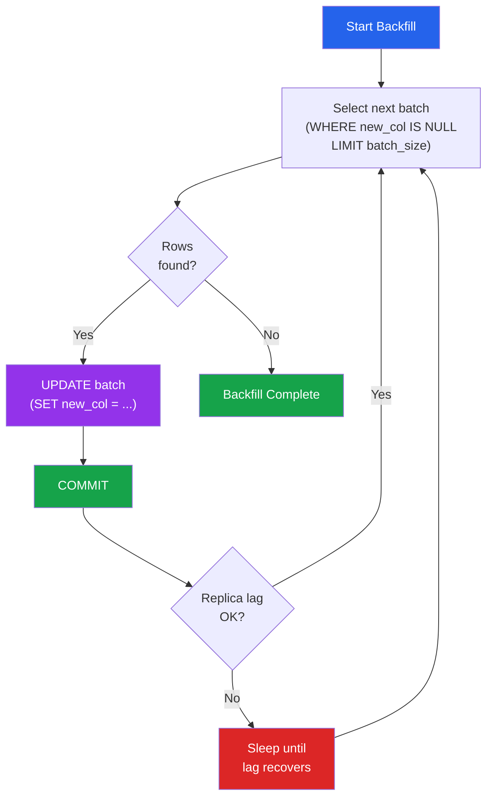

# [DEE-304] Data Backfilling Strategies

:::info
Backfills MUST be batched to avoid locking the entire table. A single `UPDATE ... SET column = value` on millions of rows holds locks, generates massive WAL/binlog traffic, and can take down replication.
:::

## Context

When you add a new column or change a data format, existing rows need to be populated with the new values. This is a backfill -- writing data to rows that were created before the schema change.

The naive approach is a single `UPDATE` statement: `UPDATE users SET full_name = name`. On a table with 10 million rows, this acquires row-level locks on every row, generates gigabytes of WAL (PostgreSQL) or binlog (MySQL) entries, bloats the table with dead tuples, and may cause replica lag to spike from seconds to hours. If the statement fails midway, all progress is lost and the entire operation must be restarted.

Batched backfills solve these problems by processing rows in small chunks -- typically 1,000 to 10,000 rows per batch -- with brief pauses between batches. Each batch is an independent transaction that locks only a small subset of rows, generates a manageable amount of WAL, and can be retried independently if it fails.

## Principle

- Backfills MUST be batched, processing a bounded number of rows per transaction.
- Each batch SHOULD be an independent, idempotent transaction so that failures do not lose previous progress.
- Backfill jobs SHOULD monitor replication lag and throttle or pause when lag exceeds safe thresholds.
- Backfills MUST NOT run inside the same transaction as DDL changes -- separate the schema migration from the data migration.
- Progress SHOULD be tracked so that a failed or interrupted backfill can resume from where it stopped.

## Visual



**Key insight:** Each batch is a separate transaction. Between batches, the job checks replication lag and pauses if needed. If the job crashes, it resumes from the first row where `new_col IS NULL`.

## Example

### Batched UPDATE with Primary Key Range

Using the primary key for batching avoids the performance pitfalls of `LIMIT/OFFSET`:

```sql
-- Find the range
SELECT MIN(id), MAX(id) FROM users;
-- min: 1, max: 10,000,000

-- Process in batches of 5,000
UPDATE users
SET full_name = first_name || ' ' || last_name
WHERE id BETWEEN 1 AND 5000
  AND full_name IS NULL;

UPDATE users
SET full_name = first_name || ' ' || last_name
WHERE id BETWEEN 5001 AND 10000
  AND full_name IS NULL;

-- ... continue in increments of 5,000
```

### Cursor-Based Batch Script (PostgreSQL)

```sql
DO $$
DECLARE
    batch_size INT := 5000;
    current_id BIGINT := 0;
    max_id BIGINT;
    rows_updated INT;
BEGIN
    SELECT MAX(id) INTO max_id FROM users;

    WHILE current_id < max_id LOOP
        UPDATE users
        SET full_name = first_name || ' ' || last_name
        WHERE id > current_id
          AND id <= current_id + batch_size
          AND full_name IS NULL;

        GET DIAGNOSTICS rows_updated = ROW_COUNT;
        RAISE NOTICE 'Updated % rows (id range % to %)',
            rows_updated, current_id + 1, current_id + batch_size;

        current_id := current_id + batch_size;
        COMMIT;

        -- Brief pause to reduce load
        PERFORM pg_sleep(0.1);
    END LOOP;
END $$;
```

### Background Worker Approach (Application Code)

For production backfills, an application-level worker provides better control:

```python
# Python example with SQLAlchemy
import time
from sqlalchemy import text

BATCH_SIZE = 5000
SLEEP_BETWEEN_BATCHES = 0.5  # seconds
MAX_REPLICA_LAG_SECONDS = 5

def get_replica_lag(session):
    """Check replication lag (PostgreSQL example)."""
    result = session.execute(text(
        "SELECT EXTRACT(EPOCH FROM (now() - pg_last_xact_replay_timestamp()))"
    )).scalar()
    return result or 0

def backfill_full_name(session):
    """Backfill users.full_name from first_name + last_name."""
    total_updated = 0
    last_id = 0

    while True:
        # Wait for replica lag to recover
        while get_replica_lag(session) > MAX_REPLICA_LAG_SECONDS:
            print(f"Replica lag too high, sleeping...")
            time.sleep(5)

        # Process one batch
        result = session.execute(text("""
            UPDATE users
            SET full_name = first_name || ' ' || last_name
            WHERE id > :last_id
              AND full_name IS NULL
            ORDER BY id
            LIMIT :batch_size
            RETURNING id
        """), {"last_id": last_id, "batch_size": BATCH_SIZE})

        rows = result.fetchall()
        if not rows:
            break  # No more rows to update

        session.commit()
        last_id = rows[-1][0]
        total_updated += len(rows)
        print(f"Updated {total_updated} rows (last_id={last_id})")

        time.sleep(SLEEP_BETWEEN_BATCHES)

    print(f"Backfill complete: {total_updated} rows updated")
```

### Dual-Write Pattern for Data Format Changes

When changing how data is stored (e.g., splitting `name` into `first_name` and `last_name`), the dual-write pattern ensures no data is lost during the transition:

```
Timeline:
  1. Add new columns (first_name, last_name) -- nullable
  2. Deploy code that writes to BOTH old (name) and new (first_name, last_name)
  3. Run backfill: populate first_name/last_name from name for old rows
  4. Deploy code that reads from new columns
  5. Deploy code that stops writing to old column
  6. Drop old column (name)
```

```sql
-- Step 1: Expand
ALTER TABLE users ADD COLUMN first_name VARCHAR(100);
ALTER TABLE users ADD COLUMN last_name VARCHAR(100);

-- Step 3: Backfill (batched)
UPDATE users
SET first_name = split_part(name, ' ', 1),
    last_name  = split_part(name, ' ', 2)
WHERE first_name IS NULL
  AND id BETWEEN 1 AND 5000;
-- ... repeat in batches
```

During steps 2-5, the application writes to both `name` and `first_name`/`last_name`, ensuring that rows created during the backfill window are populated in both formats.

## Common Mistakes

1. **Unbatched UPDATE on millions of rows.** `UPDATE users SET status = 'active'` on a 10-million-row table acquires 10 million row locks in a single transaction, generates gigabytes of WAL, and can cause the operation to run for minutes or hours while blocking other transactions. Always batch.

2. **No progress tracking.** If a backfill crashes at row 5,000,000 of 10,000,000 and there is no way to know where it stopped, the entire operation must restart from the beginning -- doubling the work and the risk. Track progress using the primary key cursor or a separate progress table.

3. **Not handling failures mid-backfill.** Each batch should be idempotent: if a batch is retried (e.g., due to a deadlock or timeout), it should produce the same result. Use `WHERE new_col IS NULL` or an equivalent predicate so that already-updated rows are skipped on retry.

4. **Ignoring replication lag.** A sustained backfill generating heavy write traffic can cause replicas to fall hours behind. If the application reads from replicas, users see stale data. Monitor lag between batches and pause when it exceeds your threshold (typically 5-10 seconds).

5. **Using LIMIT/OFFSET for batching.** `OFFSET 5000000 LIMIT 5000` requires the database to scan and skip 5 million rows before returning 5,000. As the offset grows, each batch becomes slower. Use primary key ranges (`WHERE id > last_processed_id ORDER BY id LIMIT 5000`) instead.

6. **Running backfills during peak traffic.** Even batched backfills add write load. Schedule large backfills during off-peak hours, or configure aggressive throttling (longer sleep between batches, lower batch size) when running during high traffic.

## Related DEEs

- [DEE-300](300.md) Schema Evolution Overview
- [DEE-302](302.md) Backward-Compatible Schema Changes -- the expand-and-contract pattern that triggers backfills
- [DEE-303](303.md) Zero-Downtime Migrations -- avoiding locks during schema changes
- [DEE-305](305.md) Schema Versioning -- tracking migration state

## References

- [GitLab: Batched Background Migrations](https://docs.gitlab.com/ee/development/database/batched_background_migrations.html) -- GitLab's framework for large-scale data backfills
- [Carwow Engineering: Backfilling 50 Million Records](https://medium.com/carwow-product-engineering/backfilling-50-million-records-quickly-eaa04ba5617f) -- real-world backfill at scale
- [Fly.io: Backfilling Data](https://fly.io/phoenix-files/backfilling-data/) -- practical batched backfill patterns
- [InfoQ: Shadow Table Strategy for Data Migrations](https://www.infoq.com/articles/shadow-table-strategy-data-migration/) -- shadow table approach for large migrations
- [PostgreSQL Documentation: UPDATE](https://www.postgresql.org/docs/current/sql-update.html) -- official UPDATE reference including RETURNING clause
- [TigerData: Low-Downtime Migrations with Dual-Write](https://www.tigerdata.com/docs/migrate/latest/dual-write-and-backfill) -- dual-write and backfill pattern documentation
