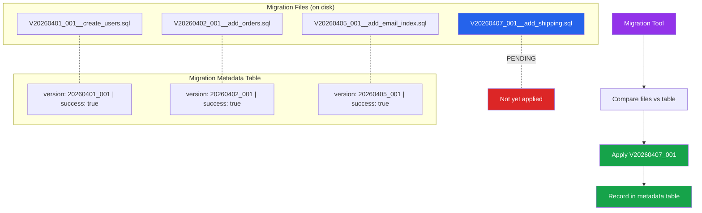

# [DEE-305] Schema Versioning

:::info
Schema version SHOULD be tracked in the database itself. A migration metadata table records which migrations have been applied, in what order, and whether they succeeded.
:::

## Context

When a migration tool runs, it needs to answer one question: which migrations have already been applied? Without a reliable answer, the tool might skip a migration (leaving the schema incomplete) or re-apply one (causing errors or data corruption).

Every mature migration tool solves this by maintaining a metadata table in the database:

| Tool | Table Name | Key Columns |
|------|-----------|-------------|
| Flyway | `flyway_schema_history` | `installed_rank`, `version`, `checksum`, `success` |
| Liquibase | `databasechangelog` | `id`, `author`, `filename`, `orderexecuted` |
| Alembic | `alembic_version` | `version_num` |
| Django | `django_migrations` | `app`, `name`, `applied` |
| ActiveRecord | `schema_migrations` | `version` |
| golang-migrate | `schema_migrations` | `version`, `dirty` |

This table is the source of truth. The tool compares the list of migration files on disk against the entries in the metadata table to determine which migrations are pending. If a migration is recorded as applied, it is skipped. If a migration file exists but has no corresponding record, it is applied next.

Beyond the metadata table, teams must also decide on a naming strategy for migration files. The two dominant approaches are **sequential numbering** (V1, V2, V3) and **timestamp-based naming** (20260407120000). Each has trade-offs, especially when multiple developers work on branches that introduce migrations concurrently.

## Principle

- Schema version SHOULD be tracked in the database itself using a migration metadata table managed by the migration tool.
- Teams MUST NOT manually edit the migration metadata table -- it is managed exclusively by the migration tool.
- Migration files SHOULD use timestamp-based naming to reduce conflicts when multiple branches introduce migrations.
- Failed migrations MUST be recorded so that teams can diagnose and fix them rather than silently re-trying.
- Teams SHOULD validate migration checksums on startup to detect unauthorized modifications to already-applied migration files.

## Visual



**Key insight:** The migration tool compares the files on disk against the metadata table. Only migrations without a corresponding "success" record are applied. After successful application, a new record is inserted.

## Example

### Migration Metadata Table Schema (Flyway-Style)

```sql
CREATE TABLE flyway_schema_history (
    installed_rank  INTEGER     NOT NULL PRIMARY KEY,
    version         VARCHAR(50),
    description     VARCHAR(200) NOT NULL,
    type            VARCHAR(20)  NOT NULL,  -- 'SQL', 'JDBC', 'BASELINE'
    script          VARCHAR(1000) NOT NULL,
    checksum        INTEGER,
    installed_by    VARCHAR(100) NOT NULL,
    installed_on    TIMESTAMP    NOT NULL DEFAULT now(),
    execution_time  INTEGER      NOT NULL,  -- milliseconds
    success         BOOLEAN      NOT NULL
);

CREATE INDEX idx_flyway_history_success
    ON flyway_schema_history (success);
```

After running migrations:

```
installed_rank | version      | description          | checksum   | success
1              | 1            | create_users         | -817269334 | true
2              | 2            | add_orders           |  491823745 | true
3              | 3            | add_email_index      | -112938475 | true
4              | 4            | add_shipping         |  738291045 | false   <-- failed
```

A `success = false` row tells the team that migration V4 was attempted and failed. The tool will not proceed past this version until the failure is resolved.

### Sequential vs. Timestamp-Based Naming

**Sequential:**
```
V1__create_users.sql
V2__add_orders.sql
V3__add_email_index.sql
```

**Timestamp-based:**
```
V20260401120000__create_users.sql
V20260402093000__add_orders.sql
V20260405141500__add_email_index.sql
```

| Aspect | Sequential | Timestamp-Based |
|--------|-----------|----------------|
| Readability | Clear ordering (V1, V2, V3) | Harder to read, but includes creation date |
| Branch conflicts | High -- two developers both create V4 | Low -- timestamps rarely collide |
| Merge resolution | Manual renumbering required | Usually auto-resolves |
| Tool support | All tools | All tools (treated as version strings) |

**Recommendation:** Use timestamp-based naming for teams with multiple active branches. Use sequential naming for solo developers or projects with a strict trunk-based workflow.

### Handling Concurrent Migrations from Branches

Consider two feature branches both adding migrations:

```
main:      V1 -- V2 -- V3
                      \
branch-A:              V20260407_A__add_phone.sql
                      \
branch-B:              V20260407_B__add_avatar.sql
```

With timestamp-based naming, both migrations have unique version identifiers and can be merged without conflict. The migration tool applies them in version order:

```
V20260407_A__add_phone.sql   (applied first, alphabetically)
V20260407_B__add_avatar.sql  (applied second)
```

With sequential naming (both branches create V4), merging causes a conflict that must be manually resolved by renumbering one migration.

### Locking to Prevent Concurrent Execution

Most migration tools use a lock to prevent two application instances from running migrations simultaneously:

```sql
-- Liquibase uses a separate lock table
CREATE TABLE databasechangeloglock (
    id          INTEGER     NOT NULL PRIMARY KEY,
    locked      BOOLEAN     NOT NULL,
    lockgranted TIMESTAMP,
    lockedby    VARCHAR(255)
);

-- Flyway uses an advisory lock or table-level lock
-- to prevent concurrent migration execution
SELECT pg_advisory_lock(123456789);
-- ... run migrations ...
SELECT pg_advisory_unlock(123456789);
```

This prevents race conditions where two application instances starting simultaneously both try to apply the same pending migration.

## Common Mistakes

1. **Conflicting migration order in branches.** Two developers on separate branches both create migration V4. When both branches merge to main, the tool sees two V4 files and fails. Use timestamp-based naming or a branch-aware naming convention to prevent collisions.

2. **Gaps in version sequence.** Some tools (notably Flyway in strict mode) reject migrations with gaps -- e.g., V1, V2, V5 (missing V3 and V4). This happens when a branch with V3 and V4 is abandoned after V5 was created on another branch. Configure the tool's gap handling (`ignoreMissingMigrations` in Flyway) or use a naming strategy that avoids this.

3. **Not recording failed migrations.** If a migration fails and no record is written, the tool will retry it on the next startup -- potentially on a partially-modified schema. Tools like Flyway record failures (`success = false`) so that the team must explicitly resolve the issue. Ensure your tool is configured to record failures.

4. **Manually editing the metadata table.** Inserting, updating, or deleting rows in the migration metadata table to "fix" a problem is dangerous. It desynchronizes the table from the actual schema state. If a fix is needed, use the migration tool's repair command (`flyway repair`, `alembic stamp`).

5. **Not validating checksums.** If someone modifies an already-applied migration file, the checksum stored in the metadata table no longer matches. Without checksum validation, this goes unnoticed, and the actual schema diverges from what the migration files describe. Enable checksum validation (it is on by default in Flyway and Liquibase).

6. **Skipping migration execution in some environments.** If staging runs migrations but production skips them (or vice versa), the environments diverge. Every environment -- development, staging, production -- must run the same migration sequence through the same tool.

## Related DEEs

- [DEE-300](300.md) Schema Evolution Overview
- [DEE-301](301.md) Migration Fundamentals -- the overall migration lifecycle
- [DEE-302](302.md) Backward-Compatible Schema Changes -- safe change patterns
- [DEE-304](304.md) Data Backfilling Strategies -- data migrations that depend on schema versions

## References

- [Flyway Documentation: Schema History Table](https://documentation.red-gate.com/flyway/flyway-concepts/migrations/flyway-schema-history-table) -- how Flyway tracks applied migrations
- [Liquibase Documentation: DATABASECHANGELOG Table](https://docs.liquibase.com/concepts/tracking-tables/databasechangelog-table.html) -- Liquibase's migration tracking table
- [Alembic Documentation: Tutorial](https://alembic.sqlalchemy.org/en/latest/tutorial.html) -- Alembic's version tracking with alembic_version table
- [Django Documentation: Migrations](https://docs.djangoproject.com/en/5.1/topics/migrations/) -- Django's django_migrations table and migration ordering
- [Rails Guides: Active Record Migrations](https://guides.rubyonrails.org/active_record_migrations.html) -- Rails schema_migrations table and timestamp-based naming
- [golang-migrate: README](https://github.com/golang-migrate/migrate) -- schema_migrations table with dirty flag for failure tracking
