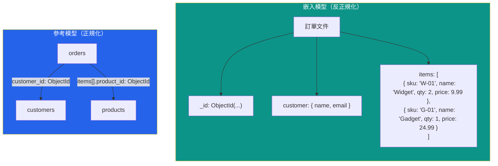

# [DEE-401] 文件存儲建模

:::info
圍繞存取模式來建模文件，而非實體關係。將一起讀取的資料嵌入同一文件；將共享的、大型的或獨立變更的資料以參考方式連結。
:::

## 背景

文件存儲（如 MongoDB、Couchbase 和 Amazon DocumentDB）將資料儲存為自包含的文件（通常是 JSON 或 BSON）。與關聯式資料庫將資料分解為正規化表格並透過 join 重組不同，文件資料庫鼓勵反正規化——將相關資料放在單一文件中，讓查詢能在一次讀取中取得所需的一切。

這種取捨是刻意的。關聯式正規化為寫入正確性和儲存效率而最佳化；文件嵌入則為讀取效能和結構彈性而最佳化。設計良好的文件可以消除多表 join、減少網路往返次數，並自然地對應到應用程式已在使用的物件。

然而，文件建模並非「把所有東西塞進一個文件」。MongoDB 有 16 MB 的 BSON 文件大小限制，無限增長的嵌入陣列是一個眾所周知的反模式，會導致寫入效能下降、工作集膨脹，並最終違反文件大小限制。核心技能在於知道何時嵌入、何時參考。

## 原則

- 你MUST圍繞應用程式的讀取方式來建模文件，而非照搬關聯式資料庫的實體關係圖。
- 你SHOULD嵌入總是一起讀取且大小有界、可預測的資料。
- 你SHOULD以參考方式連結在多個文件間共享的、大型的或獨立於父文件變更的資料。
- 你MUST NOT允許文件中的陣列無限增長。無限增長的陣列會降低索引效能、膨脹記憶體使用量，並有觸及 16 MB 文件限制的風險。
- 你SHOULD在參考查找所用的欄位上建立索引（`$lookup`、應用層 join）。

## 視覺化



## 範例

### 嵌入：帶有明細項目的訂單

當訂單總是與其明細項目一起顯示，且每筆訂單的項目數量有上限（例如最多 100 筆），嵌入是自然的選擇：

```json
{
  "_id": ObjectId("665a1f..."),
  "order_number": "ORD-2025-4821",
  "status": "shipped",
  "customer": {
    "name": "Alice Chen",
    "email": "alice@example.com",
    "shipping_address": {
      "street": "123 Main St",
      "city": "Taipei",
      "country": "TW"
    }
  },
  "items": [
    { "sku": "W-01", "name": "Widget", "qty": 2, "unit_price": 9.99 },
    { "sku": "G-01", "name": "Gadget", "qty": 1, "unit_price": 24.99 }
  ],
  "total": 44.97,
  "created_at": ISODate("2025-06-01T08:30:00Z")
}
```

單一 `findOne({ _id: ... })` 即可回傳訂單詳情頁面所需的一切。不需要 join，不需要多次往返。

### 參考：跨多筆訂單共享的產品

當產品被數千筆訂單參考，且產品資訊（價格、描述）獨立變更時：

```json
// products 集合
{
  "_id": ObjectId("665b2a..."),
  "sku": "W-01",
  "name": "Widget",
  "current_price": 10.99,
  "description": "A high-quality widget",
  "category": "hardware"
}

// orders 集合
{
  "_id": ObjectId("665a1f..."),
  "order_number": "ORD-2025-4821",
  "customer_id": ObjectId("665c3b..."),
  "items": [
    { "product_id": ObjectId("665b2a..."), "qty": 2, "unit_price": 9.99 },
    { "product_id": ObjectId("665b3c..."), "qty": 1, "unit_price": 24.99 }
  ],
  "created_at": ISODate("2025-06-01T08:30:00Z")
}
```

注意 `unit_price` 仍儲存在訂單項目上（銷售時的價格），而目前價格存放在產品文件中。`product_id` 參考僅在應用程式需要在訂單歷史旁顯示目前產品詳情時才使用。

### 嵌入 vs 參考決策表

| 因素 | 嵌入 | 參考 |
|------|------|------|
| **讀取模式** | 資料總是一起讀取 | 資料獨立讀取或選擇性讀取 |
| **資料大小** | 子文件小且有界 | 子文件大或無限增長 |
| **更新頻率** | 嵌入資料很少變更 | 相關資料頻繁且獨立變更 |
| **基數** | 一對少（例如 1 筆訂單：5 個項目） | 一對多或多對多（例如 1 個產品：10,000 筆訂單） |
| **資料共享** | 資料僅屬於此文件 | 資料在多個文件間共享 |
| **原子性需求** | 單一文件原子性即足夠 | 無論如何都需要多文件交易 |
| **文件增長** | 文件遠低於 16 MB | 有接近 16 MB 限制的風險 |

## 常見錯誤

| 錯誤 | 為何有害 | 修正方式 |
|------|---------|---------|
| **把 MongoDB 當關聯式資料庫用** —— 每個實體建一個集合，每次讀取都用 `$lookup` join | 消除了 MongoDB 的主要優勢（單文件讀取）。`$lookup` 是伺服器端 join，明顯慢於嵌入。 | 嵌入一起讀取的資料；將 `$lookup` 保留給臨時分析，而非主要存取路徑 |
| **無限陣列增長** —— 將每則留言、日誌條目或事件無限嵌入父文件 | 陣列持續增長直到文件達到 16 MB。即使在此之前，大型文件也會膨脹 WiredTiger 快取工作集並拖慢更新。 | 使用子集模式：嵌入最近的 N 筆項目；將完整歷史存放在獨立集合中 |
| **參考欄位未建索引** —— 儲存 `customer_id` 作為參考但從未建立索引 | 應用層 join 變成集合掃描。對未索引外鍵欄位的 `$lookup` 每個文件都是 O(n)。 | 對每個用作 join 目標的欄位建立索引：`db.orders.createIndex({ customer_id: 1 })` |
| **複製可變資料卻無同步策略** —— 為了讀取速度在每筆訂單中嵌入客戶地址，卻無法更新 | 當客戶搬家時，數百個訂單文件包含過時地址且無自動更新方式。 | 要嘛參考地址（如果需要目前地址），要嘛接受嵌入副本作為歷史快照（如果需要時間點準確性） |
| **為寫入密集工作負載過度嵌入** —— 將頻繁變更的資料嵌入大型父文件 | 每次更新嵌入子文件都會在 WiredTiger 中重寫整個父文件。在大型文件上，這會造成寫入放大。 | 將頻繁更新的資料參考到獨立集合；僅嵌入穩定或讀取密集的資料 |

## 相關 DEE

- [DEE-400](400.md) NoSQL 模式總覽
- [DEE-405](405.md) 選擇正確的 NoSQL 類型
- [DEE-12](../基礎概念/14.md) 關聯式 vs 非關聯式

## 參考資料

- [MongoDB Data Modeling Best Practices](https://www.mongodb.com/docs/manual/data-modeling/best-practices/) -- 官方結構設計指南
- [Embed Data in Your MongoDB Schema](https://www.mongodb.com/docs/manual/data-modeling/embedding/) -- 何時及如何嵌入
- [Reference Data in Your MongoDB Schema](https://www.mongodb.com/docs/manual/data-modeling/referencing/) -- 何時及如何參考
- [Avoid Unbounded Arrays -- MongoDB Docs](https://www.mongodb.com/docs/manual/data-modeling/design-antipatterns/unbounded-arrays/) -- 反模式文件
- [Schema Design Anti-Patterns -- MongoDB Docs](https://www.mongodb.com/docs/manual/data-modeling/design-antipatterns/) -- 全面反模式列表
