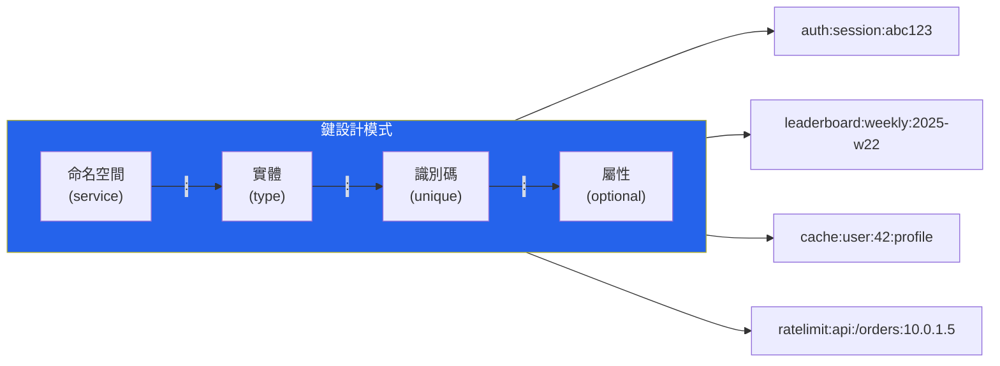

# [DEE-402] 鍵值存儲模式

:::info
為你的存取模式設計鍵；值的結構取決於存儲引擎的能力。使用一致的鍵命名慣例，對暫時性資料設定 TTL，並為每個使用情境選擇正確的資料結構。
:::

## 背景

鍵值存儲是最簡單的 NoSQL 資料庫類別：每筆記錄都是一個鍵（唯一字串）對應一個值（二進位大物件、字串或結構化資料型別）。這種簡潔性帶來了極致效能 —— Redis 通常能提供亞毫秒級的讀寫，DynamoDB 則在任何規模下都能提供個位數毫秒的延遲。

然而，此類別中的存儲引擎在功能上差異顯著。Redis 提供豐富的資料結構（字串、雜湊、列表、集合、有序集合、串流等），適用於快取、工作階段管理、排行榜、速率限制和即時分析。DynamoDB 透過排序鍵和次要索引擴展鍵值模型，支援在單一表格中處理複雜的存取模式。較簡單的存儲如 Memcached 或 etcd 僅提供不透明的字串值。

鍵的設計是最關鍵的決策。不同於關聯式資料庫可以事後添加索引，鍵值存儲幾乎完全透過鍵來存取。設計不良的鍵結構意味著你無法有效率地檢索所需的資料。

## 原則

- 你MUST在撰寫任何應用程式碼之前建立並執行鍵命名慣例。該慣例SHOULD使用分層命名空間搭配一致的分隔符（例如 `service:entity:id:attribute`）。
- 你MUST對暫時性資料（如工作階段、快取和速率限制計數器）設定 TTL（存活時間）。缺少 TTL 會導致記憶體無限增長，直到存儲耗盡記憶體或發生不可預測的驅逐。
- 你SHOULD為每個使用情境選擇適當的 Redis 資料結構，而非將所有東西序列化為字串。
- 你MUST NOT儲存超過存儲引擎設計容量的值（例如 Redis 值超過 512 MB、DynamoDB 項目超過 400 KB）。過大的值會增加延遲、記憶體碎片化和複製延遲。
- 你SHOULD設計鍵以避免熱點 —— 單一鍵承受不成比例的大量流量。

## 視覺化



## 範例

### Redis 工作階段存儲

將使用者工作階段儲存為帶有 TTL 的 Redis 雜湊。雜湊中的每個欄位都可以獨立讀取或更新，無需反序列化整個工作階段：

```redis
-- 建立帶有 30 分鐘 TTL 的工作階段
HSET auth:session:abc123 user_id 42 role "admin" login_at "2025-06-01T08:30:00Z"
EXPIRE auth:session:abc123 1800

-- 讀取單一欄位（無需反序列化）
HGET auth:session:abc123 user_id
-- "42"

-- 在活動時延長工作階段（滑動 TTL）
EXPIRE auth:session:abc123 1800

-- 登出時刪除工作階段
DEL auth:session:abc123
```

### Redis 有序集合排行榜

有序集合依分數維持元素排序，支援 O(log N) 插入和 O(log N + M) 範圍查詢（其中 M 是回傳元素數量）：

```redis
-- 記錄玩家分數
ZADD leaderboard:weekly:2025-w22 1500 "player:alice"
ZADD leaderboard:weekly:2025-w22 2300 "player:bob"
ZADD leaderboard:weekly:2025-w22 1800 "player:carol"

-- 前 3 名玩家（最高分優先）
ZREVRANGE leaderboard:weekly:2025-w22 0 2 WITHSCORES
-- 1) "player:bob"    2) "2300"
-- 3) "player:carol"  4) "1800"
-- 5) "player:alice"  6) "1500"

-- 玩家排名（從 0 開始，最高分優先）
ZREVRANK leaderboard:weekly:2025-w22 "player:carol"
-- 1

-- 原子性增加分數
ZINCRBY leaderboard:weekly:2025-w22 200 "player:alice"

-- 設定 TTL 自動過期舊排行榜
EXPIRE leaderboard:weekly:2025-w22 604800
```

### DynamoDB 單表設計基礎

DynamoDB 使用分區鍵（PK）和可選的排序鍵（SK）來組織資料。單表設計在一個表格中儲存多種實體類型，使用鍵前綴來區分：

```
PK                  SK                      Attributes
─────────────────   ─────────────────────   ──────────────────────────
USER#42             PROFILE                 { name: "Alice", email: "alice@ex.com" }
USER#42             ORDER#2025-06-01#001    { total: 44.97, status: "shipped" }
USER#42             ORDER#2025-06-15#002    { total: 19.99, status: "pending" }
PRODUCT#W-01        METADATA                { name: "Widget", price: 10.99 }
PRODUCT#W-01        REVIEW#2025-06-10#u42   { rating: 5, comment: "Great" }
```

啟用的存取模式：
- 取得使用者檔案：`PK = USER#42, SK = PROFILE`
- 列出使用者訂單：`PK = USER#42, SK begins_with ORDER#`
- 取得日期範圍內的訂單：`PK = USER#42, SK between ORDER#2025-06-01 and ORDER#2025-06-30`

### Redis 資料結構選擇指南

| 資料結構 | 適用時機 | 範例使用情境 | 關鍵操作 |
|---------|---------|-------------|---------|
| **String** | 簡單值、計數器、序列化物件 | 頁面瀏覽計數器、快取的 JSON 回應 | `GET`, `SET`, `INCR`, `SETNX` |
| **Hash** | 具有命名欄位且需獨立讀取/更新的物件 | 使用者工作階段、產品詳情 | `HGET`, `HSET`, `HMGET`, `HINCRBY` |
| **List** | 有序序列、佇列、最近項目 | 任務佇列、動態消息（最近 N 筆項目） | `LPUSH`, `RPOP`, `LRANGE`, `LTRIM` |
| **Set** | 唯一成員資格、標籤、交集/聯集 | 使用者角色、線上使用者、標籤篩選 | `SADD`, `SISMEMBER`, `SINTER`, `SUNION` |
| **Sorted Set** | 排名資料、時間序列視窗、優先佇列 | 排行榜、速率限制器（滑動視窗） | `ZADD`, `ZRANGE`, `ZREVRANK`, `ZINCRBY` |
| **Stream** | 僅附加事件日誌搭配消費者群組 | 事件溯源、訊息代理 | `XADD`, `XREAD`, `XREADGROUP` |

## 常見錯誤

| 錯誤 | 為何有害 | 修正方式 |
|------|---------|---------|
| **熱鍵** —— 單一鍵（例如全域計數器、熱門快取條目）承受大部分流量 | 在 Redis 中，對一個鍵的所有操作都是序列化的。在 DynamoDB 中，熱分區鍵會節流該分區中的所有項目。 | 分片熱鍵（例如 `counter:{0..N}` 搭配隨機分片的 `INCRBY`，讀取時加總）。在 DynamoDB 中，使用計算後綴的寫入分片。 |
| **暫時性資料缺少 TTL** —— 工作階段、快取和暫時資料沒有過期設定 | 記憶體無限增長。Redis 驅逐策略（`allkeys-lru`、`volatile-lru`）是安全網，不是設計策略。存儲最終會 OOM 或驅逐重要資料。 | 對每個暫時性鍵設定明確的 TTL：`EXPIRE key seconds` 或 `SET key value EX seconds`。 |
| **過大的值** —— 在 Redis 或 DynamoDB 中儲存多 MB 的二進位大物件（圖片、PDF、完整 HTML 頁面） | 過大的值會增加網路延遲、記憶體碎片化和複製延遲。在 DynamoDB 中，超過 400 KB 的項目會被拒絕。 | 將大型二進位物件存放在物件存儲（S3）；在鍵值存儲中僅存放中繼資料或參考 URL。 |
| **無鍵命名慣例** —— 臨時鍵名如 `u42`、`bob_session`、`data` | 鍵變得無法管理、除錯或監控。你無法使用 `SCAN` 模式來找到相關鍵。服務之間會發生命名空間衝突。 | 在第一天就定義慣例（例如 `service:entity:id`）並在程式碼審查中執行。 |
| **在 Redis 中將所有東西序列化為 JSON 字串** | 失去原子性地獨立更新個別欄位的能力。每次更新都需要完整的讀取-修改-寫入循環。 | 使用 Hash 處理物件、Sorted Set 處理排名資料、Set 處理成員資格 —— 善用 Redis 原生結構。 |

## 相關 DEE

- [DEE-400](400.md) NoSQL 模式總覽
- [DEE-405](405.md) 選擇正確的 NoSQL 類型
- [DEE-11](12.md) CAP 定理

## 參考資料

- [Redis Data Structures](https://redis.io/technology/data-structures/) -- Redis 所有資料型別的官方概覽
- [Redis Coding Patterns](https://redis.io/docs/latest/develop/clients/patterns/) -- 官方客戶端設計模式
- [Best Practices for DynamoDB Partition Keys -- AWS Docs](https://docs.aws.amazon.com/amazondynamodb/latest/developerguide/bp-partition-key-design.html) -- 分區鍵設計指南
- [The What, Why, and When of Single-Table Design with DynamoDB -- Alex DeBrie](https://www.alexdebrie.com/posts/dynamodb-single-table/) -- 全面的單表設計指南
- [Redis Key Design and Naming Conventions](https://oneuptime.com/blog/post/2026-01-21-redis-key-design-naming/view) -- 鍵命名最佳實踐
