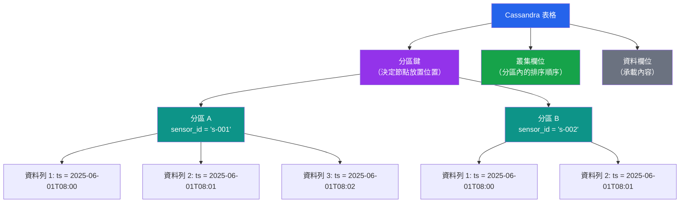

# [DEE-403] 列族建模

:::info
圍繞查詢而非實體來建模表格。在像 Apache Cassandra 這樣的列族存儲中，你為每個查詢模式設計一個表格、接受反正規化，並讓分區鍵和叢集欄位組織資料以實現高效讀取。
:::

## 背景

列族資料庫（也稱為寬欄存儲）—— 包括 Apache Cassandra、ScyllaDB 和 Google Bigtable —— 專為大量寫入吞吐量、水平擴展和跨資料中心的高可用性而設計。它們透過使用分區鍵將資料分散到叢集中，並使用叢集欄位在每個分區內組織資料列。

資料模型與關聯式資料庫有本質上的不同。在關聯式資料庫中，你將資料正規化為實體，然後撰寫帶有 join 的查詢來回答問題。在 Cassandra 中，你從需要回答的查詢開始，為每個查詢專門設計一個表格。Join 不存在。反正規化不是妥協 —— 而是預期的設計方法。

資料按層級組織：**分區鍵**決定哪個節點存放資料，**叢集欄位**決定該分區內資料列的排序順序。讀取單一分區的查詢是 Cassandra 能執行的最高效操作。跨越多個分區的查詢（scatter-gather）代價高昂，在延遲敏感的路徑上應避免使用。

Cassandra 最佳實踐建議將分區保持在 100 MB 磁碟大小和 100,000 列以下。超過這些限制會造成壓縮壓力、增加讀取延遲，以及修復期間潛在的堆積記憶體壓力。

## 原則

- 你MUST在設計表格前識別所有查詢模式。每個主要存取模式通常對應一個專屬表格。
- 你MUST選擇能將資料均勻分散到叢集中且不會無限增長的分區鍵。
- 你SHOULD使用叢集欄位在分區內排序資料，讓範圍查詢（例如時間範圍）更有效率。
- 你MUST NOT使用次要索引來替代適當的表格設計。Cassandra 中的次要索引需要對所有節點進行 scatter-gather 查詢，在規模化時效能不佳。
- 你SHOULD接受反正規化並跨表格複製資料以服務不同的查詢模式。在 Cassandra 中寫入是廉價的；跨分區讀取是昂貴的。

## 視覺化



## 範例

### 時間序列感測器資料

**查詢**：「取得感測器 X 在時間 T1 到 T2 之間的所有讀數。」

```cql
CREATE TABLE sensor_readings (
    sensor_id    TEXT,
    reading_date DATE,
    reading_ts   TIMESTAMP,
    temperature  DOUBLE,
    humidity     DOUBLE,
    pressure     DOUBLE,
    PRIMARY KEY ((sensor_id, reading_date), reading_ts)
) WITH CLUSTERING ORDER BY (reading_ts DESC);
```

關鍵設計決策：
- **複合分區鍵** `(sensor_id, reading_date)` —— 按感測器和日期分散資料，防止任何單一分區無限增長（每個分區一天的讀數）。
- **叢集欄位** `reading_ts DESC` —— 最新讀數排在前面，符合最常見的查詢模式（最近讀數）。

```cql
-- 高效：單一分區讀取搭配叢集欄位的範圍查詢
SELECT * FROM sensor_readings
WHERE sensor_id = 's-001'
  AND reading_date = '2025-06-01'
  AND reading_ts >= '2025-06-01T08:00:00Z'
  AND reading_ts <= '2025-06-01T09:00:00Z';
```

### 使用者活動動態

**查詢 1**：「取得使用者 X 最新的 20 筆活動。」
**查詢 2**：「取得使用者 X 在特定日期的所有活動。」

```cql
CREATE TABLE user_activity (
    user_id      UUID,
    activity_date DATE,
    activity_ts  TIMESTAMP,
    activity_type TEXT,
    details      TEXT,
    PRIMARY KEY ((user_id, activity_date), activity_ts)
) WITH CLUSTERING ORDER BY (activity_ts DESC);
```

```cql
-- 今天的最新活動
SELECT * FROM user_activity
WHERE user_id = 550e8400-e29b-41d4-a716-446655440000
  AND activity_date = '2025-06-15'
LIMIT 20;
```

### 與關聯式的比較：每個查詢模式一個表格

| 關聯式方法 | Cassandra 方法 |
|-----------|---------------|
| 一個 `orders` 表格，使用不同的 `WHERE` 子句和 `JOIN` 查詢 | `orders_by_customer` 表格用於「依客戶取得訂單」 |
| 同一表格，不同索引 | `orders_by_status` 表格用於「依狀態取得訂單」 |
| 同一表格，不同 join | `orders_by_date` 表格用於「依日期範圍取得訂單」 |
| 正規化以避免冗餘 | 跨三個表格複製訂單資料 |
| 新增索引以支援新查詢 | 為新查詢模式建立新表格 |

在 Cassandra 中，反正規化的儲存成本與跨分區查詢的延遲成本相比微不足道。

## 常見錯誤

| 錯誤 | 為何有害 | 修正方式 |
|------|---------|---------|
| **無限分區增長** —— 僅使用 `sensor_id` 作為時間序列資料的分區鍵 | 單一感測器的分區永遠增長。大型分區造成壓縮壓力、GC 暫停和讀取緩慢。 | 在分區鍵中加入時間分桶（例如 `(sensor_id, reading_date)`）以限制分區大小 |
| **過多的小分區** —— 使用高基數的叢集欄位作為分區鍵的一部分 | 每個查詢需要讀取許多微小分區（scatter-gather）。讀取延遲隨分區數量線性增長。 | 設計分區鍵使單一查詢從一個分區讀取。將高基數欄位移到叢集欄位。 |
| **過度依賴次要索引** —— 使用 `CREATE INDEX` 來避免建立新表格 | Cassandra 中的次要索引是本地索引，需要查詢每個節點。它們適用於低基數欄位和小結果集，但在規模化時會失效。 | 為查詢模式建立專屬表格。謹慎使用實體化視圖（它們有已知的一致性問題）。 |
| **關聯式思維** —— 將資料正規化到不同表格並嘗試多表查詢 | Cassandra 沒有 join。從多個表格讀取需要多次往返，增加延遲和失敗機率。 | 積極反正規化。將資料寫入每個需要它的表格。僅在為同一分區鍵維護反正規化表格的一致性時使用批次（`LOGGED BATCH`）。 |
| **在生產查詢中使用 `ALLOW FILTERING`** | `ALLOW FILTERING` 強制執行全表掃描。它是為臨時探索而存在的，不是為生產工作負載。 | 重新設計表格，使查詢能僅靠分區鍵 + 叢集欄位限制來完成。 |

## 相關 DEE

- [DEE-400](400.md) NoSQL 模式總覽
- [DEE-405](405.md) 選擇正確的 NoSQL 類型
- [DEE-11](12.md) CAP 定理

## 參考資料

- [Apache Cassandra Data Modeling Introduction](https://cassandra.apache.org/doc/3.11/cassandra/data_modeling/intro.html) -- 官方資料建模文件
- [Evaluating and Refining Data Models -- Apache Cassandra Docs](https://cassandra.apache.org/doc/4.0/cassandra/data_modeling/data_modeling_refining.html) -- 基於分區和大小的模型精煉
- [Best Practices for Data Modeling in Cassandra -- DataStax Docs](https://docs.datastax.com/en/cql/hcd/data-modeling/best-practices.html) -- DataStax 最佳實踐
- [Apache Cassandra Data Modeling Best Practices -- Instaclustr](https://www.instaclustr.com/blog/cassandra-data-modeling/) -- 含範例的實用建模指南
- [Cassandra Partition Key -- ScyllaDB Glossary](https://www.scylladb.com/glossary/cassandra-partition-key/) -- 分區鍵設計概念
