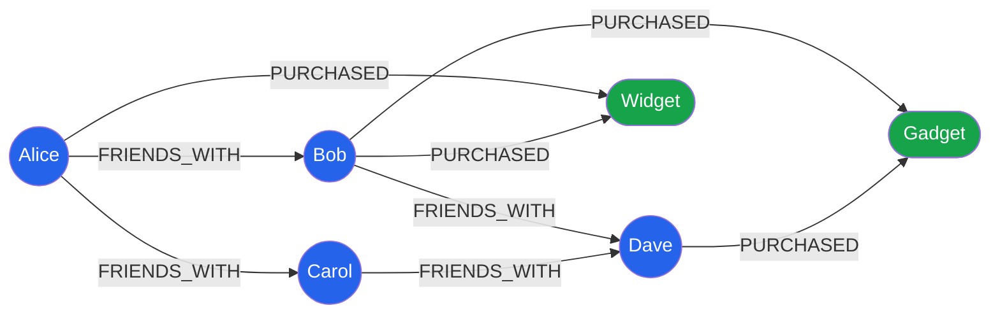

# [DEE-404] 圖形資料庫建模

:::info
當關係是主要的查詢目標時使用圖形資料庫。圖形模型擅長可變深度的遍歷和關係密集的查詢，這些在關聯式資料庫中需要複雜的遞迴 join。
:::

## 背景

圖形資料庫（如 Neo4j、Amazon Neptune 和 TigerGraph）將資料儲存為節點（實體）和關係（實體之間的邊），兩者都可以攜帶屬性。不同於關聯式資料庫中關係是隱含的（以外鍵表示，透過 join 解析），圖形資料庫將關係視為一等公民，擁有自己的識別、方向、類型和屬性。

圖形資料庫的根本優勢是**免索引鄰接**：每個節點直接參考其鄰居，因此遍歷一個關係是常數時間的指標查找，不受圖形總大小影響。在關聯式資料庫中，找到「朋友的朋友的朋友」需要在一個可能龐大的表格上執行三次自我 join。在圖形資料庫中，這是一個三跳遍歷，以毫秒級執行。

Cypher 是 Neo4j 的宣告式查詢語言，使用 ASCII 藝術語法來表達圖形模式：`(a)-[r:KNOWS]->(b)` 可以自然地讀作「節點 a 有一個 KNOWS 關係指向節點 b」。這種視覺化語法使複雜的遍歷出奇地易讀。

圖形資料庫不是關聯式或文件資料庫的通用替代品。它們是為關係密集的資料而專門打造的，其中連接的深度和方向是主要的查詢關注點。

## 原則

- 你SHOULD在主要查詢涉及遍歷可變或未知深度的關係時使用圖形資料庫（例如最短路徑、推薦、詐欺偵測、存取控制）。
- 你MUST將節點建模為領域實體，將關係建模為它們之間有意義的連接。關係SHOULD有類型（動詞）且MAY攜帶屬性。
- 你SHOULD對 `MATCH` 起點中使用的節點屬性建立索引。沒有索引的話，Cypher 查詢會退回到完整的標籤掃描。
- 你MUST NOT將圖形資料庫當作文件存儲使用 —— 在節點屬性中塞入大型 JSON 物件會違背圖形模型的初衷。
- 你SHOULD NOT在簡單的 CRUD 操作中選擇圖形資料庫，因為關係是淺層的（一層外鍵）。關聯式或文件資料庫更適合這類工作負載。

## 視覺化



## 範例

### 社群網路：朋友的朋友

找出 Alice 的朋友認識但 Alice 尚未認識的人（潛在好友推薦）：

```cypher
// 找出尚未成為 Alice 好友的朋友的朋友
MATCH (alice:Person {name: 'Alice'})-[:FRIENDS_WITH]->(friend)-[:FRIENDS_WITH]->(foaf)
WHERE foaf <> alice
  AND NOT (alice)-[:FRIENDS_WITH]->(foaf)
RETURN foaf.name AS recommended, COUNT(friend) AS mutual_friends
ORDER BY mutual_friends DESC
LIMIT 10;
```

在 SQL 中，這需要在 `friendships` 表格上進行多次自我 join：

```sql
-- 關聯式等價寫法（PostgreSQL）—— 更難閱讀和擴展
SELECT p.name, COUNT(DISTINCT mf.id) AS mutual_friends
FROM friendships f1
JOIN friendships f2 ON f1.friend_id = f2.person_id
JOIN persons p ON f2.friend_id = p.id
JOIN persons mf ON f1.friend_id = mf.id
WHERE f1.person_id = (SELECT id FROM persons WHERE name = 'Alice')
  AND f2.friend_id <> f1.person_id
  AND f2.friend_id NOT IN (
    SELECT friend_id FROM friendships
    WHERE person_id = f1.person_id
  )
GROUP BY p.name
ORDER BY mutual_friends DESC
LIMIT 10;
```

### 推薦引擎：協同過濾

找出購買了與 Alice 相同產品的人也購買的其他產品：

```cypher
// 「購買了 X 的人也購買了 Y」推薦
MATCH (alice:Person {name: 'Alice'})-[:PURCHASED]->(product)<-[:PURCHASED]-(other)
      -[:PURCHASED]->(rec)
WHERE NOT (alice)-[:PURCHASED]->(rec)
  AND rec <> product
RETURN rec.name AS recommended_product,
       COUNT(DISTINCT other) AS recommenders
ORDER BY recommenders DESC
LIMIT 5;
```

### 存取控制：權限遍歷

判斷使用者是否透過群組成員資格和角色繼承擁有資源的存取權限：

```cypher
// 檢查使用者是否對資源有 READ 權限（任何路徑）
MATCH path = (user:User {email: 'alice@example.com'})
             -[:MEMBER_OF*1..3]->(group:Group)
             -[:HAS_ROLE]->(role:Role)
             -[:GRANTS]->(perm:Permission {action: 'READ'})
             -[:ON]->(resource:Resource {name: 'secret-doc'})
RETURN path LIMIT 1;
```

這個單一查詢遍歷使用者 -> 群組（最多 3 層巢狀）-> 角色 -> 權限 -> 資源。在 SQL 中，這需要遞迴 CTE 和多次 join。

### 圖形優於關聯式的場景

| 場景 | 圖形優勢 | 關聯式限制 |
|------|---------|-----------|
| 可變深度遍歷（N 跳的朋友的朋友） | 透過免索引鄰接每跳成本固定 | 每增加一跳就多一次自我 join；成本呈指數增長 |
| 帶有關係屬性的多對多 | 關係是一等公民，擁有自己的屬性和類型 | 中介表格變得複雜；關係上的屬性需要額外欄位或表格 |
| 最短路徑 / 路徑搜尋 | 內建 `shortestPath()` 演算法 | 需要遞迴 CTE 或應用層 BFS，難以最佳化 |
| 靈活結構的連接 | 新的關係類型無需結構遷移 | 新的關係類型需要新的中介表格和外鍵約束 |
| 跨多種實體類型的模式匹配 | `MATCH (a)-[*1..5]->(b)` 遍歷最多 5 跳的任何路徑 | 多表 join 搭配 union，難以泛化 |

## 常見錯誤

| 錯誤 | 為何有害 | 修正方式 |
|------|---------|---------|
| **用圖形資料庫做簡單 CRUD** —— 基本的實體建立、檢索和更新，沒有遍歷查詢 | 圖形資料庫增加了複雜性（不同的查詢語言、不同的運維工具），在查詢不遍歷關係時沒有任何好處。 | 對簡單 CRUD 使用關聯式或文件資料庫。僅在遍歷查詢是主要使用情境時採用圖形資料庫。 |
| **未對節點屬性建立索引** —— MATCH 起點使用的屬性沒有索引 | 沒有屬性索引的話，`MATCH (p:Person {name: 'Alice'})` 會觸發所有 Person 節點的完整掃描。 | 對頻繁查詢的屬性建立索引：`CREATE INDEX FOR (p:Person) ON (p.name)` |
| **當作文件存儲使用** —— 在節點屬性中儲存大型 JSON 物件 | 大型屬性值違背了免索引鄰接的優勢，增加記憶體佔用。圖形變成了索引不良的文件存儲。 | 保持節點屬性小而純量。將大型內容存放在文件資料庫中，從圖形中參考它。 |
| **所有東西都建模為節點** —— 某些資料應該是屬性 | 過多的節點建立導致簡單屬性查找時不必要的遍歷。不是所有東西都值得成為節點。 | 如果資料不參與關係且僅作為其父項的一部分被存取，就將它設為屬性。 |
| **忽略關係方向** —— 在方向有意義時建立無方向的關係 | Cypher 在建立時要求指定方向。如果你隨意選擇方向，查詢會變得混亂且可能回傳錯誤結果。 | 根據領域語義建模方向（例如 `(a)-[:REPORTS_TO]->(b)` 表示 a 向 b 報告）。對於對稱關係，選擇一個慣例並在查詢中處理雙向。 |

## 相關 DEE

- [DEE-400](400.md) NoSQL 模式總覽
- [DEE-405](405.md) 選擇正確的 NoSQL 類型
- [DEE-12](../基礎概念/14.md) 關聯式 vs 非關聯式

## 參考資料

- [Neo4j Cypher Manual -- Basic Queries](https://neo4j.com/docs/cypher-manual/current/queries/basic/) -- 官方 Cypher 查詢語法
- [What is Cypher -- Neo4j Getting Started](https://neo4j.com/docs/getting-started/cypher/) -- Cypher 查詢語言簡介
- [Patterns in Practice -- Neo4j Getting Started](https://neo4j.com/docs/getting-started/cypher-intro/patterns-in-practice/index.html) -- 圖形模式匹配範例
- [Graph Modeling Guidelines -- Neo4j Docs](https://neo4j.com/docs/getting-started/data-modeling/guide-data-modeling/) -- 官方資料建模指南
- [Wikipedia: Graph database](https://en.wikipedia.org/wiki/Graph_database) -- 概述與歷史
