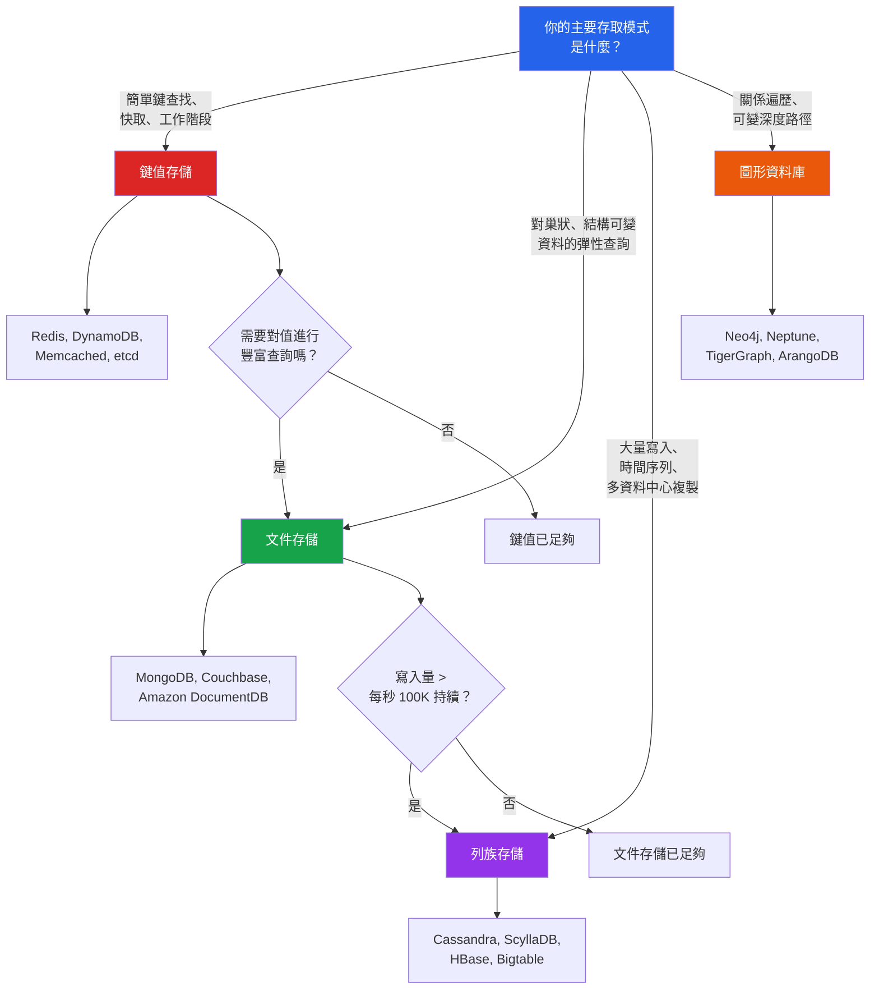

# [DEE-405] 選擇正確的 NoSQL 類型

:::info
根據你的資料模型和存取模式來選擇 NoSQL 資料庫類型，而非根據熱門程度或炒作。每種類型 —— 文件、鍵值、列族和圖形 —— 都針對特定類別的工作負載進行了最佳化。
:::

## 背景

NoSQL 領域提供四種主要資料庫類型，每種都圍繞不同的資料模型和存取模式設計：

- **文件存儲**（MongoDB、Couchbase）—— 彈性結構、巢狀資料、文件內豐富查詢。
- **鍵值存儲**（Redis、DynamoDB、Memcached）—— 依鍵簡單查找、極致吞吐量和低延遲。
- **列族存儲**（Cassandra、ScyllaDB、HBase）—— 大量寫入吞吐量、時間序列資料、跨資料中心水平擴展。
- **圖形資料庫**（Neo4j、Neptune、TigerGraph）—— 關係密集的資料、可變深度遍歷、路徑搜尋。

選擇錯誤的類型會造成摩擦，再多的應用層變通方案也無法解決。在文件存儲中強行做關係遍歷意味著在應用程式碼中建構圖形演算法。在列族存儲中強加彈性結構需求意味著對抗 CQL 嚴格的查詢模型。選錯的代價很高，因為在 NoSQL 類型之間遷移通常需要完全重新設計資料模型。

**多語言持久化**的概念 —— 在單一系統中使用多種資料庫類型，各自服務其最擅長的工作負載 —— 是一個成熟的模式。一個現代應用程式可能使用 Redis 做快取和工作階段、MongoDB 做產品目錄、Cassandra 做事件日誌，以及 Neo4j 做推薦查詢。

## 原則

- 你MUST在決定技術之前，將每個資料存取模式對應到原生支援它的資料庫類型。
- 你SHOULD在單一資料庫類型無法有效服務所有存取模式時考慮多語言持久化。
- 你MUST NOT僅根據熱門程度、團隊熟悉度或廠商行銷來選擇 NoSQL 資料庫，而不評估資料模型的適配性。
- 你SHOULD將營運複雜度（備份、監控、擴展、團隊專業知識）作為與技術適配性並列的首要選擇標準。
- 你MUST NOT假設任何單一 NoSQL 資料庫適合所有工作負載。「一體適用」的思維是 NoSQL 專案失敗最常見的原因。

## 視覺化

## 比較表

| 維度 | 文件存儲 | 鍵值存儲 | 列族存儲 | 圖形資料庫 |
|------|---------|---------|---------|-----------|
| **資料模型** | 巢狀 JSON/BSON 文件 | 不透明鍵值對（部分存儲提供結構化值） | 具分區鍵、叢集欄位和稀疏欄位的資料列 | 帶屬性的節點、有方向和類型的關係 |
| **查詢彈性** | 豐富：文件內的過濾、投影、聚合 | 最小：依鍵查找（DynamoDB 加入排序鍵 + 次要索引） | 中等：需要分區鍵，叢集欄位上的範圍查詢 | 豐富：模式匹配、可變深度遍歷、路徑搜尋 |
| **結構彈性** | 高：每個文件可以有不同結構 | 高：值對存儲是不透明的 | 低：表格結構一旦定義即固定（查詢優先設計） | 中等：節點/關係類型是彈性的，但索引必須明確 |
| **寫入吞吐量** | 中到高（每節點 10K-100K ops/sec） | 極高（每節點 100K+ ops/sec） | 極高（每節點 100K+ 持續寫入，線性擴展） | 中等（寫入涉及維護鄰接列表） |
| **讀取模式** | 單文件讀取、豐富查詢 | 單鍵查找、O(1) | 單分區讀取、分區內範圍掃描 | 遍歷：可變深度、最短路徑、模式匹配 |
| **水平擴展** | 分片（手動或自動） | 分區（DynamoDB 內建、Redis Cluster 手動） | 增加節點即線性擴展（設計內建） | 有限（大多數圖形資料庫透過副本擴展讀取，而非透過分片擴展寫入） |
| **一致性模型** | 可調（MongoDB：讀取/寫入關注層級） | 各異（Redis：複製的最終一致性；DynamoDB：每次讀取可選強一致或最終一致） | 每查詢可調（Cassandra：一致性層級） | 通常每筆交易 ACID（Neo4j） |
| **最適合** | 產品目錄、內容管理、使用者檔案、具可變酬載的 API | 快取、工作階段、排行榜、速率限制、功能旗標 | 事件日誌、IoT 時間序列、稽核軌跡、訊息系統 | 社群網路、推薦、詐欺偵測、知識圖譜、存取控制 |

## 範例場景

| 場景 | 建議類型 | 原因 |
|------|---------|------|
| 電商產品目錄，每個分類有不同屬性 | 文件（MongoDB） | 不同分類的產品有不同欄位（服飾有尺寸/顏色；電子產品有規格）。文件結構彈性自然處理這種情況。 |
| 10 萬同時線上使用者的 Web 應用程式工作階段管理 | 鍵值（Redis） | 工作階段以工作階段 ID 存取、閒置後過期，且需要亞毫秒級延遲。純鍵值存取模式。 |
| IoT 感測器資料：50,000 個感測器每秒回報 | 列族（Cassandra） | 持續 50K 寫入/秒、時間序列資料、按感測器 + 時間分桶分區、時間戳範圍查詢。Cassandra 的寫入最佳化 LSM-tree 儲存就是為此打造的。 |
| 社群網路的「你可能認識的人」功能 | 圖形（Neo4j） | 可變深度的朋友的朋友。Neo4j 中的 3 跳遍歷只需毫秒；同樣的查詢在 SQL 中需要在十億列表格上做 3 次自我 join。 |
| 分散式服務的設定鍵值存儲 | 鍵值（etcd / Consul） | 簡單鍵查找搭配強一致性和 watch/subscribe 機制監聽變更。不需要查詢彈性。 |
| 即時詐欺偵測（帳戶間異常交易模式） | 圖形（Neo4j / TigerGraph） | 偵測循環金流、空殼公司網路或異常連接模式需要遍歷帳戶、交易和實體的圖形。 |
| 金融系統的事件溯源 / 稽核軌跡 | 列族（Cassandra） | 僅附加寫入、不可變記錄、時間排序檢索、多資料中心複製以符合合規要求。 |
| 具中等流量和演進結構的 REST API 後端 | 文件（MongoDB） | 結構彈性支援快速迭代、豐富查詢支援 API 過濾/分頁、JSON 原生儲存帶來良好的開發體驗。 |

## 常見錯誤

| 錯誤 | 為何有害 | 修正方式 |
|------|---------|---------|
| **一體適用的思維** —— 為所有工作負載選擇同一個 NoSQL 資料庫 | 強迫工作負載適應不合適的資料模型。導致應用層的變通方案更慢、更多 bug 且更難維護。 | 將每個存取模式對應到最適合的資料庫類型。在合理的情況下擁抱多語言持久化。 |
| **根據熱門程度選擇** —— 「MongoDB 是最熱門的 NoSQL 資料庫，所以我們所有東西都用它」 | 熱門不代表適合。用 MongoDB 處理每秒 100K 寫入的時間序列或深度圖形遍歷，效能會不如專門的解決方案。 | 根據資料模型和存取模式評估，而非市場份額。 |
| **忽略營運複雜度** —— 選擇團隊無法維運的技術 | 需要專業維運知識的資料庫（Cassandra ring 管理、Neo4j 記憶體調校）如果團隊缺乏專業知識就會造成中斷。 | 將團隊專業知識、託管服務可用性（例如 DynamoDB、Amazon Neptune、Atlas）、監控工具和備份/還原複雜度納入考量。 |
| **過早的多語言持久化** —— 為簡單應用程式使用 5 種資料庫 | 每個資料庫增加營運開銷：監控、備份、容錯轉移、團隊訓練。對小團隊和簡單工作負載而言，一個選擇得當的資料庫更好。 | 從一個涵蓋大部分存取模式的資料庫開始。僅在特定工作負載明確超出主要存儲能力時才添加專門的資料庫。 |
| **忽略關聯式選項** —— 假設 NoSQL 對現代應用程式總是更好 | 許多工作負載（交易型、強一致性、大量臨時查詢）最適合用 PostgreSQL 或 MySQL。NoSQL 不是關聯式的升級；它是針對不同問題的不同工具。 | 在評估中始終納入關聯式資料庫。如果你的資料是結構化的、查詢是臨時的、規模是中等的，關聯式可能是最佳選擇。 |

## 相關 DEE

- [DEE-400](400.md) NoSQL 模式總覽
- [DEE-401](401.md) 文件存儲建模
- [DEE-402](402.md) 鍵值存儲模式
- [DEE-403](403.md) 列族建模
- [DEE-404](404.md) 圖形資料庫建模
- [DEE-11](../基礎概念/12.md) CAP 定理
- [DEE-12](../基礎概念/14.md) 關聯式 vs 非關聯式

## 參考資料

- [Types of NoSQL Databases and Key Criteria for Choosing Them -- TechTarget](https://www.techtarget.com/searchdatamanagement/feature/Key-criteria-for-choosing-different-types-of-NoSQL-databases) -- 決策標準概覽
- [Understand Data Store Models -- Azure Architecture Center](https://learn.microsoft.com/en-us/azure/architecture/data-guide/technology-choices/understand-data-store-models) -- Microsoft 的資料模型比較
- [NoSQL Database Comparison -- ScyllaDB](https://www.scylladb.com/learn/nosql/nosql-database-comparison/) -- 跨類型的技術比較
- [The What, Why, and When of Single-Table Design -- Alex DeBrie](https://www.alexdebrie.com/posts/dynamodb-single-table/) -- 何時鍵值搭配排序鍵即足夠
- [Wikipedia: NoSQL](https://en.wikipedia.org/wiki/NoSQL) -- 歷史背景與分類
