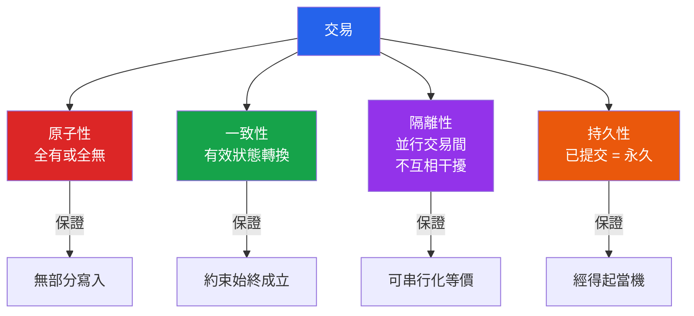

# [DEE-10] ACID 特性

:::info
ACID（Atomicity、Consistency、Isolation、Durability）定義了資料庫交易 MUST 提供的四項保證，以確保在錯誤、當機和並行存取情況下的資料有效性。
:::

## 背景

每個寫入資料的應用程式都面臨同一個根本問題：操作過程中出錯怎麼辦？銀行轉帳扣除了一個帳戶的款項，但伺服器在入帳到另一個帳戶之前當機了。兩個使用者在同一瞬間購買庫存中最後一件商品。電源在使用者點擊「儲存」後一毫秒內中斷。

ACID 特性就是這些問題的解答。Jim Gray 在 1981 年的論文「The Transaction Concept: Virtues and Limitations」中形式化了原子性、一致性和持久性的概念。1983 年，Theo Haerder 和 Andreas Reuter 在論文「Principles of Transaction-Oriented Database Recovery」中創造了 ACID 這個縮寫，並將隔離性作為明確的特性加入。

如今，ACID 合規性仍然是區分傳統關聯式資料庫（PostgreSQL、MySQL InnoDB、Oracle）與許多分散式和 NoSQL 系統的決定性特徵——後者為了可擴展性或可用性而放寬了一項或多項保證。對於任何設計資料正確性至關重要的系統的人來說，理解 ACID 不是可選的——它是推理資料完整性的基礎詞彙。

## 原則

資料庫系統 MUST 對任何宣告為交易的操作保證所有四項 ACID 特性：

- **原子性（Atomicity）** -- 交易 MUST 是全有或全無。交易中的每個操作要嘛全部成功完成，要嘛全部不生效。不存在部分執行。
- **一致性（Consistency）** -- 交易 MUST 將資料庫從一個有效狀態轉移到另一個有效狀態。所有已定義的規則——約束、級聯、觸發器——MUST 在交易完成後成立。
- **隔離性（Isolation）** -- 並行交易 MUST NOT 互相干擾。並行執行交易的結果 MUST 等價於這些交易的某種串行順序。
- **持久性（Durability）** -- 一旦交易被提交，其效果 MUST 即使在斷電、當機或其他系統故障的情況下依然持續。

開發者 SHOULD 理解隔離等級（Read Uncommitted、Read Committed、Repeatable Read、Serializable）代表嚴格性與效能之間的刻意權衡。PostgreSQL 的預設隔離等級是 Read Committed；MySQL InnoDB 是 Repeatable Read。開發者 MUST 根據一致性需求選擇適當的隔離等級，而非盲目依賴預設值。

## 圖解



## 範例

經典的銀行轉帳展示了四項特性如何協同運作：

```sql
-- 從帳戶 A 轉帳 $500 到帳戶 B
BEGIN;

-- 扣除來源帳戶
UPDATE accounts SET balance = balance - 500
 WHERE account_id = 'A'
   AND balance >= 500;  -- 一致性：強制非負餘額

-- 入帳目標帳戶
UPDATE accounts SET balance = balance + 500
 WHERE account_id = 'B';

-- 兩個更新要嘛都成功，要嘛都不生效（原子性）
-- 沒有其他交易能看到 A 已扣款但 B 尚未入帳的中間狀態（隔離性）
COMMIT;
-- COMMIT 返回後，轉帳能經得起當機（持久性）
```

### 隔離等級實務（PostgreSQL）

```sql
-- 預設：Read Committed
-- 每個語句只看到該語句開始前已提交的列
SET TRANSACTION ISOLATION LEVEL READ COMMITTED;

-- Repeatable Read
-- 交易看到第一個語句開始時的快照
SET TRANSACTION ISOLATION LEVEL REPEATABLE READ;

-- Serializable
-- 完全可串行化；資料庫會中止可能造成異常的交易
SET TRANSACTION ISOLATION LEVEL SERIALIZABLE;
```

### MySQL InnoDB 持久性設定

```sql
-- 完全 ACID 持久性（預設，最安全）
SET GLOBAL innodb_flush_log_at_trx_commit = 1;

-- 每秒刷新一次（較佳效能，有約 1 秒資料遺失風險）
SET GLOBAL innodb_flush_log_at_trx_commit = 2;
```

## 常見錯誤

1. **假設 ACID 意味著零並行問題。** ACID 保證取決於所選的隔離等級。在 Read Committed（PostgreSQL 預設）下，交易可以在語句之間看到不同的快照，導致不可重複讀。需要在交易內保持一致讀取的開發者 MUST 明確設定 Repeatable Read 或 Serializable 隔離。

2. **將長時間執行的操作包在單一交易中。** 大型交易持有鎖的時間更長，增加競爭和死鎖的機率。常見的反模式是將數百萬列的批次匯入包在一個交易中「以確保原子性」。應改為將工作拆分成較小的批次，並使用應用層冪等性來處理部分失敗。

3. **忽略持久性設定。** 在 MySQL 中設定 `innodb_flush_log_at_trx_commit = 0` 或 `= 2`，或在 PostgreSQL 中設定 `fsync = off`，會停用完全持久性。資料庫會在資料安全寫入磁碟之前就報告交易已提交。這對暫時性資料來說是適當的，但對財務或關鍵記錄來說很危險。

4. **混淆應用層一致性與資料庫一致性。** ACID 中的「C」指的是資料庫內的約束強制（外鍵、CHECK 約束、唯一索引）。僅在應用程式碼中強制的業務規則不受 ACID 保護。如果一個業務規則很重要，盡可能將其編碼為資料庫約束。

## 相關 DEE

- [DEE-11](11.md) CAP 定理 -- 分散式系統如何權衡一致性
- [DEE-12](12.md) 關聯式 vs 非關聯式 -- 並非所有資料庫都提供完整 ACID
- [DEE-100](100.md) 正規化 -- 一致性的結構基礎

## 參考資料

- Gray, J. (1981). "The Transaction Concept: Virtues and Limitations." Proceedings of the 7th International Conference on Very Large Data Bases. <https://jimgray.azurewebsites.net/papers/thetransactionconcept.pdf>
- Haerder, T. & Reuter, A. (1983). "Principles of Transaction-Oriented Database Recovery." ACM Computing Surveys, 15(4), 287-317. <https://dl.acm.org/doi/10.1145/289.291>
- PostgreSQL Documentation: Transaction Isolation. <https://www.postgresql.org/docs/current/transaction-iso.html>
- MySQL 8.4 Reference Manual: InnoDB and the ACID Model. <https://dev.mysql.com/doc/refman/8.4/en/mysql-acid.html>
- Wikipedia: ACID. <https://en.wikipedia.org/wiki/ACID>
