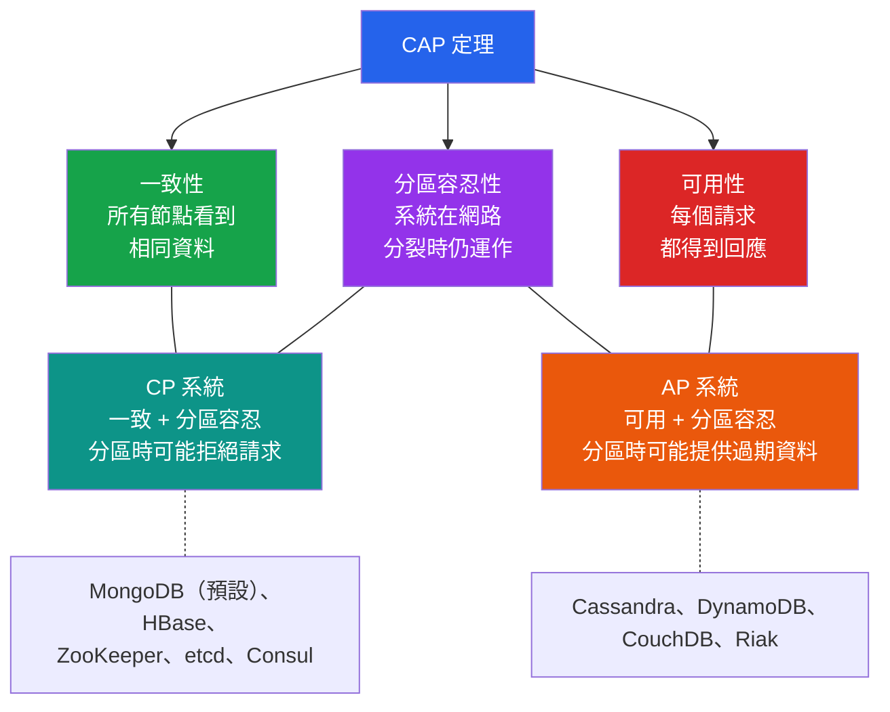

# [DEE-11] CAP 定理

:::info
CAP 定理指出，分散式資料存儲最多只能同時提供三項保證中的兩項：一致性、可用性和分區容忍性。
:::

## 背景

當資料庫運行在單一伺服器上時，ACID 特性相對容易實現。一旦資料被複製到多個節點——為了容錯、地理分佈或水平擴展——一個根本性的權衡就出現了。

2000 年，Eric Brewer 在 ACM 分散式計算原理研討會（PODC）上提出了 CAP 猜想，主張任何網路化共享資料系統最多只能滿足三項特性中的兩項：一致性、可用性和分區容忍性。2002 年，MIT 的 Seth Gilbert 和 Nancy Lynch 發表了正式證明，將其確立為定理。

三項特性分別是：

- **一致性（Consistency, C）** -- 每次讀取都接收到最近的寫入或錯誤。所有節點在同一時間看到相同的資料。
- **可用性（Availability, A）** -- 對非故障節點的每個請求都會收到回應，但不保證包含最新的寫入。
- **分區容忍性（Partition Tolerance, P）** -- 系統在任意訊息遺失或部分網路故障的情況下繼續運作。

由於網路分區在任何分散式系統中都是不可避免的，實際的選擇是在 CP（一致性 + 分區容忍性）和 AP（可用性 + 分區容忍性）之間。選擇 CP 的系統會在分區期間拒絕請求或回傳錯誤以維持一致性。選擇 AP 的系統會在分區期間繼續服務請求，但可能回傳過期資料。

Daniel Abadi 以 PACELC 定理（2010）擴展了 CAP，觀察到即使沒有分區，系統仍必須在延遲和一致性之間做選擇。PACELC 指出：如果發生分區（Partition），在可用性（Availability）和一致性（Consistency）之間選擇；否則（Else），在延遲（Latency）和一致性（Consistency）之間選擇。

## 原則

架構師 MUST 在選擇分散式資料庫之前理解 CAP 權衡。CP 和 AP 之間的選擇 SHOULD 由領域對過期讀取與不可用性的容忍度來驅動。

開發者 SHOULD NOT 將 CAP 視為資料庫的永久二元標籤。許多現代資料庫允許每查詢或每操作的一致性調整（例如 MongoDB 的讀寫關注、Cassandra 的一致性等級）。系統的有效 CAP 行為取決於其配置方式，而非僅取決於選擇了哪個產品。

開發者 MUST NOT 設計假設網路分區永遠不會發生的系統。分區容忍性在分散式環境中不是可選的——它是物理現實。

## 圖解



## 範例

### CP 行為：MongoDB 在分區期間

當 MongoDB 副本集失去主節點時，叢集會進行選舉。在選舉窗口期間（通常 10-12 秒），叢集拒絕寫入操作以維持一致性：

```
Client -> 寫入請求 -> 副本集（無主節點）
       <- 錯誤："not primary" / "no primary found"

-- 選舉完成後，寫入在新的主節點上恢復。
-- 在舊主節點停機前未複製的寫入會被回滾以維持一致性。
```

### AP 行為：Cassandra 在分區期間

Cassandra 繼續在所有可達節點上接受讀寫。分區修復後，衝突的寫入使用最後寫入勝出（依時間戳）來解決：

```
-- 一致性等級 ONE（AP 行為）：
Client -> 寫入到節點 A（可達）   -> 成功
Client -> 從節點 B 讀取（過期資料） -> 回傳舊值

-- 分區修復後：
-- 反熵修復使用時間戳調和差異
```

### 每操作調整一致性（Cassandra）

```cql
-- 關鍵讀取的強一致性（副本的法定多數必須一致）
SELECT * FROM orders WHERE order_id = 42
  USING CONSISTENCY QUORUM;

-- 非關鍵讀取的最終一致性（任何單一副本）
SELECT * FROM user_activity WHERE user_id = 7
  USING CONSISTENCY ONE;
```

### 實際場景 CP vs AP 決策表

| 場景 | 容忍度 | 選擇 | 範例系統 |
|------|--------|------|----------|
| 金融交易 | 不能容忍過期讀取 | CP | MongoDB（w:majority, r:majority）、CockroachDB |
| 購物車 | 可接受過期讀取，必須保持可用 | AP | DynamoDB、Cassandra |
| DNS | 可接受過期記錄，必須能解析 | AP | DNS 基礎設施 |
| 分散式鎖 | 正確性優先於可用性 | CP | ZooKeeper、etcd、Consul |
| 社群媒體動態 | 稍微過期的內容可接受 | AP | Cassandra、DynamoDB |
| 庫存計數（防止超賣） | 不能容忍過期讀取 | CP | PostgreSQL（單節點）、CockroachDB |

## 常見錯誤

1. **將 CAP 視為永久標籤。** 不加限定地稱 MongoDB 為「CP」或 Cassandra 為「AP」是有誤導性的。兩個資料庫都提供可調的一致性。使用 `readConcern: "local"` 和 `writeConcern: 1` 的 MongoDB 行為更像 AP。使用 `CONSISTENCY ALL` 的 Cassandra 行為更像 CP。權衡是每操作的，而非每產品的。

2. **忽略「否則」的情況（PACELC）。** CAP 只描述分區期間的行為。在正常運作中（常見情況），真正的權衡是在延遲和一致性之間。被歸類為 PA/EL 的系統（例如 Cassandra 預設）在分區期間犧牲一致性換取可用性，且在正常運作期間也犧牲一致性換取較低延遲。架構師 SHOULD 評估兩個維度。

3. **假設單節點資料庫不受 CAP 影響。** 單一 PostgreSQL 實例輕鬆提供 CA（不可能發生分區）。但一旦添加串流複製以實現高可用性，就面臨 CAP 權衡：同步複製（類 CP，較高延遲）vs. 非同步複製（副本上有過期讀取風險，類 AP）。

4. **認為 CAP 和 ACID 中的「一致性」意思相同。** CAP 一致性指的是線性化——每次讀取都看到最近的寫入。ACID 一致性指的是資料庫在遵守約束的情況下於有效狀態之間轉換。這是根本不同的概念，只是不幸共用了名稱。

## 相關 DEE

- [DEE-10](10.md) ACID 特性 -- 單節點資料庫的一致性模型
- [DEE-12](12.md) 關聯式 vs 非關聯式 -- CAP 權衡影響資料庫類別選擇
- [DEE-600](600.md) 複製 -- CAP 權衡成為維運現實之處

## 參考資料

- Brewer, E. (2000). "Towards Robust Distributed Systems." Keynote at ACM PODC. <https://people.eecs.berkeley.edu/~brewer/cs262b-2004/PODC-keynote.pdf>
- Gilbert, S. & Lynch, N. (2002). "Brewer's Conjecture and the Feasibility of Consistent, Available, Partition-Tolerant Web Services." ACM SIGACT News, 33(2). <https://users.ece.cmu.edu/~adrian/731-sp04/readings/GL-cap.pdf>
- Abadi, D. (2012). "Consistency Tradeoffs in Modern Distributed Database System Design." IEEE Computer, 45(2). <https://www.cs.umd.edu/~abadi/papers/abadi-pacelc.pdf>
- Kleppmann, M. (2015). "Please stop calling databases CP or AP." <https://martin.kleppmann.com/2015/05/11/please-stop-calling-databases-cp-or-ap.html>
- Wikipedia: CAP theorem. <https://en.wikipedia.org/wiki/CAP_theorem>
- Wikipedia: PACELC theorem. <https://en.wikipedia.org/wiki/PACELC_theorem>
