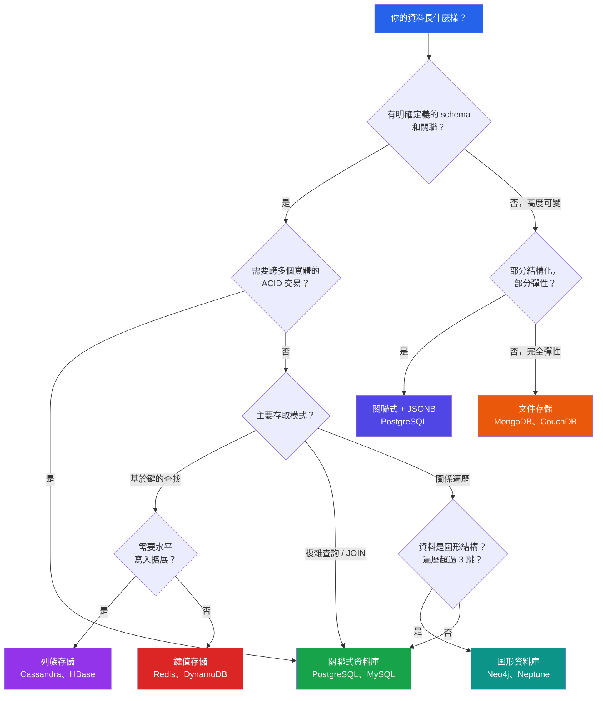

# [DEE-12] 關聯式 vs 非關聯式

:::info
關聯式與非關聯式資料庫的選擇 SHOULD 由資料存取模式和一致性需求驅動，而非由潮流或熟悉度決定。
:::

## 背景

數十年來，關聯式資料庫是幾乎所有應用程式的預設持久化層。Edgar F. Codd 於 1970 年形式化的關聯模型提供了嚴謹的基礎：資料表、列、欄位、約束，以及 SQL 作為通用查詢語言。PostgreSQL、MySQL、Oracle 和 SQL Server 等系統主導著企業和 Web 應用開發。

2000 年代 Web 規模應用的興起暴露了關聯模型在某些工作負載下的局限性：僵硬的 schema 使快速迭代困難，JOIN 密集型查詢在大規模下表現吃力，水平擴展需要複雜的分片。這催生了 NoSQL 資料庫的出現——文件存儲（MongoDB、CouchDB）、鍵值存儲（Redis、DynamoDB）、列族存儲（Cassandra、HBase）和圖形資料庫（Neo4j、Amazon Neptune）——每種都為特定的存取模式而優化。

如今，這個領域已大幅趨同。PostgreSQL 支援帶索引和強大查詢運算子的 JSONB，模糊了與文件資料庫的界線。MongoDB 在 4.0 版（2018）中加入了多文件 ACID 交易。Martin Fowler 和 Pramod Sadalage 普及了「多語種持久化（polyglot persistence）」的概念——根據每個元件特定的資料存取模式，為應用程式的不同部分使用不同的資料庫技術，而非將所有資料強制塞入一種模型。

決策已不再是「關聯式或非關聯式」，而是「哪種模型適合這個特定的資料存取模式」。大多數生產系統受益於以關聯式資料庫為主要存儲，並在關聯模型產生摩擦的特定工作負載中使用專門的資料庫。

## 原則

開發者 SHOULD 預設使用關聯式資料庫，除非有具體、可衡量的理由選擇其他方案。關聯式資料庫是通用的、被廣泛理解的，並提供難以事後補救的強一致性保證。

開發者 MUST 在選擇資料庫類型之前評估資料存取模式。主要驅動因素有：

- **Schema 穩定性** -- 如果 schema 定義明確且不太可能頻繁變更，關聯式是自然的選擇。如果 schema 高度可變或文件導向，文件存儲 MAY 更為適合。
- **查詢複雜度** -- 如果工作負載涉及多表 JOIN、聚合和即席查詢，具有 SQL 的關聯式資料庫提供更優越的表達能力。如果存取主要是基於鍵的查找，鍵值或文件存儲 MAY 提供更好的效能。
- **一致性需求** -- 如果應用需要跨多個實體的 ACID 交易，關聯式資料庫 SHOULD 是首選。支援交易的 NoSQL 資料庫通常帶有注意事項或效能損失。
- **規模特性** -- 如果工作負載需要超出單一節點處理能力的水平寫入擴展，SHOULD 評估分散式 NoSQL 資料庫。

團隊 SHOULD NOT 在沒有維運準備度的情況下採用多語種持久化。每增加一種資料庫技術都會帶來部署、監控、備份和專業知識的成本。

## 圖解



## 範例

### 使用場景對應

| 使用場景 | 存取模式 | 建議類型 | 原因 |
|---------|----------|---------|------|
| 電子商務訂單 | 跨訂單、庫存、付款的交易 | 關聯式（PostgreSQL） | ACID 交易、複雜查詢、報表 |
| 使用者 Session | 快速基於鍵的讀寫、TTL 過期 | 鍵值（Redis） | 亞毫秒延遲、內建過期功能 |
| 內容管理 | 可變文件結構、巢狀內容 | 文件（MongoDB）或關聯式 + JSONB | 彈性 schema、豐富查詢 |
| IoT 時序資料 | 高寫入吞吐量、按時間範圍掃描 | 列族（Cassandra）或 TimescaleDB | 水平寫入擴展、時間範圍分區 |
| 社群網路 | 朋友的朋友查詢、推薦路徑 | 圖形（Neo4j） | 高效多跳遍歷 |
| 產品目錄 | 結構化核心 + 可變屬性 | 關聯式 + JSONB（PostgreSQL） | 兼得兩者：SQL join + 彈性屬性 |
| 即時排行榜 | 有序集合、快速排名查找 | 鍵值（Redis） | 原生有序集合操作 |
| 稽核日誌 | 追加密集、很少查詢 | 列族（Cassandra）或關聯式 | 高寫入吞吐量、基於時間的分區 |

### PostgreSQL JSONB：關聯式與文件二合一

```sql
-- 以結構化核心欄位和彈性屬性儲存產品
CREATE TABLE products (
    id          SERIAL PRIMARY KEY,
    name        TEXT NOT NULL,
    category_id INTEGER REFERENCES categories(id),
    price       NUMERIC(10,2) NOT NULL,
    attributes  JSONB DEFAULT '{}'
);

-- 對 JSONB 建立索引以加速查詢
CREATE INDEX idx_products_attrs ON products USING GIN (attributes);

-- 查詢：找出所有螢幕尺寸大於 13 吋的電子產品
SELECT name, price, attributes->>'screen_size' AS screen
  FROM products
 WHERE category_id = 42
   AND (attributes->>'screen_size')::numeric > 13
 ORDER BY price;

-- 你同時獲得 SQL join、約束和交易
-- 加上每個產品的彈性屬性，無需變更 schema
```

### MongoDB 多文件交易（自 4.0 起）

```javascript
const session = client.startSession();
session.startTransaction();

try {
  await orders.insertOne({ orderId: 1001, items: [...], total: 99.99 }, { session });
  await inventory.updateOne(
    { sku: "ABC-123" },
    { $inc: { quantity: -1 } },
    { session }
  );
  await session.commitTransaction();
} catch (error) {
  await session.abortTransaction();
  throw error;
} finally {
  session.endSession();
}
// 可以運作，但相比單文件操作增加了延遲。
// MongoDB 在設計上就是為單文件原子性而優化的。
```

## 常見錯誤

1. **在沒有規模問題證據的情況下「為了規模」選擇 NoSQL。** 大多數應用永遠不會超出一個調優良好的 PostgreSQL 實例的能力。單一 PostgreSQL 伺服器可以處理每秒數千筆交易和數 TB 的資料。過早採用分散式資料庫增加了維運複雜度（一致性管理、叢集維護、腦裂場景），卻沒有相應的收益。

2. **使用 MongoDB 來迴避 schema 設計。** 跳過 schema 設計並不能消除對它的需要——它只是將其推遲到應用程式碼中，而在那裡更難強制和推理。「無 schema」的資料庫仍然有一個由應用程式定義的隱式 schema。差別在於關聯式資料庫強制 schema；文件資料庫則不會。

3. **將所有東西存在一種資料庫類型中。** 支援 JSONB 的關聯式資料庫（PostgreSQL）可以處理 80% 的文件工作負載，而無需引入第二個資料庫。為了少量彈性資料而在 PostgreSQL 旁邊添加 MongoDB 的團隊，往往低估了維護兩套資料庫系統、兩套備份策略和兩組專業知識的維運負擔。

4. **忽視現代資料庫的趨同。** PostgreSQL 有強大的 JSON 支援；MongoDB 有 ACID 交易；Redis 有持久化和 Lua 腳本；Cassandra 有輕量級交易。在向技術堆疊添加新資料庫之前，驗證現有的是否無法滿足需求。關聯式和非關聯式之間的差距已大幅縮小。

5. **在沒有維運成熟度的情況下採用多語種持久化。** Martin Fowler 的多語種持久化假設團隊能可靠地維運多個資料庫系統。每個資料庫都增加了監控、備份、容錯轉移、升級和待命的複雜度。團隊 SHOULD 漸進式地採用額外的資料庫，僅當收益明確超過維運成本時。

## 相關 DEE

- [DEE-10](10.md) ACID 特性 -- 關聯式資料庫提供完整 ACID；NoSQL 資料庫各有不同
- [DEE-11](11.md) CAP 定理 -- 分散式 NoSQL 資料庫面臨 CAP 權衡
- [DEE-100](../關聯式設計/100.md) 正規化 -- 關聯式資料庫的基礎設計原則
- [DEE-400](../NoSQL%20模式/400.md) 文件建模 -- 文件資料庫的設計模式

## 參考資料

- Codd, E.F. (1970). "A Relational Model of Data for Large Shared Data Banks." Communications of the ACM, 13(6). <https://dl.acm.org/doi/10.1145/362384.362685>
- Fowler, M. "Polyglot Persistence." <https://martinfowler.com/bliki/PolyglotPersistence.html>
- Sadalage, P. & Fowler, M. (2012). "NoSQL Distilled: A Brief Guide to the Emerging World of Polyglot Persistence." Addison-Wesley. <https://martinfowler.com/books/nosql.html>
- PostgreSQL Documentation: JSON Types. <https://www.postgresql.org/docs/current/datatype-json.html>
- MongoDB Documentation: Transactions. <https://www.mongodb.com/docs/manual/core/transactions/>
- Bytebase (2025). "Postgres vs. MongoDB: a Complete Comparison." <https://www.bytebase.com/blog/postgres-vs-mongodb/>
